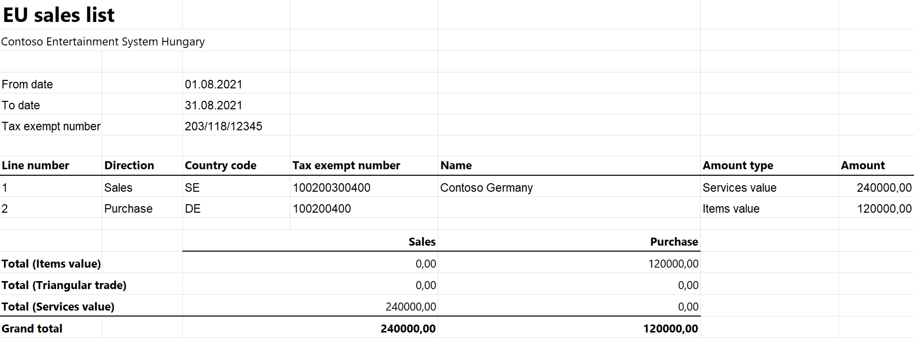

# EU Sales list for Hungary

This article provides information about the European Union (EU) sales list report for Hungary. The Hungarian EU sales list report contains information about purchases and sales of goods and services for reporting in XML format. The following fields are included on the Hungarian EU sales list report:

- **EU sales list header:**

    - Company's tax registration number
    - Reporting period
    - Company name
    - Company postcode
    - Company location
    - Company street
    - Company building, stairway, floor and door number
    - Person submitting the report
    - Telephone number of the person
    - Existence of a correction
    - Number of lines for the sale of goods
    - Number of lines for the purchase of goods
    - Number of lines for the sale of services
    - Number of lines for the purchase of services

-   **EU sales list lines:**
    
    - Page and line number
    - Customer/vendor VAT ID
    - Line amount in thousands
    - Total amount of the section in thousands

## Setup

For general setup information, see [EU Sales list reporting](../europe/emea-eu-sales-list.md#prerequisites).

> [!NOTE] 
> The value from the **Tax registration number** field on the **Tax registration** FastTab of the **Legal entities** page will be used in the .xml and .xlsx files for the EU sales list report.

**Set up the address format**

1. In Microsoft Dynamics 365 Finance, go to **Organization administration** > **Global address book** > **Addresses** > **Address setup**.
2. On the **Country/region** tab, in the **Country/region** field, select **HUN**.
3. Select the address format in the **Address format** field.
4. On the **Address format** tab, set cursor on the line with the address format selected earlier.
5. In the **Configure address component** section, add a **Street number** line after the **Street** line.
6. On **Street number** line, select the **New line** checkbox.
7. On the Action Pane, select **Save**.

### Set up information about the company

1. Go to **Organization administration** > **Organizations** > **Legal entities**.
2. In the grid, select your company.
3. On the **Addresses** FastTab, set the city, ZIP/postal code, street, and street number for the primary address that should be shown on the EU sales list report.

### Import Electronic reporting configurations

In [Microsoft Dynamics Lifecycle Services (LCS)](https://lcs.dynamics.com/Logon/Index), import the latest versions of the following Electronic reporting (ER) configurations for the EU sales list:

- EU Sales list model
- EU Sales list by columns report
- EU Sales list by rows report
- EU Sales list (HU)

For more information, see [Download Electronic reporting configurations from Lifecycle Services](../../../fin-ops-core/dev-itpro/analytics/download-electronic-reporting-configuration-lcs.md).

### Set up foreign trade parameters

1. In Finance, go to **Tax** > **Setup** > **Foreign trade** > **Foreign trade parameters**.
2. On the **EU sales list** tab, set **Report cash discount** option to **Yes** if a cash discount should be included in the value when a transaction is included in the EU sales list.
3. On the **Electronic reporting** FastTab, in the **File format mapping** field, select **EU Sales list (HU)**.
4. In the **Report format mapping** field, select **EU Sales list by rows report** or **EU Sales list by columns report**.
5. On the **Other** FastTab, in the **Filled by** field, select the person who is submitting the report.
6. On the **Country/region properties** tab, select **New**, and specify the following information:
    
    - In the **Country/region** column, select **HUN**.
    - In the **Country/region type** column, select **Domestic**.

7. List all the countries or regions that your company does business with. For each country that is part of the EU, in the **Country/region type** field, select **EU**.
8. On the **Company information** FastTab, set the following fields:
    
    - In the **Legal entity** field, select your company.
    - In the **Legal entity address** field, select the address that you created earlier.
    - In the **Building number**, **Stairway number**, **Floor number**, and **Door number** fields, enter the appropriate values.

9. On the Action Pane, select **Save**.

## Work with the EU sales list

For general information about which types of transactions are included in the EU sales list, how to generate the EU sales list report, and how to close the EU sales list reporting period, see [EU Sales list reporting](../europe/emea-eu-sales-list.md#working-with-the-esl).

> [!NOTE] 
> When you create a customer or vendor invoice, in addition using to the main codes in the **List code** field, you can use the **Triangular/intermediate role** code for purchase and sale items. On the EU sales list report, the field that has the **DA** postfix will be set to **B** for sale items if the **List code** field is set to **Triangular/intermediate role** for purchase and sale items. It will be set to **C** if the **List code** field is set to **Triangular/Prod. on toll** or **Triangular/EU trade** for purchase items.

### Generate the EU sales list report

1. Go to **Tax** > **Declarations** > **Foreign trade** > **EU sales list**.
2. Transfer transactions. In addition to using the main codes in the **List code** field, you can use the **Triangular/intermediate role** code for the trade of items.
3. Optional: To create correction files, set the **Correction** option to **Yes** for each corrective line.
4. On the Action Pane, select **Reporting**.
5. In the **EU sales list reporting** dialog box, on the **Parameters** FastTab, set the following fields.

    | Field                      | Description                                                                                                                       |
    |----------------------------|-----------------------------------------------------------------------------------------------------------------------------------|
    | Reporting period           | Select **Monthly** or **Quarterly**.                                                                                              |
    | From date                  | Select the start date for the report.                                                                                             |
    | Change in reporting period | Set this option to **Yes** to show the period change on the report. This option is available only for a monthly reporting period. |
    | Generate file              | Set this option to **Yes** to generate an .xml file for your EU sales list report.                                                |
    | File name                  | Enter the name of the .xml file.                                                                                                  |
    | Generate report            | Set this option to **Yes** to generate an .xlsx file for your EU sales list report.                                               |
    | Report file name           | Enter the name of the .xlsx file.                                                                                                 |
    | Correction                 | Set this option to **Yes** to create correction files.                                                                            |

6. Optional: To create correction files, apply a filter on the **Records to include** FastTab to show only corrective lines.
7. Select **OK**, and review the generated reports.

    > [!NOTE]
    > The maximum number of lines per page is 24.

## Example

For information about how to create a general setup, create postings, and transfer transactions by using the **DEMF** legal entity for Hungary, see [Example for generic EU Sales list](../europe/emea-eu-sales-list-example.md). However, for the example in this topic, create **HU00088000** as the company's VAT ID.

For information about how to do the setup for purchases and create vendor invoices, see [Set up purchase transfers](../europe/emea-eu-sales-list-example.md#set-up-purchase-transfers).

Additionally, for the example in this topic, create a vendor invoice where the amount is 120,000 and a customer invoice where the amount is 240,000.

**Set up the address format**

1. Go to **Organization administration** > **Global address book** > **Addresses** > **Address setup**.
2. On the **Country/region** tab, in the **Country/region** field, select **HUN**.
3. Select **0017** in the **Address format** field.
4. On the **Address format** tab, set cursor on the line with the address format selected earlier.
5. In the **Configure address component** section, add a **Street number** line after the **Street** line.
6. On the **Street number** line, select the **New line** checkbox.
7. On the Action Pane, select **Save**.

**Set up information about the company**

1. Go to **Organization administration** > **Organizations** > **Legal entities**.
2. Select the **DEMF** legal entity.
3. In the **Name** field, enter **Contoso Entertainment System Hungary**.
4. On the **Addresses** FastTab, select **Edit**.
5. In the **Edit address** dialog box, set the following fields.

    | Field               | Value           |
    |---------------------|-----------------|
    | Name or description | Primary address |
    | Purpose             | Business        |
    | Country/region      | HUN             |
    | ZIP/postal code     | 4400            |
    | Street              | Ulitsa          |
    | Street number       | 35              |
    | City                | Gorod           |
    | Primary             | Yes             |

6. Select **OK**.

**Set up the person who submits the report**

1. Go to **Tax** > **Setup** > **Foreign trade** > **Foreign trade parameters**.
2. On the **EU sales list** tab, on the **Other** FastTab, in the **Filled by** field, select **Jodi Christiansen**.
3. On the **Company information** FastTab, set the following fields:
    
    - In the **Legal entity** field, select **DEMF**.
    - In the **Legal entity address** field, select the company address that you created earlier.
        
        - In the **Building number** field, enter **5**.
        - In the **Stairway number** field, enter **1**.
        - In the **Floor number** field, enter **2**.
        - In the **Door number** field, enter **3**.

4. On the Action Pane, select **Save**.

**Create an EU sales list report**

1. Go to **Tax** > **Declarations** > **Foreign trade** > **EU sales list**.
2. On the Action Pane, select **Reporting**.
3. In the **EU sales list reporting** dialog box, on the **Parameters** FastTab, set the following fields:
    
    - In the **Reporting period** field, select **Monthly**.
    - In the **From date** field, select **8/1/2021** (August 1, 2021).

4. Select **OK**, and review the report in XML format that is generated. The following tables show the values on the example report.

    **EU sales list header**

    | Field   | Value       | Comment   |
    |---------|-------------|-----------|
    | nev     | Contoso Entertainment System Hungary | The company name.   |
    | Adoszam | 203/118/12345                        | The company's tax registration number.  |
    | tol     | 20210801                             | The beginning of the reporting period.  |
    | ig      | 20210831                             | The end of the reporting period. |
    | eazon   | **0A0001**                           | The section identifier (**0A**) and page number (**0001**) that are located before each field name.    |
    | C002A   | 203/118/12345                        | The company's tax registration number.   |
    | C005A   | Contoso Entertainment System Hungary | The company name.     |
    | C006A   | 4400                                 | The company's ZIP/postal code.       |
    | C007A   | Gorod                                | The company's city.         |
    | C010A   | Ulitsa                               | The company's street.       |
    | C011A   | utca                                 | A constant value.      |
    | C012A   | 35                                   | The company's street number.      |
    | C013A   | 5                                    | The company's building number.        |
    | C014A   | 1                                    | The company's stairway number.      |
    | C015A   | 2                                    | The company's floor number.     |
    | C016A   | 3                                    | The company's door number.    |
    | C017A   | 4255555049                           | The telephone number of the person who is submitting the report.    |
    | C018A   | Jodi Christiansen                    | The person who is submitting the report.      |
    | D001A   | 20210801                             | The beginning of the reporting period.     |
    | D002A   | 20210831                             | The end of the reporting period.    |
    | D003A   |                                      | The number of lines for the sale of goods.         |
    | D004A   | 1                                    | The number of lines for the purchase of goods.     |
    | D005A   | 1                                    | The number of lines for the sale of services.      |
    | D006A   |                                      | The number of lines for the purchase of services.         |
    | D007A   |                                      | A value that indicates the existence of a correction. If the **Correction** option is set to **No**, this field is blank. If the **Correction** option is set to **Yes**, this field is set to **H**.         |
    | D008A   | H                                    | Information about the reporting period. If the **Reporting period** field is set to **Monthly**, this field is set to **H**. If the **Change in reporting period** option is set to **Yes**, this field is set to **Á**. If the **Reporting period** field is set to **Quarterly**, this field is set to **N**. |

    **EU sales list lines**

    | Field         | Line 1 value   | Line 2 value    | Comment   |
    |---------------|----------------|-----------------|-----------|
    | eazon   | 0B0001  | 0C0001   | The section identifier and page number that are located before each field name. For a service record, the value starts with **0D0001** for sales and **0E0001** for purchases. For an item record, the value starts with **0B0001** for sales and **0C0001** for purchases. |
    | B002A   | 203/118/12345     | 203/118/12345     | The company's tax registration number.   |
    | B003A   | Contoso Entertainment System Hungary | Contoso Entertainment System Hungary | The company name.    |
    | B004A   | 1                                    | 1                                    | The page number.     |
    | C0001AA (where **0001** is the line number in the section) | DE      | SE       | The customer's or vendor's country/region code.    |
    | C0001BA (where **0001** is the line number in the section) | 100200400     | 100200300400     | The customer's or vendor's VAT ID without the country/region code.  |
    | C0001CA (where **0001** is the line number in the section) | 120         | 240         | The line amount in thousands.   |
    | C0001DA (where **0001** is the line number in the section) |    &nbsp;            |      &nbsp;               | This field exists only for purchase and sale items. For purchase and sale items, this field is set to **B** if the **List code** field is set to **Triangular/intermediate role**. It's set to **C** if the **List code** field is set to **Triangular/Prod. on toll**.     |
    | C0025CA         | 120       | 240       | The total amount of the section in thousands.    |

5.  Review the report in Excel format that is generated.

    
