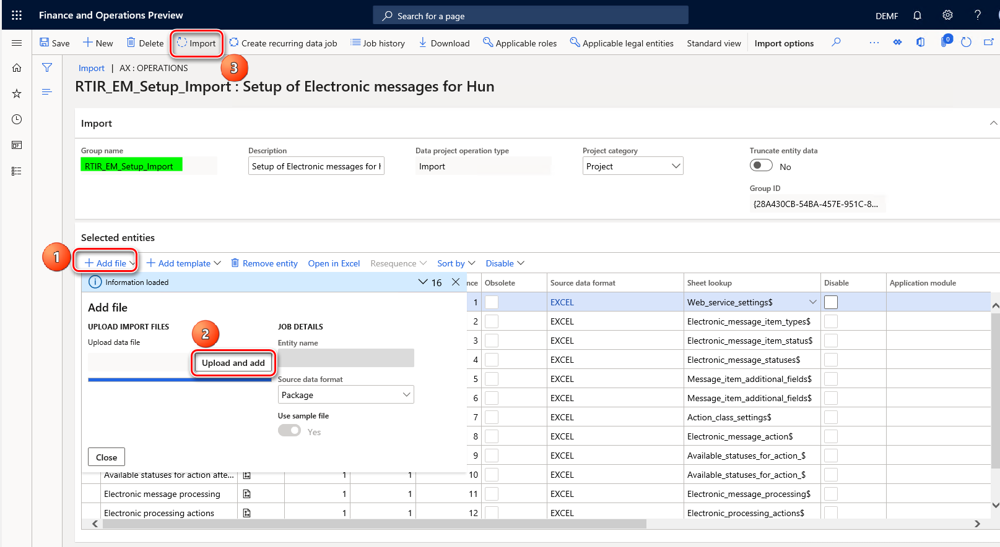

# Online invoicing system

[!include [banner](../../includes/banner.md)]

The National Tax and Customs Administration of Hungary has announced that, starting July 1, 2018, companies in Hungary are required to supply data of their issued invoices to the Real-time invoice reporting (RTIR) platform of the Online invoicing system.

For more information, see <https://onlineszamla.nav.gov.hu>.

This article describes how to set up Electronic reporting (ER) configurations, and how to set up and use electronic messaging (EM) functionality for RTIR.

The article includes information about how to complete the following tasks:

- Import ER configurations, and set up application-specific parameters.
- Set up EM functionality.
- Work with EM functionality for RTIR.

Online invoicing system of Hungary require the use of TLS 1.2. For more information about how to enable TLS 1.2, see [How to enable TLS 1.2](/mem/configmgr/core/plan-design/security/enable-tls-1-2). 

## Import ER configurations

To prepare your Microsoft Dynamics 365 Finance application for RTIR, you must import the following ER configurations.

| Number | Configuration name                     | Configuration type     | Description                                                                                                     |
|--------|----------------------------------------|------------------------|-----------------------------------------------------------------------------------------------------------------|
| 1      | Invoices Communication Model           | Model                  | The model that represents data for reporting incoming and outgoing invoices.                                    |
| 2      | RTIR mapping                           | Model mapping (export) | The model mapping configuration that collects data from Finance in accordance with Hungarian RTIR requirements. |
| 3      | RTIR Invoice Data (HU)                 | Format XML (export)    | The format for exporting RTIR invoice data.                                                                     |
| 4      | RTIR Token Exchange Request (HU)       | Format XML (export)    | The format for exporting RTIR token exchange requests.                                                          |
| 5      | RTIR Manage Invoice Request (HU)       | Format XML (export)    | The format for exporting RTIR manage invoice requests.                                                          |
| 6      | RTIR Query Invoice Status Request (HU) | Format XML (export)    | The format for exporting RTIR query invoice status requests.                                                    |
| 7      | Electronic Messages framework model    | Model                  | The model for the EM framework.                                                                                 |
| 8      | RTIR import model mapping              | Model mapping (import) | The importing model mapping configuration that provides updates of EM data during RTIR.                         |
| 9      | RTIR import format (HU)                | Format XML (import)    | The importing format configuration that parses responses from RTIR in the data structure of the EM framework.   |

> [!IMPORTANT]
> Be sure to import the most recent versions of these configurations. The version description usually includes the number of the Microsoft Knowledge Base (KB) article that explains the changes that were introduced in the configuration version.

> [!NOTE]
> After all the ER configurations from the preceding table are imported, set the **Default for model mapping** option to **Yes** for the **RTIR mapping** and **RTIR import model mapping** configurations.

For more information about how to download ER configurations from the Microsoft global repository, see [Download ER configurations from the Global repository](../../../fin-ops-core/dev-itpro/analytics/er-download-configurations-global-repo.md).

## Set up application-specific parameters

The format that is used to report invoice data to the Hungarian Online Invoicing System requires specific values from enumerated lists for some elements (for example, units of measure or line expression indicators). For these elements, before you start to use RTIR, you must set up application-specific parameters that the **RTIR Invoice Data (HU)** format will use.

When you've finished setting up conditions, change the value of the **State** field to **Completed**, save your changes, and close the page.

### Line expression indicator

The **lineExpressionIndicator** element of the Boolean type must be reported to the Online invoicing system for invoice lines. For natural units of measure, a value of **true** must be reported for the **lineExpressionIndicator** element. If the unit of measure isn't indicated for an invoice line, a value of **false** must be reported for the **lineExpressionIndicator** element.

1. In the **Electronic reporting** workspace, select the most recent imported version of the **RTIR Invoice Data (HU)** format.
2. On the Action Pane, on the **Configurations** tab, in the **Application specific parameters** group, select **Setup**.
3. On the **Lookups** FastTab, select **UnitOfMeasureTypeLookup** for the most recent version of the format, and then define which units of measure must be reported as natural (that is, a value of **true** must be reported for the **lineExpressionIndicator** element in the Online invoicing system).
4. Match all the units in your Legal entity. For example, for kilometers, add the following line:

    - **Lookup result:** Natural
    - **Line:** 1
    - **Unit of measure code:** km

        This value is the value from the **Units** page for your legal entity (**Organization administration** \> **Setup** \> **Units**).

> [!IMPORTANT]
> At the end of the list, add the following two lines.
> 
> | Lookup result | Line                                       | Unit of measure |
> |---------------|--------------------------------------------|-----------------|
> | NONE          | This line must be next to last in the list | \*Blank\*       |
> | Other         | This line must be last in the list.        | \*Not blank\*   |

The **lineDescription** element must be reported when the **lineExpressionIndicator** element is reported. If there is no value for the
**lineDescription** element on the related line of the invoice, this element will indicate the voucher of the related invoice. We recommend that you define the description on all invoice lines of all types, except invoices that are posted from a sales order. In that case, the **lineDescription** element will report the item.

### Unit of measure

For the **unitOfMeasure** element, one of the values from the enumerated list that is defined by the XSD schema of the **Invoice Data** format must be reported.

1. In the **Electronic reporting** workspace, select the most recent imported version of the **RTIR Invoice Data (HU)** format.
2. On the Action Pane, on the **Configurations** tab, in the **Application specific parameters** group, select **Setup**.
3. On the **Lookups** FastTab, select **UnitOfMeasureLookup** for the most recent version of the format, and then define the correspondence between the reference units of measure and the enumerated list of the Online invoicing system. For example, for kilometers, add the following line:

    - **Lookup result:** KILOMETER
    - **Line:** 1
    - **Unit of measure code:** km

        (This value is the value from the **Units** page for your legal entity.)

Match all the units in your legal entity that you can find a related value for in the enumerated list.

| UnitOfMeasureType | Description (hu)                   | Description (en-us) |
|-------------------|------------------------------------|---------------------|
| PIECE             | Darab                              | Piece               |
| KILOGRAM          | Kilogramm                          | Kilogram            |
| TON               | Metrikus tonna                     | Metric ton          |
| KWH               | Kilowatt óra                       | Kilowatt hour       |
| DAY               | Nap                                | Day                 |
| HOUR              | Óra                                | Hour                |
| MINUTE            | Perc                               | Minute              |
| MONTH             | Hónap                              | Month               |
| LITER             | Liter                              | Liter               |
| KILOMETER         | Kilométer                          | Kilometer           |
| CUBIC_METER       | Köbméter                           | Cubic meter         |
| METER             | Méter                              | Meter               |
| LINEAR_METER      | Folyóméter                         | Linear meter        |
| CARTON            | Karton                             | Carton              |
| PACK              | Csomag                             | Pack                |
| OWN               | Saját mennyiségi egység megnevezés | Own unit of measure |

> [!IMPORTANT]
> Instead of adding all the **own** values to the list, you can define **\*Not blank\*** for the **OWN** lookup result. All the other values will then be reported as **OWN**. The **OWN** lookup result must be added, and it must be last in the list.

The **unitOfMeasureOwn** element must report information about any unit of measure that there is no value for in the enumerated list of the **unitOfMeasure** element. This element must be reported when the **unitOfMeasure** element has a value of **OWN**.

### Customer tax number type

As of **version 94.50** of the **RTIR Invoice Data (HU)** format, which was released to support **XSD version 3.0** of the Online invoicing system, you must report different types of customer tax registrations in different nodes of the report.

| CustomerVatDataType value | Description |
|---------------------------|-------------|
| customerTaxNumber         | The domestic tax number or group identification number that the purchase of goods or services is completed under. |
| communityVatNumber        | The community tax number. |
| thirdStateTaxId           | The third-state tax identification number. |

When the purchase of goods or services is completed by using a group identification number, **customerTaxNumber** can also be represented by **groupMemberTaxNumber** (the tax number of the group member).

To differentiate the various registration types that are specified for customers' VAT data, use the **Registration categories** functionality.

1. Go to **Organization administration** \> **Global address book** \> **Registration types** \> **Registration types**.
2. Create tax registration types that you will associate with your customers' registration categories and **customerVatData** values for the Online invoicing system.
3. Go to **Organization administration** \> **Global address book** \> **Registration types** \> **Registration categories**.
4. For the registration categories that you will use for your customers, specify the registration types that you just created.
5. In the **Electronic reporting** workspace, open **Invoices Communication Model** \> **RTIR Invoice Data (HU)**.
6. On the Action Pane, on the **Configurations** tab, in the **Application specific parameters** group, select **Setup**.
7. Select the latest version of the configuration in the list on the left.
8. On the **Lookups** FastTab, select the **TaxNumberTypeLookup** field, and then, in the **Tax registration types** column, create a mapping between the registration types that you created in step 2. In this way, you create an association between your customers' registration categories and the values that the Online invoicing system expects for the **customerVatData** node in the **Lookup result** column on the **Conditions** FastTab.

    When the setup for the **TaxNumberTypeLookup** lookup field is completed, the system applies the following algorithm to report the **customerVatData** node:

    - The **customerVatData** node is enabled if the **customerVATstatus** value is *not* **PRIVATE\_PERSON**.
    - The **customerVatData** node is enabled if the **customerVATstatus** value is **DOMESTIC**.
    - The **customerTaxNumber.groupMemberTaxNumber** node is enabled if the customer has a **TaxRegistrationId** value that is mapped to the **GROUP VAT ID** value in the **TaxNumberTypeLookup** field.
    - The **customerVatData** node is enabled if the customer has a **TaxRegistrationId** value that is mapped to the **EU VAT ID** value in the **TaxNumberTypeLookup** field, and if the **customerVATstatus** value is **OTHER**.
    - The **thirdStateTaxId** node is enabled if the customer has a **TaxRegistrationId** value that is mapped to the **THIRD STATE VAT ID** value, and if the **customerVATstatus** value is **OTHER**.

9. When you've finished setting up the lookup fields, set the **State** field to **Completed**, and then save the configuration.

### Differentiation by tax type for invoice line reporting in the vatRate node

XSD version 3.0 of the Online invoicing system introduced the following changes that are related to reporting of the VAT information for each invoice line and the invoice summary information.

| Node              | Change description |
|-------------------|--------------------|
| vatExemption      | The following additional details must be reported:<ul><li>**case** – Case notation with code</li><li>**reason** – Case notation with text</li></ul> |
| vatOutOfScope     | The following additional details must be reported:<ul><li>**case** – Case notation with code</li><li>**reason** – Case notation with text</li></ul> |
| vatAmountMismatch | A new node that has mandatory reporting of the following details:<ul><li>**vatRate** – VAT rate, VAT content</li><li>**case** – Case notation with code</li></ul> |
| noVatCharge       | A new node that has a Boolean value. |

Version 94.50 of the **RTIR Invoice Data (HU)** format was released to support XSD version 3.0 of the Online invoicing system. Therefore, because of the previously described changes, you must classify all the sales tax exempt codes and sales tax codes that are required for reporting to the Online invoicing system before you start to use XSD version 3.0 for reporting.

1. In the **Electronic reporting** workspace, open **Invoices Communication Model** \> **RTIR Invoice Data (HU)**.
2. On the Action Pane, on the **Configurations** tab, in the **Application specific parameters** group, select **Setup**.
3. Select the latest version of the configuration in the list on the left.
4. On the **Lookups** FastTab, in the **VatExemptionCodesLookup** field, create a mapping between the sales tax exempt codes that your company uses and the values that the Online invoicing system expects for the **vatExemption** node in the **Lookup result** column on the **Conditions** FastTab.
4. In the **VatOutOfScopeCodesLookup** lookup field, define the mapping between the sales tax codes that your company uses and the values that XSD version 3.0 of the Online invoicing system expects in the **vatExemption** node in the **Lookup result** column on the **Conditions** FastTab.
5. In the **MarginSchemeTypesLookup** lookup field, define the mapping between the sales tax codes that your company uses and the values that XSD version 3.0 of the Online invoicing system expects in the **marginSchemeIndicator** node in the **Lookup result** column on the **Conditions** FastTab.
6. In the **VatRateTypesLookup** lookup field, define the mapping between the sales tax codes that your company uses and the values that XSD version 3.0 of the Online invoicing system expects in the **vatPercentage** and **vatExemption** nodes in the **Lookup result** column on the **Conditions** FastTab.

    This setup must be completed for all your sales tax codes.

7. When you've finished setting up the lookup fields, set the **State** field to **Completed**, and then save the configuration.

## Import a package of data entities that includes a predefined EM setup

EM functionality is provided to maintain different electronic reporting processes for different document types. For more information about electronic messages, see [Electronic messaging](../../general-ledger/electronic-messaging.md).

The process of setting up the EM functionality for RTIR has many steps. Because the names of some predefined entities are used in the ER configurations, it's important that you use a set of predefined values that are delivered in a package of data entities for the related tables.

1. In [LCS](https://lcs.dynamics.com/v2), go to the Shared asset library, and select the **Data package** asset type.
2. In the list of data package files, find **HU RTIR setup.zip**, and download it to your computer. There might be several versions of the package. Be sure to download the most recent version.
3. After the HU RTIR setup.zip file is downloaded, open Finance, select the company that you will interoperate with the Hungarian Online invoicing system from, and then go to **Workspaces** \> **Data management**.
4. In the **Data management** workspace, go to **Framework parameters** \> **Entity settings**, and then select **Refresh entity list**. Wait for confirmation that the refresh has been completed. For more information about how to refresh the entity list, see [Entity list refresh](../../../fin-ops-core/dev-itpro/data-entities/data-entities.md#entity-list-refresh).
5. Validate that the source data and target data are correctly mapped. For more information, see the section about validation in [Data import and export jobs](../../../fin-ops-core/fin-ops/data-entities/data-import-export-job.md#validate-that-the-source-data-and-target-data-are-mapped-correctly).
6. Before the data entities are used for the first time to import the data from the package, sync the mapping of source data and target data. In the list for the package, select a data entity, and then, on the Action Pane, select **Modify target mapping**.
7. Above the grid for the package, select **Generate mapping** to create a mapping from scratch, and then save the mapping.
8. Repeat steps 6 through 7 for each data entity in the package before you start the import.

    For more information about data management, see [Data management](../../../fin-ops-core/dev-itpro/data-entities/data-entities-data-packages.md).

9. You must now import data from the HU RTIR setup.zip file into the selected company. In the **Data management** workspace, select **Import**.
10. Select **Upload and add**, select the **HU RTIR setup.zip** file on your computer, and upload it.
11. After the data entities are uploaded, on the Action Pane, select **Import**.

You will receive a notification in **Messages**, or you can manually refresh the page to view the data import progress. When the import process is completed, the **Execution summary** page shows the results.

The HU RTIR setup.zip package provides the setup for **Online invoicing** processing in the EM functionality that supports interoperation with the Hungarian Online invoicing system. The following illustration shows the schema for **Online invoicing** processing.

The following table describes the processing actions of **Online invoicing** processing.

| Action                         | Type                                | Description |
|--------------------------------|-------------------------------------|-------------|
| Create EM items                | Message item execution level        | This action runs the **EMCreateItemsController_HU** executable class to generate electronic message items for issued invoices that were posted. Additional setup of the **EMCreateItemsController_HU** executable class parameters is required. |
| Evaluate EM items              | Message item execution level        | This action runs the **EMAdditionalFieldsEvaluationController_HU** executable class to calculate additional field values for electronic message items. These values include the invoice operation, the reference to the original invoice, and the last line number. |
| Generate EM                    | Electronic reporting export         | This action runs the **RTIR Invoice Data (HU)** format to create a package of invoices that can be submitted to the Online invoicing system. |
| Generate token request         | Electronic reporting export message | This action runs the **RTIR Token Exchange Request (HU)** format to create the exchange token file in XML format. |
| Submit token request           | Web service                         | This action submits the token file in XML format to the **Token exchange** web service. |
| Import token response          | Electronic reporting import         | This action imports the response from the Online invoicing system and stores the token that is received in the **Message additional fields** FastTab by using the **RTIR import format (HU)** configuration. |
| Generate invoice request       | Electronic reporting export message | This action runs the **RTIR Manage Invoice Request (HU)** format to create the **ManageInvoiceRequest.xml** file by encoding invoices, inserting a token in the request, and so on. |
| Submit invoice request         | Web service                         | This action submits the **ManageInvoiceRequest.xml** file to the **Manage invoice** web service. |
| Import invoice response        | Electronic reporting import         | This action imports the response from the Online invoicing system and stores the transaction ID that is received in the **Message additional fields** FastTab by using the **RTIR import format (HU)** configuration. |
| Generate status request        | Electronic reporting export message | This action runs the **RTIR Query Invoice Status Request (HU)** format to create the **QueryInvoiceStatusRequest.xml** file. |
| Submit status request          | Web service                         | This action submits the **QueryInvoiceStatusRequest.xml** file to the **Query invoice status** web service. |
| Import status response         | Electronic reporting import         | This action imports the response from the Online invoicing system. If the status of the EM item is **Received** (which indicates that the invoice was received by the Online invoicing system) or **Processing** (which indicates that the invoice is being processed in the Online invoicing system), the system will send the status request again, until the status of the EM item is updated to **Processed**. |
| Exclude EM items               | User processing                     | This manual user action resets the status of the EM item from **Evaluated** to **Excluded** and excludes the item from processing. |
| Include EM items in processing | User processing                     | This manual user action resets the status of the EM item from **Excluded** or **Manual editing** to **Evaluated**. |
| Reset EM item status           | User processing                     | This manual user action resets the status of the EM item from **Rejected** to **Created**. |
| Reset EM status                | Message level user processing       | This manual user action resets the status of the electronic message from **Error invoice response importing**, **Error sending invoice request**, or **Error Token response importing** to **Generated** so that processing for the electronic message can continue. |

For more information about the predefined setup that is included in the data entities in the package for RTIR, see [Appendix 1: Electronic messages setup for RTIR](#appendix-1-electronic-message-setup-for-rtir) later in this article.

## Set up EM for RTIR

After the data entities are imported into the database, follow these steps to make the EM functionality ready to use.

1. Go to **Tax** \> **Setup** \> **Electronic messages** \> **Executable class settings**, and select the **Message items creation** executable class that is associated with the **EMCreateItemsController_HU** executable class name.
2. On the Action Pane, select **Parameters**.
3. In the dialog box, on the **Records to include** FastTab, define values for the parameters of the query.

    

4. Select **OK**.
5. On the **Executable class settings** page, select the **Additional fields evaluation** executable class that is associated with the **EMAdditionalFieldsEvaluationController_HU** executable class name, select **Parameters** on the Action Pane, and then, in the dialog box, define values for the parameters of the executable class.

    

    The following values must be set for the parameters.

    | Parameter name                            | Value                                |
    |-------------------------------------------|--------------------------------------|
    | Report period start date                  | The date when you want to start RTIR |
    | Status for excluded items                 | Excluded                             |
    | Status for items requiring manual editing | Manual editing                       |
    | Operation field                           | Operation                            |
    | Original message item field               | Original message item                |
    | Last line reference number field          | Last line reference number           |
    | Modification index                        | Modification index                   |

6. Select **OK**.

    Interoperation with the Hungarian Online invoicing system requires a technical user name and password, and signature and replacement keys. There are two options for storing this sensitive data:

    - Azure Key Vault storage
    - Local storage

7. Go to **System administration** \> **Setup** \> **System parameters**, and set the **Use advanced certificate store** option to **No** to store sensitive data locally. Set the option to **Yes** to use Key Vault storage. For more information about how to set up Key Vault, see [Setting up Azure Key Vault Client](https://support.microsoft.com/help/4040305/setting-up-azure-key-vault-client) and [Maintaining Azure Key Vault storage](https://support.microsoft.com/help/4040294/maintaining-azure-key-vault-storage).
8. If you set the **Use advanced certificate store** option to **Yes** on the **System parameters** page, you must set up the Key Vault parameters at **System administration** \> **Setup** \> **Key Vault parameters**.

    

9. Go to **Tax** \> **Setup** \> **Parameters** \> **Online invoicing system parameters**, and specify the following information:

    - Technical user name
    - Technical user password
    - Signature key
    - Replacement key

10. If you set the **Use advanced certificate store** option to **Yes** on the **System parameters** page, select related secrets on the **General** tab of the **Online invoicing system parameters** page.

    

    Alternatively, if you set the **Use advanced certificate store** option to **No**, manually enter the technical user name and password, signature key, and replacement key that you obtained for interoperation with the Hungarian Online invoicing system. For more information, see the [information about the registration procedure](https://onlineszamla-test.nav.gov.hu/tajekoztatas_a_regisztraciorol).

    

11. Go to **Tax** \> **Setup** \> **Parameters** \> **Electronic messages** \> **Web service settings**, and enter the following information to define the internet address for web services.

    | Web service name     | Testing internet address (for Online invoicing system XSD 3.0)                      |
    |----------------------|-------------------------------------------------------------------------------------|
    | Manage invoices      | `https://api-test.onlineszamla.nav.gov.hu/invoiceService/v3/manageInvoice`          |
    | Query invoice status | `https://api-test.onlineszamla.nav.gov.hu/invoiceService/v3/queryTransactionStatus` |
    | Token exchange       | `https://api-test.onlineszamla.nav.gov.hu/invoiceService/v3/tokenExchange`          |

    Internet addresses are subject to change by the Hungarian Online invoicing system. Therefore, we recommend that you check for actual internet addresses on the [official web site of the Hungarian Online invoicing system](https://onlineszamla.nav.gov.hu/). The website also has information about the actual *production* internet addresses that you should set up.

12. Go to **Tax** \> **Setup** \> **Parameters** \> **Electronic messages** \> **Message processing actions**, and select **Generate EM**.
13. In the **Number of message items per export** field, define the number of message items that can be included in one message. This number should not exceed 100.
14. In the **Items attached compression type** field, specify **None**, and set the **Attach files from output archive to items** option to **Yes**.

    

15. Set up security roles for online invoicing processing. Different groups of users might require access to online invoicing processing. You can limit access to the processing, based on security groups that are defined in the system. Go to **Tax** \> **Setup** \> **Electronic messages** \> **Electronic message processing**, select **Online invoicing**, and add the security groups that must work with this processing. If no security group is defined for the processing, only a system admin can see the processing on the **Electronic messages** page.

## Set up financial reasons for RTIR

For each invoice that is reported to the Hungarian Online invoicing system, a specific operation type must be defined and transmitted in the **\<invoiceOperation\>** element in the **ManageInvoiceRequest.xml** file. In most cases, Finance automatically specifies the invoice operation type according to the rules that are defined in requirements of the Hungarian Online invoicing system:

- **Create** – This invoice operation type is specified when Finance defines no reference to original invoice.
- **Modify** – This invoice operation type is specified when Finance defines a reference to original invoice.

You can manually define the operation type for an invoice during invoice posting by using the **Financial reasons** page.

- Go to **Organization administration** \> **Setup** \> **Financial reasons**. In the **Operation** column, define operation types. The following values are allowed by the Hungarian Online invoicing system:

    - **Create** – The invoice in the given position is considered an original invoice.
    - **Modify** – The invoice is a modifying invoice.
    - **Storno** – The invoice is a canceling invoice.

By using the related financial reason during invoice posting, you can have a specific operation type reported for an invoice.

For example, you want to submit an invoice of the **Storno** operation type to the Online invoicing system. For this invoice, specify a financial reason that has a value of **Storno** value in **Operation** field. To submit a corrective invoice that has no reference to the original invoice, specify a financial reason that has a value of **Modify** in the **Operation** field.

## RTIR process

Finance automatically runs actions that are included in the processing, based on the status of messages and message items.

### Additional fields for message items

All message items have additional fields that are required for processing. The system automatically fills in values for additional fields when it runs actions.

| Additional field           | Description |
|----------------------------|-------------|
| Operation                  | Values include **Create**, **Modify**, and **Storno**. Finance sets the value of this additional field during execution of the **Evaluate EM items** action. The value of the **Operation** additional field can be defined automatically or through a financial reason on the invoice. For more information, see the [Set up financial reasons for RTIR](#set-up-financial-reasons-for-rtir) section earlier in this article. |
| Original message item      | If the **Operation** additional field is set to **Modify** or **Storno**, the **Original message item** additional field must be set. If the system can't set this field, it sets the status of the related message item to **Manual editing**, and you must manually set this field. |
| Index                      | This additional field specifies the invoice position in the request (package of invoices). The value is reported in the **\<index\>** element in the **ManageInvoiceRequest.xml** file. This additional field is automatically filled in when the **Generate invoice request** action is run. |
| Modification index         | This additional field specifies the unique sequence number referring to the original invoice (the modifying document sequential number). This value is reported in the **\<modificationIndex\>** element for message items of the **Modify** or **Storno** operation type. This additional field is automatically filled in when the **Evaluate EM items** action is run. |
| Last line reference number | For message items of the **Create** operation type, this additional field contains the last number (invoice line number) in the invoice. For message items of the **Modify** or **Storno** operation type, this additional field contains the last line number within the whole chain of documents, starting from the original invoice, considering all its modifications. This value is used to calculate value to be reported in the **\<lineNumberReference\>** element for message items of the **Modify** or **Storno** operation type. This additional field is automatically filled in when the **Evaluate EM items** action is run. |

### Run Online invoicing processing

This procedure walks you through the RTIR process.

1. Go to **Tax** \> **Inquiries and reports** \> **Electronic messages** \> **Electronic message items**.
2. On the Action Pane, select **Run processing**.
3. In the dialog box, in the **Processing** field, select **OnlineInvoicing**.
4. If you want to run all the possible actions from **Online invoicing** processing, clear the **Choose action** check box. If you want to run only a specific action, select the **Choose action** check box, and then, in the **Action** field, select the action to run.

### Exclude invoice reporting in RTIR

To exclude an invoice from processing in RTIR, follow these steps.

1. Go to **Tax** \> **Inquiries and reports** \> **Electronic messages** \> **Electronic message items**.
2. On the Action Pane, select **Update status** to update the status of the message items to **Excluded**. Invoices that have a status of **Excluded** won't be included in the report.
3. In the **Update status** dialog box, select **Online invoicing** processing. Then, in the **Action** field, select **Exclude message item**. In the **New status** field, select **Excluded**.
4. Define additional criteria by using the **Records to include** FastTab to specify which invoices must be excluded from further processing.

### Postpone invoice reporting in RTIR

To postpone reporting of an invoice in RTIR, follow these steps.

1. Go to **Tax** \> **Inquiries and reports** \> **Electronic messages** \> **Electronic message items**.
2. On the Action Pane, select **Update status** to update the status of the message items to **Postponed**. Invoices that have a status of **Postponed** won't be included in the report.
3. In the **Update status** dialog box, select **Online invoicing** processing. Then, in the **Action** field, select **Update to Postponed** in the **Action** field. In the **New status** field, select **Postponed**.
4. Define additional criteria by using the **Records to include** FastTab to specify which invoices reporting must be postponed for.

You can always reverse the status of **Excluded** or **Postponed** message items by selecting **Update to initial status**.

### Run online invoicing processing in batch mode

Online invoicing processing can be run in batch mode. You can define the parameters of the batch processing on the **Run in the background** FastTab of the **Run processing** dialog box. For more information about batch processing, see [Batch processing overview](../../../fin-ops-core/dev-itpro/sysadmin/batch-processing-overview.md).

## Appendix 1: Electronic message setup for RTIR

This appendix provides information about how the EM functionality should be set up so that it supports **Online invoicing** processing. Use this information to determine whether the EM functionality is set up correctly.

Although this appendix includes the most important information about the setup, it doesn't include all the data. We recommend that you use a package of data entities that provides a predefined setup of the functionality, and that includes all the data that is required to set up the processing for RTIR.

### Web service settings

**Online invoicing** processing uses the following web services.

| Web service name     | Testing internet address (for Online invoicing system XSD 3.0)                      |
|----------------------|-------------------------------------------------------------------------------------|
| Manage invoices      | `https://api-test.onlineszamla.nav.gov.hu/invoiceService/v3/manageInvoice`          |
| Query invoice status | `https://api-test.onlineszamla.nav.gov.hu/invoiceService/v3/queryTransactionStatus` |
| Token exchange       | `https://api-test.onlineszamla.nav.gov.hu/invoiceService/v3/tokenExchange`          |

Internet addresses are subject to change by the Hungarian Online invoicing system. You should verify the actual internet addresses on the official web site of the Hungarian Online invoicing system. The website also has information about the actual production internet addresses that you should set up.

### Additional fields

For a full description of the additional fields for **Online invoicing** processing, see the [Additional fields for message items](#additional-fields-for-message-items) section earlier in this article.

> [!NOTE]
> These fields can't be changed by the user.

### Electronic message item types

The setup of electronic messages for **Online Invoicing** processing uses one type of electronic message item: **Customer invoice**.

### Electronic message item statuses

**Online Invoicing** processing uses the following electronic message item statuses.

| Status                      | Description                                                                                          | Records in this status can be deleted |
|-----------------------------|------------------------------------------------------------------------------------------------------|---------------------------------------|
| Accepted                    | The message item was accepted by the Online invoicing system.                                        | Yes                                   |
| Created                     | The message item was created.                                                                        | Yes                                   |
| Evaluated                   | The message item's additional fields were evaluated.                                                 | Yes                                   |
| Excluded                    | The message item is excluded from processing.                                                        | Yes                                   |
| In preprocessing            | The message item is undergoing preprocessing.                                                        | Yes                                   |
| Included in invoice request | The message item is included in the manage invoice request.                                          | Yes                                   |
| Included in message         | The message item is included in the message.                                                         | Yes                                   |
| Manual editing              | The message item requires manual editing.                                                            | Yes                                   |
| Pending status response     | The message item is waiting for a status response.                                                   | Yes                                   |
| Processed                   | The message item was processed.                                                                      | Yes                                   |
| Processing                  | The message item is being processed by the Online invoicing system.                                  | Yes                                   |
| Received                    | The message item was received by the Online invoicing system.                                        | Yes                                   |
| Rejected                    | The message item was rejected by the Online invoicing system.                                        | Yes                                   |
| Sent                        | The message item was sent to the Online invoicing system.                                            | Yes                                   |
| Saved                       | The message item was saved in the Online invoicing system, but processing hasn't yet been completed. | Yes                                   |

### Electronic message statuses

**Online Invoicing** processing uses the following electronic message statuses.

| Status                                  | Description                                                                             | Records in this status can be deleted |
|-----------------------------------------|-----------------------------------------------------------------------------------------|---------------------------------------|
| Error generating invoice request        | A technical error occurred when the invoice request was being generated.                | No                                    |
| Error generating status request         | A technical error occurred when the status request was being generated.                 | No                                    |
| Error generating token request          | A technical error occurred when the token request was being generated.                  | No                                    |
| Error invoice response importing        | A technical error occurred when the invoice response was being imported.                | No                                    |
| Error response import of status request | A technical error occurred when the response for the status request was being imported. | No                                    |
| Error sending invoice request           | A technical error occurred when the manage invoice request was being sent.              | No                                    |
| Error sending status request            | A technical error occurred when the invoice status request was being sent.              | No                                    |
| Error sending token request             | A technical error occurred when the token request was being sent.                       | No                                    |
| Error Token response importing          | A technical error occurred when the token response was being imported.                  | No                                    |
| Generated                               | The message was generated.                                                              | No                                    |
| In process                              | The message is being processed by the Online invoicing system.                          | No                                    |
| Invoice request generated               | The request to submit invoices was generated.                                           | No                                    |
| Invoice request submitted               | The request that includes invoices was submitted to the Online invoicing system.        | No                                    |
| Processed                               | The message was processed by the Online invoicing system.                               | No                                    |
| Sent                                    | The message was sent.                                                                   | No                                    |
| Status request generated                | The invoice status request was generated.                                               | No                                    |
| Status request submitted                | The invoice status request was submitted.                                               | No                                    |
| Token received                          | The token was received.                                                                 | No                                    |
| Token request generated                 | The token request was generated.                                                        | No                                    |
| Token request submitted                 | The token request was submitted.                                                        | No                                    |
| Transaction ID received                 | The invoice response that includes the transaction ID was received.                     | No                                    |

### Electronic message actions

For a full description of the electronic message actions of **OnlineInvoicing** processing, see the [Import a package of data entities that includes a predefined EM setup](#import-a-package-of-data-entities-that-includes-a-predefined-em-setup) section earlier in this article.

### Electronic processing actions

**Online invoicing** processing uses the following electronic processing actions.

| Name                           | Run separately |
|--------------------------------|----------------|
| Create EM items                | No             |
| Evaluate EM items              | No             |
| Exclude EM items               | Yes            |
| Generate EM                    | No             |
| Generate invoice request       | No             |
| Generate status request        | No             |
| Generate token request         | No             |
| Import invoice response        | No             |
| Import status response         | No             |
| Import token response          | No             |
| Include EM items in processing | Yes            |
| Reset EM item status           | Yes            |
| Reset EM status                | Yes            |
| Submit invoice request         | No             |
| Submit status request          | No             |
| Submit token request           | No             |

## Appendix 2: Implementation details

### Reporting the supply of goods or services (LineNatureIndicator)

The Online invoicing system requires reporting of the **LineNatureIndicator** field, which indicates the nature of the supply of goods or services on a line. The **RTIR Invoice Data (HU)** format provides the binding to report this field, based on value that is specified for the **Reporting type** field in the item sales tax group from the related sales tax transaction.

### Customer status by VAT (customerVatStatus)

As of **XSD version 3.0**, the Online invoicing system requires reporting of the **customerVatStatus** – **Customers status by VAT** required field. This field must have one of the following values.

| Value           | Description |
|-----------------|-------------|
| DOMESTIC        | The customer is a domestic customer who is subject to VAT. |
| PRIVATE\_PERSON | The customer is a domestic or foreign natural person who isn't subject to VAT. |
| OTHER           | The customer has some other status. For example, the customer is a domestic non-natural person who isn't subject to VAT, a foreign non-natural person who is subject to VAT, or a foreign non-natural person who isn't subject to VAT. |

As of **version 94.50**, which was released to support XSD version 3.0 of the Online invoicing system, the **RTIR Invoice Data (HU)** format supports the following algorithm to define the **customerVatStatus** value.

| customerVatStatus value | Criteria |
|-------------------------|----------|
| DOMESTIC                | **CustTable.partyType() == DirPartyType.Organization**, and the customer has either a Hungarian **VATNum** value or a Hungarian **TaxRegistrationId** value. |
| PRIVATE\_PERSON         | **CustTable.partyType() == DirPartyType.Person**, and the customer has neither a Hungarian **VATNum** value nor a Hungarian **TaxRegistrationId** value. |
| OTHER                   | This value will be applied if criteria for DOMESTIC or PRIVATE\_PERSON are not applicable. |

### Reporting advance payment invoices and final invoices

As of XSD version 3.0, the Online invoicing system requires a specific application to report advance payment invoices and final invoices. For detailed information about the requirements, see the [official documentation](https://onlineszamla.nav.gov.hu).

The following business process is considered a subject for the "Advance payment invoices and final invoices" reporting scenario. According to the Hungarian VAT Act, *receipt of advance payment is a tax point*. In the general business scenario that involves advance payment invoices and final invoices, the following events occur:

1. The supplier issues a request for advance payment. This request is a non-VAT document.
2. After the payment is made by the customer and received by the supplier, the supplier issues an invoice for the advance payment.
3. The final invoice is issued upon fulfillment of the supply. This invoice considers the amount of the advance payment. The VAT amount is payable on the total consideration reduced by the advance payments.

In Dynamics 365 Finance's solution for Hungarian Online invoicing system supports reporting of described below scenarios of "Advance payment invoices and final invoices".

#### Scenario 1: A prepayment that has sales tax transactions is posted (Accounts receivable module)

1. Post a prepayment that has sales tax transactions.
2. Go to **Accounts receivable** \> **Advance invoices** \> **All advance invoices**, and create an advance invoice.
3. On the **Advance invoice** page, on the Action Pane, select **Related information** \> **Prepayment** to link the posted prepayment to the advance payment that you just created.
4. Post the advance invoice. No voucher is created. Therefore, there is no effect on the accounting.

    The posted advance invoice is reported to the Online invoicing system. Lines are collected from the sales tax transactions of the prepayment that is linked to the advance invoice. The invoice number and date information are collected from the advance invoice header. The currency amount and exchange rate of the advance invoice are reported in the currency of the posted prepayment.

5. Go to **Accounts receivable** \> **Advance invoices** \> **All advance invoices**, and create a final invoice.
6. On the **Advance invoice** page, on the Action Pane, select **Related information** \> **Prepayment**, and link the final invoice to the advance invoice that you created earlier.

    > [!NOTE]
    > To ensure correct reporting in the Online invoicing system, avoid linking multiple invoices to multiple advance invoices on the same sales order.

    The posted final invoice is reported to the Online invoicing system. It includes reference information in the **\<advancePaymentData\>** node and amounts in summary reduced by the posted sales tax from prepayments that are linked to the same advance invoice. The exchange rate of the advance invoice is reported for the referenced advance invoice information. However, if the currency of the advance invoice differs from the currency of the final document, all lines of the advance invoice will be reported as negative amounts to the final invoice, and they will be recalculated in the currency of the final document.

#### Scenario 2: A prepayment that has no sales tax transactions is posted (Accounts receivable module)

1. Post a prepayment that has no sales tax transactions.
2. Use the advanced prepayment handling functionality for the posted prepayment to post sales tax transactions for it.
3. Go to **Accounts receivable** \> **Advance invoices** \> **All advance invoices**, and create an advance invoice.
4. On the **Advance invoice** page, on the Action Pane, select **Related information** \> **Prepayment** to link the posted prepayment to the advance payment that you just created.
5. Post the advance invoice. No voucher is created. Therefore, there is no effect on the accounting.

    The posted advance invoice is reported to the Online invoicing system. Lines are collected from the sales tax transactions of the prepayment that is linked to the advance invoice. The invoice number and date information are collected from the advance invoice header. The currency amount and exchange rate of the advance invoice are reported in the currency of the posted prepayment.

6. Go to **Accounts receivable** \> **Advance invoices** \> **All advance invoices**, and create a final invoice.
7. On the **Advance invoice** page, on the Action Pane, select **Related information** \> **Prepayment** to link the final invoice to the advance invoice that you created earlier.

    > [!NOTE]
    > To ensure correct reporting in the Online invoicing system, avoid linking multiple invoices to multiple advance invoices on the same sales order.

    The posted final invoice is reported to the Online invoicing system. It includes reference information in the **\<advancePaymentData\>** node and amounts in summary reduced by the posted sales tax from prepayments that are linked to the same advance invoice. The exchange rate of the advance invoice is reported for the referenced advance invoice information. However, if the currency of the advance invoice differs from the currency of the final document, all lines of the advance invoice will be reported as negative amounts to the final invoice, and they will be recalculated in the currency of the final document.

#### Scenario 3: An advance invoice is posted by using the customer advance on a project (Project management and accounting module)

1. In Project management and accounting, open a project.
2. On the Action Pane, select **Manage** \> **Bill** \> **Customer advance** to create and post a customer advance on the project.

    The posted invoice that is created as a customer advance will be reported to the Online invoicing system as an advance invoice.

3. Create and post a project invoice, and select the customer advance that was previously posted.

    The posted project invoice is reported to the Online invoicing system as the final invoice. It includes reference information in the **\<advancePaymentData\>** node and amounts in summary reduced by the posted sales tax from the customer advance that is linked to the final project invoice.

### Support for archiving digital invoices and including the hash value on the data report

As of XSD version 3.0, the Online invoicing system supports archiving digital invoices and sending the hash numbers that it generates for those invoices. To enable your system to generate hash numbers for the invoices, follow these steps.

1. Go to **Workspaces** \> **Feature management**.
2. In the **Feature management** workspace, find and select the **Archive printed customer invoices with hash numbers** feature, and turn it on.
2. Go to **Organization administration** \> **Document management** \> **Document management parameters**, and set up the archive directory.
3. Specify the customers and project invoices that must be archived. Open the **Customer** page for each customer, select **Invoice and delivery** \> **eInvoice**, and then set the **eInvoice attachment** option to **Yes**.

For more information, see [Archive printed customer invoices with hash numbers](../../accounts-receivable/archive-printed-invoices.md).

After you've finished, any posted and printed invoices for the specified customers will have an attachment where the **Type** field is set to **File** and the **Restriction** field is set to **External**. To review attachments, select **Document handling**. The **General** FastTab of the **Document handling** page shows the hash number that is related to an invoice. If an attachment that was created for an invoice has a hash number, when the invoice is reported to the Online invoicing system, it will include the hash number value that is stored in the system.

### Additional information

To ensure correct reporting of system data in the Online invoicing system, create one credit note for each invoice. Avoid scenarios where one credit note is created for multiple invoices.

[!INCLUDE[footer-include](../../../includes/footer-banner.md)]
