# Get started with Electronic invoicing for Chile

[!include [banner](../../includes/banner.md)]

This article provides information to help you get started with Electronic invoicing for Chile. It guides you through the configuration steps that are country/region-dependent in Microsoft Dynamics 365 Finance or Dynamics 365 Supply Chain Management. These steps complement the steps that are described in [Electronic invoicing setup](../global/e-invoicing-set-up-overview.md). For the last-mile integration with the Chilean Tax Authorities, Microsoft is partnering with Edicom.

After you configure Electronic invoicing, you can generate, digitally sign, and submit the XML files of electronic invoices to the [Edicom](https://edicomgroup.com/electronic-invoicing/chile) authorized certification provider (PAC) according to the [regulatory requirements in Chile](https://www.sii.cl/servicios_online/1039-1182.html).

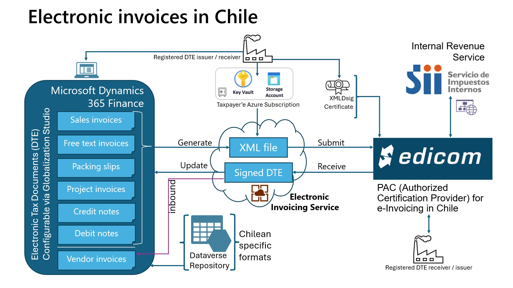

> [!NOTE]
> The electronic invoicing approach that this article describes is implemented by using an invoicing service that is applicable only to cloud deployments of Finance or Supply Chain Management.

> [!IMPORTANT]
> The new Electronic invoicing Globalization feature for Chile (outbound flow) requires that you run 365 Finance version 10.0.40. Specifically, you must run build number 10.0.1935.60 or later. The feature can only be imported into the new Globalization Studio. It isn't supported in Regulatory Configuration Service (RCS).

## Prerequisites

Before you begin the procedures in this article, the following prerequisites must be met:

1. Ensure that the settings for the Chilean legal entity are in place. For more information, see [Set up legal entity and tax information for Chile](ltm-chile-set-up-legal-entity-tax-information.md).
1. [Configure electronic invoice parameters for Chile](ltm-chile-conf-electronic-invoice.md).
1. Gain familiarity with and understanding of Electronic invoicing as it's described in [Electronic Invoicing service overview](../global/e-invoicing-service-overview.md).
1. Do the common part of Electronic Invoicing service configuration as it's described in [Electronic invoicing configuration](../global/gs-e-invoicing-set-up-overview.md).
1. You must enable the following features in Feature management:

    - Electronic invoicing integration
    - E-Invoicing service workspace designer
    - Execute update actions for submitted documents

1. Make sure that the following Electronic reporting (ER) format configurations are imported. For more information, see [Import Electronic reporting (ER) configurations](../../../fin-ops-core/dev-itpro/analytics/electronic-reporting-import-ger-configurations.md).

    - Customer invoice context model
    - Inventory e-invoice (CL)
    - Inventory Export e-Invoice (CL)
    - E-shipping guide (CL)
    - Project e-invoice (CL)
    - Project Export e-Invoice (CL)
    - Edicom source file response import format
    - Edicom response processing (CL)
    - Edicom response error log import

    > [!NOTE]
    > These formats are based on the corresponding **LATAM** format configurations that use the **Invoice model LATAM** and **Invoice model mapping LATAM** configurations. All required additional configurations are automatically imported.

## Configure the Electronic invoicing feature

The **Chilean electronic invoice (CL) "E-Invoicing for Chile: ISV last-mile connector with Edicom"** feature represents an outbound flow for issuing the following sales documents:

| Name | Code | Original name |
|---|---|---|
| Invoice | 33 | Factura Electrónica |
| Packing slip (e-shipping guide) | 52 | Guía de Despacho Electrónica |
| Debit note | 56 | Nota de Débito Electrónica |
| Credit note | 61 | Nota de Crédito Electrónica |
| Export invoice | 110 | Factura de Exportación |
| Export debit note | 111 | Nota de Débito de Exportación |
| Export credit note | 112 | Nota de Crédito de Exportación |

Some parameters of the feature are published with default values. Before you deploy the Electronic invoicing feature to the service environment, add a feature that is based on the Microsoft-provided feature, and complete the common parameters on the **Feature parameters** tab. Review the default values, and update them as required, so that they better reflect your business operations.

For Chile, there are at least three interactions with Edicom in the pipeline: first to submit the invoice, then to fetch the signed XML, and finally to fetch the status of the submitted invoice. Each interaction requires common parameters, such as Edicom connection details and the authentication token that Edicom provides. These common parameters are reused in the feature setup for all document types. Edicom provides the values when a company is onboarded.

> [!NOTE]
> The configuration of common parameters is simplified. You no longer have to go to each action and feature setup, and repeatedly specify the common connection parameters. Use of the **Feature parameters** tab is available only as of version 10.0.41.

> [!IMPORTANT]
> The **Chilean electronic invoice (CL)** feature is provided by Microsoft. Before it can be used, additional configuration is required, as described in this article. For information about how to configure invoicing features and apply changes, see [Work with feature setups](../global/e-invoicing-feature-setup.md). For example, in addition to the connection parameters, you can filter specific legal entities so that they are processed in applicability rules. By default, the feature is applicable to all legal entities that have a primary address in Chile.

1. Import the latest version of the **Chilean electronic invoice (CL)** Globalization feature as described in [Import features from the repository](../global/gs-e-invoicing-import-feature-global-repository.md). The following illustrations show what the feature looks like after you import it from Dataverse.

    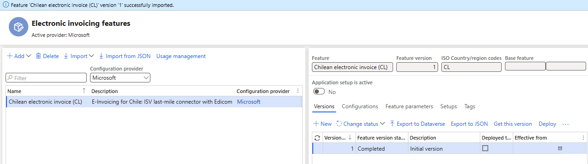

    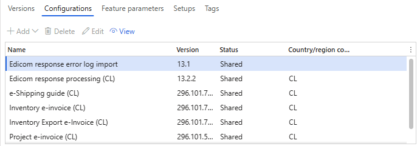

1. Create a copy of the imported Globalization feature, and select your configuration provider. For more information, see [Create a Globalization feature](../global/e-invoicing-create-new-globalization-feature.md).
1. On the **Versions** tab, confirm that the **Draft** version is selected.
1. On the **Feature parameters** tab, specify values for the following connection and integration parameters that are required for interoperation with Edicom's API:

    - Select **Application**, and then enter the service ID number that you obtained.
    - Select **Domain**, and then enter the same service ID number.
    - Select **Get status schema name**, and then enter the schema name.
    - Select **Group**, and then enter the group code that you obtained.
    - Select **Signed XML schema name**, and then enter the schema name.
    - Select **Destination name**, and then enter the service ID number concatenated with the string "_EDIWIN." For example, if the service ID number is 123456, enter **123456_EDIWIN**.
    - Select **Submit invoice schema name**, and then enter the schema name.
    - Select **Auth token**, and then select the name of the secret that you created for the token.
    - Select **Web service URL**, and confirm the web address.

    The following illustration shows these feature parameters set to the values that Edicom provided to Microsoft for testing purposes. The values that you enter will differ. Edicom provides these values to you when you're onboarded.

    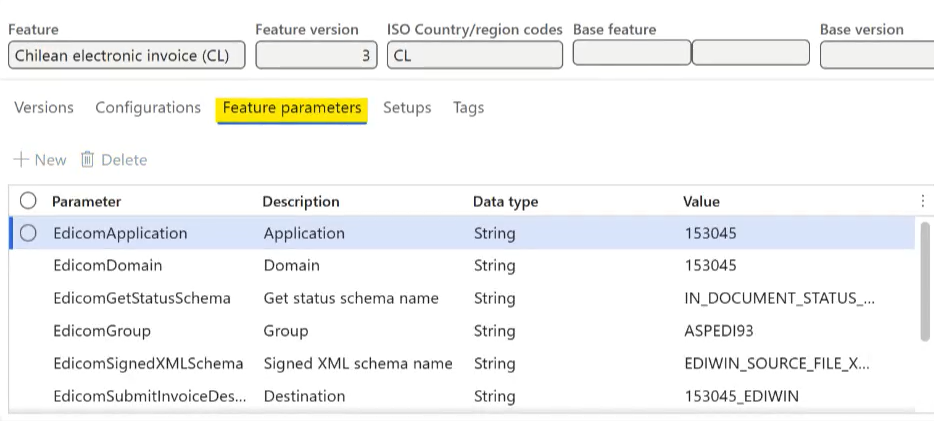

1. The copy of the feature is always created as a **Draft** version. Regardless of whether you made changes, you must complete, publish, and deploy the feature as described in [Complete, publish, and deploy a Globalization feature](../global/e-invoicing-complete-publish-deploy-globalization-feature.md).

### Outbound flow pipeline

To review the processing pipeline, on the **Setups** tab, go to **Feature setup**, select the derived document type that you want, and then select **Edit**. The outbound flow consists of the following actions:

1. **Transform document** – Generate a format that can be sent to Edicom.
1. **Integrate with Edicom** – Submit the generated invoice to Edicom.
1. **Get status from Edicom for an invoice** – Fetch the signed XML from Edicom. This document might not be immediately available, because the PAC needs time to generate it.

    > [!NOTE]
    > At this point in the flow, the concept of *update actions* comes into play. Notice that the **Update action** checkbox is selected for this step. Therefore, this step and all subsequent steps run in a loop until the system determines that a terminal state has been reached.

1. **Get status from Edicom for an invoice** – Fetch the status of the submitted invoice from Edicom.
1. **Process response** – Process the received response to determine whether a terminal state has been reached.

    - If the status response indicates a failure, the pipeline is terminated, and the submission is marked as failed.
    - Even if the status response indicates successful submission to the Chilean Internal Revenue Service (SII), the pipeline can't be completed yet, because customers or buyers in Chile can reject invoices for up to eight days. During this time, the pipeline is kept on hold in a **Pending execute update action** state. If a response is received that indicates customer rejection of the invoice, it's detected during the **Process response** step, and the pipeline is marked as failed.

1. **Terminate pipeline** – Wait the specified number of days, and then terminate the pipeline. In the out-of-box default setup, the pipeline is terminated with a **Completed** status if more than nine days pass since the invoice was submitted. If there are no rejections, the **Terminate pipeline** step marks the pipeline as completed.

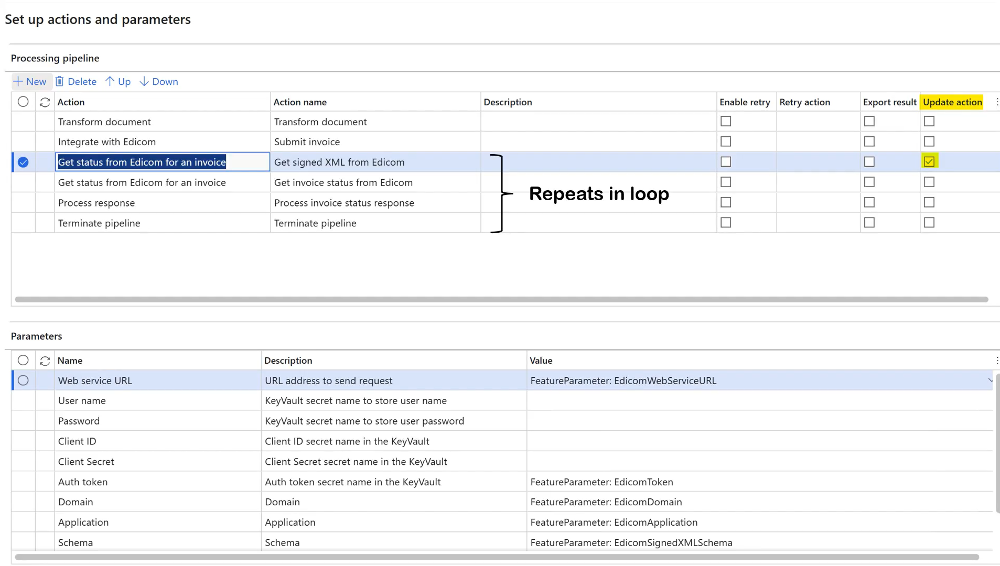

> [!NOTE]
> There is a similar setup for each format that is included in the **Chilean electronic invoice (CL)** feature. For Chile, there are six setups: five for sales documents (outbound flow) and one for import vendor invoices (inbound flow).
> 
> - Sales invoice derived
> - Project invoices derived
> - Export sales invoice derived
> - Export project invoices derived
> - Sales packing slips derived
> - Import vendor invoice
>
> 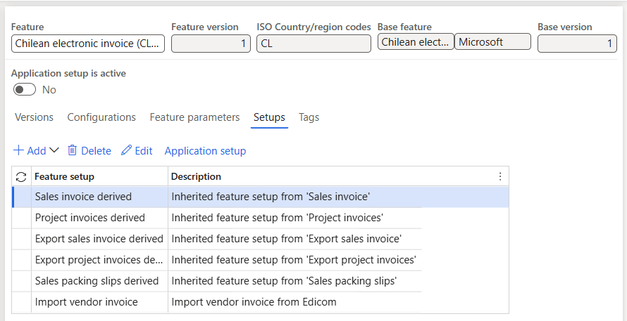

### Applicability rules

Applicability rules must be correctly configured to provide context, so that the exact Electronic invoicing Globalization feature that must run in Electronic Invoicing service can be found. Applicability rules are provided out of the box by checking the legal entity in the International Organization for Standardization (ISO) country/region code. This particular feature setup supports all three types of invoices: customer invoices, debit notes, and credit notes.

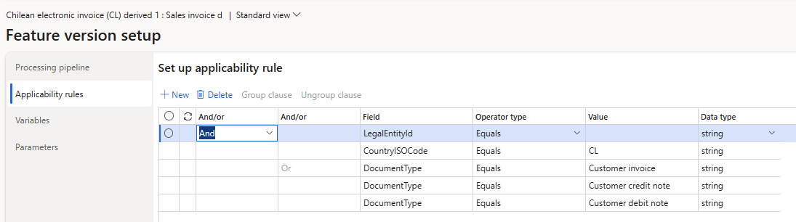

### Variables

The following variables are used in the outbound data flow actions of the Chilean feature. (These variables are provided out of the box.)

- **BusinessDocumentDataModel** – The Business Document Data model variable that is received from Finance or Supply Chain Management and transformed into the format that is required for submission.
- **SignedXML** – The signed XML variable that is sent back to Finance or Supply Chain Management. This variable contains the base64-encoded response body from the **Get Signed XML from Edicom** step. It's used in the response types to save the signed XML that is obtained from Edicom as an attachment to the invoice journal. It's also used to generate printable reports through QR codes.

After you import the **Electronic invoicing for Chile** feature that includes the out-of-box default feature setup, follow the steps in the next section to configure electronic documents.

## Configure electronic document parameters

1. Make sure that the country/region-specific ER configurations for the document context and electronic document model mapping that are required for Chile are imported. For more information, see [Set up Electronic document parameters](../global/e-invoicing-set-up-parameters.md#set-up-electronic-document-parameters).
1. Go to **Organization administration** \> **Setup** \> **Electronic document parameters**.
1. In the **Electronic document** section, add records for the **Customer Invoice journal**, **Customer packing slip journal**, and **Project invoice** table names.
1. For each table name, set the **Document context** and **Electronic document model mapping** fields in accordance with step 1.

    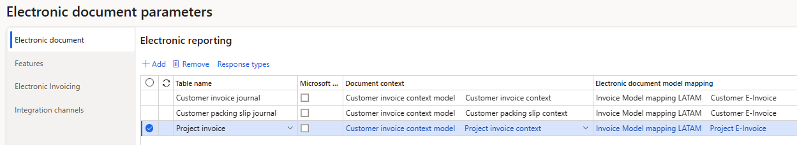

1. Save your changes, and close the page.
1. For each table name, follow these steps:

    1. Select **Response types**, select **New** to create a response type that you will get from the back end, and enter the following values:

        - In the **Response type** field, enter **SignedXML** (the default value). (See the [Variables](#variables) section of this article.)
        - In the **Description** field, enter any meaningful name. Alternatively, leave the field blank.
        - In the **Submission status** field, select **Pending**.
        - In the **Model mapping** field, select **Edicom source file response format**.

    1. Repeat the preceding step, but set the **Submission status** field to **Pending update actions execution**. In this way, you can run a subset of the actions in the processing pipeline in a loop to continuously pull updated statuses and other information for the submitted documents from the tax authority.

    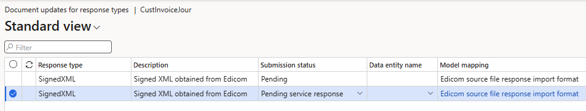

    > [!NOTE]
    > The response includes the signed XML that is obtained from Edicom. This signed XML is stored in the system as an attachment to the corresponding invoice journal. It will eventually be used to generate printable invoices through QR codes.

## Issue electronic invoices

After you complete all the required configuration steps, you can generate and submit electronic invoices for posted invoices by going to **Organization administration** \> **Periodic** \> **Electronic documents** \> **Submit electronic documents**. For more information about how to generate electronic invoices, see [Submit electronic documents](../global/e-invoicing-submit-electronic-documents.md).

To inquire about the results of a submission, go to **Organization administration** \> **Periodic** \> **Electronic documents** \> **Electronic document submission log**, and select the required document type. For more information, see [Work with Electronic document submission log](../global/e-invoicing-submission-log.md).

For Chile, after you submit the invoice, the submission status is set to **Pending update actions execution**. The response body is probably empty for the signed XML and the call to get the invoice status. An empty response body indicates that the XML wasn't available immediately after submission. To address the pending status, a function that is named **Execute update actions** is used. This function resumes the pipeline from the action that is marked as an update action, and then runs all subsequent actions in the pipeline in a loop. The status should change to **Executing** again. Then, after a few seconds, it reverts to **Pending update actions execution**.

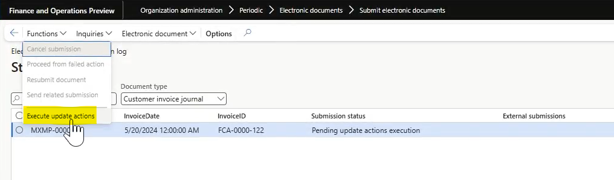

> [!NOTE]
> By setting a recurrence schedule, you can configure the **Execute update actions** function to run in batch mode on a periodic basis.

When you review the submission details, you should notice that the steps run again. This time, the signed XML is received.

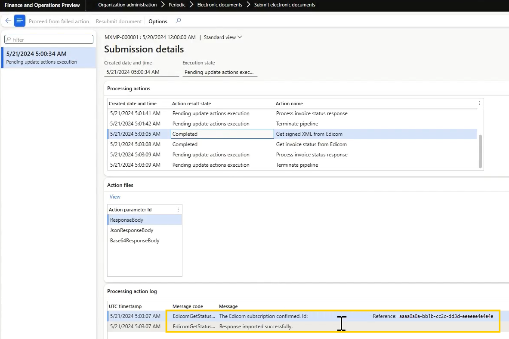

As a result of the completed outbound flow, the signed XML is attached to the invoice journal as **EdicomSourceFile**.

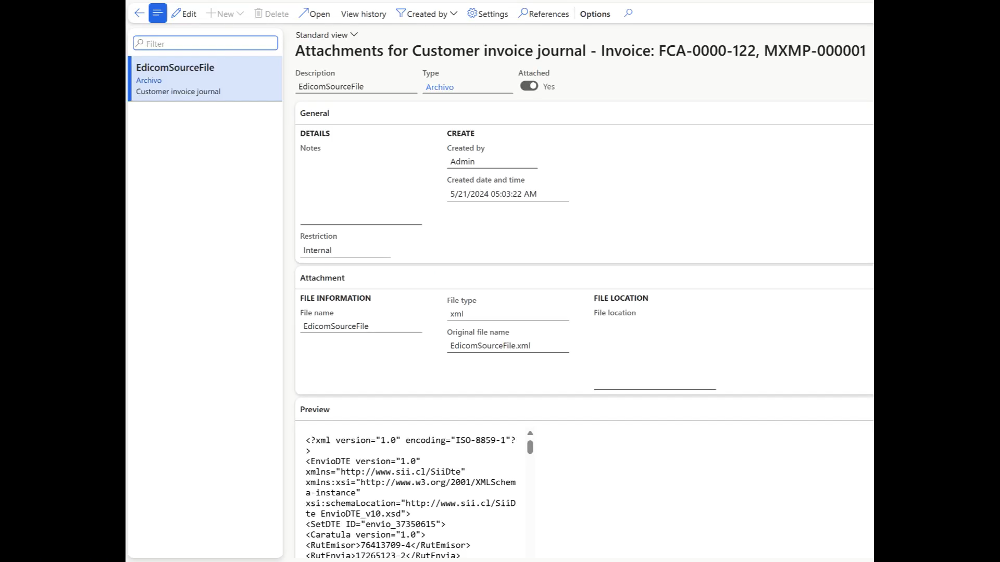

If no business rejection or acceptance is received from the buyer after nine days, the **Terminate pipeline** action completes the pipeline.

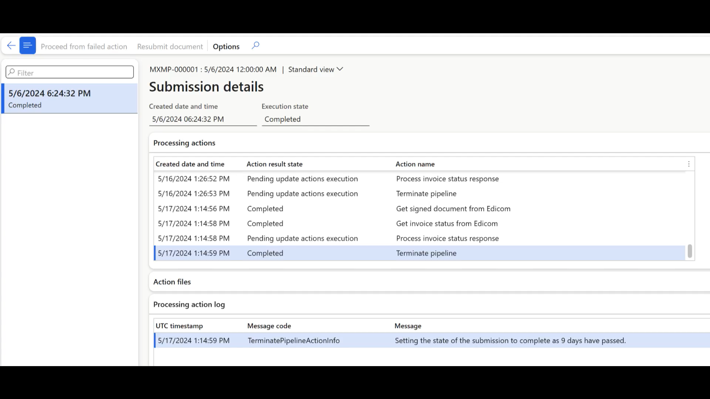

## More resources

- [Electronic Invoicing service overview](../global/e-invoicing-service-overview.md)
- [Get started with Electronic invoicing service administration](../e-invoicing-get-started-service-administration.md)
- [Get started with Electronic invoicing](../e-invoicing-get-started.md)
- [Electronic Invoicing service independent software vendor (ISV) last-mile connector](../global/e-invoicing-isv-connector.md)
- [Dynamics 365 Country expansion: localizations for LATAM countries | June 27, 2024](https://community.dynamics.com/blogs/post/?postid=7bd2efc7-9344-ef11-840a-6045bdeef618)
- [Dynamics 365 Country expansion: localizations for LATAM countries | D365 FastTrack Tech Talks (youtube.com)](https://www.youtube.com/watch?v=eK8TJmnhpJo)

[!INCLUDE[footer-include](../../../includes/footer-banner.md)]
