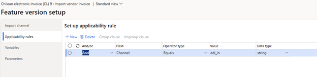
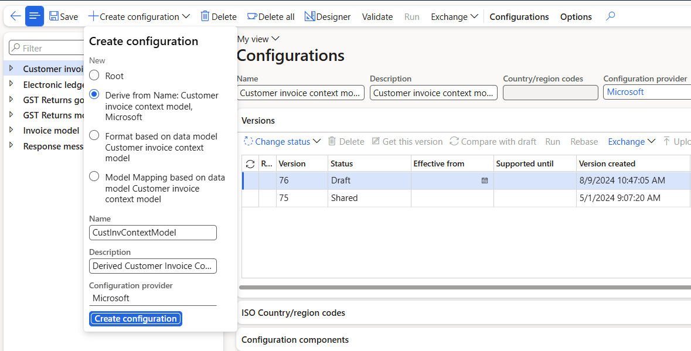

# Vendor electronic invoice import in Chile

[!include [banner](../../includes/banner.md)]

This article explains how to configure and use vendor electronic invoice import for Chile from the country-specific XML format in Microsoft Dynamics 365 Finance.

## Prerequisites

Before you complete the tasks in this article, the following prerequisites must be met:

- The primary address of the legal entity must be in Chile.
- **Enable application response for vendor invoices** feature must be enabled in Feature management.
- Make sure that the following Electronic reporting (ER) format configurations are imported.
    - **Customer invoice context model**
    - **Inventory e-invoice (CL) XML Import**
    - **Edicom response processing (CL)**

> [!NOTE]
> The ER format is based on the **Invoice model LATAM** configuration and uses the **Vendor Invoice Mapping to Destination LATAM** configuration. All required additional configurations are automatically imported.

## Configure the Electronic invoicing feature
### Import channel

To enable an inbound flow, a **feature setup** of the **Import channel** type nedds to be created for the **Chilean electronic invoice (CL) "E-Invoicing for Chile: ISV last-mile connector with Edicom"** globalization feature as follows:
1. Switch to the **Setups** tab of the derived feature.
1. Click **Add** and opt for **Custom setup**.
1. Specify **Name** and **Description** of the feature setup.
1. Choose the **Import channel** setup type and select the **Edicom service** data channel.
1. Click on the **Create** button.
1. Position on the created feature setup for the vendor invoice import.
1. Click on **Edit**.
1. Complete the **Import channel parameters**. 

    The following illustration shows these feature setup parameters set to the values that Edicom provided to Microsoft for testing purposes. The values that you enter will differ. Edicom provides these values to you when you're onboarded.

    

### Applicability rules

Applicability rules must be correctly configured to provide context, so that the exact Electronic invoicing Globalization feature that must run in Electronic Invoicing service can be found. Create a new applicability rule for the same channel name as specified for the Import channel configuration above. For example, like this:

### Variables

Variables are provided out-of-box with the particular feature setup supporting the following variables: EdicomId, Response, and ResponseXML as shown on the picture below:

> [!NOTE]
> Once the feature setup is completed, save, complete, and deploy the version.

## Configure Electronic reporting

1. Go to the **Electronic reporting** workspace, open **Reporting configurations**.
1. **Derive** a configuration from **Customer Invoice Context Model**.

1. In the new created configuration, go to **Designer** \> **Map model to datasource** \> **Data channel** \> **Designer**.
1. Update the **Data channel context** with the value of your **Channel name**, save the changes. 
1. The change would look like this (an example):

1. Return back to **Reporting configurations**.
1. Position to **Vendor invoice Mapping to destination LATAM** configuration.
1. Set the **Default for model mapping** to **Yes**.

## Configure parameters

## Configure electronic document parameters

1. Make sure that the country/region-specific ER configurations for the document context and electronic document model mapping that are required for Chile are imported. For more information, see [Set up Electronic document parameters](../global/e-invoicing-set-up-parameters.md#set-up-electronic-document-parameters).
1. Go to **Organization administration** \> **Setup** \> **Electronic document parameters**.
1. In the **Integration channels** section, create records: specify a **Channel** name of **Import** type and the document context configuration for every required company.
1. For each channel, add the **Import source** as follows:
	- fill in the response format in the **Name** field,
	- select the **Vendor invoice header** data entity,
	- and put the **model mapping** for the invoice import.
1. Save your changes, and close the page.

### Configure vendor data

During the import process, vendors are identified by their tax exempt number. To enable correct vendor identification, follow these steps.

1. Go to **Accounts payable** \> **Vendors** \> **All vendors**, and select a vendor.
2. On the **Invoice and delivery** FastTab, in the **Tax exempt number** field, enter a valid tax registration number for the vendor. This number is used to identify the vendor during import, by matching it to the value of the **Invoice\\cac:AccountingSupplierParty\\cac:Party\\cac:PartyLegalEntity\\cbc:CompanyID** element in the import XML file.

### Configure products

During the import process, products are identified by their external descriptions. These descriptions are usually vendor-specific. To enable correct product identification, follow these steps.

1. Go to **Product information management** \> **Products** \> **Released products**.
2. Select a product, and then, on the **Purchase** menu, in the **Related information** section, select **External item description**.
3. Create a new external description for the selected product.
4. In the **Account code** column, select **Table** to define an external product description for a specific vendor.
5. In the **Vendor relation** column, select a vendor.
6. In the **External item number** column, enter an external product code. This code is used to identify the product during import, by matching the code to the value of the **Invoice\\cac:InvoiceLine\\cac:Item\\cbc:Name** element in the import XML file.

### Configure units of measure (optional)

You can optionally configure external codes for units of measure, if specific units are explicitly defined in the incoming import files.

1. Go to **Organization administration** \> **Setup** \> **Units** \> **Units**.
2. Select a unit ID, and then select **External codes**.
3. On the **External codes** page, in the **Overview** section, in the **Code** field, enter a code that corresponds to the selected unit ID.
4. In **Value** section, in **Value** field, enter the external unit code that's expected in import files.

## Import vendor electronic invoices

To run the import vendor electronic invoices, follow these steps.

1. Go to **Organization administration** \> **Periodic** \> **Electronic documents** \> **Receive electronic documents**.
2. On the **Receive electronic documents** dialog, cpecify the parameters as required.
3. Click **OK** to immediately start the import process or to schedule the import to run in the background.

### Import process description

Here's an overview of the steps in the import process and the order that they occur in.

1. Vendors are identified by using the tax exempt number that's defined in the vendor record. If no vendor matches the data that's being searched, the import process fails, and a related error message is shown.
2. Products that are used on invoice lines are identified by using an external item number, which might be vendor-specific. If no product matches the external description, the import process fails, and a related error message is shown.
3. If units of measure are used on invoices lines, they're identified by using external codes values. If no unit that has a matching external code value is found in the system, the import process fails, and a related error message is shown.
4. If an incoming import file contains the information about purchase orders and its lines in the **Invoice\\cac:OrderReference\\cbc:ID** and **Invoice\\cac:InvoiceLine\\cac:OrderLineReference\\cbc:LineID** elements, the numbers are used for invoice matching with purchase orders and lines that are entered in the system.
5. If no order or line references are defined in an incoming file, the system tries to automatically match incoming vendor invoices with existing purchase orders.
6. If no purchase order is found, the system raises a warning but continues the import. It now considers products on invoice lines **Non-stock** items. The system expects that these products belong to an item model group where the **Stocked product** checkbox is cleared on the **Inventory policy** page.
7. If no related **Non-stock** products exist, the system tries to import invoice lines by referring to a default item. The default item must be configured in the system as a released product where the code is defined exactly as **DEFAULT\_ITEM**, and the product must belong to an item model group where the **Stocked product** checkbox is cleared on the **Inventory policy** page. If no default item is configured in the system, the import process fails, and a related error message is shown.
8. Taxes are calculated in the system, based on the imported data and tax settings. Taxes aren't imported as fixed amounts from the incoming XML file. The results of the calculation can be manually adjusted as required.

Successfully imported vendor electronic invoices are shown in the system as pending invoices. To review imported invoices, go to **Accounts payable** \> **Invoices** \> **Pending vendor invoices**. 

### Application response

> [!NOTE]
> There are some limitations to this import process:
>
> - The import of miscellaneous charges isn't supported.
> - Only the import of line-level discounts is supported.

## Learn more

- [Get started with Electronic invoicing for Chile](ltm-chile-elec-invo-conncection.md)

[!INCLUDE[footer-include](../../../includes/footer-banner.md)]
