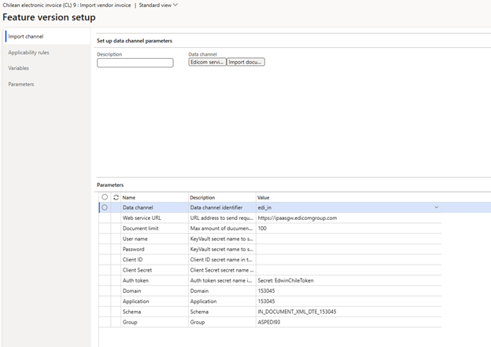
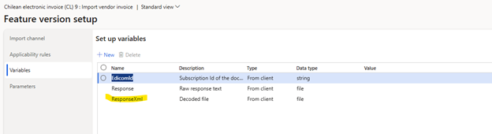
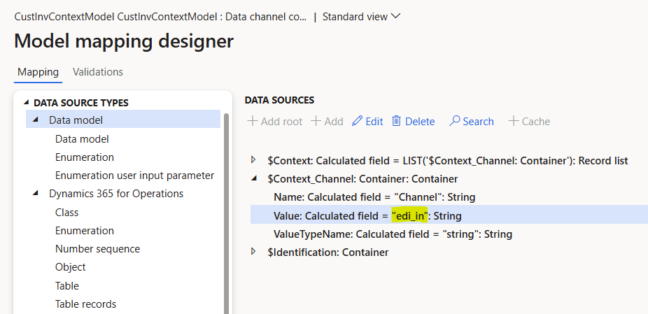
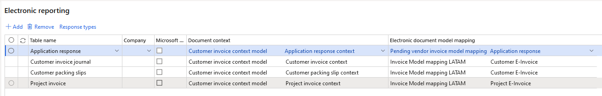
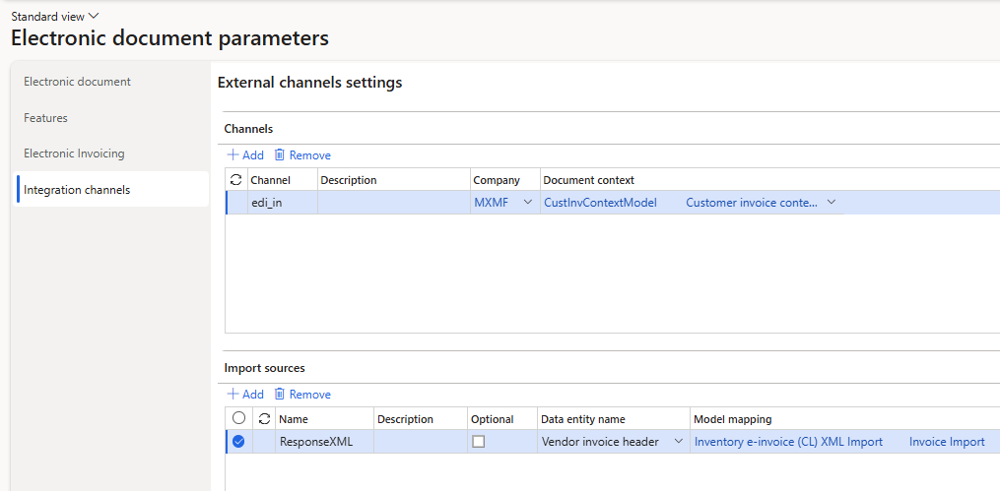
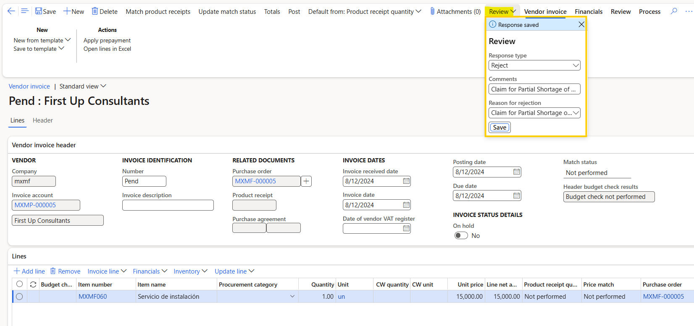

# Vendor electronic invoice import in Chile

[!include [banner](../../includes/banner.md)]

This article explains how to configure and use vendor electronic invoice import for Chile from the country-specific XML format in Microsoft Dynamics 365 Finance.

## Prerequisites

Before you complete the tasks in this article, the following prerequisites must be met:

1. The primary address of the legal entity must be in Chile.
1. Ensure that the settings for the Chilean legal entity are in place. For more information, see [Set up legal entity and tax information for Chile](ltm-chile-set-up-legal-entity-tax-information.md).
1. [Configure electronic invoice parameters for Chile](ltm-chile-conf-electronic-invoice.md).
1. Gain familiarity with and understanding of Electronic invoicing as it's described in [Electronic Invoicing service overview](../global/e-invoicing-service-overview.md).
1. Do the common part of Electronic Invoicing service configuration as it's described in [Electronic invoicing configuration](../global/gs-e-invoicing-set-up-overview.md).
1. **Enable application response for vendor invoices** feature must be enabled in Feature management.
1. Make sure that the following Electronic reporting (ER) format configurations are imported.
    - Customer invoice context model
    - Inventory e-invoice (CL) XML Import
	- Vendor Invoice Mapping to Destination LATAM
    - Application response (CL)
	- Pending vendor invoice model mapping

> [!NOTE]
> The ER format is based on the **Invoice model LATAM** configuration and uses the **Vendor Invoice Mapping to Destination LATAM** configuration. All required additional configurations are automatically imported.

## Configure the Electronic invoicing feature
### Import channel

To enable an inbound flow, a **feature setup** of the **Import channel** type needs to be created for the **Chilean electronic invoice (CL) "E-Invoicing for Chile: ISV last-mile connector with Edicom"** globalization feature. To enable an inbound flow, follow these steps.

1. Switch to the **Setups** tab of the derived feature.
1. Select **Add** and opt for **Custom setup**.
1. Specify **Name** and **Description** of the feature setup.
1. Choose the **Import channel** setup type and select the **Edicom service** data channel.
1. Select the **Create** button.
1. Position on the created feature setup for the vendor invoice import.
1. Select on **Edit**.
1. Complete the **Import channel parameters**. 

    The following illustration shows these feature setup parameters set to the values that Edicom provided to Microsoft for testing purposes. The values that you enter will differ. Edicom provides these values to you when you're onboarded.

    

### Applicability rules

Applicability rules must be correctly configured to provide context, so that the exact Electronic invoicing Globalization feature that must run in Electronic Invoicing service can be found. Create a new applicability rule for the same channel name as specified for the Import channel configuration above. For example, add an applicability rule with an **And** clause that uses the Channel field equal to the value of the "edi_in" string.

### Variables

Variables are provided out-of-box with the particular feature setup supporting the following variables: EdicomId, Response, and ResponseXML as shown on the picture below:

> [!NOTE]
> Once the feature setup is completed, save, complete, and deploy the version.

## Configure Electronic reporting

1. Go to the **Electronic reporting** workspace, open **Reporting configurations**.
1. **Derive** a configuration from **Customer Invoice Context Model**.
1. In the new created configuration, go to **Designer** \> **Map model to datasource** \> **Data channel** \> **Designer**.
1. Update the **Data channel context** with the value of your **Channel name**, save the changes. 
1. The change would look like this (an example):

1. Return back to **Reporting configurations**.
1. Position to **Vendor invoice Mapping to destination LATAM** configuration.
1. Set the **Default for model mapping** to **Yes**.

## Configure parameters

### Configure electronic document parameters

1. Make sure that the country/region-specific ER configurations for the document context and electronic document model mapping that are required for Chile are imported. For more information, see [Set up Electronic document parameters](../global/e-invoicing-set-up-parameters.md#set-up-electronic-document-parameters).
1. Go to **Organization administration** \> **Setup** \> **Electronic document parameters**.
1. Under the section **Electronic document** section, add the record for **Application response** as follows:
    
1. In the **Integration channels** section, create records: specify a **Channel** name of **Import** type and the document context configuration for every required company.
1. For each channel, add the **Import source** as follows:
	- fill in the response format in the **Name** field,
	- select the **Vendor invoice header** data entity,
	- and put the **model mapping** for the invoice import.
1. Save your changes, and close the page.
    

### Configure vendor data

During the import process, vendors are identified by their tax exempt number. To enable correct vendor identification, follow these steps.

1. Go to **Accounts payable** \> **Vendors** \> **All vendors**, and select a vendor.
2. On the **LATAM** FastTab, in the **Country identification number** field, enter a valid identification number of the country for the vendor. This number is used to identify the vendor during import, by matching it to the value of the **DTE\\Documento\\Encabezado\\RUTEmisor** element in the import XML file.

### Configure products

During the import process, products are identified by their external descriptions. These descriptions are usually vendor-specific. To enable correct product identification, follow these steps.

1. Go to **Product information management** \> **Products** \> **Released products**.
2. Select a product, and then, on the **Purchase** menu, in the **Related information** section, select **External item description**.
3. Create a new external description for the selected product.
4. In the **Account code** column, select **Table** to define an external product description for a specific vendor.
5. In the **Vendor relation** column, select a vendor.
6. In the **External item number** column, enter an external product code. This code is used to identify the product during import, by matching the code to the value of the **DTE\\Documento\\Detalle\\NmbItem** element in the import XML file.

> [!NOTE]
> If there must be non-stocked items, the system expects that these products belong to an item model group where the Stocked product checkbox is cleared on the Inventory policy page. 
> If no related Non-stock products exist, the system tries to import invoice lines by referring to a default item. The default item must be configured in the system as a released product where the code is defined exactly as DEFAULT_ITEM, and the product must belong to an item model group where the Stocked product checkbox is cleared on the Inventory policy page.

## Import Vendor electronic invoices and send Application responses

To run the import vendor electronic invoices, follow these steps.

1. Go to **Organization administration** \> **Periodic** \> **Electronic documents** \> **Receive electronic documents**.
2. On the **Receive electronic documents** dialog, specify the parameters as required.
3. Select **OK** to immediately start the import process or to schedule the import to run in the background.

### Import process description

Here's an overview of the steps in the import process and the order that they occur in.

1. Vendors are identified by using the Country identification number that's defined in the vendor record. If no vendor matches the data that's being searched, the import process fails, and a related error message is shown.
1. Products that are used on invoice lines are identified by using an external item number, which might be vendor-specific. If no product matches the external description, the import process fails, and a related error message is shown.
1. If an incoming import file contains the information about purchase orders and its lines in the **DTE\\Documento\\Referencia\\FolioRef** elements, the numbers are used for invoice matching with purchase orders and lines that are entered in the system.
1. If no order or line references are defined in an incoming file, the system tries to automatically match incoming vendor invoices with existing purchase orders.
1. If no purchase order is found, the system raises a warning but continues the import. It now considers products on invoice lines **Non-stock** items. The system expects that these products belong to an item model group where the **Stocked product** checkbox is cleared on the **Inventory policy** page.
1. If no related **Non-stock** products exist, the system tries to import invoice lines by referring to a default item. The default item must be configured in the system as a released product where the code is defined exactly as **DEFAULT\_ITEM**, and the product must belong to an item model group where the **Stocked product** checkbox is cleared on the **Inventory policy** page. If no default item is configured in the system, the import process fails, and a related error message is shown.

Successfully imported vendor electronic invoices are shown in the system as pending invoices. To review imported invoices, go to **Accounts payable** \> **Invoices** \> **Pending vendor invoices**. 

### Application response

Once the imported vendor electronic invoice has been reviewed in the **Accounts payable** \> **Invoices** \> **Pending vendor invoices** form, an application response with an acceptance or a rejection along with the corresponding comment and reason for rejection can be saved and submitted.

To fill in the application response, perform the following steps:
1. In the **Pending vendor invoices** opened in the edit mode for the desired invoice, select the **Review** button on the top ribbon.
1. Select the response type as required:
	- Accept
	- Accept with discrepancies
	- Reject
1. Specify the **Comments** in case of **Accept of discrepancies** or **Reject**.
1. Choose the **Reason for rejection** among the following values:
	- Claim to the content of the document
	- Claim for Partial Shortage of Goods
	- Claim for Total Shortage of Goods
1. Select **Save**.
For example:

1. Go to **Organization administration** \> **Periodic** \> **Electronic documents** \> **Submit electronic documents**.
1. Expand the **Records to include** fast tab and select **Filter**.
1. In **Joins**, add vendor invoices to the join for application response.
1. Add the **Range** \> **Criteria** with the invoice number to the **Vendor invoices** table.
1. **Submit** the application response.
1. Once submitted, the application response cannot be modified.

> [!IMPORTANT]
> Application responses need to be sent before the pending vendor invoices are posted. The application response capability is not available for posted invoices.

## Learn more

- [Get started with Electronic invoicing for Chile](ltm-chile-elec-invo-conncection.md)

[!INCLUDE[footer-include](../../../includes/footer-banner.md)]
