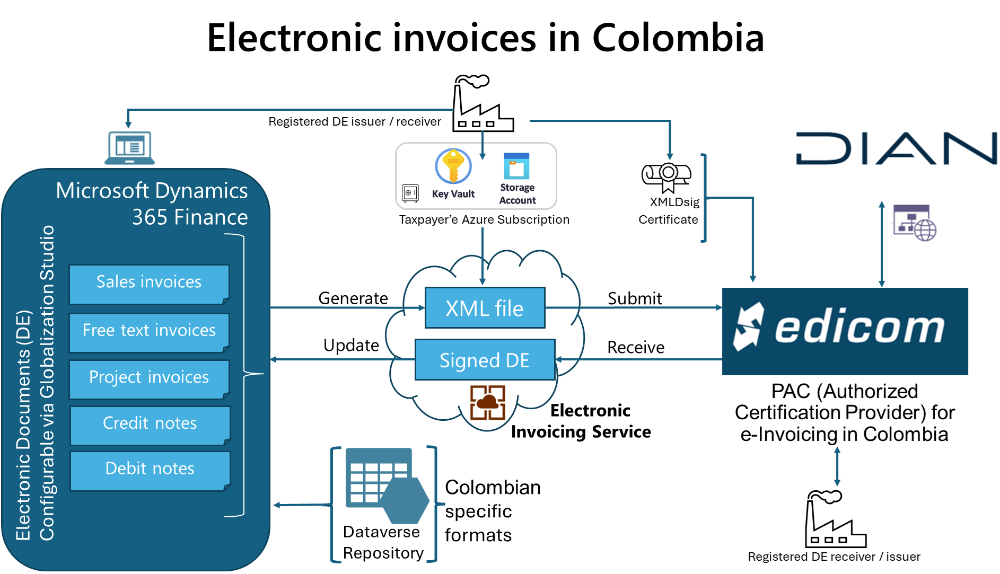
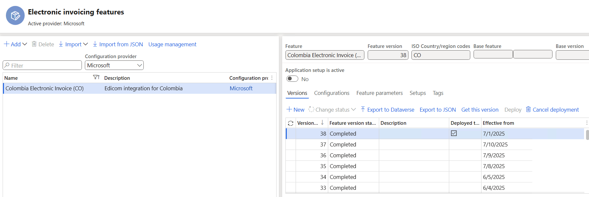
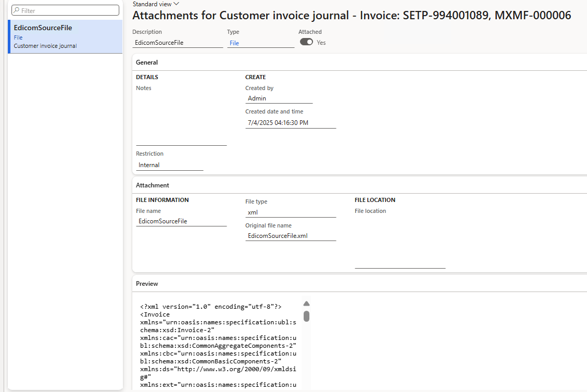

# Get started with Electronic invoicing for Colombia

- [Introduction](#get-started-with-electronic-invoicing-for-colombia)
- [Prerequisites](#prerequisites)
- [Configure the electronic invoicing feature](#configure-the-electronic-invoicing-feature)
- [Edicom Interactions for Colombia](#edicom-interactions-for-colombia)
    - [Additional Interactions (Conditionally Triggered)](#additional-interactions-conditionally-triggered)
- [Outbound flow pipeline](#outbound-flow-pipeline)
- [Electronic invoice feature](#electronic-invoice-feature)
    - [Setups-View](#setups-view)
    - [Feature version setup](#feature-version-setup)
        - [Processing pipeline](#processing-pipeline)
        - [Applicability Rules and Feature Setup Scope](#applicability-rules-and-feature-setup-scope)
        - [Variables](#variables)
    - [Setups-Application Setup](#setups-application-setup)
- [Configure electronic document parameters](#configure-electronic-document-parameters)
- [Issue electronic invoices](#issue-electronic-invoices)
- [More resources](#more-resources)

[!include [banner](../../includes/banner.md)]

This article provides information to help you get started with Electronic invoicing for Colombia. It guides you through the configuration steps that are country/region-dependent in Microsoft Dynamics 365 Finance or Dynamics 365 Supply Chain Management. These steps complement the steps that are described in [Electronic invoicing setup](../global/gs-e-invoicing-set-up-overview.md). For the last-mile integration with the Colombian Tax Authorities, Microsoft is partnering with Edicom.

After you configure Electronic invoicing, you can generate, digitally sign, and submit the XML files of electronic invoices to the [Edicom](https://edicomgroup.com/electronic-invoicing/colombia) authorized certification provider (PAC) according to the [regulatory requirements in Colombia](https://www.dian.gov.co/).

> [!NOTE]
> The electronic invoicing approach that this article describes is implemented by using an invoicing service that is applicable only to cloud deployments of Finance or Supply Chain Management.

## Prerequisites

Before you begin the procedures in this article, the following prerequisites must be met.

1. Ensure that the settings for the Colombian legal entity are in place. For more information, see [Set up a legal entity and tax information for Colombia](ltm-set-up-legal-entity-tax-colombia.md).
1. Gain familiarity with and understanding of Electronic invoicing as it's described in [Electronic invoicing overview](../global/gs-e-invoicing-service-overview.md).
1. Do the common part of Electronic Invoicing service configuration as described in [Electronic invoicing configuration](../global/gs-e-invoicing-set-up-overview.md).
1. You must enable the following features in Feature management:

    - Electronic invoicing integration
    - Electronic invoicing integration resubmit document from failed action
    - Execute update actions for submitted documents

1. Ensure that the following Electronic reporting (ER) format configurations are imported. For more information, see:
[Import Electronic reporting (ER) configurations from Dataverse](../global/workspace/gsw-import-er-config-dataverse.md),
[Import Electronic reporting (ER) configurations](../../../fin-ops-core/dev-itpro/analytics/electronic-reporting-import-ger-configurations.md).

    - Customer invoice context model
    - Edicom response error log import
    - Edicom Response Processing CO
    - Edicom source file response import format
    - Inventory e-Invoice (CO)
    - Inventory e-DebitNote (CO)
    - Inventory e-CreditNote (CO)
    - Project e-Invoice (CO)
    - Project e-DebitNote (CO)
    - Project e-CreditNote (CO)

    > [!NOTE]
    > These formats are based on the corresponding **LATAM** format configurations that use the **Invoice model LATAM** and **Invoice model mapping LATAM** configurations. All other required configurations are automatically imported.
    
[!IMPORTANT]
**Colombia – Referencing another document using CUFE or CUDE**

For Colombia, whenever a document must reference another one — for example:
- Credit Notes that cancel or correct an invoice
- Invoices that cancel Credit Notes or Debit Notes
- Debit Notes that cancel or correct a document
The relationship is established only through the CUFE (Unique Electronic Invoice Code) or CUDE (Unique Electronic Document Code) of the original document.

Therefore, the referenced document must have been previously submitted and approved by the DIAN, so that the CUFE or CUDE is available in the official signed XML.
If the referenced document has not been approved by the DIAN, this information will not be available and cannot be included in the document being processed.

## Configure the electronic invoicing feature

The **Colombia Electronic Invoice (CO) Edicom integration for Colombia"** feature represents an outbound flow to issue the following sales documents.

| Name                      | Code | Original name                  |
|---------------------------|------|--------------------------------|
| Electronic sales invoice  | 01   | Factura electrónica de venta   |
| Export Invoice            | 02   | Factura de exportación         |
| Credit Note               | 91   | Nota de Crédito                |
| Debit Note                | 92   | Nota de Débito                 |

Some parameters of the feature are published with default values. Before you deploy the Electronic invoicing feature to the service environment, add a feature that is based on the Microsoft-provided feature, and complete the common parameters on the **Feature parameters** tab. Review the default values, and update them as required, so that they better reflect your business operations.

## Edicom Interactions for Colombia

For Colombia, there are at least three core interactions with Edicom in the base flow:

1. **Invoice submission**  
2. **Signed XML retrieval**  
3. **Status retrieval of the submitted invoice**

### Additional Interactions (Conditionally Triggered)

In addition to the base flow, up to three extra interactions may occur depending on the response from the receiver:

1. **Status 30 – Invoice reception**  
   The receiver acknowledges that the invoice was received.

2. **Status 32 – Good or service reception**  
   The receiver confirms receipt of the goods or services described in the invoice.

3. **One of the following may follow**:
   - **Status 31 – Reclaim**  
     The receiver issues a formal complaint or disagreement regarding the invoice or delivered goods/services.
   - **Status 33 – Express acceptance**  
     The receiver explicitly accepts the invoice and its content.
   - **Status 34 – Tacit acceptance**  
     If no response is received from the receiver within the legal timeframe, the sender may generate this status to indicate automatic acceptance.

> **Note:** Status codes **30**, **31**, **32**, and **33** are generated by the **receiver**, while status **34** will be returned automatically by Edicom after 72 hours if status 31 or 33 are not received.

Each of these interactions requires common parameters, such as Edicom connection details and the authentication token provided by Edicom. These parameters are reused across the feature setup for all document types. Edicom supplies these values during the company's onboarding process.

---
**Colombia Electronic Invoice (CO) Edicom integration for Colombia**

> [!IMPORTANT]
> The **Colombia Electronic Invoice (CO)** feature is provided by Microsoft. Before it can be used, it requires additional configuration, as described in this article. For information about how to configure invoicing features and apply changes, see [Work with feature setups](../global/gs-e-invoicing-feature-setup.md). For example, in addition to the connection parameters, you can filter specific legal entities so that they are processed in applicability rules. By default, the feature is applicable to all legal entities that have a primary address in Colombia.

1. Import the latest version of the **Colombia Electronic Invoice (CO)** Globalization feature as described in [Import features from the repository](../global/gs-e-invoicing-import-feature-global-repository.md). The following illustrations show what the feature looks like after you import it from Dataverse.

    

    If you go to the **Configuration** tab, as shown in the previous screenshot, you should see a page displaying information similar to the following table:

    | Name                                | Version         | Status     | Country/region code |
    |-------------------------------------|-----------------|------------|----------------------|
    | Edicom response error log import    | 13.2            | Completed  |                      |
    | Project e-CreditNote (CO)           | 296.141.21.22   | Completed  | CO                   |
    | Project e-DebitNote (CO)            | 296.141.21.17   | Completed  | CO                   |
    | Project e-Invoice (CO)              | 296.141.21.14   | Completed  | CO                   |
    | Inventory e-CreditNote (CO)         | 296.142.39.27   | Completed  | CO                   |
    | Inventory e-DebitNote (CO)          | 296.142.39.23   | Completed  | CO                   |

    > [!NOTE]
    > The version numbers may change if the formats have been updated. The table is for illustrative purposes only.

1. Create a copy of the imported Globalization feature, and select your configuration provider. For more information, see [Create a Globalization feature](../global/gs-e-invoicing-create-new-globalization-feature.md).
1. On the **Versions** tab, confirm that the **Draft** version is selected.
1. On the **Feature parameters** tab, specify values for the following connection and integration parameters that are required for interoperation with Edicom's API.  
These parameters are general-purpose and will be used across the different actions in the setups, so you only need to configure them once in this section.

    > [!TIP]
    > The following table provides **example values** for each feature parameter, so you can see the type of data that should be entered for each one. These values are **illustrative only** and were provided by Edicom to Microsoft for testing purposes. When you are onboarded, Edicom will provide you with your own unique values to use in your configuration.

    | Parameter                      | Description                    | Data type    | Value                                      |
    |-------------------------------|--------------------------------|--------------|--------------------------------------------|
    | EdicomApplication             | Application                    | String       | <ID_PROVIDED_EDICOM>   |
    | EdicomDomain                  | Domain                         | String       |  <ID_PROVIDED_EDICOM>                 |
    | EdicomGetStatusSchema         | Get status schema name         | String       | IN_DOCUMENT_STATUS_MICROSOFT_CO            |
    | EdicomGroup                   | Group                          | String       | <GROUP_ID>                                  |
    | EdicomSignedXMLSchema         | Signed XML schema name         | String       | EDIWIN-SOURCE-FILE_SIGNED_<ID_PROVIDED_EDICOM>
    | EdicomSubmitInvoiceDestination| Destination name               | String       | <ID_PROVIDED_EDICOM>_EDIWIN   |
    | EdicomSubmitInvoiceSchema     | Submit invoice schema name     | String       | OUTBOUND_DOCUMENT_MICROSOFT_CO             |
    | EdicomToken                   | Auth token                     | Secret name  | EdiwinColombiaToken                        |
    | EdicomWebServiceURL           | Web service URL                | String       | https://ipaasgw.edicomgroup.com            |

    > [!TIP]
    > When configuring the feature parameters for Edicom integration, follow these steps:
    >
    > - Select **Application**, and enter the service ID number you obtained from Edicom.
    > - Select **Domain**, and enter the same service ID number.
    > - Select **Get status schema name**, and enter the provided schema name.
    > - Select **Group**, and enter the group code you received.
    > - Select **Signed XML schema name**, and enter the appropriate schema name.
    > - Select **Destination name**, and enter the service ID number concatenated with "_EDIWIN". For example, if your service ID is 123456, enter **123456_EDIWIN**.
    > - Select **Submit invoice schema name**, and enter the schema name.
    > - Select **Auth token**, and choose the name of the secret you created for the token.
    > - Select **Web service URL**, and verify the web address is correct.
5. The copy of the feature is always created as a **Draft** version. Regardless of whether you made changes, you must complete, publish, and deploy the feature as described in [Complete and deploy a Globalization feature](../global/gs-e-invoicing-complete-publish-deploy-globalization-feature.md).

### Outbound flow pipeline

There are six electronic invoice formats for Colombia included in the **Colombia Electronic Invoice (CO)** feature. Each format requires its own setup and configuration. The formats are:

- **Project e-Invoice (CO)**
- **Project e-CreditNote (CO)**
- **Project e-DebitNote (CO)**
- **Inventory e-Invoice (CO)**
- **Inventory e-CreditNote (CO)**
- **Inventory e-DebitNote (CO)**

In the following sections, you will find guidance on the general configuration steps that apply to all six formats. Additionally, specific considerations and requirements for each individual format will be explained, so you can ensure that each one is configured correctly according to its unique needs.

## Electronic invoice feature

### Setups-View

After importing the feature, in the second screenshot, you will see five tabs: **Versions**, **Configuration**, **Feature parameters**, **Setups**, and **Tags**. Select the **Setups** tab, and then click **View**. This opens the page **Feature version setup**:

## Feature version setup
These page allows you to review and configure the details of the feature setup for Colombia. On the left side of this page, you will see four sections: **Processing pipeline**, **Applicability rules**, **Variables**, and **Parameters**.

### Processing pipeline

The Setup Actions and Parameters section is located on the right-hand side of the screen and is divided into two distinct grids:

#### Top Right – Processing Pipeline

The **Processing pipeline** grid should look like the following table:

| Action                       | Action name                       | Description                      | Enable retry | Retry action | Export result | Update action |
|------------------------------|-----------------------------------|----------------------------------|--------------|--------------|---------------|--------------|
| Transform document           | Generate invoice XML file          |                                  |              |              |               |              |
| Integrate with Edicom        | Submit invoice                     |                                  |              |              |               |              |
| Get status from Edicom for an invoice | Get signed XML from Edicom         |                                  |              |              |               | **Checked**   |
| Get status from Edicom for an invoice | Get invoice status from Edicom      |                                  |              |              |               |              |
| Process response             | Process invoice status response     |                                  |              |              |               |              |

> [!NOTE]
> The **Get status from Edicom for an invoice** action is crucial in the flow, as it is marked with the **Update action** checkbox. This designation means that this specific step—and all steps following it—will repeatedly execute in a loop. The system continues this process until the invoice reaches a final, terminal status, ensuring that the latest status from Edicom is always retrieved and processed.

#### Bottom Right – Parameters
The lower grid shows the Parameters associated with the selected processing action. These parameters allow for fine-tuning of the selected step’s behavior. Each entry includes a parameter name, description, data type, and value, enabling users to configure processing logic according to their business requirements. 

#### Transform document parameters

| Name                   | Description                                                        | Value                          |
|------------------------|--------------------------------------------------------------------|--------------------------------|
| Input file             | Source file provides to the action the data to be executed.        | Variable: BusinessDocumentDataModel |
| Direction              | Direction describes which format will be used: import or export     | export                         |
| Configuration          | Configuration describes format which will be executed               | Inventory e-Invoice (CO): Inventory e-Invoice (CO) |
| Configuration Integration point | Source file provides data to the reporting runtime          | InvoiceCustomer                |
| Custom file name       | Custom file name from the client                                   |                                |

#### Linking the correct format in Transform document parameters

When configuring the **Transform document** action in the processing pipeline, ensure the following:

- **Configuration**: Set this to the exact name of the feature format you are configuring.  
    - For example:
        -` Inventory e-Invoice (CO)` -> Configuration: `Inventory e-Invoice (CO)`
        - `Inventory e-DebitNote (CO)` → Configuration: `Inventory e-DebitNote (CO)`
        - `Inventory e-CreditNote (CO)` → Configuration: `Inventory e-CreditNote (CO)`
        - `Project e-Invoice (CO)` → Configuration: `Project e-Invoice (CO)`
        - `Project e-DebitNote (CO)` → Configuration: `Project e-DebitNote (CO)`
        - `Project e-CreditNote (CO)` → Configuration: `Project e-CreditNote (CO)`
        

- **Configuration Integration Point**:  
    - Use `InvoiceCustomer` for inventory-related formats (`Inventory e-Invoice (CO)`, `Inventory e-CreditNote (CO)`, `Inventory e-DebitNote (CO)`).
    - Use `InvoiceProject` for project-related formats (`Project e-Invoice (CO)`, `Project e-CreditNote (CO)`, `Project e-DebitNote (CO)`).

> [!TIP]
> If the feature name contains "Project", use `InvoiceProject`. If it contains "Inventory", use `InvoiceCustomer`. Incorrect settings will result in empty XML or missing required data.

#### Integrate with Edicom parameters

| Name                | Description                                 | Value                                         |
|---------------------|---------------------------------------------|-----------------------------------------------|
| Web service URL     | URL address to send request                 | FeatureParameter: EdicomWebServiceURL         |
| Http request body   | Http request body (can be empty)            | Generate invoice XML file: Output file        |
| User name           | KeyVault secret name to store user name     |                                               |
| Password            | KeyVault secret name to store user password |                                               |
| Client ID           | Client ID secret name in the KeyVault       |                                               |
| Client Secret       | Client Secret secret name in the KeyVault   |                                               |
| Auth token          | Auth token secret name in the KeyVault      | EdiwinColombiaToken                           |
| Domain              | Domain                                      | FeatureParameter: EdicomDomain                |
| Application         | Application                                 | FeatureParameter: EdicomApplication           |
| Destination         | Destination                                 | FeatureParameter: EdicomSubmitInvoiceDestination |
| Schema              | Schema                                      | FeatureParameter: EdicomSubmitInvoiceSchema   |
| Duplicates          | Duplicates                                  | 0                                             |
| Group               | Group                                       | FeatureParameter: EdicomGroup                 |
| Custom file name    | Custom file name from the client            | Generate invoice XML file: File name          |

#### Get signed XML from Edicom parameters

| Name           | Description                                         | Value                                 |
|----------------|-----------------------------------------------------|---------------------------------------|
| Web service URL| URL address to send request                         | FeatureParameter: EdicomWebServiceURL |
| User name      | KeyVault secret name to store user name             |                                       |
| Password       | KeyVault secret name to store user password         |                                       |
| Client ID      | Client ID secret name in the KeyVault               |                                       |
| Client Secret  | Client Secret secret name in the KeyVault           |                                       |
| Auth token     | Auth token secret name in the KeyVault              | EdiwinColombiaToken                   |
| Domain         | Domain                                              | FeatureParameter: EdicomDomain        |
| Application    | Application                                         | FeatureParameter: EdicomApplication   |
| Schema         | Schema                                              | FeatureParameter: EdicomSignedXMLSchema|
| Group          | Group                                               | FeatureParameter: EdicomGroup         |
| ERP UUID       | Reference Id of the document submitted to Edicom    | Submit invoice: ExternalID            |

#### Get invoice status from Edicom parameters

| Name           | Description                                         | Value                                 |
|----------------|-----------------------------------------------------|---------------------------------------|
| Web service URL| URL address to send request                         | FeatureParameter: EdicomWebServiceURL |
| User name      | KeyVault secret name to store user name             |                                       |
| Password       | KeyVault secret name to store user password         |                                       |
| Client ID      | Client ID secret name in the KeyVault               |                                       |
| Client Secret  | Client Secret secret name in the KeyVault           |                                       |
| Auth token     | Auth token secret name in the KeyVault              | EdiwinColombiaToken                   |
| Domain         | Domain                                              | FeatureParameter: EdicomDomain        |
| Application    | Application                                         | FeatureParameter: EdicomApplication   |
| Schema         | Schema                                              | FeatureParameter: EdicomGetStatusSchema|
| Group          | Group                                               | FeatureParameter: EdicomGroup         |
| ERP UUID       | Reference Id of the document submitted to Edicom    | Submit invoice: ExternalID            |

#### Process response parameters

| Name                        | Description                                         | Value                                         |
|-----------------------------|-----------------------------------------------------|-----------------------------------------------|
| Input file                   | Response to analyze                                | Get invoice status from Edicom: Output file   |
| Reporting configuration list | List of configurations used for response parsing    | Edicom Response Processing CO: Edicom Response Processing CO |
| Custom file name             | Custom file name from the client                    |                                               |
| Reporting configuration list | List of configurations used for response parsing    | Edicom response error log import: Edicom response error log import |

> [!NOTE]  
> - If the status response indicates a failure, the pipeline is terminated, and the submission is marked as failed.  
> - If the response indicates successful submission to the Colombian Tax Authorities (DIAN), the process is completed when acknowledgment receipts **31, 33, or 34** are received.  

## Applicability Rules and Feature Setup Scope

Applicability rules must be correctly configured to provide context, so that the exact Electronic Invoicing Globalization feature that must run in the Electronic Invoicing service can be found. These applicability rules are provided out of the box by checking the legal entity’s International Organization for Standardization (ISO) country/region code. 

#### Applicability rules for Colombian electronic invoice formats

Below are the applicability rules for each electronic invoice format for Colombia. Replace `<Legal Entity ID>` with the actual ID of your legal entity.

#### Inventory e-Invoice (CO)

| And/Or | Field           | Operator type | Value                  | Data type |
|--------|-----------------|--------------|------------------------|-----------|
| And    | CountryISOCode  | Equals       | CO                     | string    |
|        | LegalEntityId   | Equals       | `<Legal Entity ID>`    | string    |
| Or     | DocumentType    | Equals       | Customer invoice       | string    |
|        | DocumentType    | Equals       | Export Customer invoice| string    |

#### Inventory e-CreditNote (CO)

| And/Or | Field           | Operator type | Value                  | Data type |
|--------|-----------------|--------------|------------------------|-----------|
| And    | CountryISOCode  | Equals       | CO                     | string    |
|        | LegalEntityId   | Equals       | `<Legal Entity ID>`    | string    |
|        | DocumentType    | Equals       | Customer credit note   | string    |

#### Inventory e-DebitNote (CO)

| And/Or | Field           | Operator type | Value                  | Data type |
|--------|-----------------|--------------|------------------------|-----------|
| And    | CountryISOCode  | Equals       | CO                     | string    |
|        | LegalEntityId   | Equals       | `<Legal Entity ID>`    | string    |
|        | DocumentType    | Equals       | Customer debit note    | string    |

#### Project e-Invoice (CO)

| And/Or | Field           | Operator type | Value                  | Data type |
|--------|-----------------|--------------|------------------------|-----------|
| And    | CountryISOCode  | Equals       | CO                     | string    |
|        | LegalEntityId   | Equals       | `<Legal Entity ID>`    | string    |
| Or     | DocumentType    | Equals       | Project invoice        | string    |
|        | DocumentType    | Equals       | Project Export invoice | string    |

#### Project e-CreditNote (CO)

| And/Or | Field           | Operator type | Value                  | Data type |
|--------|-----------------|--------------|------------------------|-----------|
| And    | CountryISOCode  | Equals       | CO                     | string    |
|        | LegalEntityId   | Equals       | `<Legal Entity ID>`    | string    |
|        | DocumentType    | Equals       | Project credit note    | string    |

#### Project e-DebitNote (CO)

| And/Or | Field           | Operator type | Value                  | Data type |
|--------|-----------------|--------------|------------------------|-----------|
| And    | CountryISOCode  | Equals       | CO                     | string    |
|        | LegalEntityId   | Equals       | `<Legal Entity ID>`    | string    |
|        | DocumentType    | Equals       | Project debit note     | string    |

### Variables

The following variables are used in the outbound data flow actions of the Colombian feature. (These variables are provided out of the box.)

- **BusinessDocumentDataModel** – The Business Document Data model variable that is received from Finance or Supply Chain Management and transformed into the format that is required for submission.
- **SignedXML** – The signed XML variable that is sent back to Finance or Supply Chain Management. This variable contains the base64-encoded response body from the **Get Signed XML from Edicom** step. It's used in the response types to save the signed XML that is obtained from Edicom as an attachment to the invoice journal. It's also used to generate printable reports through QR codes.

| Name                      | Description                                       | Type        | Data type | Value                                           |
|---------------------------|---------------------------------------------------|-------------|-----------|-------------------------------------------------|
| BusinessDocumentDataModel | Contains the electronic document from the client  | From client | file      |                                                 |
| SignedXML                 | Signed XML document in base64-encoded format      | To client   | file      | Get signed XML from Edicom.Base64ResponseBody   |

After you import the **Electronic invoicing for Colombia** feature that includes the out-of-box default feature setup, follow the steps in the next section to configure electronic documents.

### Setups-Application Setup

To configure the mapping between Dynamics 365 Finance source tables and electronic document formats, go to the **Setups** tab within the [**Electronic invoice feature**](#electronic-invoice-feature) section, and then select **Application Setup**. This step lets you define how data from Finance is linked to the correct electronic invoice formats for Colombia.

> [!NOTE]
> Although this configuration is not set at the general feature level, it acts globally for the selected feature setup. You do not need to repeat these steps for each individual format or feature—one configuration is sufficient for all supported document types within the feature.

The following grid defines the link between the source table in Dynamics 365, the document context model, and the mapping configuration used for electronic invoicing:

| Table name               | Context model / Context                  | Electronic document mapping      | Mapping name         | Description                                                                                  |
|--------------------------|------------------------------------------|----------------------------------|----------------------|----------------------------------------------------------------------------------------------|
| Customer invoice journal | Customer invoice context model / Customer invoice context | Invoice Model mapping LATAM      | Customer E-Invoice   | Maps customer invoices from the CustInvoiceJour table to the LATAM invoice model for electronic submission. |
| Project invoice          | Customer invoice context model / Project invoice context  | Invoice Model mapping LATAM      | Project E-Invoice    | Maps project invoices to the LATAM invoice model for electronic submission.                   |

> [!TIP]
> Ensure that the Context and Mapping name match the document type. Incorrect mappings will cause errors in XML generation or submission to DIAN.

## Configure electronic document parameters

To configure electronic document parameters, follow these steps.

1. Make sure that the country/region-specific ER configurations for the document context and electronic document model mapping that are required for Colombia are imported. For more information, see [Set up Electronic document parameters](../global/gs-e-invoicing-set-up-parameters.md#set-up-electronic-document-parameters).
1. Go to **Organization administration** \> **Setup** \> **Electronic document parameters**.
1. In the **Electronic document** section, add records for the **Customer Invoice journal** and **Project invoice** table names.
1. For each table name, set the **Document context** and **Electronic document model mapping** fields in accordance with step 1.

the Electronic Document Parameters page in Dynamics 365 Finance and Operations. Shows on the left-hand navigation pane, we can see the following options:

   - Electronic Document

   - Features

   - Electronic Invoicing

   - Integration Channels

For the Electronic Document option on the right-hand side, the section labeled Electronic Reporting is displayed.

Within Electronic Reporting, a grid is presented which lists the electronic document configurations. This grid includes important associations between:

   - The source table name

   - The document context model and context

   - The electronic document model mapping

   - The final mapping name used for generating the electronic invoice.

This configuration is essential for determining how Dynamics 365 maps internal data models to external electronic formats for submission to tax authorities or service providers.

Configure the grid as follows:

| Table name               | Microsoft-owned | Document context model         | Document context         | Electronic document model mapping | Mapping name        |
|--------------------------|-----------------|--------------------------------|--------------------------|-----------------------------------|---------------------|
| Customer invoice journal | No              | Customer invoice context model | Customer invoice context | Invoice Model mapping LATAM       | Customer E-Invoice  |
| Project invoice          | No              | Customer invoice context model | Project invoice context  | Invoice Model mapping LATAM       | Project E-Invoice   |

   
1. Save your changes, and close the page.
1. For each table name, follow these steps:

    1. Select **Response types**, select **New** to create a response type that you will get from the back end, and enter the following values:

        - In the **Response type** field, enter **SignedXML** (the default value). (See the [Variables](#variables) section of this article.)
        - In the **Description** field, enter any meaningful name. Alternatively, leave the field blank.
        - In the **Submission status** field, select **Pending**.
        - In the **Model mapping** field, select **Edicom source file response format**.

    1. Repeat the preceding step, but set the **Submission status** field to **Pending update actions execution**. In this way, you can run a subset of the actions in the processing pipeline in a loop to continuously pull updated statuses and other information for the submitted documents from the tax authority.
    In the standard view, you should see a table similar to the following:

    | Response type | Description                        | Submission status                     | Data entity name | Model mapping                             |
    |---------------|------------------------------------|---------------------------------------|------------------|--------------------------------------------|
    | SignedXML     | Signed XML obtained from EDICOM    | Pending                               |                  | Edicom source file response import format  |
    | SignedXML     | Signed XML obtained from EDICOM    | Pending update actions execution      |                  | Edicom source file response import format  |

    > [!NOTE]
    > The response includes the signed XML that is obtained from Edicom. This signed XML is stored in the system as an attachment to the corresponding invoice journal. It will eventually be used to generate printable invoices through QR codes.

## Issue electronic invoices

After you complete all the required configuration steps, you can generate and submit electronic invoices for posted invoices by going to **Organization administration** \> **Periodic** \> **Electronic documents** \> **Submit electronic documents**. For more information about how to generate electronic invoices, see [Submit electronic documents](../global/e-invoicing-submit-electronic-documents.md).

To inquire about the results of a submission, go to **Organization administration** \> **Periodic** \> **Electronic documents** \> **Electronic document submission log**, and select the required document type. For more information, see [Work with Electronic document submission log](../global/e-invoicing-submission-log.md).

For Colombia, after you submit the invoice, the submission status is set to **Pending update actions execution**. The response body is probably empty for the signed XML and the call to get the invoice status. An empty response body indicates that the XML wasn't available immediately after submission. To address the pending status, a function that is named **Execute update actions** is used. This function resumes the pipeline from the action that is marked as an update action. It then runs all subsequent actions in the pipeline in a loop. The status should change to **Executing** again. Then, after a few seconds, it reverts to **Pending update actions execution**.

> [!NOTE]
> By setting a recurrence schedule, you can configure the **Execute update actions** function to run in batch mode on a periodic basis.

When you review the submission details, you should notice that the steps run again. This time, the signed XML is received.

As a result of the completed outbound flow, the signed XML is attached to the invoice journal as **EdicomSourceFile**.

For Colombia, the **Process response** action completes the pipeline after a few minutes.

## More resources

- [Electronic Invoicing service overview](../global/gs-e-invoicing-service-overview.md)
- [Get started with Electronic invoicing service administration](../global/gs-e-invoicing-administration-integration-components.md)
- [Setting up Electronic Invoicing](../global/gs-e-invoicing-set-up-overview.md)
- [Electronic Invoicing service independent software vendor (ISV) last-mile connector](../global/e-invoicing-isv-connector.md)
- [Dynamics 365 Country expansion: localizations for LATAM countries | June 27, 2024](https://community.dynamics.com/blogs/post/?postid=7bd2efc7-9344-ef11-840a-6045bdeef618)
- [Dynamics 365 Country expansion: localizations for LATAM countries | D365 FastTrack Tech Talks (youtube.com)](https://www.youtube.com/watch?v=eK8TJmnhpJo)

- [Finance Localization for LATAM: Update on Additional Countries | Dynamics 365 Fast Track TechTalk | Jun 23, 2025](https://community.dynamics.com/blogs/post/?postid=f091c202-104b-f011-877a-7c1e52165747)
- [Finance Localization for LATAM: Update on Additional Countries | Dynamics 365 Fast Track TechTalk (youtube.com)](https://www.youtube.com/watch?v=g3oD3jqsePA)

[!INCLUDE[footer-include](../../../includes/footer-banner.md)]
