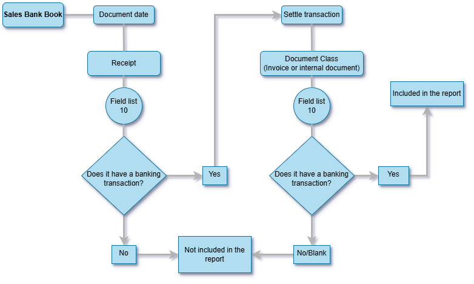

# Configure printing for sales bank books for Bolivia

[!include[banner](../../includes/banner.md)]

This article explains how to set up and generate reports for sales bank books for Bolivia.

The bank book in Bolivia details all customer payments that equal or exceed the amount that is established by the regulations of the National Tax Service (Servicio de Impuestos Nacionales). The **Sales bank Book BO** report can be used to download information about customer payments for sales of goods and/or services on a monthly basis. The downloaded information is in the presentation structure that is requested by the tax authority.

The following diagram shows the process flow for the Purchase Band Book BO report. When the localization settings for a banking transaction indicate the payment needs to be reported, it is included on the report.

## Prerequisites

Before you can generate the report, the following prerequisites must be met:

- The legal entity's address must be in Bolivia.
- Both the country/region-specific LATAM feature for Bolivia and the general LATAM feature must be enabled.
- Download the specific report from the Global repository. Learn more in [Download ER configurations from the Global repository of Configuration service](../global/workspace/gsw-import-er-config-dataverse.md).
- Configure the Electronic reporting (ER) parameters. Learn more in [Configure the Electronic reporting (ER) framework](../../../fin-ops-core/dev-itpro/analytics/electronic-reporting-er-configure-parameters.md).
- Create a tax application to use on the report. For example, the tax application ID might be **LB**, and the description might be **Libro Bancarizacion**. Learn more in [Tax application for Latin America](ltm-core-tax-application.md).
- Create a field that is named **List 10**. In the **Reference code** section, add two options: **YES** and **NO**. Learn more in [Field list configuration for Latin America](ltm-core-field-master-lists.md).

## Common configurations for all transaction types

- Create a document class that is named **recibo** and that represents the receipt. Enable field list 10 as required. You can use field list 10 to specify whether the transaction should be included on the report.
- Configure a document class payment medium that is named **Payment documents**, and configure the tax application code accordingly, based on the medium. For example, the payment medium might be a check, bank transfer, or deposit. For the document class type of each payment medium, select **Unique per entry**. Learn more in [Document class type for Latin America](ltm-core-document-class-type.md).
- In the **Bank group** field of the bank account that is associated with the payment medium, configure the LATAM extension. This configuration brings in the information that is related to the bank account number and tax identification.

### Configure payment of invoice transactions

Before you receive payments from a customer, follow these steps to verify that the document class settings are configured correctly.

1. Go to **Organization administration** \> **Setup** \> **LATAM** \> **Document class**.
1. Select a document class that represent invoices, **Factura**. Verify that you completed the required fields for this type of document. Learn more in [Configure sales and purchase invoices for Bolivia](ltm-Configure-invoices-Bolivia.md).
1. On the Action Pane, select **Tax application**.
1. In the **Tax application ID** field, verify that **LB** is entered.
1. In the **Tax application code** field, enter **2** as the transaction type.
1. In the **Letter code** field, enter **FC** for invoices.
1. In the **User define field 2** field, enter **2** as the type of supporting document.

In the event of a successive tract contract, you might change the value of the **Letter code** field to **CS** and enable the **Concept 3** field of the document class to add the contract number.

### Configure other payments

If you must receive payments for real estate sales, follow these steps to verify the configuration.

1. Go to **Organization administration** \> **Setup** \> **LATAM** \> **Document class**.
1. Select a document class that represent a supporting document for real estate sales, **Venta de Bienes Inmuebles**. Verify that you completed the required fields for this type of document. Learn more in [Configure sales and purchase invoices for Bolivia](ltm-Configure-invoices-Bolivia.md).
1. On the Action Pane, select **Tax application**.
1. In the **Tax application ID** field, verify that **LB** is entered.
1. In the **Tax application code** field, enter **1** as the transaction type.
1. In the **User define field 2** field, enter **430** as the type of supporting document.

In the event of a successive tract contract, you might add a **Letter code** field that has the value **CS**. Then enable the **Concept 3** field of the document class to add the contract number.

## Set up application-specific parameters

To set up application-specific parameters, follow these steps:

1. Open the **Electronic reporting** workspace, and select **Reporting configurations**.
1. Select **Sales Bank Book BO**, and then, on the Action Pane, on the **Configurations** tab, in the **Application specific parameters** group, select **Setup**.
1. On the **Application specific parameters** page, on the **Lookups** tab, select **ApplicablePaymentDocuments**.
1. On the **Conditions** FastTab, select **Add**.
1. In the **Lookup result** field, select **Yes**.
1. In **Document classification Id** field, select the document class that represents a receipt.
1. If you have another document class that represents receipts, repeat steps 4 through 6 to add it.

## Run the Sales Bank Book BO report

To run the **Sales bank Book BO** report, follow these steps:

1. Go to **Tax** \> **Inquiries and reports** \> **LATAM** \> **Tax reporting**.
1. In the **Format mapping** field, enter or select a value.
1. Select **OK**.
1. In the **TAX application Id** field, specify the tax application code that you created for this report.
1. In the **From date** field, enter a date.
1. In the **To date** field, enter a date.
1. Select **OK**.

[!INCLUDE[footer-include](../../../includes/footer-banner.md)]
