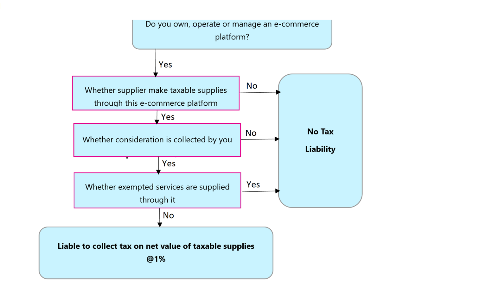

---
# required metadata

title: GST TCS on payment of goods and services
description: This topic provides information about how to deduct GST-TCS on payments of goods and services.
author: EricWang
ms.date: 08/17/2021
ms.topic: article
ms.prod: 
ms.technology: 

# optional metadata

# ms.search.form: 
audience: Application User
# ms.devlang: 
ms.reviewer: kfend
# ms.tgt_pltfrm: 
# ms.custom: 
ms.search.region: India
# ms.search.industry: 
ms.author: kfend
ms.search.validFrom: 
ms.dyn365.ops.version: 

---

# GST TCS on payment of goods and services

[!include [banner](../includes/banner.md)]

This topic provides information about how to deduct Goods and Services Tax (GST) Tax Collected at Source (TCS) on payments of goods and services in Microsoft Dynamics 365.

Under the GST law, e-commerce aggregators are responsible for deducting and depositing tax at a rate of 1 percent from every transaction. Any dealers or traders that sell goods and services online receive the payment after a deduction of 1-percent tax. The deductor must deposit the deducted tax by the tenth day of the next month.

All dealers and traders that sell goods and services online must be registered under the GST law, even if their turnover is less than the prescribed limit for claiming the tax that is deducted by e-commerce operators.

[!INCLUDE[footer-include](../../includes/footer-banner.md)]
