---
# required metadata

title: TDS on purchases of goods
description: This article will help you learn how to post Tax Deducted at Source (TDS) on purchases of goods in Microsoft Dynamics 365.
author: EricWangChen
ms.date: 07/08/2019
ms.topic: article
ms.prod: 
ms.technology: 

# optional metadata

# ms.search.form: 
audience: Application User
# ms.devlang: 
ms.reviewer: kfend
# ms.tgt_pltfrm: 
# ms.custom: 
ms.search.region: India
# ms.search.industry: 
ms.author: wangchen
ms.search.validFrom: 
ms.dyn365.ops.version: 

---

# TDS on purchases of goods

[!include [banner](../includes/banner.md)]

Section 194Q of the Income Tax Act was recently introduced vide the Finance Act, 2021. Section 194Q states, “It is provided for TDS by the person responsible for paying any sum to any resident for purchase of goods. The rate of TDS is kept very low at 0.1%. The tax is only required to be deducted by that person (i.e. ―buyer) whose total sales, gross receipts, or turnover from the business carried on by them exceed ten crore rupees during the financial year immediately preceding the financial year in which the purchase of goods is carried out. Tax is required to be deducted by such person if the purchase of goods by them from the seller is of the value or aggregate of such value exceeding fifty lakh rupees in the previous year.”

The proposed date of applicability for section 194Q is July 1, 2021.

   - Per the charging proviso to this section, the section will apply to any person who is a buyer, and who is responsible for making payments to a resident for the purchase of goods when the value or aggregate of either a purchase from a supplier or a payment (whichever occurs earlier) is 50 rupees lakh (Rs. 50 lakh) during the previous year. (Note that this section doesn't apply to import purchases from a supplier that is outside India, or to the purchase of services.) If a transaction with a supplier causes your aggregate purchase from that supplier, or your aggregate payment for a purchase from that supplier, to exceed Rs. 50 lakh, TDS will have to be deducted from that transaction at a rate of 10 percent of either the purchase transaction or the payment for it (whichever occurs earlier).
   - This section will also apply to an assessee whose aggregate turnover in the immediately previous year exceeds 10 crore rupees (Rs. 10 crore).
The rate of TDS under section 194Q depends on whether a permanent account number (PAN) has been provided to you, as shown in the following table.

| Condition                     | TDS rate |
|-------------------------------|----------|
| A PAN   has been provided.    | 0.10%    |
| A PAN   hasn't been provided. | 5%       |

The following example will help explain the scope of this TDS provision.

Your turnover for the financial year that ended March 31, 2020, exceeded Rs. 10 crore, and the value or aggregate of your purchase of goods from the seller exceeded Rs. 50 lakh in the previous year. Therefore, the TDS provisions that are mentioned in section 194Q apply to you. TDS will be deducted at a rate of 0.1 percent if a PAN has been provided to you and 5 percent if a PAN hasn't been provided.

If your turnover didn't exceed Rs. 10 crore, section 194Q doesn't apply to you. However, if the seller's turnover exceeded Rs. 10 crore, the seller becomes liable to collect TCS under section 206(c)(1H).

Under section 194Q, TDS doesn't have to be deducted on a transaction if it's deducted under any other section of the Income Tax Act, unless TCS is collected under section 206(c)(1H) of the Act.

If the seller is liable to collect TCS under section 206(c)(1H), and the buyer is liable to deduct TDS under section 194Q, section 194Q overrides section 206(c)(1H). In this case, only the buyer must deduct TDS. The seller isn't required to deduct TDS.

For example, a seller that is named Fabrikam sold goods to a buyer that is named Contoso and collected TCS under section 206(c)(1H). However, after section 194Q becomes applicable on July 1, 2021), Contoso will be covered by it. Because section 194Q is an overriding section, Contoso will become liable to deduct TDS under it, and Fabrikam won't require collection of TCS under section 206(c)(1H).

The following table provides more information that is related to the preceding example.

| Details                                                     | Scenario 1 | Scenario 2 | Scenario 3 |
|-------------------------------------------------------------|------------|------------|------------|
| Turnover   of Fabrikam (in cr.)                             | 12         | 6          | 12         |
| Turnover   of Contoso (in cr.)                              | 6          | 12         | 12         |
| Sale of   goods (in cr.)                                    | 2          | 2          | 2          |
| Sales   consideration paid during the year (in cr.)         | 1          | 1          | 1          |
| Party   that is liable to deduct or collect tax             | Seller     | Buyer      | Buyer      |
| Rate of   tax                                               | 0.10%      | 0.10%      | 0.10%      |
| Amount   that tax must be deducted or collected on (in cr.) | 0.5        | 0.5        | 0.5        |
| Tax   that must be deducted or collected                    | 5,000      | 15,000     | 15,000     |

In Microsoft Dynamics 365 Finance, the seller's environment can't be controlled by the buyer, and the buyer's environment can't be controlled by the seller. Therefore, it's your responsibility to ensure that the buyer deducts tax when both the buyer and the seller have exceeded the prescribed turnover in the previous year.

## Point of taxation under section 194Q

Under section 194Q, the point of taxation for the buyer is the invoice amount that is credited to the account of the seller, or the payment that is made to the seller (whichever occurs earlier). The TDS amount must be deducted on the amount that exceeds the threshold limit. For example, Contoso buys goods from Fabrikam in the amount of Rs. 85 lakh and is liable to deduct TDS under section 194Q. In this case, TDS must be deducted on Rs. 35 lakh (85 – 50) at a rate of 0.1 percent.

In Finance, the tax parameters include the option to apply TDS on either the invoice or the payment (whichever occurs earlier). However, if you deduct TDS on both the invoice and the payment, a feature that is available in Feature management lets you automatically reverse transactions that occur later.

The **Advance threshold** feature that is available in Finance provides an option to exclude previously non-taxable transactions for TDS calculation. This option helps you calculate TDS on exceeded values only.

## Threshold limit amounts

Calculation of the threshold limit amount starts on the date of applicability of the new law or the start date of the financial year.

The previously announced purchasing limit of Rs. 50 lakh under section 194Q will be considered from April 1, 2021, not from July 1, 2021.
T
o address this requirement, Finance provides a new initial threshold setup for vendors. You can accumulate purchase transactions from April 1 through June 30, 2021, and define the total accumulated value as an initial threshold value for each vendor separately. This value will be considered part of the total transaction value that can be compared with the threshold limit.

## Deducting TDS on the total invoice value vs. the taxable value under section 194Q

It isn't currently clear whether TDS under section 194Q should be deducted on the total invoice value including GST or on the taxable value excluding GST. Therefore, CBDT must issue clarification about this issue. However, the Advance threshold feature in Finance provides an option to include or exclude “other taxes including GST” for TDS or TCS calculation. Under the withholding tax group, you can exclude GST tax for TDS calculation.

## Set up TDS under section 194 Q

To define the initial TDS threshold value for transactions that occur between April 1 and June 30, 2021, you must enable the initial TDS threshold option in Feature management.

1. Go to **Workspaces** > **Feature management**.
2. In the list, find and select the feature that is named **(India) Enable initial TDS threshold under section 194Q**.
3. Select **Enable now**.

    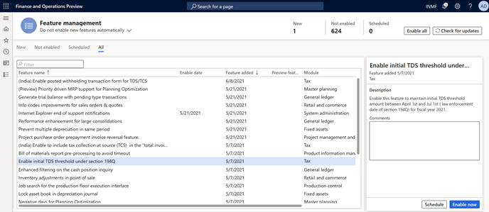

4. You receive a message that prompts you to refresh your browser window after the feature is enabled. Refresh your browser window to verify that you can open the new page.

   After the feature is enabled, TDS is automatically reversed at the time of settlement if TDS is deducted on the invoice and the payment. However, you can disable the related feature, **(India) Reversal of vendor TDS at the time of settlement when deducted on both Invoice and payment** at any time in Feature management.

    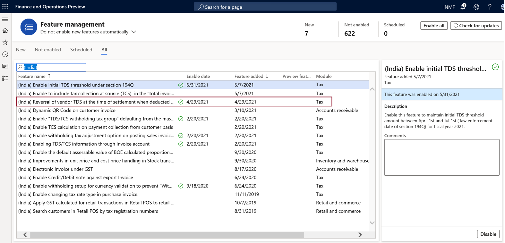
    
## Define the initial TDS threshold value for each vendor

1. Go to **Tax** > **Setup** > **Withholding tax** > **Initial threshold achieved values**.
2. On the **Vendor initial threshold achieved turnover** tab, select **Add line**.
3. Select a vendor account, and then select a withholding tax code.
4. In the **Initial threshold turnover amount** field, enter the invoice value of transactions that occurred between April 1 and June 30, 2021.

    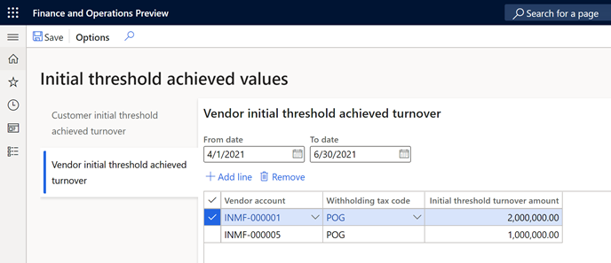
     
## Create a withholding tax component group

1.	Go to **Tax** > **Setup** > **Withholding tax** > **Withholding component group**.
2.	Create a withholding component group that is named, **POG**.
3.	In the **Description** field, enter **Purchase of Goods**.
4.	In the **Status** field, select **Resident**.
5.	In the **Section** field, select **194Q**.

    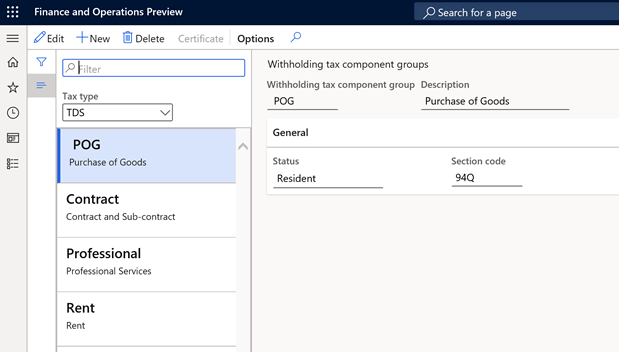
    

## Create a withholding tax component

1.	Go to **Tax** > **Setup** > **Withholding tax** > **Withholding component**.
2.	Create a withholding component that is named **POG**.
3.	In the **Description** field, enter **Purchase of Goods**.
4.	In the **Withholding tax component group** field, select **POG**.
5.	In the **Section** field, select **194Q**.

    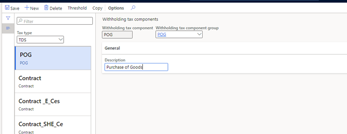
    
## Set up threshold definitions

1.	Go to **Tax** > **Setup** > **Withholding tax** > **Threshold definitions**.
2.	Create a record.
3.	In the **Name** field, enter **POG**. In the **Description** field, enter **POG threshold definition**.
4.	Select **Threshold designer**, and then select **New**.
5.	On the **General** FastTab, in the **Effective from** field, select **4/1/2021** (April 1, 2021). In the **Effective to** field, select **3/31/2022** (March 31, 2022).
6.	In the **Lower limit** field, enter **0** (zero). In the **Upper limit** field, enter **5,000,000**.
7.	In the **Type** field, select **Cumulative**.
8.	In the left pane, select **Cumulative: 0 – 50,00,000; 4/1/2021 - 3/31/2022**, and then select **POG**.
9.	Select **New**.
10.	On the **General** FastTab, in the **Effective from** field, select **4/1/2021**. In the **Effective to** field, select **3/31/2022**.
11.	In the **Lower limit** field, enter **5,000,000**. In the **Upper limit** field, enter **0**.
12.	Set the **Final level** option to **Yes**, and then close the page.

    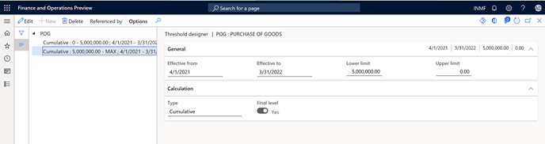

## Set up a withholding tax code

1. Go to **Tax** > **Withholding tax** > **Withholding tax code**.
2. Create a record, and set the following values:

    -	**Withholding tax code**: POG
    -	**Withholding tax name**: Purchase of Goods Threshold Definition
    -	**Tax type**: TDS
    -	**Enable threshold hierarchy**: Yes
    -	**PAN based accumulation**: Yes
    -	**Withholding tax component**: POG
    -	**Main account**: 202122
    -	**Settlement period**: TDS
    -	**Receivable account**: 1322611

3. Select **Values**, and then set the following values:

    -	**Value**: 0.1
    -	**PAN non-availability %**: 5

4. Close the **Withholding tax values** page.

    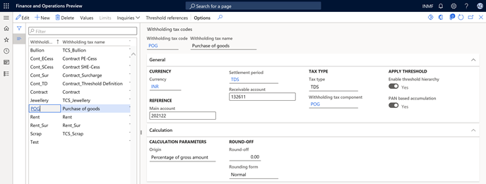
    
5. On the **Withholding tax codes** page, in the left pane, select **POG**.
6. Mark **Apply threshold**.
7. Select **Threshold references**.
8. Create a record, and set the following values:

    -	**Account type**: Vendor
    -	**Account code**: All
    -	**Account or Group**: Blank
    -	**Threshold**: POG

9. Select **Threshold designer**, and then select **POG**.
10.	Select **New cumulative; 0 – 50,00,000; 4/1/2021 - 3/31/2022**, and then select **New**.
11.	In the **PAN status** field, select **Received**.
12.	On the **General** FastTab, set the following values:

    -	**Value**: 0
    -	**Reason code**: Y
    -	**Calculate tax**: No
    -	**Include in turnover base**: Yes

13.	Unmark **Calculate previously nontaxed transactions**.
14.	In the left pane, select **POG: 50,00,000 - MAX; 4/1/2021 - 3/31/2022**.
15.	Select **New**, and set the following values:

    -	**PAN status**: Received
    -	**Value**: 0.1

16.	On the **General** FastTab, set the following values:

    -	**Calculate tax**: Yes
    -	**Include in turnover base**: Yes

17.	Unmark **Calculate previously nontaxed transactions**, and then close the page.

    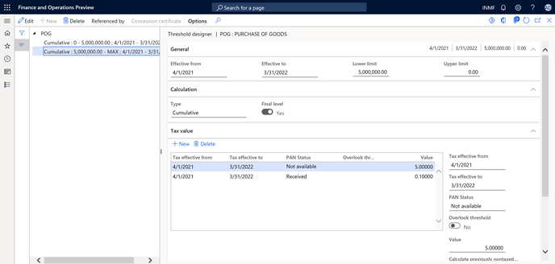

## Create a withholding tax group

1. Go to **Tax** > **Withholding tax** > **Withholding tax group**.
2. Create a record, and set the following values:

    -	**Withholding tax group**: POG
    -	**Description**: POG - Threshold Definition
    -	**Tax type**: TDS
    -	**Include GST tax component for TDS calculation**: IGST, CGST, SGST

3. On the **Setup** FastTab, select **Add**.
4. In the **Withholding tax code** field, select **POG**.
5. Select **Designer**, and then create a record.
6. In the **Tax code** field, select **POG**.
7. In the **Taxable basis** field, select **Gross amount**.
8. Close the page.

    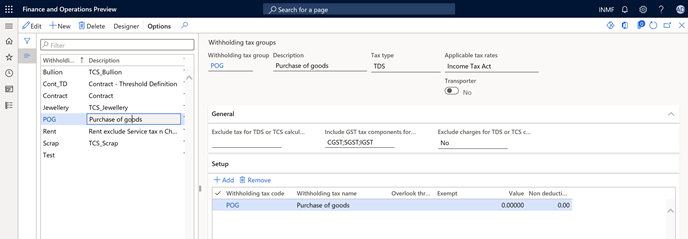

## Attach a withholding tax group to a vendor account

1.	Go to **Accounts payable** > **Vendors**.
2.	Select vendor **INMF-000001**.
3.	On the **Invoice and delivery** FastTab, set **Calculate withholding tax** to **Yes**.
4.	In the **TDS group** field, select **POG**.

    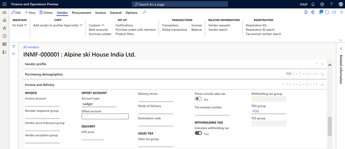

## Create and post the invoice journal

1. Go to **Accounts payable** > **Invoices** > **Vendor invoice journal**.
2. Select **New**, and set the following values:

   - **Account type**: Vendor
   - **Account**: INMF-000001
   - **Invoice**: IN-9
   - **Credit**: 1,500,000.00)
   - **Offset account type**: Ledger
   - **Offset account**: 600120
   - **Already posted transaction**: 2,000,000
   - **Initial threshold value**: 2,000,000
 
     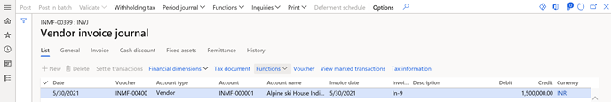
   
3. Select **Withholding tax**.

    Notice that withholding tax is calculated as expected, based on the percentage that you previously set up for this vendor (0.1). The total cumulative transaction value, including the initial threshold, exceeded 50,00,000, as shown here:

   - **Initial threshold achieved value**: 20,00,000
   - **First transaction**: 20,00,000
   - **Second transaction**: 15,00,000
   - **TDS**: Total cumulative value (55,00,000) – 50,00,000 = 5,00,000
   - **Threshold value**: 5,00,000 at a rate of 0.1 percent = 500

    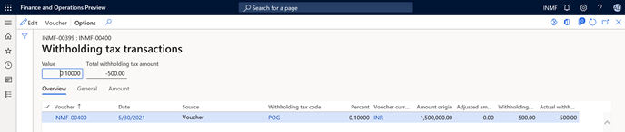
  
## Reversal of TDS on invoice settlement when TDS is deducted separately on the invoice and the payment

Per the Income Tax Act, TDS must be deducted on either the invoice or the payment (whichever occurs earlier). If TDS is accidentally deducted separately on both the invoice and the payment, when the invoice is settled with the payment, the TDS on the later transaction should be reversed.

Example:

- **Threshold value**: 5,000
- **Invoice amount**: 7,000
- **TDS rate**: 0.1 percent

The following table shows the TDS deduction.

| Description       | Dr.   | Cr.   |
|-------------------|-------|-------|
| Purchases         | 5,000 |   -   |
| TDS   Payable     |   -   | 5     |
| Account   Payable |   -   | 4,995 |

The following table shows a payment that is made for 7,000.

| Description       | Dr.   | Cr.   |
|-------------------|-------|-------|
| Account   Payable | 7,000 |   -   |
| TDS               |   -   | 7     |
| Bank              |   -   | 6,993 |

Based on the income tax rule, TDS should be deducted from either the invoice or the payment (whichever occurs earlier).

Because the invoice is posted first, the payment must be reversed up to the value of the invoice. In this example, the value is 5, as shown in the following table.

| Description       | Dr. | Cr. |
|-------------------|-----|-----|
| TDS   payable     | 5   |  -  |
| Account   Payable |  -  | 5   |

The following illustration shows the related voucher that is posted.

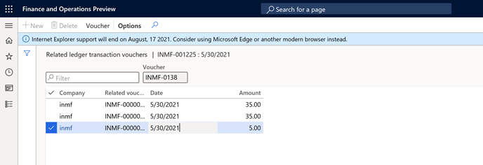

[!INCLUDE[footer-include](../../includes/footer-banner.md)]
