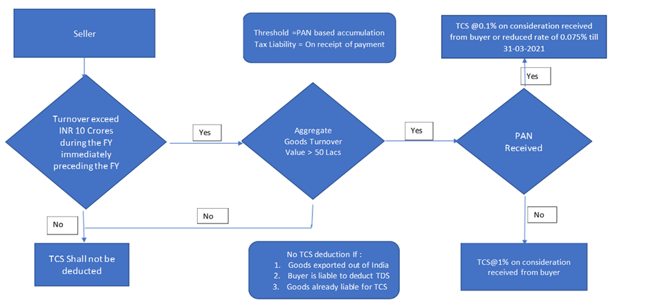
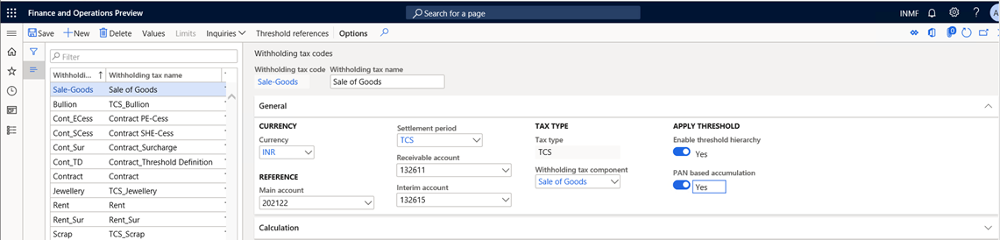

# TCS on sales of goods

[!include [banner](../../includes/banner.md)]

This article provides information about the functionality for Tax Collection at Source (TCS) on sales of goods. For example, it describes how to do the basic setup for TCS deduction on sale of goods transactions, how to calculate TCS on transactions from customers or groups of customers, and how to calculate TCS on transactions when customers don't have a permanent account number (PAN).
Per section 206C (1H), TCS should be collected when payment is received from a customer against a sale consideration. When the seller receives the payment, the TCS amount is debited to the interim account and credited to the TCS payable account. When the invoice is posted, the TCS amount will be posted to the interim payable account and added to the invoice value.
One important aspect of this feature is that if multiple customers have the same PAN, the transaction amount will be accumulated and compared to a threshold to determine whether the transaction is eligible for TCS deduction.

The following illustration shows the process flow for this feature.

   

## Base amount for TCS deduction

Central Board of Direct Taxes (CBDT) vide circular no. 17, dated September 30, 2020, clarified the base amount for TCS deduction. Because the collection is based on receipt of the amount of the sale consideration, no adjustment because of indirect taxes, including Goods and Services Tax (GST), is required for the collection of tax under this provision. Therefore, TCS that is collected on the sale consideration must include GST.

In the withholding tax group, you can include the GST tax component and charges in the base amount for TCS calculation.

## PAN-based accumulation of transactions for multiple customers

In the case of TCS on sales of goods, TCS will be deducted based on PANs. If multiple customers have the same PAN, all transactions by those customers will be accumulated and compared to the threshold that is prescribed by the government. You can also accumulate the purchase threshold based on the PANs of vendors. 

However, the accumulation is based on vendors or customers in one legal entity. Accumulation among multiple legal entities is out of scope.

## The point of collection of tax

Per the interpretation of TCS on sales of goods under section 206C (1H), tax should be collected "at the time of receipt." The law clarifies that TCS on sales of goods will be collected when actual payment is received by the seller.

However, to collect TCS on sales of goods, the seller must increase the amount of the sales invoice, including the amount of TCS. The seller must also account for the amount in the books as a TCS liability, even though it isn't payable. Although the TCS amount is debited to the buyer, the liability under section 206C (1H) doesn't arise until the amount is collected. To accommodate this requirement, a new **Tax liability on payment** option is added for the withholding tax group.

When this option is selected, the **Interim account** field for the withholding tax code becomes available. When a sale of goods is posted, the tax amount on the invoice is posted to the interim TCS payable account and debited to the customer account. When the user receives payment from the buyer, the system posts an invoice transaction to accrue the TCS liability on the payment.

## TCS on advance receipt of payment

Under section 206C(1H), sellers must deduct TCS every time that they receive payment against a sale consideration, or every time that they receive an advance payment. However, aa difficulty arises in the calculation when the amount of the payment that is received crosses the threshold that is set up in the system for transaction values. In this case, you must manually adjust the TCS amount that is calculated on customer payment transactions.

## Changes that have been incorporated based on the CBDT press release

Initially, experts interpreted the new TCS provision in the following way:

   - Tax must be collected when both the amount of the sale and the amount that was received as a sale consideration exceed 50 lakh rupees (INR 5,00,000) during the previous year.
   - Tax must be collected when the amount of the sale exceeds INR 50,00,000, regardless of the amount of the sale consideration that was received during the previous year.
   - Tax must be collected when the amount that was received as a sale consideration exceeds INR 50,00,000, regardless of the amount of the sale that was made during the previous year.
   
Based on this initial interpretation finance and operations apps provided functionality for the first option. However, some scenarios didn't comply with the intended law.

To clarify the applicability of the new TCS provisions, the CBDT issued circular no. 17, dated September 30, 2020. According to this circular, the third option is a more convenient, realistic, and reasonable way to get the expected result.

To make the solution comply with the new interpretation, the following changes have been incorporated into the existing feature:

   - **Initial achieved threshold value**: The CBDT clarification states, "It may be noted that this TCS shall be applicable only on the amount received on or after 1st October 2020. However the threshold is based on the yearly receipt, it may be noted that only for calculation of this threshold of Rs. 50 lakh, the receipt from the beginning of the financial year i.e. from 1st April 2020 shall be taken into account. For example, a seller who has received Rs. 1 crore before 1st October 2020 from a particular buyer and receives Rs. 5 lakh after 1st October 2020 would be required to collect tax on Rs. 5 lakh only and not on Rs. 55 lakh [i.e Rs.1.05 crore - Rs. 50 lakh (threshold)] but for threshold calculation amount received before 1st October will also be considered. To meet this change we introduced an initial threshold value concept."
   - **TCS when payment is collected from the customer against a sale consideration**: The CBDT clarification states, "It may be noted that this TCS applies only in cases where the receipt of sale consideration exceeds Rs. 50 lakh in a financial year. For example, a seller who has made sales of Rs. 1 crore before 1st October 2020 from a particular buyer and receives only Rs. 10 lakh after 1st October 2020 would not be required to collect tax on 10 lakh as the payment amount has not crossed the threshold value of Rs. 50."

   Based on this statement, you can use the **Feature management** workspace to enable TCS deduction when payment is collected from a customer against a sales consideration.

   - **Direct voucher posting of the TCS amount on payment and invoice transactions**: In the initial solution that was provided for TCS deduction, posting was done through related vouchers. The redesigned solution lets you post the TCS amount directly in the ledger. You don't have to post it through a related voucher.
   - **When TCS on sales is applied on Accounts payable transactions, the tax amount is posted to a recoverable account**: When you apply TCS on sales on a purchase transaction, the TCS amount is posted directly to the TCS recoverable account. You must then match the TCS ledger with Form 26AS to determine the TCS amount for a claim against the tax liability.
   - **The credit note reverses the TCS transaction without affecting the accumulated value for the threshold**: The tax must be calculated on the sale consideration that is received from the buyer. Therefore, when the credit note that is issued adjusts the buyer's ledger, the adjustment has no effect on the tax that must be collected. The posting will remain the same if the seller repays some of the sale consideration to the buyer after the tax is collected. In this situation, the amount of the sale consideration that the seller receives isn't reduced by the amount that is refunded for the calculation of TCS.
   - **TCS groups can automatically be entered from the invoice account**: In the **Feature management** workspace, you can enable the TCS group to automatically be entered on a sales transaction from the invoice account instead of the customer account. This functionality lets you address scenarios that involve third-party invoices.
   - **TCS groups can automatically be entered from the vendor account on a purchase transaction**: In the **Feature management** workspace, you can enable the TCS group to automatically be entered on a purchase transaction if the TCS withholding group is attached to the vendor account.

## Key scenarios covered

- Tax rates that have three decimal places
- Sales orders
- Free text invoices
- Customer payment journals
- Project invoices
- General journals
- Multi-line journals
- TCS through invoice accounts
- PAN-based accumulation of thresholds
- Credit notes

## Out-of-scope scenarios

- Intercompany transactions

## Feature support

The feature is supported in following versions of Microsoft Dynamics 365 Finance, or later versions:

   - 10.0.14
   - 10.0.15

## Set up TCS on sales of goods on a collection-of-payment basis

To enable TCS on sales of goods on a collection-of-payment basis, you must complete three tasks.

1. **Turn on the feature through Feature management**. Section 206C(1H) states that tax must be collected when the amount is received as consideration for the sale of goods. In other words, tax must be collected if the amount is received on or after October 1, 2020.

To turn on the feature, go to **Workspaces** > **Feature management**, select the **Enable TCS calculation on payment collection from customer basis** feature, and then select **Enable now**.
 
You can also turn on the following features if they are required for your:

   - Third- business party Invoice Scenario: Enable TDS/TCS information through invoice account
   - TCS on Purchase transactions: Enable "TDS/TCS withholding tax group" defaulting from the master form without differentiating the nature of the transaction

2. **Enable the threshold hierarchy**. To apply the TCS rate, based on whether a customer has a PAN, select the **Enable threshold hierarchy** check box in the **TCS on sales tax** code.
3. **Enable liability on payment**. To deduct TCS when payment is collected, select the **Liability on payment** check box.

    > [!NOTE]
    > If the **Liability on the payment** check box is cleared, the system creates TCS liability on the Invoice. If the **Enable TCS calculation on payment collection from customer basis** feature isn't turned on, the system considers both the invoice and the payment amount for threshold determination.

## Initial threshold achieved value
TCS is applicable from October 1, 2020. However, for threshold determination, transaction accumulation occurs from April 1 of every financial year.
The following example shows how the accumulated value is determined for TCS calculation:

   - The threshold value is INR 50,00,000.
   - TCS is applicable from October 1, 2020.
   - The transaction is run as shown in the following table.
   
   | Date      | Invoice | Amount    |
   |-----------|---------|-----------|
   | 1-Aug-20  | INV-001 | 20,00,000 |
   | 15-Aug-20 | INV-002 | 10,00,000 |
   | 28-Aug-20 | Payment | 15,00,000 |
   | 1-Sep-20  | Payment | 5,00,000  |
   | 15-Sep-20 | INV-003 | 50,00,000 |
   | 25-Sep-20 | Payment | 20,00,000 |
   | 10-Oct-20 | Payment | 12,00,000 |

The initial accumulated value is determined by adding the payments that are received between April 1 and September 30, 2020: 15,00,000 + 5,00,000 + 20,00,000 = 40,00,000. The first payment value after October 10, 2020 is 12,00,000. Therefore, the total accumulated value is 40,00,000 + 12,00,000 = 52,00,000.
In this case, TCS is calculated as (52,00,000 – 50,00,000) × 0.1 percent = 20.

To calculate the initial accumulated value, follow these steps.

1.	Go to **Tax** > **Setup** > **Withholding tax** > **Initial threshold achieved values**.
2.	Use the **From date** and **To date** fields to define the date range from April 1 through September 30, 2020.
3.	Select **Initialize**. The payment transaction that is run in the defined date range is automatically considered to determine the initial threshold achieved value for each customer. After you select **Initialize**, and the initialization process is run, the button is no longer available and can't be selected again.

You can edit the system-generated initial threshold value for any customer. When you save the changes, the new value is recorded for the customer. You can also manually add new customers. For example, a new customer might be created in the system after the initialization process is run. However, initial threshold value must be manually updated.

## Create a new withholding tax code for sales of goods

1.	Go to **Tax** > **Setup** > **Withholding tax code**.
2.	In the left pane, select **Sale of Goods**.

   When you attach a withholding tax component of the TCS type, the new **Interim account** field on the **General** FastTab becomes available.

   > [!IMPORTANT]
   > Don't select an interim account yet. You will select it after you set the **Tax liability on payment** option to **Yes** for the withholding tax group in the next procedure.

3.	Set the **Enable threshold hierarchy** option to **Yes**. The **PAN based accumulation** option becomes available.
4.	If multiple customers have the same PAN, set the **PAN based accumulation** option to **Yes**.

   

## Create a new withholding tax group for sales of goods

1. Go to **Tax \> Setup \> Withholding tax group**.
2. In the left pane, select **Sale of Goods**.
3. Create a withholding tax group that has the **TCS** tax type, and set the **Tax liability on payment** option to **Yes**.
4. Go to **Tax** \> **Setup** \> **Withholding tax code**.
5. On the **Withholding tax codes** page, in the **Interim account** field, select **Interim TCS payable account**. This account was created in the chart of accounts and has the **India withholding tax (TCS)** posting type.
6. Return to the **Withholding tax groups** page.
7. In the **Include GST tax component for TDS or TCS calculation** field, include the GST tax component if it's part of the calculation of the TCS base amount.
8. If charges aren't part of the TCS calculation, in the **Exclude charges for TDS or TCS calculation** field, select **Yes**.
9. On the Action Pane, select **Designer**, and define the formula for TCS calculation.

   

## Define threshold definitions

1. Go to **Tax** \> **Setup** \> **Threshold definitions**.
2. Define a threshold definition for sales of goods.
3. Define two threshold slabs:

    - 0-Max
    - Max-0

   

## Set up the TCS threshold for sales of goods

TCS on sales of goods applies to a single customer or multiple customers that have the same PAN.

If the customer PAN isn't available, a higher tax rate is applied after the exempted turnover amount is passed. If the customer PAN is available, the lower tax rate is applied.

1. Define threshold references for customers.

    

2. In the Action Pane, select **Threshold designer**.
3. Define two threshold slabs that have the following options:

    - With PAN number
    - Without PAN number

4. Define a separate TCS rate for each option.
5. Define the calculation basis for each slab:

    - For the exempted slab, set the following values:

        - **Calculate tax:** No

            Alternatively, set the **Calculate tax** option to **Yes**, and set the value to **0** (zero).

        - **Calculate previous non-tax transactions:** No
        - **Include in turnover base:** Yes

    - For the taxable slab, set the following values:

        - **Calculate tax:** Yes
        - **Calculate previous non-tax transactions:** No
        - **Include in turnover base:** Yes

      

      > [!IMPORTANT]
      > On the **Threshold designer** page, you must define the date for each slab from April 1, 2020, through March 31, 2021. The system verifies that the threshold date range includes the initial amount date range. If it does, the system adopts the defined initial amount as part of the turnover and doesn't consider the transactions during the initial amount date range, because the turnover during the date range has been defined as the initial amount. In the previous example, the threshold date range (April 1, 2020, through March 31, 2021) includes the date range April 1 through September 30, 2020. Therefore, the initial threshold amount is included as part of the turnover. Then the payments of the date range October 1, 2020, through March 31, 2021, are cumulated as another part of the turnover. Finally, the total turnover is the initial threshold amount plus the cumulative amount of October 1, 2020, through March 31, 2021.

## Activate the calculation of TCS for customers

- Go to **Accounts receivable** \> **Customers** \> **All customers**.

   

When an invoice and payment transactions are posted, the following values are used to calculate TCS:

   -	Threshold limit: 50,00,000
   -	TCS rate: 0.0750 percent

The following table shows the transaction details.

| Date      | Payment received | Accumulated threshold | TCS applicable | Reason                                                                                                                                |
|-----------|------------------|-----------------------|----------------|---------------------------------------------------------------------------------------------------------------------------------------|
| 5-Apr-20  | 20,00,000        | 20,00,000             | No             | TCS is applicable from October   1, 2020.                                                                                             |
| 10-May-20 | 15,00,000        | 35,00,000             | No             | TCS is applicable from October   1, 2020.                                                                                             |
| 10-Aug-20 | 10,00,000        | 45,00,000             | No             | TCS is applicable from October   1, 2020                                                                                              |
| 1-Sep-20  | 8,00,000         | 53,00,000             | No             | Transaction accumulation will   start from April 1, 2020.                                                                             |
| 1-Oct-20  | 2,00,150         | 2,00,150              | Yes            | The threshold of INR 50,00,000   was already crossed before October 1,2020. TCS will apply on (2,00,150 ÷   1.0750) × 0.0750 percent. |

When you initialize the initial threshold achieved value, the system calculates and shows INR 53,00,000.

When you post a payment of 2,00,150 that is received from the customer, the following accounting entry is posted.

| Account                       | DR       | CR       |
|-------------------------------|----------|----------|
| Bank   A/C                    | 2,00,150 |          |
| Customer   A/C                |          | 2,00,150 |
| TCS   Interim payable account | 150      |          |
| TCS   Payable                 |          | 150      |

> [!NOTE]
> The first time that the system crosses the threshold amount, you must manually adjust the calculated TCS amount. The amount to adjust should be minor. The variation in the calculation occurs because the current algorithms work differently. This difference will be corrected in the future.
When an invoice is posted against the last payment transaction, the following entry is posted.
>
> | Account               | DR       | CR       |
> |-----------------------|----------|----------|
> | Customer   A/C        | 2,00,000 |          |
> | To Sales              |          | 2,00,000 |
> | Customer              | 150      |          |
> | Interim   TCS payable |          | 150      |

## TCS that vendors deduct on purchases of goods

If the selling vendor deducts TCS against the organization, you can apply the same **TCS on sales of goods** withholding tax group. The threshold won't apply on the purchase transaction. When you post the purchase order, the TCS amount that the vendor deducted is posted directly to the TCS recoverable account. To match the recoverable amount before you make your claim, you must download Form 26AS from the appropriate government website.

| Account               | DR       | CR       |
|-----------------------|----------|----------|
| Purchase              | 2,00,000 |          |
| Vendor   A/C          |          | 2,00,000 |
| TCS   Recoverable A/C | 150      |          |
| Vendor   A/C          |          | 150      |

Every organization will claim a credit for TCS deduction after it reconciles the deduction with Form 26AS.

1. Go to **Tax** \> **Inquiries and reports** \> **TDS/TCS inquiry**.
2. Select the required column fields to generate the report.

   

