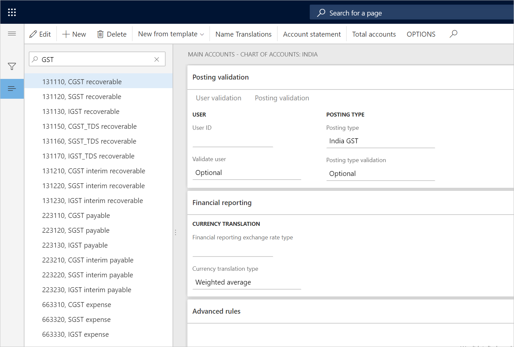

# Create main accounts for the GST posting type

[!include [banner](../../includes/banner.md)]

To make the India localization solution for Goods and Services Tax (GST) in Microsoft Dynamics 365 for Finance and Operation available, you must complete the following master data setup:

- Define a business vertical.
- Update the state code and union territory.
- Create a Goods and Services Tax Identification Number (GSTIN) master.
- Define GSTINs for the legal entity, warehouse, vendor, or customer masters.
- Define Harmonized System of Nomenclature (HSN) codes and Service Accounting Codes (SACs).
- Create main accounts for the GST posting type.
- Create a tax settlement period.
- Attach the GSTIN to a tax registration group.

Follow these steps to create main accounts for the GST posting type.

1. Go to **General ledger** \> **Chart of Accounts** \> **Accounts** \> **Main accounts**.
2. Create a record.
3. In the **Main account** field, enter a value.
4. In the **Name** field, enter a value.
5. On the **General** FastTab, in the **Main account type** field, select a value.
6. On the **Setup** FastTab, in the **Posting type** field, select **GST**.
7. Repeat steps 2 through 6 to create all the required state-wide ledger accounts.

[!INCLUDE[footer-include](../../../includes/footer-banner.md)]
