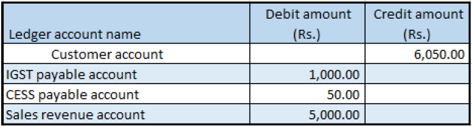

# Create a credit note against a sales invoice

[!include [banner](../../includes/banner.md)]

## Create a sales order

1. Go to **Accounts receivable** \> **Sales orders** \> **All sales orders**.
2. Create a sales credit note for a taxable item.
3. In the **Original invoice number** field, select a value.
4. Verify that the **Original invoice date** field is automatically set based on the original invoice number that you selected, and then save the record.
5. Select **Tax information**.
6. Select the **GST** tab.
7. Select the **Customer tax information** tab.
8. Select **OK**.
9. On the Action Pane, on the **Sell** tab, in the **Tax** group, select **Tax document**.

    You should see something that resembles the following example:

    - **Taxable amount:** -5,000
    - **IGST:** 20 percent
    - **CESS:** 1 percent

10. Select **Close**.

## Post the invoice

1. On the Action Pane, on the **Invoice** tab, in the **Generate** group, select **Invoice**.
2. In the **Quantity** field, select **All**.
3. On the **Others** tab, verify that the **Invoice type** field is set to **Original**.

    > [!NOTE]
    > You can post a revised credit note by selecting **Revised** in the **Invoice type** field and then adding a reference to the original credit note.

4. Select **OK**, and then select **Yes** to acknowledge the warning message that you receive.

## Validate the voucher

1. On the Action Pane, on the **Invoice** tab, in the **Journals** group, select **Invoice**.
2. Select **Voucher**.

> [!NOTE]
> You can create a sales credit note through the general ledger and a free text invoice.

[!INCLUDE[footer-include](../../../includes/footer-banner.md)]
