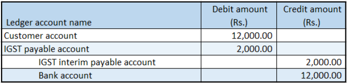

# Customer payment refunds

[!include [banner](../../includes/banner.md)]

This article explains how to create and configure a customer advance payment journal for customer refunds and validate tax details and financial entries in Microsoft Dynamics 365 Finance.

To create and configure a customer advance payment journal, follow these steps.

1. In Dynamics 365 Finance, go to **Accounts receivable \> Payments \> Payment journal**.
1. Create a record.
1. In the **Name** field, select a value.
1. On the **Setup** tab, select the **Amounts include sales tax** checkbox.
1. Select **Lines**.
1. Create a customer advance payment journal, and save the record.
1. Select **Tax information**.
1. On the **GST** tab, in the **HSN code** field, select a value.
1. Select the **Customer tax information** tab.
1. Select **OK**.

## Validate the tax details

To validate the tax details, follow these steps.

1. Select **Tax document**.
1. Select **Close**.
1. Select **Post \> Post**.
1. Close the message that you receive.

## Validate the financial entries

To validate the financial entries, select **Inquiries \> Voucher**. The following example image shows some voucher financial entries.

[!INCLUDE[footer-include](../../../includes/footer-banner.md)]
