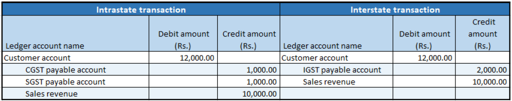

# Free text invoices

[!include [banner](../../includes/banner.md)]

## Create a free text invoice

1. Go to **Accounts receivable** \> **Free text invoices** \> **All free text invoices**.
2. Create a free text invoice for taxable services, and save the record.
3. Select **Tax information**.
4. On the **GST** tab, in the **SAC** field, select a value.
5. Select the **Customer tax information** tab.
6. Select **OK**.
7. On the Action Pane, on the **Invoice** tab, in the **Details** group, select **Tax document**.

    You should see something that resembles the following example:

    - **Taxable value:** 10,000.00
    - **CGST:** 10 percent
    - **SGST:** 10 percent

8. Select **Close**.

## Post the invoice

1. On the Action Pane, on the **Invoice** tab, select **Post** \> **Post**.
2. Select **OK**, and then close the message that you receive.

## Validate the voucher

1. On the Action Pane, on the **Invoice** tab, in the **Related information** group, select **Invoice journal**.
2. Select **Voucher**.

[!INCLUDE[footer-include](../../../includes/footer-banner.md)]
