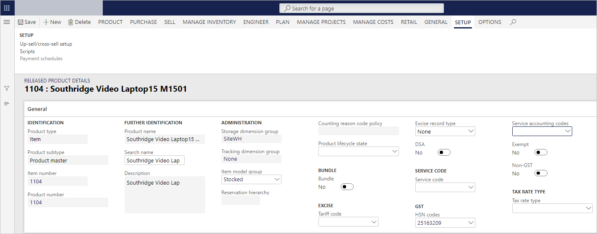

# Define HSN codes and Service Accounting Codes

[!include [banner](../../includes/banner.md)]

To make the India localization solution for Goods and Services Tax (GST) in Microsoft Dynamics 365 Finance available, you must complete the following master data setup:

- Define a business vertical.
- Update the state code and union territory.
- Create a Goods and Services Tax Identification Number (GSTIN) master.
- Define GSTINs for the legal entity, warehouse, vendor, or customer masters.
- Define Harmonized System of Nomenclature (HSN) codes and Service Accounting Codes (SACs).
- Create main accounts for the GST posting type.
- Create a tax settlement period.
- Attach the GSTIN to a tax registration group.

## Define HSN codes

1. Go to **Tax** \> **Setup** \> **Sales tax** \> **India** \> **HSN code**.
2. Create a record.
3. In the **Chapter** field, enter a value.
4. In the **Heading** field, enter a value.
5. In the **Subheading** field, enter a value.
6. In the **Country/region extension** field, enter a value.
7. In the **Statistical suffix** field, enter a value.
8. Save the record, and verify that the **HSN code** field is updated.
9. In the **Description** field, enter a value.
10. Select **Close**.

## Define SACs

1. Go to **Tax** \> **Setup** \> **Sales tax** \> **India** \> **Service accounting codes**.
2. Create a record.
3. In the **SAC** field, enter a value.
4. In the **Description** field, enter a value.
5. Save the record, and then select **Close**.

## Assign HSN codes and SACs to products

1. Go to **Product information management** \> **Products** \> **Released products**.
2. Select a product, and then select **Edit**.
3. On the **General** FastTab, if the product type is **Item**, select a value in the **HSN codes** field. If the product type is **Service**, select a value in the **Service accounting codes** field.
4. Save the record, and then select **Close**.

The following setup is required for the calculation of GST:

- An HSN code should be defined for the **Item** product type, or an SAC should be defined for the **Service** product type.
- The item sales tax group should be removed.

## Assign SACs to miscellaneous charges

1. Go to **Accounts payable** \> **Charges setup** \> **Charges code**.
2. Select a charges code.
3. On the **Tax information** FastTab, in the **Service accounting codes** or **HSN codes** field, enter a value.
4. In the **Service category** or **ITC Category** field, enter a value.
5. Set the **Exempt** option to **Yes** to exempt these charges from the calculation of GST.
6. Save the record.

    When this charge code is selected for a transaction, the defined tax information is automatically entered, and GST is calculated accordingly.

    

7. Go to **Accounts receivable** \> **Charges setup** \> **Charges code**.
8. Select a charges code.
9. On the **Tax information** FastTab, in the **Service accounting codes** or **HSN codes** field, enter a value.
10. Set the **Exempt** option to **Yes** to exempt these charges from the calculation of GST.
11. Save the record.

    When this charge code is selected for a transaction, the defined tax information is automatically entered, and GST is calculated accordingly.

    

[!INCLUDE[footer-include](../../../includes/footer-banner.md)]
