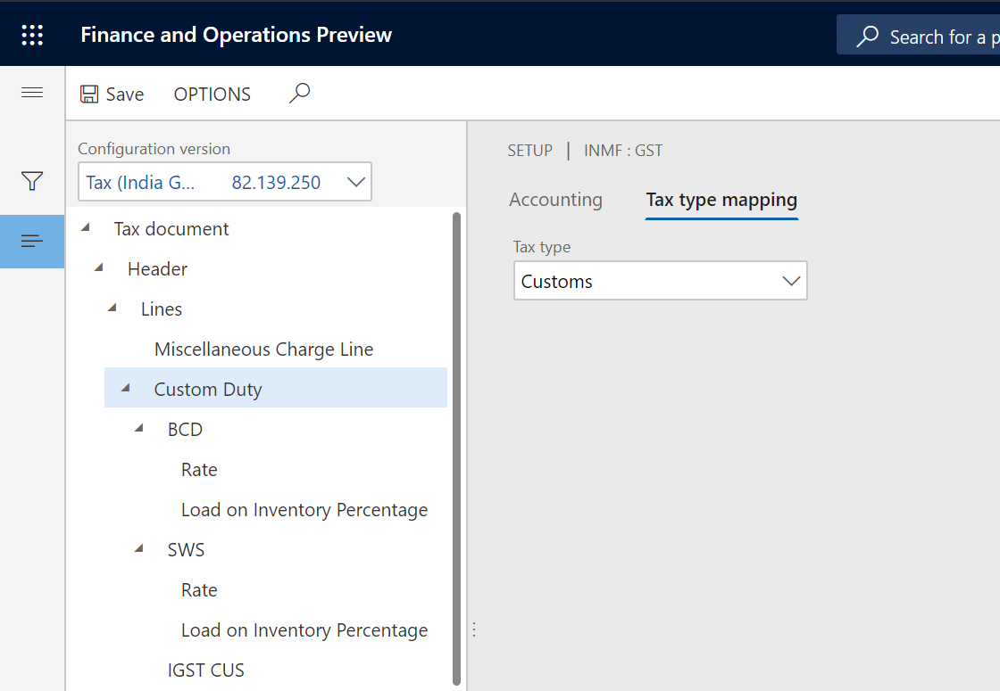
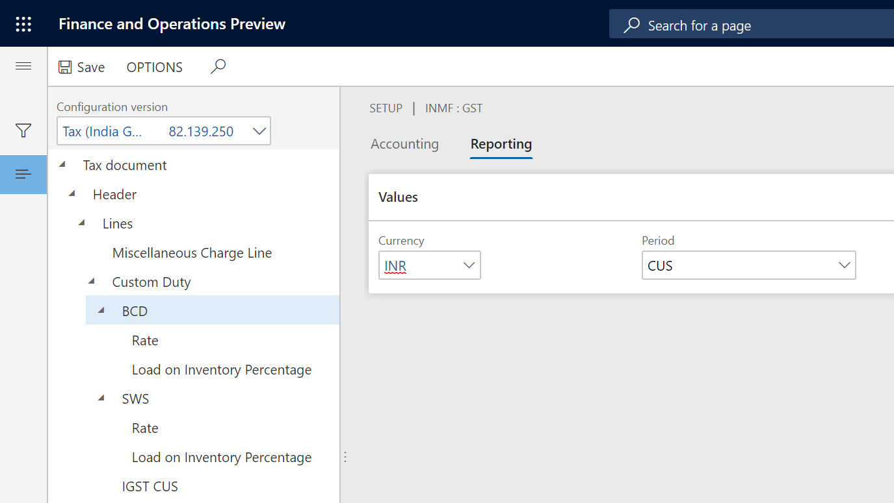
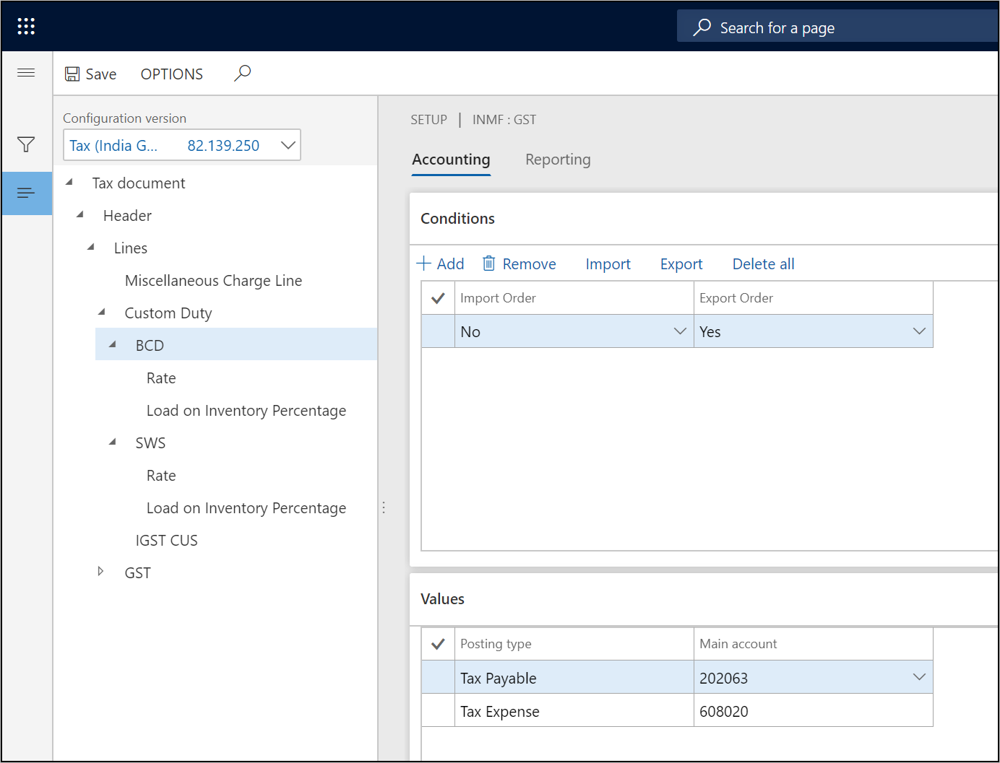
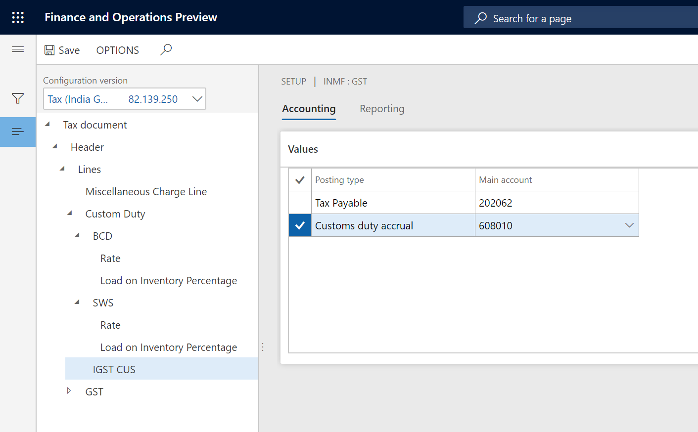
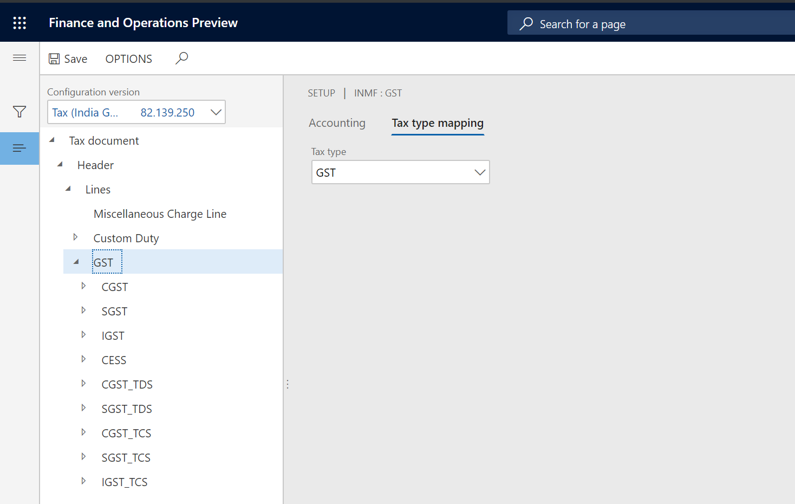
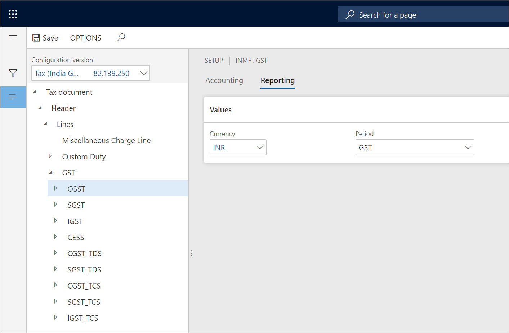
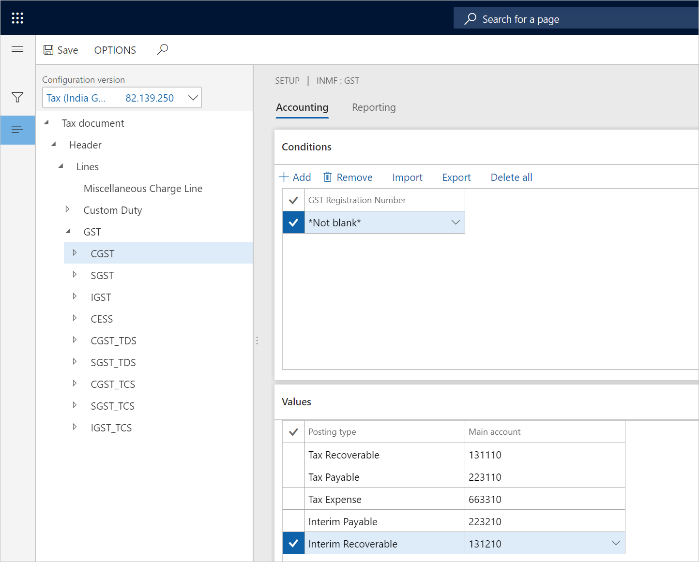

# Map configuration tax types - Customs

[!include [banner](../../includes/banner.md)]

## Customs tax type 

### Define the tax type mapping

1. Go to **Tax** \> **Setup** \> **Tax Configuration** \> **Tax Setup**.
2. Select a company, and then select **Setup**.
3. Select the **Customs** node.
4. On the **Tax type mapping** tab, in the **Tax type** field, select **Customs**.

    

### Define the tax period

For each node for the tax component, on the **Reporting** tab, in the **Period** field, select a value.

### Define main accounts

1. On the **Accounting** tab, on the **Conditions** FastTab, select **Add**.
2. In the **Import Order** field, select a value.
3. In the **Export order** field, select a value.
4. Save the record.
5. On the **Values** FastTab, in the **Main account** field, select a value.

    > [!NOTE]
    > The list of accounts is dynamically generated, based on the posting profile from the configuration. The selected main account should have the **Customs** posting type.

    

6. Select the **IGST CUS** node.
7. On the **Values** FastTab, in the **Main account** field, select a value.

    > [!NOTE]
    > The main account that you select for **Customs duty accrual** should be the same account that is selected for the **Customs duty accrual** account for the **GST** \> **IGST** node.

    

## GST tax type

### Define the tax type mapping

1. Go to **Tax** \> **Setup** \> **Tax Configuration** \> **Tax Setup**.
2. Select a company, and then select **Setup**.
3. Select the **GST** node.
4. On the **Tax type mapping** tab, in the **Tax type** field, select **GST**.

    

### Define the tax period

For each node for the tax component, on the **Reporting** tab, in the **Period** field, select a value.

### Define main accounts

1. On the **Accounting** tab, on the **Conditions** FastTab, select **Add**.
2. In the **GST Registration Number** field, select a value.
3. Save the record.
4. On the **Values** FastTab, in the **Main account** field, select a value.

    > [!NOTE]
    > The list of accounts is dynamically generated, based on the posting profile from the configuration.

    

> [!NOTE]
> Tax main accounts can be defined either at the level of the tax type or the level of the tax component. The value at the tax component level overrides the value at the tax type level. If the field is left blank for a posting type at the tax component level, the corresponding value from the tax type level is used for posting. We recommend that you set up the tax accounts at the tax component level per registration.

[!INCLUDE[footer-include](../../../includes/footer-banner.md)]
