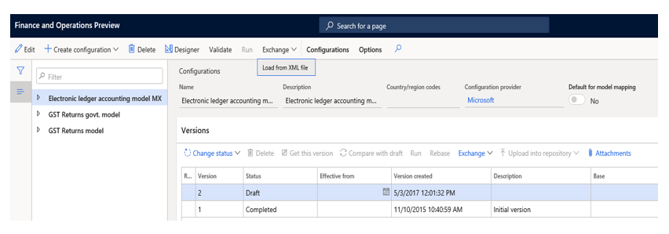
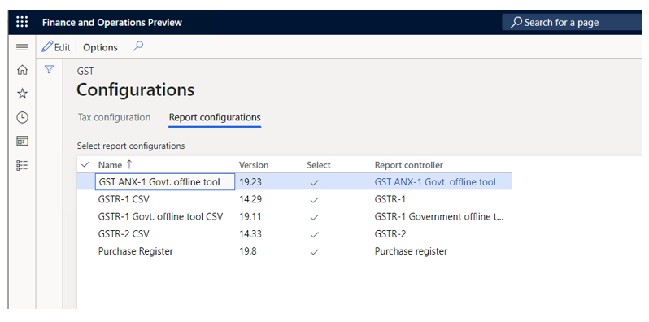
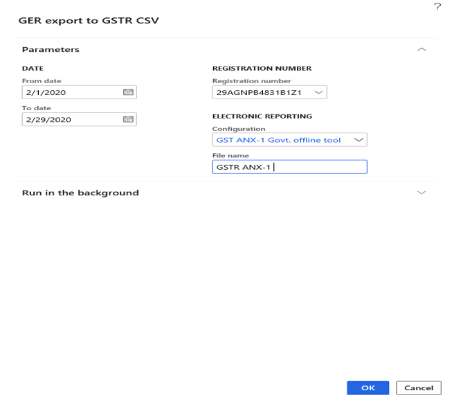
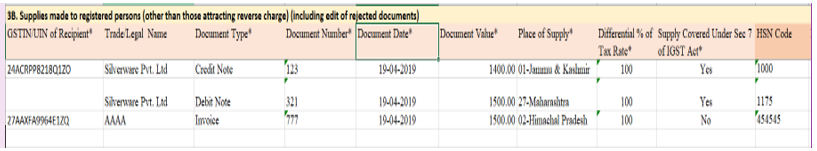
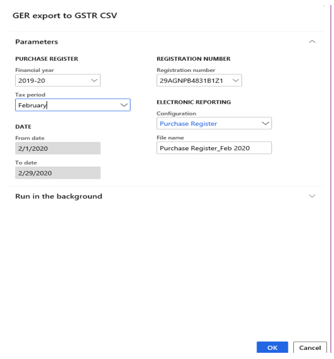
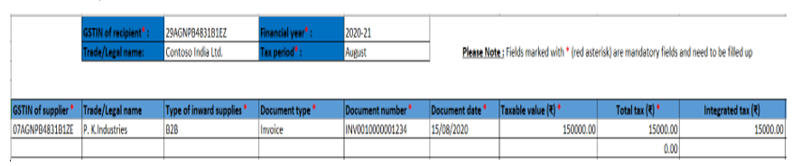

# New GSTR Offline Tool for ANX-1 and Purchase Register

[!include [banner](../../includes/banner.md)]

In the newly proposed system for Goods and Services Tax Return (GSTR) filing, the taxpayer will have to file Form GST RET-1 (Normal), Form GST RET-2 (Sahaj), or Form GST RET-3 (Sugam) either monthly or quarterly. The Annexure of Supplies (GST ANX-1) and the Annexure of Inward Supplies (GST ANX-2) will be filed as part of these returns.

GST ANX-1 contains details about all outward and inward supplies that are liable for tax on the basis of reverse charges. These outward and inward supplies include imports and the inward supply of goods from special economic zones (SEZs). GST ANX-2 contains details about inward supplies only. These details are automatically filled in, mainly from suppliers' GST ANX-1. GST ANX-1 also contains details that are automatically filled in from Form GSTR-5 and Form GSTR-6.

The taxpayer must provide details about the inward supplies that are listed in GST ANX-2 by accepting or rejecting the entries. The taxpayer can also keep the documents pending by marking them accordingly.

Based on the details that are uploaded in GST ANX-1, and the actions that the taxpayer takes in GST ANX-2, the relevant fields in Form GST RET-1 are automatically updated. The taxpayer can then view and enter details in the relevant columns, save the information, and download a copy of the form in PDF format.

The Goods and Services Tax Network (GSTN) has released a trial version of the New Returns Offline Tool for Form GST ANX-1, Form GST ANX-2 (the Matching Tool is built in), and a template for the Purchase Register. The Purchase Register is used to import Purchase Register data so that it can be matched with GST ANX-2 data.

This article provides information about how to set up and use Microsoft Dynamics 365 Finance to generate comma-separate values (CSV) files by using the New GSTR Offline Tool. It includes information about how to import the configuration, generate GST ANX-1, and generate the Purchase Register.

Generated GST ANX-1 and Purchase register reports are supported in the following version:

| Finance version | Build number   |
|-----------------|----------------|
| 10.0.13         | 10.0.569.10002 |

The solution that supports the reporting capabilities of the New Returns Offline Tool is based on Electronic reporting (ER) functionality. This functionality provides a flexible approach for setting up and supporting reporting processes.

## Setup

Complete the following tasks to prepare Finance to report GST ANX-1:

1. Import and set up ER configurations.
2. Map the reporting configuration in the tax setup.
3. Provide report data for report generation.

    - Generate the ANX-1 report which contains 10 CSV files.

4. Provide report data for report generation:

    - Generate the Purchase Register in a Microsoft Excel file format.

## Import the tax configuration

- Taxable Document.version.82
- Taxable Document (India).version 82.155
- Tax (India GST).version.82.155.300

## Import and set up ER configurations

To prepare Finance for GSTR reporting, you must import the following versions of ER configurations, or later versions, in the order that they are listed in.

| ER configuration name           | Type               | Format | Version |
|---------------------------------|--------------------|--------|---------|
| GST returns model               | Model              | XML    | 16      |
| GST returns model mapping       | Model              | XML    | 16.7    |
| GSTR-1 for old return           | Model              | XML    | 16.32   |
| GSTR-1 for new return           | Model              | XML    | 16.41   |
| GSTR-2 for old return           | Model              | XML    | 16.36   |
| GSTR-2 for new return           | Model              | XML    | 16.40   |
| GST Returns govt. model mapping | Model              | XML    | 19.10   |
| GST Returns govt. model         | Model              | XML    | 19.0    |
| GST Returns govt. model mapping | Model              | XML    | 19.12   |
| GST ANX-1 Govt. offline tool    | Model              | XML    | 19.22   |
| Purchase Register               | Model              | XML    | 19.7    |
| ANX-1                           | Format (exporting) | CSV    |   N/A   |
| Purchase Register               | Format (exporting) | Excel  |   N/A   |
| GSTR-1 (new)                    | Format (exporting) | CSV    |   N/A   |
| GSTR-2 (new)                    | Format (exporting) | CSV    |   N/A   |

Import the latest versions of these configurations. The description of each configuration version usually includes information about the changes that were introduced in that version.

> [!NOTE]
> After all the ER configurations from the preceding table are imported, you must map the report configuration in the tax setup.

| Name                          | Version | Report controller            | Description (Pl)                                             |
|-------------------------------|---------|------------------------------|--------------------------------------------------------------|
| GST ANX-1 Govt. Offline Tool  | 19.22   | GST ANX-1 Govt. offline Tool | New GSTR return applicable from 1.4.2020 onward              |
| GSTR-1 CSV (old)              | 16.32   | GSTR-1 (old)                 | Existing GSTR-1 format                                       |
| GSTR-1 Govt. Offline Tool CSV | 19.10   | GSTR-1 Govt. Offline Tool    | Existing GSTR-1 offline tool. (Ineffective from 1.4.2020)    |
| GSTR-2 CSV (old)              | 16.36   | GSTR-2 (old)                 | Existing GSTR-2 format                                       |
| Purchase register             | 19.7    | Purchase Register            | New register for inward transaction applicable from 1.4.2020 |

## Important transactions for ANX-1

| Name    | Report | File format | Description | Fields that are covered |
|---------|--------|-------------|-------------|-------------------------|
| B2C CSV | ANX-1  | CSV         | Supplies that are made to consumers and unregistered persons (the net total of debit and credit notes). | <ul><li>Place of supply</li><li>Differential % of Tax Rate</li><li>Taxable value</li><li>Supply Covered Under Sec 7 of IGST Act Rate</li><li>Integrated tax</li><li>Central tax</li><li>State Tax</li><li>Cess</li></ul> |
| B2B CSV | ANX-1  | CSV         | Supplies that are made to registered persons. Supplies that attract reverse charges are excluded. This includes editing of rejected documents. | <ul><li>GSTIN/UIN of Recipient</li><li>Trade/Legal Name</li><li>Document Type (**Debit note**, **Credit note**, or **Invoice**)</li><li>Document number</li><li>Document date</li><li>Document value</li><li>Place of supply</li><li>Differential % of tax rate</li><li>Supply covered under section 7 of IGST Act</li><li>HSN</li><li>Rate</li><li>Taxable value</li><li>Integrated tax</li><li>Central tax</li><li>State Tax/UT</li><li>Cess</li></ul> |
| EXP     | ANX-1  | CSV         | Exports that include payment of tax and exports that exclude payment of tax. | These transactions aren't supported by the current tax configuration version, 82.143.xxx, or earlier versions. |
| SEZ     | ANX-1  | CSV         | Supplies to SEZ units and developers that include payment of tax and those that exclude payment of tax. This includes editing of rejected documents. | These transactions aren't supported by the current tax configuration version, 82.143.xxx, or earlier versions. |
| DE      | ANX-1  | CSV         | Deemed exports. | These transactions aren't supported by the current tax configuration version, 82.143.xxx, or earlier versions. |
| RV      | ANX-1  | CSV         | Inward supplies that attract reverse charges that must be reported by the recipient, GSTIN-wise, the net of debit/credit notes, and any paid advances. | <ul><li>GSTIN/PAN of supplier</li><li>Trade/Legal name</li><li>Place of supply</li><li>Differential % of tax rate</li><li>Supply covered under section 7 of IGST Act</li><li>Supply Type (**Inter-state** or **Intra-state**)</li><li>HSN code</li><li>Rate</li><li>Taxable value</li><li>Integrated tax</li><li>Central tax</li><li>State Tax/UT</li><li>Cess</li></ul> |
| IMPS    | ANX-1  | CSV         | Import of services (the net total of credit and debit notes, and any paid advances). | <ul><li>Place of supply</li><li>HSN code Rate</li><li>Taxable value</li><li>Integrated tax Central tax</li><li>State Tax/UT</li><li>Cess</li></ul> |
| IMPG    | ANX-1  | CSV         | Import of services (the net total of credit and debit notes, and any paid advances). | <ul><li>Place of supply</li><li>HSN code</li><li>Rate</li><li>Taxable value</li><li>Integrated tax</li><li>Central tax</li><li>State Tax/UT</li><li>Cess</li></ul> |
| IMPGSEZ | ANX-1  | CSV         | Import of goods from SEZ units on a bill of entry. | These transactions aren't supported by the current tax configuration version, 82.143.xxx, or earlier versions. |
| ECOM    | ANX-1  | CSV         | Details of supplies that are made through e-commerce operators that are liable to collect Tax Collection at Source (TCS) under section 52. | <ul><li>GSTIN of E-com</li><li>Trade/Legal Name</li><li>Value of supplies</li><li>Value of supplies returned</li><li>Net value of supplies Integrated tax</li><li>Central tax</li><li>State Tax/UT</li><li>Cess</li></ul> |

## Important transactions for the Purchase Register

| Name              | Report | File format | Description | Fields that are covered |
|-------------------|--------|-------------|-------------|-------------------------|
| Purchase Register | PR     | XLSX        | Inward supplies from the following sources:<ul><li>B2B</li><li>DE</li><li>SEZWP</li><li>SEZWOP</li></ul> | <ul><li>GSTIN of supplier</li><li>Trade/Legal name</li><li>Type of inward supplies</li><li>Document type</li><li>Document number</li><li>Document date</li><li>Taxable value</li><li>Total tax</li><li>Integrated tax</li><li>Central tax</li><li>State/UT tax</li><li>Cess</li></ul> |

## Generate data in a CSV file

### Load the report configuration into workspaces

Follow these steps to load the report configuration into workspaces.

1. Go to **Workspaces \> Electronic reporting**, and select the **Reporting configurations** tile.
2. On the **Configurations** page, select **Exchange \> Load from XML file**, and load the following configurations:

    - GSTReturnsGovt.version.19
    - GST Returns govt. model mapping.version.19.12
    - GST ANX-1 Govt. offline tool.version.19.22
    - GSTR1GovtCSV.version.19.10
    - Purchase Register.version.19.7

3. Import the configuration files in the same order that you loaded them in.

### Map the report configuration in the tax setup

Follow these steps to map the report configuration in the tax setup.

1. Go to **Tax \> Setup \> Tax configuration \> Tax setup**, and select **Configurations**.
2. On the **Configurations** page, on the **Reporting configurations** tab, select the report configuration, and then select the **Select** check box.

    

3. In the **Report data provider** field, select a value.
4. Select the **Close** button.

> [!NOTE]
> If you don't select a report in the **Report controller** field, the report won't be available for selection under **Sales tax reports \> India** in step 1 of the procedures in the next section.

## Generate the GST ANX-1 and Purchase Register reports

### GST ANX-1 Govt. Offline Tool report data

1. Go to **Tax \> Sales tax reports \> India \> GER export to GSTR CSV**.
2. In the **GER export to GSTR CSV** dialog box, in the **From date** and **To date** fields, define the period that the generated report should include.
3. In the **Registration number** field, select the GSTIN registration number.
4. In the **Configuration** field, select **GST ANX-1 Govt. Offline Tool**.
5. In the **File name** field, enter a name for the file to save the report in CSV format.

    

6. Select **OK**.

The GST ANX-1 report is generated in CSV format. It will include a total of 10 worksheets:

- B2C
- B2B
- EXP
- SEZ
- DE
- REV
- IMPG
- IMPS
- IMPGSEZ
- ECOM

For example, here are some of the columns that the **B2B** worksheet contains: **GSTIN/UIN of Recipient**, **Trade/Legal Name**, **Document Type**, **Document Number**, **Document Date**, **Document Value**, **Place of Supply**, **Differential % of Tax Rate**, **Supply Covered Under Sec 7 of IGST Act**, and **HSN Code**.

### Purchase Register report data

1. Go to **Tax \> Sales tax reports \> India \> GER export to GSTR CSV**.
2. In the **GER export to GSTR CSV** dialog box, in the **Financial year** field, select the financial year that you're generating the report for.
3. In the **Tax period** field, select the tax period.
4. In the **Registration number** field, select the GSTIN registration number.
5. In the **Configuration** field, select **Purchase Register**.
6. In the **File name** field, enter a name for the file to save the report in CSV format.

    

7. Select **OK**.

The Purchase Register report is generated. This report contains the following columns: **GSTIN of supplier**, **Trade/Legal name**, **Type of inward supplies**, **Document type**, **Document number**, **Document date**, **Taxable value**, **Total tax**, **Integrated tax**, **Central tax**, **State/UT tax**, and **Cess**.

