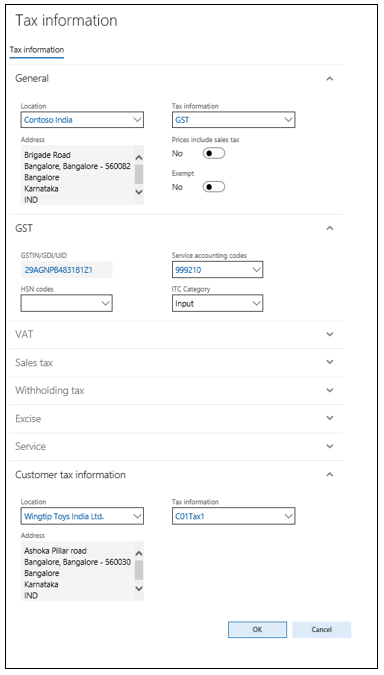
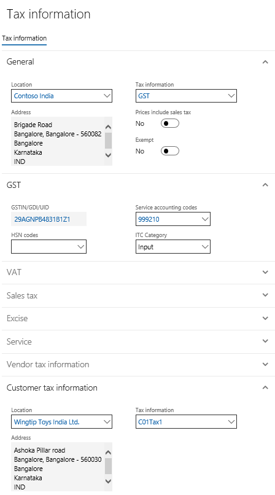
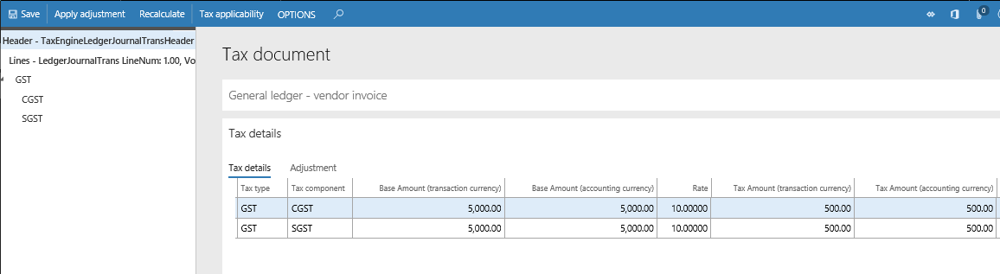
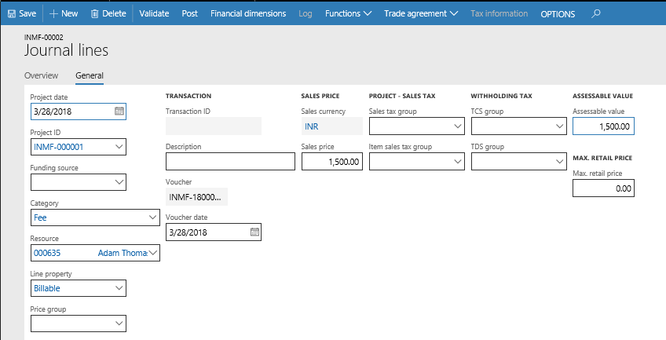
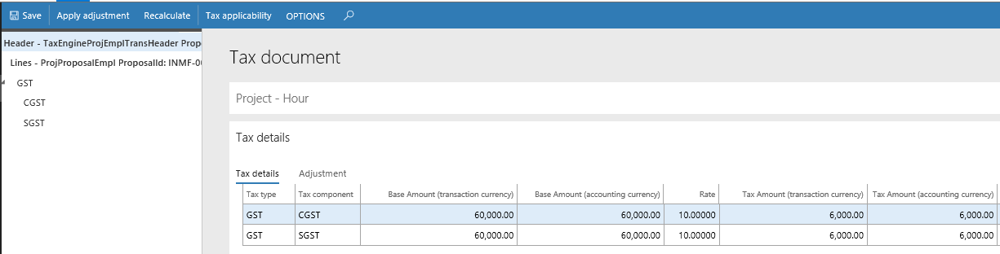
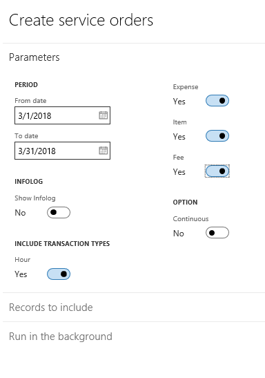

# Goods and Service Tax (GST) project transactions

[!include [banner](../../includes/banner.md)]

## Create a project category

1. Go to **Project management and accounting** \> **Setup** \> **Categories** \> **Project categories**.
2. On the **Project** FastTab, in the **Service accounting code** field, select a value.
3. Close the page.

## Create a project quotation

1. Go to **Project management and accounting** \> **Quotations** \> **Project quotations**.
2. Create a project quotation.

    

3. Select **Tax information**.

    

4. Select **OK**.
5. On the Action Pane, on the **Quote** tab, in the **Tax** group, select **Tax document**.

    

6. Close the page.
7. On the Action Pane, select **Workflow** \> **Submit** to start the quotation workflow.
8. Update the comment, and then select **Submit**.

### After the quotation is approved

1. On the Action Pane, on the **Quote** tab, in the **Process** group, select **Send quotation**.
2. Select **OK**.
3. On the Action Pane, on the **Follow up** tab, in the **Generate** group, select **Confirm**.
4. Select **OK**.

## Create a project contract

1. Go to **Project management and accounting** \> **Projects** \> **Project contracts**.
2. Create a project contract.
3. On the Action Pane, on the **Project contract** tab, in the **Attachments** group, select **Tax information**.

    

## Create a project

1. On the **Project contracts** page, on the Action Pane, on the **Maintain** tab, in the **New** group, select **Project**.
2. In the **Project type** field, select **Time and material**.
3. Enter a project name.
4. Select a project group.
5. Select the project contract ID.
6. Select **Create project**.
7. On the Action Pane, on the **Project** tab, in the **Setup** group, select **Tax information**.

    

8. Select **OK**.

## Create an Expense journal

1. On the **Projects** page, on the Action Pane, on the **Project** tab, in the **Journals** group, select **Expense**.
2. Select **New** to create a journal, and then select **Lines** to create a project expense journal.

    

3. Select the **General** tab.
4. On the **Invoice** tab, enter the invoice information.
5. Select **Tax information** \> **Cost**.

    

6. Select **OK**, and then select **Tax information** \> **Invoice**.

    

7. Select **OK**, and then select **Tax document**.

    

8. Close the page.
9. Select **Post** \> **Post**.
10. Select **Inquiries** \> **Voucher**.

    The following illustration shows an example of what you will see.

    | Ledger account name      | Debit amount (Rs.) | Credit amount (Rs.) |
    |--------------------------|--------------------|---------------------|
    | Purchases account        | 5,000.00           |                     |
    | CGST recoverable account | 500                |                     |
    | SGST recoverable account | 500                |                     |
    | Vendor account           |                    | 6,000.00            |

11. Close the page.

## Create an Hour journal

1. On the **Projects** page, on the Action Pane, on the **Project** tab, in the **Journals** group, select **Hour**.
2. Select **New** to create a journal, and then select **Lines**.
3. Create a project hour journal.

    

4. Select the **General** tab.

    

5. Save the record, and then select **Tax information**.

    

6. Select **OK**.
7. Select **Post**.
8. Select **OK**.
9. Close the page.

## Create an Item journal

1. On the **Projects** page, on the Action Pane, on the **Project** tab, in the **Journals** group, select **Item**.
2. Select **New** to create a journal, and then select **Lines**.
3. Create an item journal.

    

4. Select the **Project** tab.

    

5. Save the record, and then select **Tax information**.

    

6. Select **OK**.
7. Select **Post**.
8. Select **OK**.
9. Close the page.

## Create a Fee journal

1. On the **Projects** page, on the Action Pane, on the **Project** tab, in the **Journals** group, select **Fee**.
2. Select **New** to create a journal, and then select **Lines**.
3. Create a journal line.
4. Select the **General** tab.

    

5. Select **Tax information**.

    

6. Select **OK**.
7. Select **Post**.
8. Select **OK**.
9. Close the page.

## Create an on-account transaction

1. On the **Projects** page, on the Action Pane, on the **Manage** tab, in the **Bill** group, select **On-account transactions**.
2. Select **New**, and enter a sales price.

    

3. Select **Tax information**.
4. On the **GST** FastTab, in the **Service accounting codes** field, select the Services Accounting Code (SAC).

    

5. Select **OK**.
6. Close the page.

## Create a project invoice proposal

1. On the **Projects** page, on the Action Pane, on the **Manage** tab, in the **New** group, select **Invoice proposal**.
2. Select the project transactions for invoicing, and then select **OK**.
3. Select **View details**.
4. Select **Tax information**.

    

5. Select **OK**.
6. Close the page.
7. Select **Tax document**.

    

8. Close the page.

### Update additional fees

1. On the **Projects** page, select **Create Fees**.
2. Define the values, and then select **OK**.
3. On the **Fee** tab, select the additional fee record, and then select **View details**.
4. Select **Tax information**.

    

5. Select **OK**.
6. Close the page.
7. Select **Tax document**.

    

8. Close the page.
9. Select **Post**.
10. Select **OK**.
11. Select **OK**.

## Create a customer advance invoice

1. On the **Projects** page, on the Action Pane, on the **Manage** tab, in the **Bill** group, select **Customer advance** \> **Request a customer advance**.
2. Enter a description and the customer advance amount.
3. Select **OK**.
4. Select **View details**.
5. Select **Tax information**.
6. On the **GST** FastTab, in the **Service accounting codes** field, select the SAC.

    

7. Select **OK**.
8. Close the page.
9. Select **Tax document** to validate the tax computation.
10. Close the page.
11. Select **Post**.
12. Select **Print invoice**, and then select **OK**.
13. Select **OK**.

## Validate the tax report

The following illustration shows an example of the **Tax invoice** report.

## Create a service management

1. Go to **Service management** \> **Common** \> **Service agreements** \> **Service agreements**.
2. Create a service agreement.
3. Select **Create service orders**.

    

4. Select **OK**.

### Validate a service order

1. On the **Service agreements** page, on the Action Pane, on the **Deliver** tab, in the **Service orders** group, select **View**.

    

2. Select **Edit**.
3. On the Action Pane, on the **Service order** tab, in the **Show** group, switch to the header view.
4. Select the **Sign off** check box.
5. On the Action Pane, on the **Dispatch** tab, in the **Service stage** group, select **Next stage**.
6. On the Action Pane, on the **Invoice** tab, in the **Post** group, select **Service order**.

    

7. Select **OK**.

## Create and post a project invoice proposal

1. On the **Service agreements** page, on the Action Pane, on the **Invoice** tab, in the **Related information** group, select **Project invoice proposals**.
2. Select **New** \> **Invoice proposal**.
3. Select a project, and then select **Search**.
4. Select **OK**.
5. Select **Post**.
6. Select **OK**.
7. Select **OK**.

[!INCLUDE[footer-include](../../../includes/footer-banner.md)]
