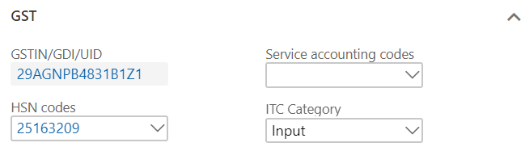

# Purchases from composite dealers

[!include [banner](../../includes/banner.md)]

1. Go to **Accounts payable** \> **Invoice** \> **Invoice journals**.
2. Create a journal, and then select **Lines**.
3. Create a purchase transaction for a composite vendor, and save the record.
4. Select **Tax information**.

    

5. On the **GST** FastTab, in the **HSN codes** field, select a value.

    

6. On the **Vendor tax information** FastTab, verify the information.

    

7. Select **OK**.

## Validate the tax details

1. Select **Tax document**.
2. Select **Close**.
3. Select **Post** \> **Post** to post the journal.
4. Close the message that you receive.

## Validate a voucher

To validate a voucher, select **Inquiries** \> **Voucher**.

[!INCLUDE[footer-include](../../../includes/footer-banner.md)]
