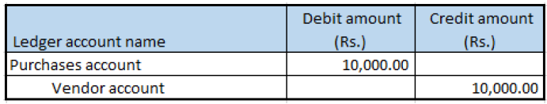

# Purchase of zero-rated goods

[!include [banner](../../includes/banner.md)]

1. Go to **Accounts payable** \> **Purchase orders** \> **All purchase orders**.
2. Create a purchase order for a zero-rated item, and save the record.
3. Select **Tax information**.
4. Select the **GST** FastTab.
5. Select **OK**.

## Validate the tax details

1. On the Action Pane, on the **Purchase** tab, in the **Tax** group, select **Tax document**.
2. Verify that the **Tax computed** field is set to **0.00**.
3. Select **Close**, and then select **Confirm**.

## Post the purchase invoice

1. On the Action Pane, on the **Invoice** tab, in the **Generate** group, select **Invoice**.
2. In the **Default quantity for lines** field, select **Ordered quantity**.
3. Enter the invoice number.
4. On the Action Pane, on the **Vendor invoice** tab, in the **Actions** group, select **Post** \> **Post**.
5. On the Action Pane, on the **Invoice** tab, in the **Journals** group, select **Invoice**.
6. On the **Overview** tab, select **Voucher**.

[!INCLUDE[footer-include](../../../includes/footer-banner.md)]
