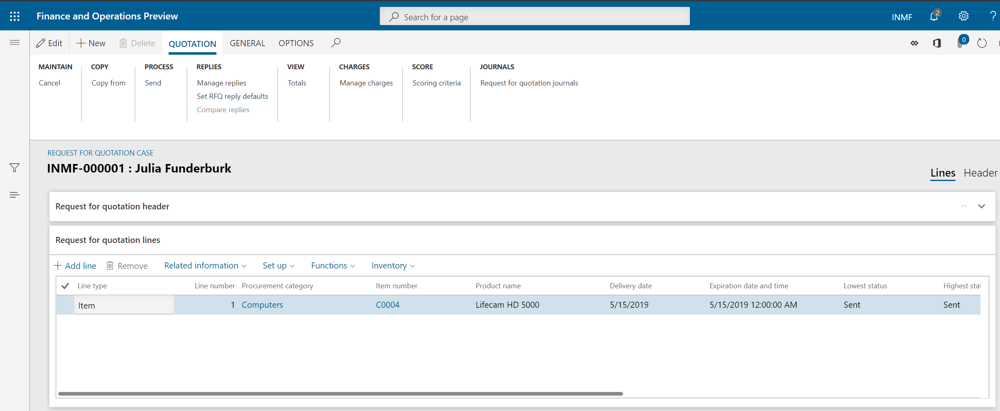
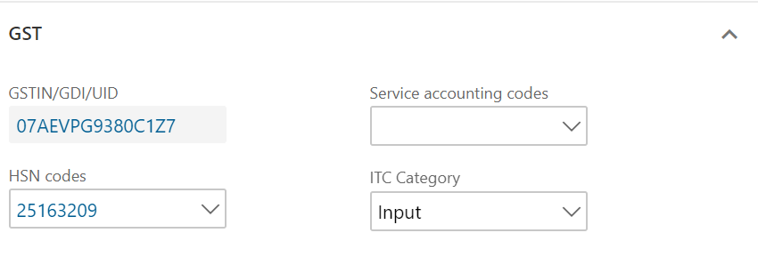
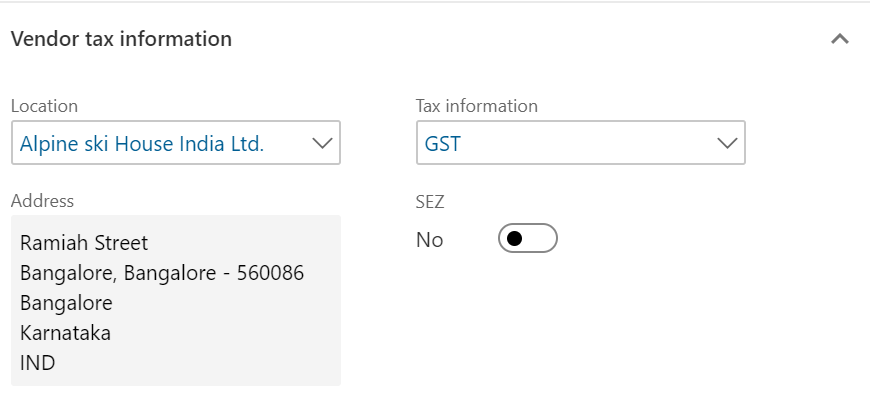
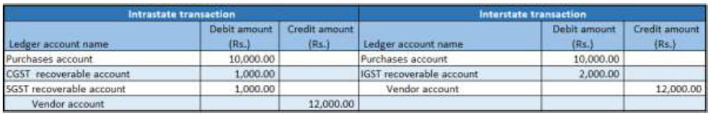

# Purchases from registered vendors

[!include [banner](../../includes/banner.md)]

## Request for quotation

1. Go to **Procurement and sourcing** \> **Requests for quotations** \> **All requests for quotations**.
2. Create a record for a taxable item.
3. On the Action Pane, on the **Quotation** tab, in the **Process** group, select **Send**, and publish the request for quotation (RFQ) to the vendor collaboration module.
4. Select **OK**.
5. Close the message that you receive.
6. Close the **Request for quotation details** page.

## Request for quotation replies

1. Go to **Procurement and sourcing** \> **Requests for quotations** \> **Request for quotation replies**.
2. Select the record.
3. On the Action Pane, on the **Reply** tab, in the **Maintain** group, select **Edit**.
4. On the Action Pane, on the **Reply** tab, in the **Process** group, select **Copy data to reply**.
5. On the **Purchase quotation lines** FastTab, select **Tax information**.

    

6. Select the **GST** FastTab.

    

7. Select the **Vendor tax information** FastTab.

    

8. Select **OK**.

## Review and accept the tax details

1. On the Action Pane, on the **Reply** tab, in the **Financials** group, select **Tax document**.
2. Select the **GST** node.
3. Review the tax applicability, tax attributes, and tax calculation.

    What you see might resemble the following example:

    - **Taxable value:** 10,000.00
    - **CGST:** 10 percent
    - **SGST:** 10 percent

4. Select **Close**.
5. On the Action Pane, on the **Reply** tab, in the **Process** group, select **Accept**.
6. Select **OK**, and close the message that you receive.
7. Close the **Request for quotation reply** page.

## Purchase order page

1. Select **Accounts payable** \> **Purchase orders \> **All purchase orders**.
2. Select the purchase order that was created through the RFQ.
3. On the Action Pane, on the **Purchase order** tab, in the **Maintain** group, select **Edit**.
4. On the **Purchase order lines** FastTab, select **Tax information**.

    

5. Select the **GST** FastTab.

    

6. Select the **Vendor tax information** FastTab.

    

7. Select **OK**.

## Review and confirm the tax details

1. On the Action Pane, on the **Purchase** tab, in the **Tax** group, select **Tax document**.
2. Review the tax applicability, tax attributes, and tax calculation.

    What you see might resemble the following example:

    - **Taxable value:** 10,000.00
    - **CGST:** 10 percent
    - **SGST:** 10 percent

3. Select **Close**, and then select **Confirm**.

## Post the purchase invoice

1. On the Action Pane, on the **Invoice** tab, in the **Generate** group, select **Invoice**.
2. In the **Default quantity for lines** field, select **Ordered quantity**.
3. Enter the invoice number.
4. On the Action Pane, on the **Vendor invoice** tab, in the **Actions** group, select **Post** \> **Post**.
5. On the Action Pane, on the **Invoice** tab, in the **Journals** group, select **Invoice**.
6. On the **Overview** tab, select **Voucher**.

The following illustration shows the financial entry for the purchase of goods.

The following illustration shows the financial entry for the purchase of services.

The following illustration shows the financial entry for the purchase of goods where the ITC category is set to **Others**.

The following illustration shows the financial entry for the purchase of services where the service category is set to **Others**.

The following illustration shows the financial entry for the purchase of goods where the load on inventory is set to 100 percent.

The following illustration shows the financial entry for the purchase of goods where the reverse charge is set to 100 percent.

The following illustration shows the financial entry for the purchase of goods where the reverse charge is set to 70 percent and the ITC category is set to **Others**.

[!INCLUDE[footer-include](../../../includes/footer-banner.md)]
