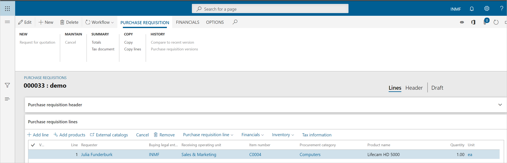
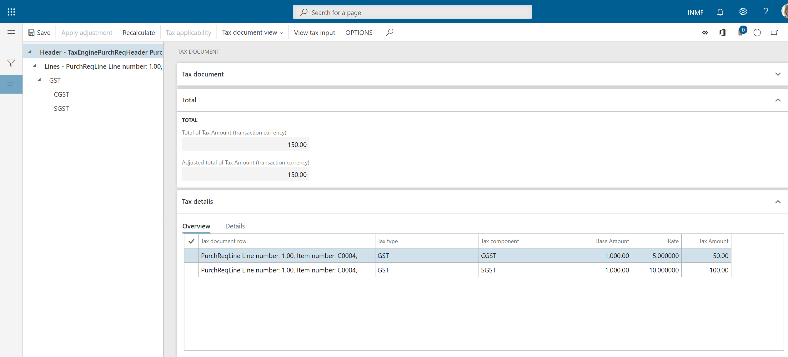
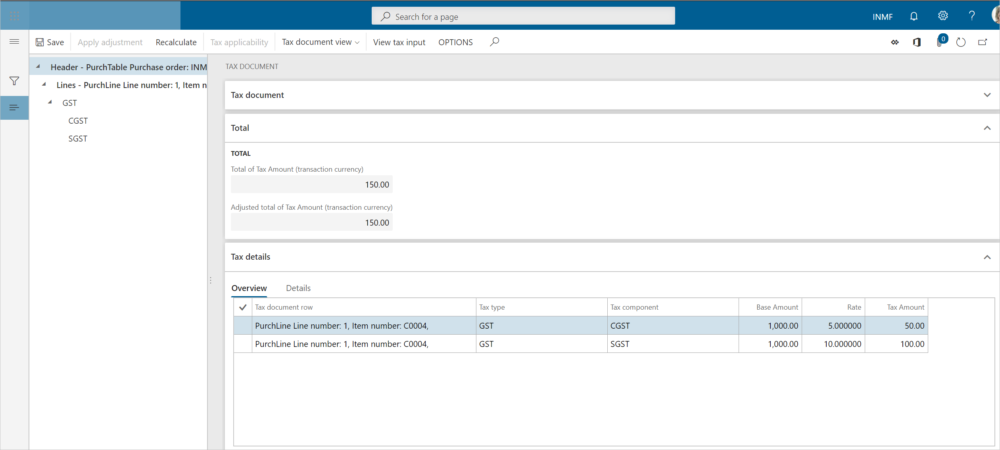
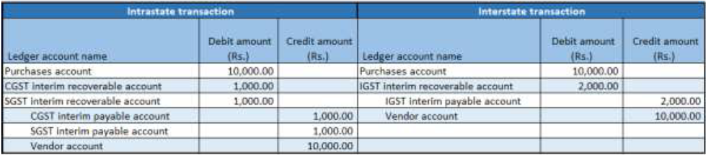
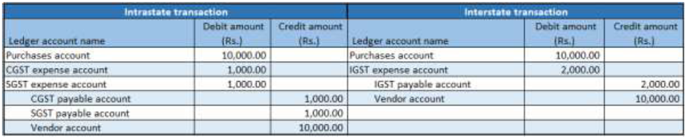
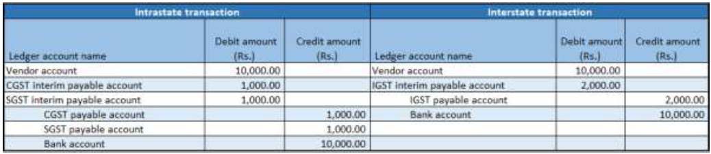

# Purchases from unregistered vendors

[!include [banner](../../includes/banner.md)]

## Create a purchase requisition

1. Go to **Procurement and sourcing** \> **Purchase requisitions** \> **All purchase requisitions**.
2. Create a purchase requisition for a taxable item, and save the record.

    The **Tax information** button becomes available.

    

3. Select **Tax information**.
4. On the **GST** FastTab, validate the default values for the following fields:

    - **GSTIN/GDI/UID**
    - **HSN code**
    - **ITC category:** Input
    - **Service category:** Inward

5. Select the **Vendor tax information** FastTab.

    > [!NOTE]
    > Because the **Tax information** field is blank for the vendor, the dealer is an unregistered dealer.

6. Select **OK**.

   
7. On the Action Pane, on the **Purchase Requisition** tab, in the **Summary** group, select **Tax document** to review the calculated taxes.

    What you see might resemble the following example:

    - **Taxable value:** 1,000.00
    - **CGST:** 5 percent
    - **SGST:** 10 percent

    

8. Select **Close**.
9. Select **Submit**.
10. Update the comment, and then select **Submit** to process the purchase requisition through a workflow.

## Approve the purchase requisition

1. Go to **Procurement and sourcing** \> **Purchase requisitions** \> **Purchase requisitions prepared by me**.
2. Select the purchase requisition, and then select **Actions** \> **Approve**.
3. Update the comment, and then select **Approve**.

## Release the approved purchase requisition

1. Go to **Procurement and sourcing** \> **Purchase requisitions** \> **Release approved purchase requisition**.
2. Select the purchase requisition, and then select **New Purchase order**.
3. Close the message that you receive.

## Purchase order page

1. Go to **Accounts payable** \> **Purchase orders** \> **All purchase orders**.
2. Select the purchase order.
3. On the **Purchase order lines** FastTab, select **Tax information**.
4. Select the **GST** FastTab.
5. Select the **Vendor tax information** FastTab.
6. Select **OK**.

## Validate the tax details

1. On the Action Pane, on the **Purchase** tab, in the **Tax group** group, select **Tax document** to review the calculated taxes.

    What you see might resemble the following example:

    - **Taxable value:** 1,000.00
    - **CGST:** 5 percent
    - **SGST:** 10 percent

    

2. If you change any tax attributes after the order line is created, select **Recalculate** to recalculate the tax.
3. Select **Close**, and then select **Confirm**.

## Post the purchase invoice

1. On the Action Pane, on the **Invoice** tab, in the **Generate** group, select **Invoice**.
2. In the **Default quantity for lines** field, select **Ordered quantity**.
3. Enter the invoice number, and then, on the **Action** Pane, on the **Vendor invoice** tab, in the **Actions** group, select **Post** \> **Post**.
4. On the Action Pane, on the **Invoice** tab, in the **Journals** group, select **Invoice**. 
5. On the **Overview** tab, select **Voucher**.

The following illustration shows the financial entry for the purchase of goods.

> [!NOTE]
> After the authority payment, the credit should be claimed.

The following illustration shows the financial entry for the purchase of services.

The following illustration shows the financial entry on invoice payment.

> [!NOTE]
> An appropriate Service Accounting Code (SAC) must be selected.

The following illustration shows the financial entry for the purchase of goods where the ITC category is set to **Others**.

The following illustration shows the financial entry for the purchase of services where the service category is set to **Others**.

The following illustration shows the financial entry on invoice payment.

The following illustration shows the financial entry for purchases where the load on inventory is set to 100 percent.

[!INCLUDE[footer-include](../../../includes/footer-banner.md)]
