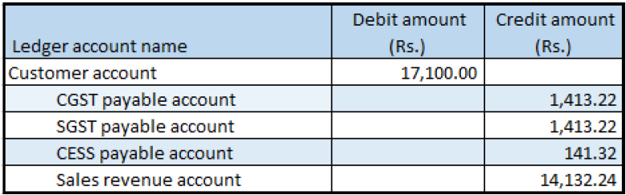

# Sales where prices include and exclude tax

[!include [banner](../../includes/banner.md)]

## Create a sales order

1. Go to **Accounts receivable** \> **Sales orders** \> **All sales orders**.
2. Create a sales order for taxable goods, and add two sales order lines:

    - For order line 1, clear the **Prices include sales tax** check box.
    - For order line 2, select the **Prices include sales tax** check box.

3. Save the records.
4. Select order line 1, and then select **Tax information**.
5. Select the **GST** FastTab.
6. Select the **Customer tax information** FastTab.
7. Select **OK**.
8. Repeat steps 4 through 7 for order line 2.
9. On the Action Pane, on the **Sell** tab, in the **Tax** group, select **Tax document**.

    What you see might resemble the following example:

    **Order line 1**

    - **Taxable amount:** 10,000
    - **CGST:** 10 percent
    - **SGST:** 10 percent
    - **CESS:** 1 percent

    **Order line 2**

    - **Taxable amount:** 5,000
    - **CGST:** 10 percent
    - **SGST:** 10 percent
    - **CESS:** 1 percent
    - Price inclusive

10. Select **Close**.

## Post the invoice

1. On the Action Pane, on the **Invoice** tab, in the **Generate** group, select **Invoice**.
2. In the **Quantity** field, select **All**.
3. Select **OK**, and then select **Yes** to acknowledge the warning message that you receive.

## Validate the voucher

1. On the Action Pane, on the **Invoice** tab, in the **Journals** group, select **Invoice**.
2. Select **Voucher**.

[!INCLUDE[footer-include](../../../includes/footer-banner.md)]
