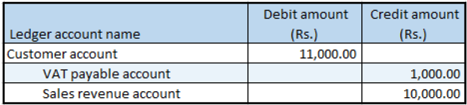

# Sales of non-GST goods

[!include [banner](../../includes/banner.md)]

1. Go to **Accounts receivable** \> **Sales orders** \> **All sales orders**.
2. Create a sales order, and define value-added tax (VAT) tax groups.
3. Select the record, and then select **Tax information**.
4. In the **Tax information** field, select a value that has a Tax Identification Number (TIN) associated with it.
5. Select the **GST** FastTab.
6. Select the **Customer tax information** FastTab.
7. Select **OK**.
8. On the Action Pane, on the **Sell** tab, in the **Tax** group, select **Sales tax**.
9. Select **Close**.

## Post the invoice

1. On the Action Pane, on the **Invoice** tab, in the **Generate** group, select **Invoice**.
2. In the **Quantity** field, select **All**.
3. Select **OK**, and then select **Yes** to acknowledge the warning message that you receive.

## Validate the voucher

1. On the Action Pane, on the **Invoice** tab, in the **Journals** group, select **Invoice**.
2. Select **Voucher**.

[!INCLUDE[footer-include](../../../includes/footer-banner.md)]
