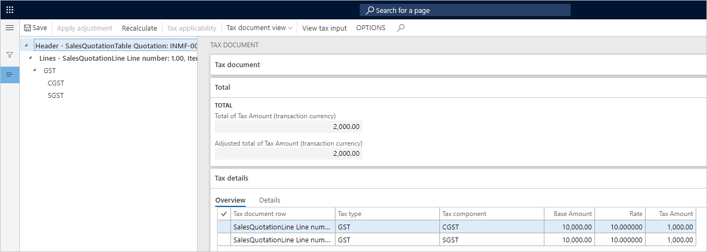
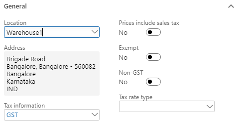
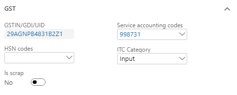
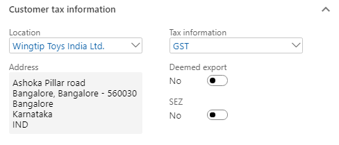

# Sales to registered customers

[!include [banner](../../includes/banner.md)]

## Create a sales quotation

1. Go to **Sales and marketing** > **Sales quotation** > **All quotations**.
1. Create a quotation for a taxable item for the registered customer.
1. Save the record.
1. Select **Tax information**.

    :::image type="content" source="../media/Capture06.PNG" alt-text="Screenshot of the Tax information dialog box.":::

1. On the **GST** FastTab, validate the default values.

    :::image type="content" source="../media/Capture07.PNG" alt-text="Screenshot of the GST FastTab.":::

1. Select the **Customer tax information** FastTab.

    :::image type="content" source="../media/Capture08.PNG" alt-text="Screenshot of the Customer tax information FastTab.":::

    > [!NOTE]
    > - The company address and the customer address are in the same state. Therefore, this transaction is an intrastate transaction.
    > - Customer tax information is defined. Therefore, the dealer is a registered dealer.

1. On the Action Pane, on the **Quotation** tab, in the **Financials** group, select **Tax document**.
1. Select the **GST** node.
1. On the **Sales quotation** and **Tax details** FastTabs, review the tax applicability, tax attributes, and tax calculation.

    What you see might resemble the following example:

    - **Taxable value:** 10,000.00
    - **CGST:** 10 percent
    - **SGST:** 10 percent

    

1. Select **Close**.
1. On the Action Pane, on the **Quotation** tab, in the **Generate** group, select **Send quotation**.
1. Select **OK**, and then close the message that you receive.
1. On the Action Pane, on the **Follow up** tab, in the **Generate** group, select **Confirm**.
1. Select **OK**, close the message that you receive, and then close the pages.

## Create a sales order

1. Go to **Accounts receivable** > **Sales orders** > **All sales orders**.
1. Select a record. On the Action Pane, on the **Sales order** tab, in the **Maintain** group, select **Edit**.
1. Select **Tax information**.

    

1. Select the **GST** FastTab.

    

1. Select the **Customer tax information** FastTab.

    

1. Select **OK**.
1. On the Action Pane, on the **Sell** tab, in the **Tax** group, select **Tax document** to review the calculated taxes.

    

1. Select **Close**.

## Post the invoice

1. On the Action Pane, on the **Invoice** tab, in the **Generate** group, select **Invoice**.
1. In the **Quantity** field, select **All**.
1. Select the **Print invoice** check box.
1. Select **OK**, and then select **Yes** to acknowledge the warning message that you receive.

## Validate the voucher

1. On the Action Pane, on the **Invoice** tab, in the **Journals** group, select **Invoice**.
1. Select **Voucher**.

The following illustration shows the financial entries for both the intrastate transactions and the interstate transactions.

:::image type="content" source="../media/Annotation-2019-05-20-133425.png" alt-text="Screenshot of financial entries for intrastate and interstate transactions.":::

[!INCLUDE[footer-include](../../../includes/footer-banner.md)]
