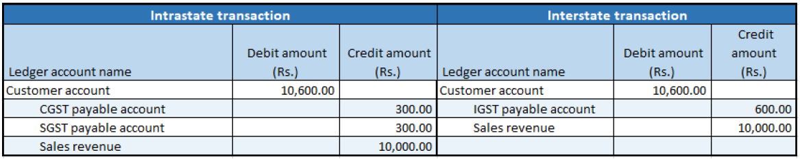

# Sales of taxable goods where there is a reverse charge

[!include [banner](../../includes/banner.md)]

1. Go to **Accounts receivable** \> **Sales orders** \> **All sales orders**.
2. Create a sales order for a taxable item, and save the record.
3. Select **Tax information**.
4. Select the **GST** FastTab.
5. Select the **Customer tax information** FastTab.
6. Select **OK**.
7. On the Action Pane, on the **Sell** tab, in the **Tax** group, select **Tax document** to review the calculated taxes.

    What you see might resemble the following example:

    - **Taxable value:** 10,000.00
    - **CGST:** 10 percent
    - **SGST:** 10 percent
    - **Reverse charge percentage:** 70 percent

8. Select **Close**.

## Post the invoice

1. On the Action Pane, on the **Invoice** tab, in the **Generate** group, select **Invoice**.
2. In the **Quantity** field, select **All**.
3. Select the **Print invoice** check box.
4. Select **OK**, and then select **Yes** to acknowledge the warning message that you receive.

## Validate the voucher

1. On the Action Pane, on the **Invoice** tab, in the **Journals** group, select **Invoice**.
2. Select **Voucher**.

The following illustration shows the financial entries for both the intrastate transactions and the interstate transactions.

[!INCLUDE[footer-include](../../../includes/footer-banner.md)]
