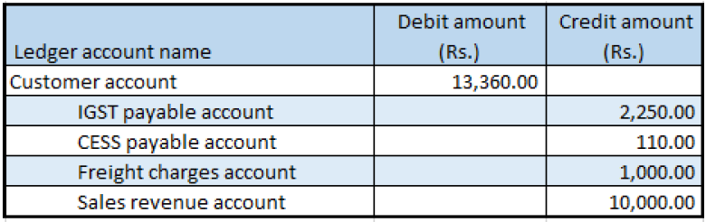

# Sales of taxable goods that have tax on shipping charges

[!include [banner](../../includes/banner.md)]

1. Go to **Accounts receivable** \> **Sales orders** \> **All sales orders**.
2. Create a sales order for a taxable item.
3. On the **Lines details** FastTab, on the **Address** tab, in the **Delivery address** field, select a value.
4. Save the record.
5. Select **Tax information**.
6. Select the **GST** FastTab.
7. Select the **Customer tax information** FastTab.
8. In the **Location** field, select the value that you selected for the delivery address in step 3, and then select **OK**.
9. On the **Sales order lines** FastTab, select **Financials** \> **Maintain charges**.
10. Select a charges code, and then, in the **Charges value** field, enter a value.
11. Save the record.
12. Select **Tax information**.
13. Select the **GST** FastTab.

    > [!NOTE]
    > The **SAC** field is automatically set, based on the charges code that you selected. The default setting is defined in the charges code master.

14. Select the **Customer tax information** FastTab.
15. Select **OK**.
16. On the Action Pane, on the **Sell** tab, in the **Tax** group, select **Tax document** to review the calculated taxes.

    What you see might resemble the following example:

    - **Line amount:** 10,000.00
    - **IGST:** 20 percent
    - **CESS:** 1 percent
    - **Miscellaneous charges:** 1,000.00
    - **IGST:** 25 percent
    - **CESS:** 1 percent

17. Select **Close**.

## Post the invoice

1. On the Action Pane, on the **Invoice** tab, in the **Generate** group, select **Invoice**.
2. In the **Quantity** field, select **All**.
3. Select the **Print invoice** check box.
4. Select **OK**, and then select **Yes** to acknowledge the warning message that you receive.

## Validate the voucher

1. On the Action Pane, on the **Invoice** tab, in the **Journals** group, select **Invoice**.
2. Select **Voucher**.

[!INCLUDE[footer-include](../../../includes/footer-banner.md)]
