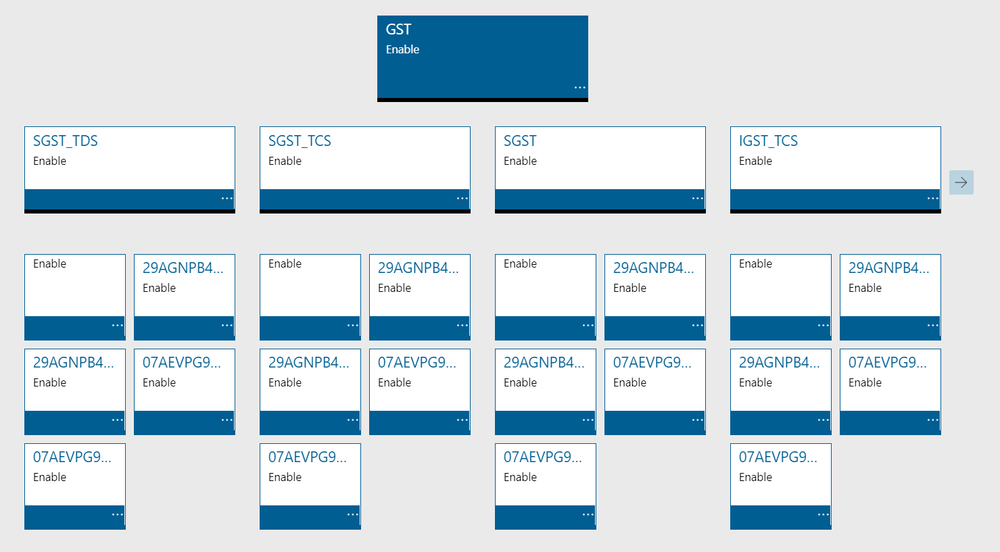
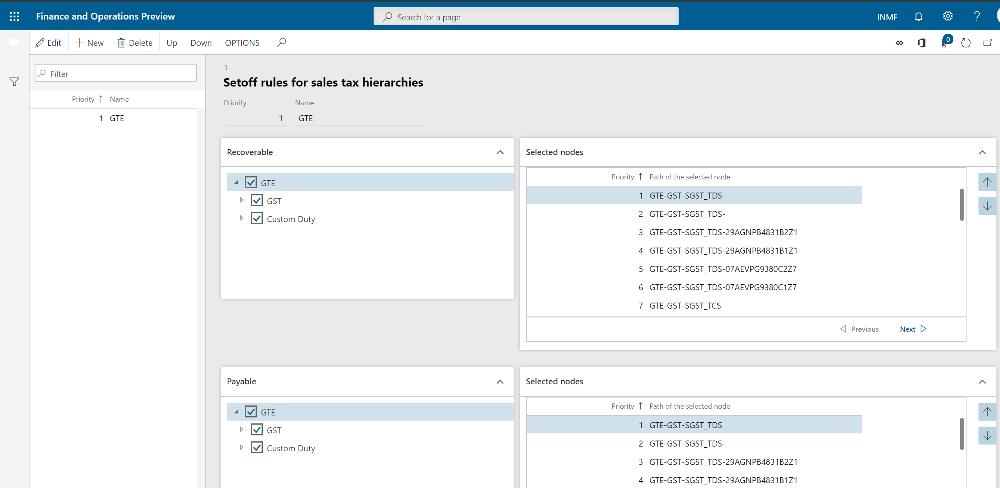
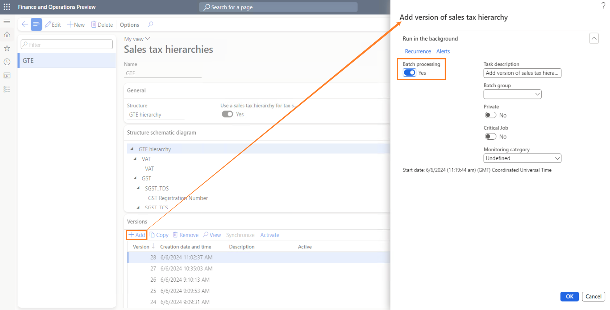
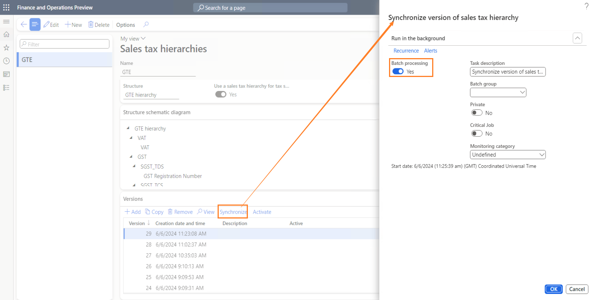
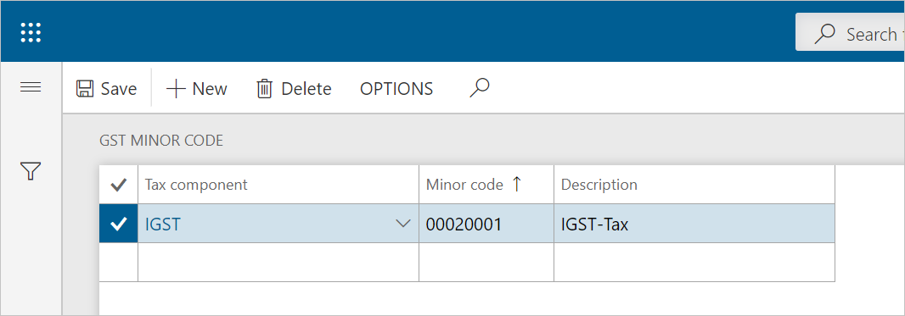

# Set up a sales tax hierarchy and the setoff rules

[!include [banner](../../includes/banner.md)]

## Maintain tax hierarchies

1. Go to **Tax** \> **Setup** \> **Sales tax** \> **Sales tax hierarchies**.
2. Select **New**.
3. In the **Name** field, enter a value.
4. In the **Structure** field, select **GTE hierarchy**.

    

5. Select **OK**.
6. On the **Versions** FastTab, select **Synchronize**.
7. Close the message that you receive.
8. Select **View**.

    

    The **Sales tax hierarchy designer** page shows the tax type and tax components, based on the configuration.

    

9. Select **Setoff rules for sales tax hierarchy**, and then select **New**.
10. In the **Name** field, enter a value, and then save the record.
11. On the **Recoverable** and **Payable** FastTabs, select the tax components, and adjust the priority values.
12. Define the setoff rules according to the legal requirement.

    

13. Select **Save**, and then select **Close**.
14. Close the **Sales tax hierarchy designer** page.
15. Select **Activate**, and then select **Close**.

## Maintain setoff hierarchy profiles

1. Go to **Tax** \> **Setup** \> **Sales Tax** \> **Maintain setoff hierarchy profiles**.
2. Select **New**.
3. In the **Effective date** field, enter a value.
4. In the **Hierarchy** field, select a value.

    

5. Select **OK**, and then select **Activate**.
6. Select **Yes**.
7. Close the message that you receive, and then close the page.

## Enable the addition and synchronization of tax hierarchy versions in batch mode

As of version 10.0.41, you can add and synchronize tax hierarchy versions in batch mode.

In the **Feature management** workspace, enable the **Enable adding and synchronizing of tax hierarchy version in batch mode** feature. Then, when you add a new version on the **Sales tax hierarchies** page (**Tax** \> **Setup** \> **Sales tax** \> **Sales tax hierarchies**), you can enable batch processing by setting the **Batch processing** option to **Yes** in the **Add version of sales tax hierarchy** dialog box.

> [!NOTE]
> After you select **OK** in the dialog box, you receive the following message: "The Add version of sales tax hierarchy job is added to the batch queue."
>
> If there is a batch job that isn't completed, you receive the following message: "Cannot start a new job, as a batch job to Add version of sales tax hierarchy is already running."

For the **Synchronize** operation, you can also enable batch processing in the **Synchronize version of sales tax hierarchy** dialog box.

> [!NOTE]
> After you select **OK** in the dialog box, you receive the following message: "The Synchronize version of sales tax hierarchy job is added to the batch queue."
>
> If there is a batch job that isn't completed, you receive the following message: "Cannot start a new job, as a batch job to Synchronize version of sales tax hierarchy is already running."

## GST minor codes

1. Go to **Tax** \> **Setup** \> **Sales tax** \> **GST minor codes**.
2. Select **New** to create a record.
3. In the **Tax component** field, select a value.
4. In the **Minor code** field, enter a value.
5. In the **Description** field, enter a value.
6. Select **Save**, and then select **Close**.

[!INCLUDE[footer-include](../../../includes/footer-banner.md)]
