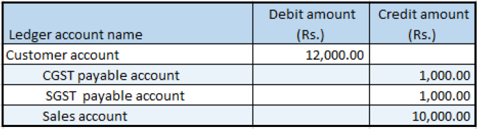

# Tax amount adjustment

[!include [banner](../../includes/banner.md)]

1. Go to **General ledger** \> **Journals** \> **General journal**.
2. Create a journal.
3. Select **Lines**.
4. In the **Account type** field, select **Customer**. Then, in the **Account** field, select a value.
5. In the **Debit** field, enter a value.
6. In the **Offset account type** field, select **Ledger**. Then, in the **Offset account** field, select a value.
7. Select **Tax information**.
8. On the **GST** tab, in the **HSN code** field, select a value.
9. Select the **Customer tax information** tab, and then select **OK**.

## Validate the tax details and reset the adjustment

1. Select **Tax document**.
2. On the **Adjustment** tab, in the **Tax amount (Adjusted)** field, change the value to override the tax amount that the system calculated.
3. Select **Apply adjustment** to apply the new tax amount.
4. On the **Tax details** tab, select **Recalculate** to reset the taxes to the amounts that were originally calculated.

## Adjust the tax applicability from interstate to intrastate

1. Select the **GST** node.
2. Select **Tax applicability** to override the tax applicability that the system determined.
3. Clear the **IGST** check box, and select the **CGST** and **SGST** check boxes.
4. Select **OK**.
5. Select **Apply adjustment** to apply your changes.

    > [!NOTE]
    > To reset the tax applicability to its original value, select **Recalculate**.

6. Select **Post** \> **Post**.
7. Select **Inquiries** \> **Voucher**.

    

> [!NOTE]
> Tax adjustment functionality is available only for purchase orders and sales orders that are at the invoicing stage.

[!INCLUDE[footer-include](../../../includes/footer-banner.md)]