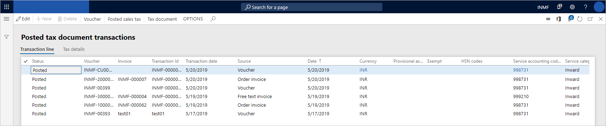
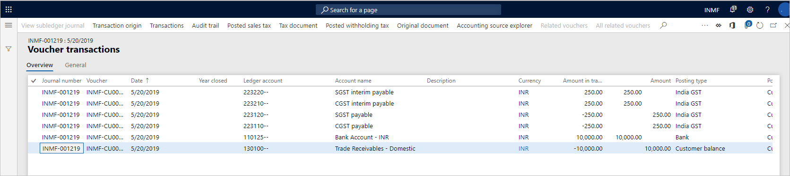
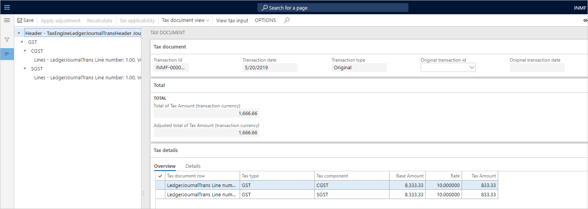
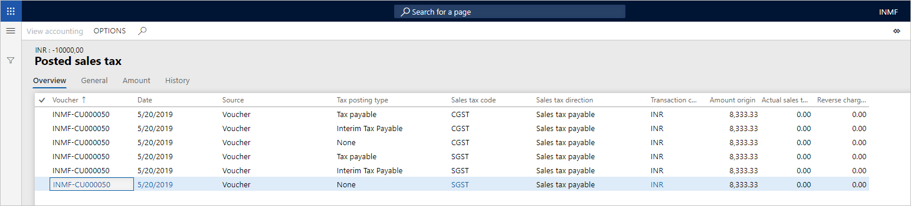

# Tax inquiry

[!include [banner](../../includes/banner.md)]

1. Go to **Tax** \> **Inquiries and reports** \> **Tax document transactions** \> **Posted tax document transactions**.
2. Select the registration number, and then select **OK**.

    

3. Select **Voucher** to view the financial entry that is posted for the transaction.

    

4. Select **Close**.
5. Select **Tax document** to view the tax that is calculated on the transaction.

    

6. Select **Close**.
7. Select **Posted sales tax**.

    

8. Select **Close**.

[!INCLUDE[footer-include](../../../includes/footer-banner.md)]
