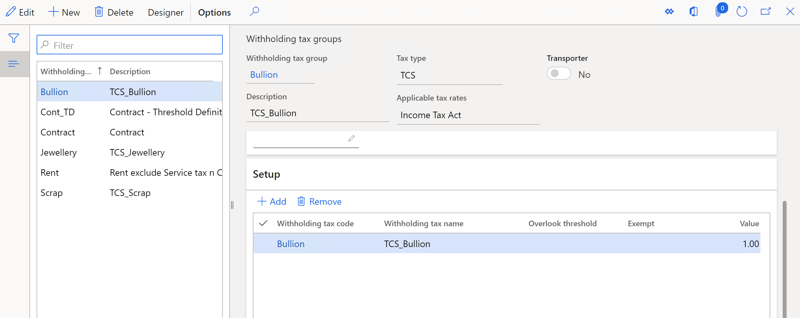

---
# required metadata

title: Attach TDS tax codes to TDS tax groups and define the formula for calculating TDS
description: This article explains how to set up Tax Deducted at Source (TDS) tax groups and attach TDS tax codes to TDS tax groups. To calculate TDS for a TDS tax group, you must define the formula for TDS tax codes that are attached to it.
author: kailiang
ms.date: 02/12/2021
ms.topic: article
ms.prod: 

ms.technology: 

# optional metadata

ms.search.form: 
# ROBOTS: 
audience: Application User
# ms.devlang: 
ms.reviewer: kfend
# 
# ms.tgt_pltfrm: 
ms.assetid: b4b406fa-b772-44ec-8dd8-8eb818a921ef
ms.search.region: Global
# ms.search.industry: 
ms.author: kailiang
ms.search.validFrom: 2021-02-12
ms.dyn365.ops.version: AX 10.0.17

---

# Attach TDS tax codes to TDS tax groups and define the formula for calculating TDS

[!include [banner](../../includes/banner.md)]

This article explains how to set up Tax Deducted at Source (TDS) tax groups and attach TDS tax codes to TDS tax groups. To calculate TDS for a TDS tax group, you must define the formula for TDS tax codes that are attached to it.

Follow these steps to set up a TDS tax group, attach TDS tax codes to it, and define the formula for calculating TDS.

1. Go to **Tax \> Indirect taxes \> Withholding tax \> Withholding tax groups**.

    

2. On the Action Pane, select **New** to create a withholding tax group for TDS, and enter the required details.
3. In the **Tax type** field, select **TDS**.
4. On the **Setup** FastTab, select **Add** to create a line.
5. In the **Withholding tax code** field, select the TDS tax code for the TDS tax group. The **Withholding tax name** field shows the name of the TDS tax code, and the **Value** field shows the value.
6. To ignore the threshold limit and exception threshold limit that are defined for the TDS tax component that is attached to the TDS tax code in TDS transactions, select the **Overlook threshold** check box.
7. To prevent the tax group from being calculated in transactions, select the **Exempt** check box.
8. On the Action Pane, select **Designer** to open the formula designer, so that you can define the formula for calculating TDS for the TDS tax group. On the **Designer** page, the **Taxes** tab shows the TDS tax codes that have been selected for the TDS tax group.

    

9. On the **Calculation** tab, select **Alt+N** to create a line. The **ID** field shows the automatically generated priority ID for TDS calculation.
10. In the **Tax code** field, select the TDS tax code to define the formula for. All the TDS tax codes that have been selected for the TDS tax group are available for selection in this field.
11. In the **Taxable basis** field, select the basis for calculating TDS:

    - **Gross amount** – Calculate TDS based on the gross transaction amount (that is, the invoice amount) by using the calculation expression that is defined for the tax code.
    - **Excl Gross amount** – Calculate TDS based on the calculation expression that is defined for the tax code.

    > [!NOTE]
    > The **Taxable basis** field can't be set to **Excl Gross amount** for the TDS tax code that has a priority ID of **1**.

12. The TDS calculation is based on the formula that is defined in the **Calculation expression** field for each tax code that is attached to the TDS tax group. Select the plus sign (+), minus sign (-), multiplication sign (\*), or division sign (/) button to enter the calculation expression for the selected TDS tax code in the **Calculation expression** field.

    > [!NOTE]
    > No calculation expression can be defined for the TDS tax code that has a priority ID of **1**.

13. To define the calculation expression for the TDS tax code in the **Calculation expression** field, add TDS tax codes that are available on the **Taxes** tab. To add TDS tax codes in the **Calculation expression** field, you can use any of the following methods:

    - Drag the required tax code from the **Taxes** tab to the **Calculation expression** field.
    - Double-tap (or double-click) the required tax code on the **Taxes** tab.
    - Select and hold (or right-click) the required tax code on the **Taxes** tab, and then select **Add tax code**.

    > [!NOTE]
    > Insert a calculation expression before each TDS tax code. The TDS tax codes that have been added to the calculation expression appear in brackets (\[...\]).

14. To clear the calculation expression that is defined for a tax code in the **Calculation expression** field, select the **C** button.
15. To delete a record on the **Calculation** tab, select **Delete**.
16. Close the page.
