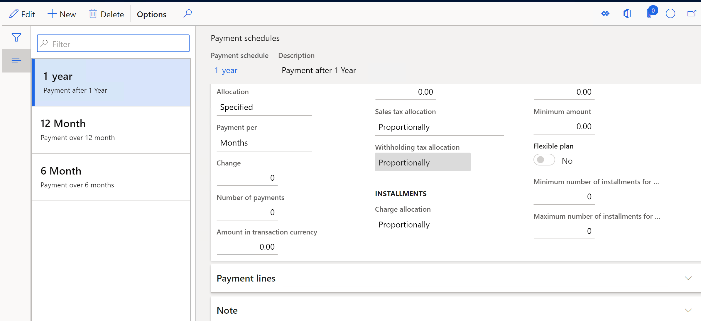

# Set up payment schedules with TDS allocation

[!include [banner](../../includes/banner.md)]

This article explains how to set up payment schedules with Tax Deducted at Source (TDS) allocation.

1. Go to **Accounts payable \> Payment setup \> Payment schedules**.

    []

2. On the Action Pane, select **New** to create a payment schedule, and enter the required details.
3. In the **Allocation** field, select the method to use to allocate the payment for the payment schedule:

    - Total
    - Fixed amount
    - Fixed quantity
    - Specified

    The **Withholding tax allocation** field shows the TDS allocation method for the payment schedule. If you select **Total** in the **Allocation** field, the **Withholding tax allocation** field is automatically set to **Total**. If you select **Fixed amount**, **Fixed quantity**, or **Specified** in the **Allocation** field, the **Withholding tax allocation** field is automatically set to **Proportionally**.

    > [!NOTE]
    > If the **Withholding tax allocation** field is set to **Total**, the payment installments are calculated based on the gross amount, which includes the TDS amount. If the **Withholding tax allocation** field is set to **Proportionally**, the payment installments are calculated based on the net invoice amount after the TDS amount is deducted.

4. Enter the other required details, and then close the page.
