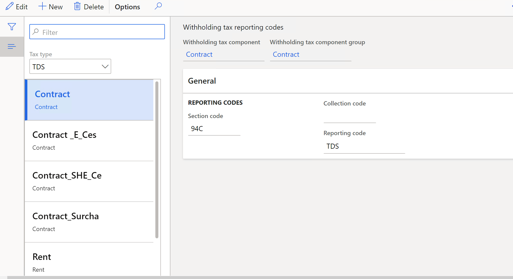

# Set up withholding tax reporting codes for the TDS tax type

[!include [banner](../../includes/banner.md)]

Withholding tax reporting codes are used to generate Form 26Q and Form 27Q statements for Tax Deducted at Source (TDS). This article explains how to set up withholding tax reporting codes steps so that you can set up TDS reporting codes.

1. Go to **Tax \> Setup \> Withholding tax \> Withholding tax reporting codes**.

    []

2. In the **Tax type** field, select **TDS** to define withholding tax reporting codes for the TDS tax type.
3. In the **Withholding tax component** field, select the TDS component to that you're defining the withholding tax reporting code for. The **Withholding tax component group** field shows the TDS component group that was defined for the TDS component that you're defining.

    The **Section code** field on the **General** FastTab shows the section code that is attached to the TDS component group.

4. On the **General** FastTab, in the **Reporting code** field, select the TDS reporting code:

    - TDS
    - TCS
    - Surcharge
    - PE\_Cess
    - SHE\_Cess

5. Close the page.
