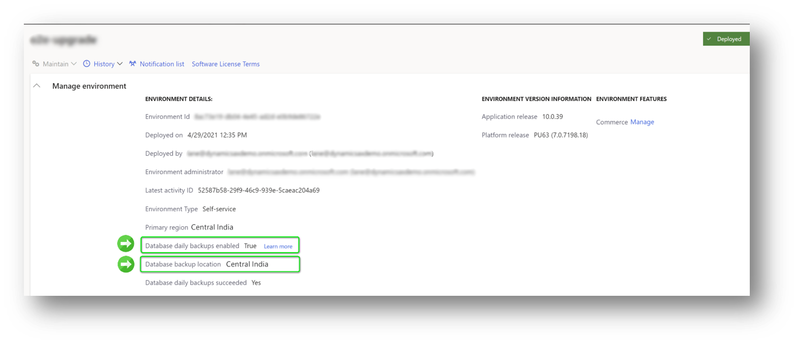

# Audit trail and edit logs for accounting software

[!include [banner](../../includes/banner.md)]

As of March 1, 2022, Microsoft Dynamics 365 Finance is in compliance with the new Indian tax legislation guidelines for accounting software to record an audit trail of all transactions. Additionally, an edit log is created for each change that is made to an account. This log records the date when the change was made.

## The legislation

Principal notification No. GSR 205 (E) dated March 24, 2021, and amended vide notification G.S.R.247(E) dated April 1, 2021, states that, as of April 1, 2022, all businesses that use accounting software to maintain books of accounts should have an audit trail feature that includes the following functionality:

- Recording an audit trail of every transaction
- Creating an audit log of every change that is made in the books of accounts
- Capturing the date details when those changes (edits) are made
- Ensuring that the audit trail can't be disabled

Additionally, the rules state that the audit trail feature should meet these conditions:

- It has been used throughout the year, for all transactions that are recorded in the software.
- It hasn't been tampered with.
- The audit logs that it generated have been preserved by the company.

## Compliance

### Compliance 1: Recording an audit trail

Under new guidelines of the Companies Act that specify how account books must be kept in electronic format, every company that uses accounting software to maintain its books of accounts must use only accounting software that has a feature for recording an audit trail. For compliance, the system must record and trace the data sources in the audit trail.

Typically, the following data is traced for a transaction:

- **Accounting data** – Entries that are posted in the general ledger.
- **Trade data** – This data includes credit limits and payment terms, among other types.
- **Other data** – This data can include user log information.

#### Accounting data

Finance is fully compliant with the requirement to record accounting data. The **Audit trail** function on the **Voucher transaction inquiry** page fetches the financial transaction entries that are posted in the general ledger and on reports. The function opens the **Audit trail inquiry** page, which shows who posted the transaction, when, and from which document type. The following graphic shows the audit trail option in Finance. 

Additionally, a creation date and time value represents the date when the transaction was posted. The **Audit trail inquiry** page also lets users view the voucher transactions. For more information, see [View journal entries and transactions](../../general-ledger/view-journal-entries-transactions.md).

#### Trade data

You can use the database logging in Finance to track specific types of changes to tables and fields. Changes that can be tracked include create, read, update, delete, and rename key operations. When you enable a database log for any table, note that the impact on performance might vary, depending on the category of table. In general, performance is affected as shown in the following table.

| Table category    | Data volume | Performance impact |
|-------------------|-------------|--------------------|
| Transaction table | High        | High               |
| Master table      | Medium      | Medium             |
| Setup table       | Low         | Low                |

> [!NOTE]
> This guideline is a general guideline. It might vary, depending on the specific business scenario.

When you configure logging for a table or field, a record of every change to that table or field is stored in the database log table, **sysdatabaselog**. This log table is stored in the environment database. You can use this feature to track changes in any trade data, such as credit limits or payment terms.

Companies that use Finance to maintain books of accounts are fully compliant with the new notifications and can track transaction data to the source. For more information, see [Configure database logging](../../../fin-ops-core/dev-itpro/sysadmin/configure-manage-database-log.md).

> [!IMPORTANT]
> Enabling database logs for tables and fields can track changes including insert, update, delete, and rename key operations. However, enabling the functionality might also impact performance. We recommend that you contact Microsoft support before you enable this functionality.

#### Other data

- **User log** – System administrators can use the **User log** page to keep an audit log of users who have signed in to the system. Users can help protect an organization's data by tracking logging information. For more information, see [Manage access to sensitive data](../../../fin-ops-core/dev-itpro/privacy/privacy-auditing-sensitive-data.md).

    

- **Workflow history** – Finance provides a report that shows the status of a document that was submitted to the workflow system for processing and approval. You can use this report to view approvals. A date stamp and document type are shown. 

    

    For more information, see [View workflow history](../../../fin-ops-core/fin-ops/organization-administration/tasks/view-workflow-history.md).

- **Log of edits that are made to the book of accounts** – In Finance, changes can't be made to posted financial data. Therefore, financial transactions can't be edited after they are posted. However, they can be reversed. The audit logs provide information about the transaction. Here are some examples:

    - The user who accessed the system and when
    - The user who updated the field value on the record and when
    - The field value before it was changed
    - Recent actions that the user has taken
    - The user who deleted the record
    - The locale that was used to make the update

    In the case of data corruption, you can correct minor data inconsistencies without disruptive downtime. You can upload and run deployable packages that contain custom X++ scripts to correct the data. For more information, see [Run custom X++ scripts with zero downtime](../../../fin-ops-core/dev-itpro/deployment/run-custom-scripts.md).

- **Ensuring that the audit trail can't be turned off** – Finance doesn't allow you to turn off the **Audit trail** feature. By default, the **Audit trail** report is generated for a legal entity. You can filter the period frequency so that data is shown immediately. However, the system provides an option that lets you to start or stop the auditing and retention policy for audit logs. 

### Compliance 2: Retain books of accounts in the original format

The books of accounts and other relevant books and papers are retained in one of the following formats:

- The format that they were originally generated, sent, or received in
- A format that accurately presents the information that was generated, sent, or received

The information in the electronic records will remain complete and unaltered.

Transactions that are posted in Finance remain complete and in the format that they were originally generated in. Finance includes no process for changing the format or content of a posted transaction.

### Compliance 3: Preservation of branch transactions information

The information that is received from branch offices isn't updated and is kept as it was originally received from the branches.

In Finance, changes can't be made to posted financial data. Therefore, financial transactions can't be edited after they are posted. However, they can be reversed. Data that is sent from a branch to a head office can't be changed by the head office. However, you can adjust the posted transaction through the specified mode of the transaction, such as a credit note or tax journal, that was posted in the ledger of both the branch and the head office.

### Compliance 4: Display of electronic record in legible format

The information in the electronic record of the document is shown in Finance. The **Electronic Reporting (ER) format configurations** feature that is available in Finance enables at least one output component per file. Typically, configurations contain multiple file output components of different types (for example, XML, TXT, XLSX, DOCX, and PDF). These components are grouped into one or multiple folders. Electronic reporting (ER) destination management lets you preconfigure what occurs when each component is run. By default, when a configuration is run, a dialog box appears that lets you save or open the file. The file is opened in the defined output components.

### Compliance 5: Maintain proper system of storage of electronic record

There is a proper system for storing, retrieving, displaying, and printing the electronic records. These electronic records must not be disposed of or rendered unusable unless those actions are permitted by law. Provided that a backup of the company's books of accounts and other books and papers is maintained in electronic mode, even in a location that is outside India, it will be kept on servers that are physically located in India.

Finance can be deployed into a subset of Azure datacenters by using Microsoft Dynamics Lifecycle Services. Azure is generally available in datacenters and geographical locations around the world. Finance lets customers specify the region or datacenter where their customer data will be stored. Although Microsoft might replicate data to other regions for data durability, customer data won't be replicated or moved outside the geographical location.
Microsoft provides business continuity and disaster recovery for production instances of Dynamics 365 software as a service (SaaS) applications if an Azure region-wide outage occurs. Paired regions reside within the same geography as their enabled set to meet data residency requirements for tax and law enforcement jurisdiction purposes. For more information, see [Business continuity and disaster recovery](/power-platform/admin/business-continuity-disaster-recovery).

### Compliance 6: Information for filling of annual financial statement

On an annual basis, the company will provide the following information to the Registrar when it files a financial statement:

- The name of the service provider
- The Internet Protocol (IP) address of the service provider
- The location of the service provider, wherever applicable
- The location where the books of accounts and other books and papers are maintained in the cloud (for example, the address that was provided by the service provider)

This information is protected by server security. We don't recommend that you include it on any publicly available financial report. You can manually add this information to any specific report.

### Compliance 7: Books of accounts must remain accessible in India

#### Requirement

In March 2021, the Ministry of Corporate Affairs (MCA) in India introduced amendments to Rule 3 of the Companies (Accounts) rules concerning the maintenance of books of accounts in electronic form. The key modifications are as follows.

**I. Accessibility requirement**: Amended *Rule 3 (1)* emphasizes that books of accounts and other relevant documents that are maintained in electronic mode must remain accessible in India at all times for later reference.

**II. Daily backup requirement**: Under amended *Rule 3 (5)*, companies are required to maintain a daily backup of their electronic books of accounts and other relevant documents on servers that are physically located in India, even if backups are also maintained outside the country.

**III. Annual intimation requirement**: *Rule 3 (6)* requires that companies inform the Registrar about details such as the service provider's name, IP address, and location annually, when they file financial statements. If books of accounts are maintained in the cloud, the address that the service provider provided must also be disclosed.

#### Supported scope

##### I. Accessibility requirement

Books of accounts and other relevant documents that are maintained in electronic mode in Dynamics 365 finance and operations apps are accessible in India for later reference. Access to the data and functionality of finance and operations apps is determined by the role-based security concept. For more information, see [Role-based security](/dynamics365/fin-ops-core/dev-itpro/sysadmin/role-based-security).

##### II. Daily backup requirement

To use a finance and operations app, companies must deploy a finance and operations apps environment through [Lifecycle Services](/dynamics365/fin-ops-core/dev-itpro/lifecycle-services/lcs-user-guide). Finance and operations apps environments are deployed in a customer-selected Azure region where customer data is stored. Companies that use finance and operations apps choose where they want to deploy their environments when they create the environment through Lifecycle Services. Although Microsoft might replicate data to other regions for data durability, customer data isn't replicated or moved outside the geographical location. For more information, see [Azure paired regions](/azure/reliability/cross-region-replication-azure#azure-paired-regions). The specific activities that are required to meet the daily backup requirement may vary, based on the geographical location (whether inside or outside of India) that was chosen for deployment of finance and operations apps environments.

###### Finance and operations apps environments that are deployed in India

- Finance and operations apps infrastructure ensures that backups of the company's books of accounts, along with other records maintained electronically within finance and operations apps, are stored on servers that are physically located in India.
- A customer's representative who has an administrator role in a finance and operations apps tenant (that is, an administrator) can check where the database is deployed by looking at the **Database backup location** field in Lifecycle Services.
- If an Azure region-wide outage occurs, Microsoft provides business continuity and disaster recovery for production instances of the finance and operations apps software as a service (SaaS) application.
- Databases are protected by Microsoft Power Platform's automatic backups of production environments. These backups are kept for up to 28 days. For more information, see [Back up and restore environments](/power-platform/admin/backup-restore-environments). The underlying technology is Azure SQL Database. For more information, see [Automated backups in Azure SQL Database](/azure/sql-database/sql-database-automated-backups).
- Administrators can view evidence about which finance and operations apps environments have daily backups enabled. They can capture a screenshot to create a log of this evidence.
- Administrators in Lifecycle Services can use the Environment Metadata API to create a daily log of evidence that pertains to the database backup location and the enabled status of daily backup. For more information, see [Fetch environment metadata](/dynamics365/fin-ops-core/dev-itpro/lifecycle-services/api/v1/reference-environment-metadata). Any software that supports HTTP and RESTful APIs can be used for this task.
- Administrators can restore their environments to a specific point in time in the past by using Lifecycle Services. For more information, see [Database point-in-time restore (PITR)](/dynamics365/fin-ops-core/dev-itpro/database/database-point-in-time-restore).

###### Finance and operations apps environments that are deployed outside of India

If a finance and operations apps environment is deployed outside of India, a company can consider using the following options to fulfill India's daily backup requirement.

**Option (1). Geo to geo migration**

Under some conditions, to fulfill India's daily backup requirement, a company that operates in India and has its finance and operations apps environment deployed outside of India can consider migrating the finance and operations apps environment that has an Indian legal entity to a datacenter in India. For more information, see [Geo to geo migration overview](/dynamics365/fin-ops-core/dev-itpro/deployment/geo-to-geo-migrations). When a finance and operations apps environment that contains data necessary to fulfill the daily backup requirement is migrated to a datacenter in India, the approach that is described in the [Finance and operations apps environments that are deployed in India](#finance-and-operations-apps-environments-that-are-deployed-in-india) section is applicable.

**Option (2). Multi-instance installation**

Under some conditions, a company that operates in India and has its finance and operations apps environment deployed outside of India can consider a multi-instance installation, where the Indian legal entities are installed in a finance and operations apps environment that is located in a datacenter in India. Other legal entities can be installed in environments in different geolocations, depending on other countries'/regions' legal requirements and the company's needs. For more information, see [Plan your environment strategy for Dynamics 365](/dynamics365/guidance/implementation-guide/environment-strategy-overview). When finance and operations apps legal entities that have an address in India are installed in a finance and operations apps environment that is located in a datacenter in India, the approach that is described in the [Finance and operations apps environments that are deployed in India](#finance-and-operations-apps-environments-that-are-deployed-in-india) section is applicable.

**Option (3). Azure Synapse Link for Dataverse with Azure Data Lake Storage**

For finance and operations apps environments that are deployed outside of India, companies can consider using Azure Synapse Link for Dataverse for daily replication of their electronic books of accounts and other relevant documents from their finance and operations apps to a data lake in a datacenter in India. For more information, see [What is Azure Synapse Link for Dataverse?](/power-apps/maker/data-platform/export-to-data-lake)

This service enables the selection of both standard and custom finance and operations entities and tables. It supports continuous replication of entity and table data, including create, update, and delete (CUD) transactions. For more information, see [Create an Azure Synapse Link for Dataverse with Azure Data Lake](/power-apps/maker/data-platform/azure-synapse-link-data-lake).

> [!NOTE]
> We recommend that you use finance and operations tables for data replication to Data Lake Storage.

**1. Enable Data Lake Storage.** Data Lake Storage is a powerful Microsoft-provided cloud service that lets you store and analyze large volumes of data. For more information, see [Introduction to Azure Data Lake Storage Gen2](/azure/storage/blobs/data-lake-storage-introduction). To fulfill the daily backup requirement, create a storage account in India to use with your Azure Data Lake Storage instance. For more information, see [Create an Azure storage account](/azure/storage/common/storage-account-create).

> [!NOTE]
> Beginning August 15, 2024, when you select tables in the finance and operations apps for replication in your organization's Azure Synapse Data Lake Storage in India, the data from these selected tables will be replicated regardless of the association to legal entities in your organization's finance and operations apps. For example, if you setup a legal entity in France or US and India, the data in the selected tables for those legal entities will be replicated and stored in your Azure Synapse Data Lake Storage in India.

**2. Choose data.** In Power Apps, select the desired Azure Synapse Link in the list, and go to the **Azure Synapse** workspace. Expand **Databases**, and select your Dataverse container. The exported tables appear under the **Tables** directory in the left pane. For more information, see [Choose finance and operations data in Azure Synapse Link for Dataverse](/power-apps/maker/data-platform/azure-synapse-link-select-fno-data).

**3. Data replication.** Data from finance and operations apps is continuously replicated to Azure Synapse Data Lake Storage by using Azure Synapse Link. The data is stored in Common Data Model format to ensure semantic consistency across apps and deployments.

**4. Query and transform.** After the data is exported, you can use tools such as Apache Spark to query and transform it. For more information, see [Transform Azure Synapse Link for Dataverse data with Apache Spark](/power-apps/maker/data-platform/azure-synapse-link-spark).

> [!IMPORTANT]
> Determining the scope of data sources for books of accounts and other relevant books and papers that are maintained in electronic mode for data replication to fulfill the daily backup requirement in a specific company by using finance and operations apps is outside the purview of Microsoft's support.

##### III. Annual intimation requirement

Companies must inform the Registrar about the following details annually, when they file financial statements:

- The name of the service provider
- The IP address of the service provider
- The location of the service provider (wherever applicable)
- If the books of accounts and other books and papers are maintained in the cloud, the address that is provided by the service provider
- If the service provider is located outside of India, the name and address of the person who is in control of the books of account and other books and papers in India

[!INCLUDE[footer-include](../../../includes/footer-banner.md)]
