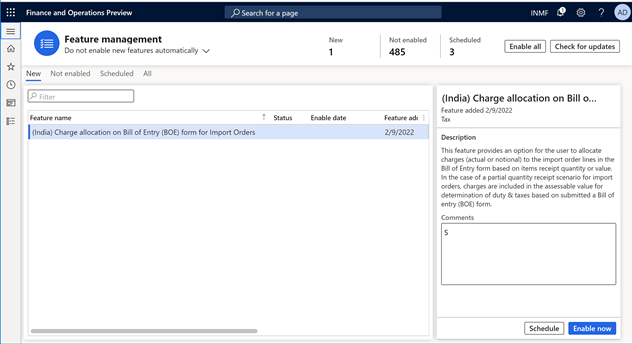
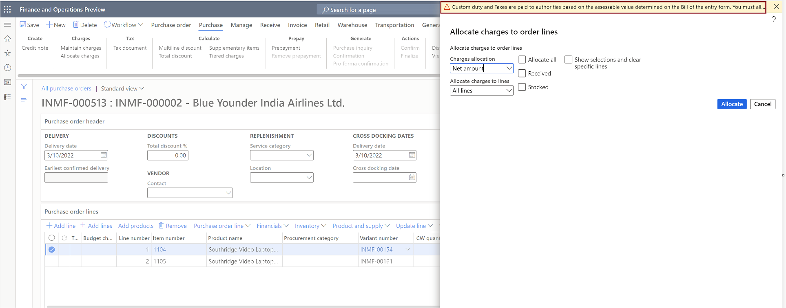
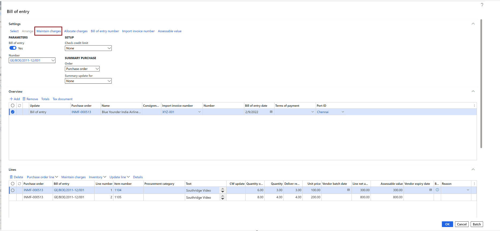
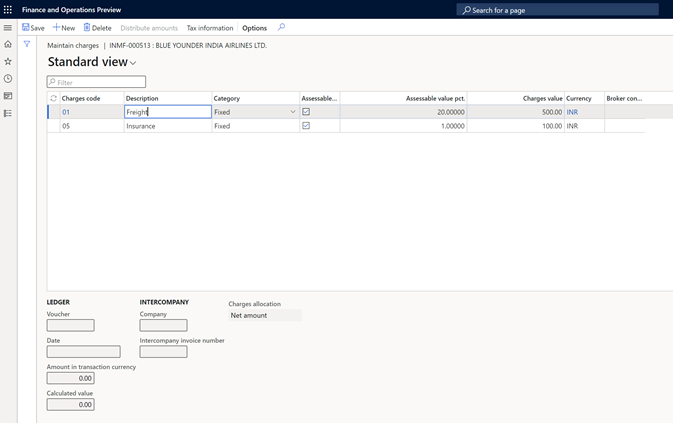
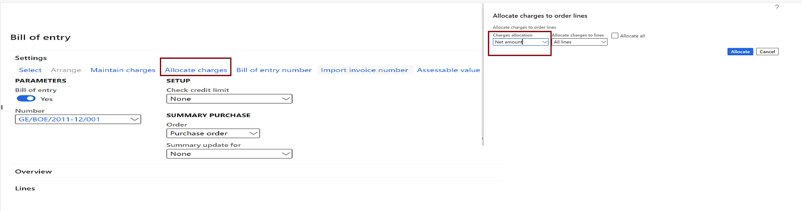
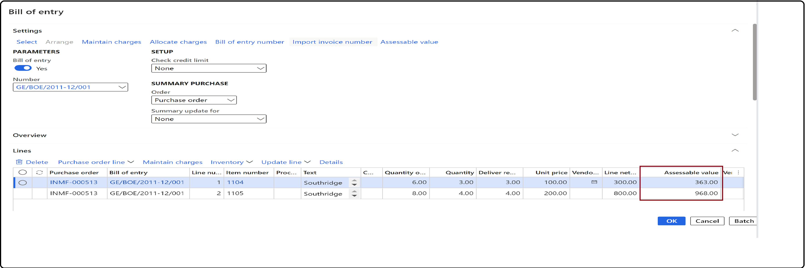

# Charges allocation on Bill of entry page for import orders

[!include [banner](../../includes/banner.md)]

For transactions for the import of goods, duty and taxes are calculated based on a custom cost, insurance, and freight (CIF) value that is determined by adding freight and insurance charges to the value of the imported goods. The custom CIF value is also known as the assessable value. Customs authorities determine this value when a bill of entry (BOE) is submitted.

Generally, actual freight and insurance charges are added to the value of goods to determine the assessable value. Sometimes, the quantity of goods that are received against an import order or a purchase order differs from the actual quantity that was ordered. This difference affects the actual amount of charges that are incurred for freight and insurance, and the assessable value that is used to determine the customs duty and goods and services tax (GST). Therefore, this feature lets you edit the charge amount at the BOE stage and allocate charges to all BOE line items on a net amount or quantity basis. This capability will help you match the BOE assessable value with the value that customs authorities determine, for taxation purposes.

Currently, the system applies freight and insurance charges to the full value or quantity of all the line items on an import order or purchase order to determine the assessable value. However, importers often receive only a partial quantity of goods. In these cases, and the freight and insurance charges can't be edited on the **Bill of entry** page. Additionally, these partial receipts also cause the assessable value that is used to determine duties and taxes to be incorrect. Therefore, the new feature lets you edit charges on the **Bill of entry** page and allocate the edited charges to selected BOE lines. This capability will help you allocate actual charges to the line items and determine the correct assessable value as it's determined by customs authorities.

> [!NOTE]
> The government determines the assessable value when a BOE is submitted. Therefore, we recommend that you to allocate charges on the **Bill of entry** page instead of the **Import order** or **Purchase order** page.

## Key changes introduced
The new feature introduces the following key changes:

- Charges that are defined on the import order header are automatically copied to the **Bill of entry** page.
- Charges can be defined or edited on the **Bill of entry** page.
- Allocation of charges must be done on the **Bill of entry** page instead of at the import order level.
- You receive a warning if you try to allocate header charges on import order lines.
- The charge allocation option on the **Bill of entry** page is available only for the **Fixed charge** calculation category, because customs authorities consider charges only on an actual or notional percentage basis.
- Charges that are allocated on BOE lines can be edited.
- The assessable value is automatically calculated for every BOE line after charges are added.
- Either the actual charge amount or charge percentage of the assessable value, whichever is lower, is considered when the assessable value is determined.
- Charges that are posted on the **Bill of entry** page will be copied to the **Posting invoice** page.
- Although you can edit the charges on the **Posting invoice** page, your changes won't affect the assessable value of items on the import order.
- You can post-import an invoice on the following bases:

  - One BOE > One invoice
  - One BOE > One product receipt > One invoice
  - One BOE > Multiple receipts > One invoice
  - One BOE > Multiple receipts > Multiple invoices

- Charges can be applied to the BOE in the company currency and a foreign currency.

## Enable the feature

1. Go to **Workspaces** > **Feature management**.
2. In the list, find and select the **Charge allocation on Bill of entry (BOE) form for import orders** feature.
3. Select **Enable now**.

     

## Create a purchase (import) order

1. Go to **Accounts payable** > **Purchase orders** > **All purchase orders**.
2. Create a purchase order that has a foreign vendor account and a port ID.
3. Add multiple line items.
4. On the purchase order header, enter the charges for freight and insurance.

   > [!NOTE]
   > If you allocate charges on the purchase order lines, you will receive a warning when you select **Allocation**.
   > 
   >   

5. Save the record.
6. Select **Tax information**.
7. Select the Harmonized System of Nomenclature (HSN) code and the customs tariff code, and then select **OK**.
  
## Validate the tax details
1. On the **Purchase order** page, on the Action Pane, on the **Purchase** tab, in the **Tax** group, select **Tax document**.
2. On the **Tax details** FastTab, review the tax calculation.
3. Select **Close**.
4. Select **Confirm**.

## Update the invoice registration
1. On the **Import order** page, on the Action Pane, on the **Customs** tab, in the **Maintain** group, select **Invoice registration**.
2. Select **Import invoice number**.
3. Edit the quantity that was received, and then select **Update**.

## Post the BOE
1. On the **Import order** page, on the Action Pane, on the **Customs** tab, in the **Generate** group, select **Bill of entry**.
2. Select **Import invoice number**.
3. Select **Bill of entry number**.
4. In the **Settings** group, select **Maintain charges**.
 
    
   
   Charges that are defined on the purchase order header are entered by default under **Maintain charges** on the **Bill of entry** page.

5. Edit the charges as required.
   
   

6. On the **Bill of entry** page, on the Action Pane, select **Allocate charges**.
   
   Charges are allocated to BOE lines. Charge allocation can be done on the following bases:

     - Net amount
     - Quantity
  
   

7. Review the assessable value for each BOE line.
 
   

   > [NOTE]
   > You can still edit charges on the BOE lines.

8. Save your changes, and then post the BOE.

## Post the purchase invoice

1. On the **Bill of entry** page, on the Action Pane, on the **Invoice** tab, in the **Generate** group, select **Invoice**. By default, the value of the **Quantity for lines** field will equal the value of the **Bill of entry quantity** field. You can select the product receipt quantity as required. You can continue to edit charges on lines on the **Posting invoice** page without affected the posted assessable value.
2. Enter the invoice number.
3. On the Action Pane, on the **Vendor invoice** tab, in the **Actions** group, select **Post** > **Post**.
4. On the Action Pane, on the **Invoice** tab, in the **Journals** group, select **Invoice** > **Overview** > **Voucher**.

[!INCLUDE[footer-include](../../../includes/footer-banner.md)]
