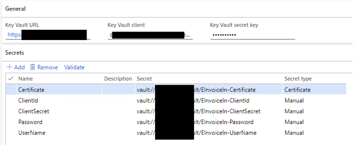

# Electronic invoices in India

An electronic invoice is a legally accepted digital tax receipt document that your organization registers in the Invoice Registration Portal (IRP). The obligation and applicability of using electronic invoices depends on annual turnover. The minimum applicable threshold is determined by the legislation. Depending on their turnover, some companies might not be able to access IRP directly and must use additional options, such as integration with Goods and Services Tax (GST) Service Providers (GSPs). Registration of an e-Way Bill in IRP is supported as part of electronic invoice registration.

By using Microsoft Dynamics 365 Finance to generate electronic invoices for your organization, you ensure that they are secure, confidential, authentic, and legally acceptable. You also ensure that required standards are applied to them. As an alternative integration option, the applicable invoice details can be exchanged through file export and import. (For example, you might use this alternative when you expect that the GSP integration will be used.)

## Setting up electronic invoices

### Feature activation

1. Go to **System administration** \> **Workspaces** \> **Feature management**.
2. In the list, find and select the **(India) Electronic invoice under GST** feature.
3. Select **Enable** to activate the feature. For more information about feature management and the available options, see [Feature management overview](../../../fin-ops-core/fin-ops/get-started/feature-management/feature-management-overview.md).

### Import Electronic reporting configurations

To prepare Finance to interoperate with the IRP system, import the latest versions of the following Electronic reporting (ER) configurations. For more information, see [(ER) Import configurations from RCS](../../../fin-ops-core/dev-itpro/analytics/tasks/import-configuration-rcs.md).

- Invoice model
- Invoice model mapping (IN)
- GST Invoice format (IN)
- Electronic messages framework model
- eInvoice model mapping
- eInvoice format (IN)
- eInvoice authentication import format (IN)
- eInvoice data import format (IN)

After you import the configurations, set the **Default for model mapping** option to **Yes** for the **eInvoice model mapping** configuration.

> [!NOTE]
> When you import from the Global Repo or Microsoft Dynamics Lifecycle Services (LCS), you just have to import the format configurations. Related model and model mapping configurations will automatically be imported. Ensure that you import the latest configuration versions that are available.

### Set up Electronic messaging functionality

Electronic messaging (EM) functionality is provided to maintain the different processes that are used in electronic reporting and the transmission of different document types. For more information about electronic messages, see [Electronic messaging](../../general-ledger/electronic-messaging.md). The most important step in the setup of EM functionality for IRP integration is to import the Indian IRP integration setup V5.zip data package that is provided. After you successfully import the setup data, almost all the required setup will automatically be created. The only remaining setup that you will have to do is select parameters for executable classes and set up number sequences for EM. Both those tasks are described later in this topic.

> [!NOTE]
> We recommend that you apply only the latest data package version that is available in LCS.

#### Import a package of data entities that include a predefined EM setup

The process of setting up the EM functionality to interoperate with the IRP system has multiple steps. Because the names of some predefined entities are used in the ER configurations, use the set of predefined values that are included in a package of data entities for the related tables. Import the ER configurations before you import the data entities.

1. In LCS, go to the Shared asset library, and select **Data package** as the asset type.
2. In the list of data package files, find and download **Indian IRP integration setup V5.zip**.
3. After the file is downloaded, open Finance, and select the company that you will interoperate with the IRP system from.
4. Go to **Workspaces** \> **Data management**.
5. In the **Data management** workspace, go to **Framework parameters** \> **Entity settings**, and select **Refresh entity list**. Wait for confirmation that the refresh has been completed. For more information about how to refresh the entity list, see [Entity list refresh](../../../fin-ops-core/dev-itpro/data-entities/data-entities.md#entity-list-refresh).
6. Validate that the source data and target data are correctly mapped. For more information, see [Validate that the source data and target data are mapped correctly](../../../fin-ops-core/fin-ops/data-entities/data-import-export-job.md#validate-that-the-source-data-and-target-data-are-mapped-correctly).
7. Before you use the data entities to import the data from the package, follow these steps for each data entity in the package:

    1. Sync the mapping of the source data and target data. In the package list, select a data entity, and then, on the Action Pane, select **Modify target mapping**.
    2. Above the grid for the package, select **Generate mapping** to create a mapping from scratch, and then save the mapping.

    For more information about data management, see [Data management overview](../../../fin-ops-core/dev-itpro/data-entities/data-entities-data-packages.md).

10. Import data from the Indian IRP integration setup V5.zip file into the selected company. In the **Data management** workspace, select **Import**, specify a group name, select **Add file**, and then, in the drop-down dialog box, set the **Source data format** field to **Package**.
11. Select **Upload and add**, select the **Indian IRP integration setup V5.zip** file on your computer, and upload it.
12. After the data entities are uploaded, on the Action Pane, select **Import**.

You will receive a notification in the Action center, or you can manually refresh the page to view the progress of the data import. When the import is completed, the **Execution summary** page shows the results.

After the data entities are imported, the following types of electronic message processing are available. This processing contains most of the setup that is required in your legal entity.

- **OnlineInvoicing** – Indian online invoicing. This processing supports interoperation with the IRP system to submit information about sales invoices, free text invoices, project customer invoices, and transfer orders. IRP responses are parsed to obtain and save the Invoice Registration Number (IRN) and signed QR code.
- **CancelInvoice** – Cancel Indian online invoicing. This processing supports interoperation with the IRP system to cancel previously registered customer invoices.
- **RegisterEWB** – Register e-Way Bill. This processing supports interoperation with the system to submit information that includes e-Way Bill details. As a result of this processing, the e-Way Bill status and other details, such as the e-Way Bill number and date, are updated.
- **CancelEWB** – Cancel e-Way Bill. This processing supports interoperation with the system to cancel previously registered e-Way Bills.

To review the imported processing, go to **Tax** \> **Setup** \> **Electronic messages** \> **Electronic message processing**.

#### Set up the integration internet addresses

1. Go to **Tax** \> **Setup** \> **Parameters** \> **Electronic messages** \> **Web service settings**.
2. Define the internet addresses for web services. The addresses that are shown here are testing addresses that are applicable to the sandbox environment.

    - **Authentication:** `https://einv-apisandbox.nic.in/eivital/v1.04/auth`
    - **Generate IRN:** `https://einv-apisandbox.nic.in/eicore/v1.03/Invoice`
    - **Cancel IRN:** `https://einv-apisandbox.nic.in/eicore/v1.03/Invoice/Cancel`
    - **Generate WEB:** `https://einv-apisandbox.nic.in/eiewb/v1.03/ewaybill`
    - **Cancel EWB:** `https://einv-apisandbox.nic.in/ewaybillapi/v1.03/ewayapi`

    > [!NOTE]
    > Internet addresses are subject to change by the National Informatics Centre (NIC). We recommend that you check for actual internet addresses on the official website of the e-Invoice System or other appropriate sources. The official documentation also has information about the available production internet addresses that you should set up.

3. In the **Request** parameters, specify the following set of values for all the preceding web services.

    | Parameter | Value |
    |-----------|-------|
    | Successful response code | 200 |
    | Request method | POST |
    | Content type | Application/json |
    | Request headers format mapping | eInvoice format (IN) |

IRP might limit the number of Internet Protocol (IP) addresses that it can be accessed from. To satisfy the requirements, select the **Use proxy server** checkbox, and set up proxy server parameters, such as the proxy server IP address, proxy server port number, and proxy authentication (stored in Azure Key Vault).

#### Set up additional fields

Additional fields are associated with EM items and required for their processing. They are included in the electronic message processing of the **OnlineInvoicing** (Indian online invoicing) type that is used to interoperate with the IRP system and are imported into the system by using a package of data entities. The system automatically sets values for additional fields when actions are run. IRP integration uses only one additional field.

If no additional fields were imported from the data package, follow these steps.

1. Go to **Tax** \> **Setup** \> **Electronic messages** \> **Additional fields**.
2. Select **New**, and enter the **AppKey** and a **Unique ID** that identifies the unique user session.

#### Set up executable class parameters

To finalize the electronic message setup after you've imported the data package, follow these steps.

1. Go to **Tax** \> **Setup** \> **Electronic messages** \> **Executable class setting**.
2. Select **Generate EM**.
3. On the Action Pane, select **Parameters**.
4. In the dialog box that appears, set the following values for the parameters of the executable class:

    - **Format mapping:** GST Invoice format (IN)
    - **Message status in case of success:** Generated
    - **Message item status in case of technical error:** Created

### Set up number sequences for electronic messages

To work with the electronic message functionality, you must define related number sequences.

1. Go to **Tax** \> **Setup** \> **Parameters** \> **General ledger parameters**.
2. On the **Number sequences** tab, set up two number sequences:

    - Message
    - Message item

### Set up batch settings for automated processing of interoperation with the IRP system

1. Go to **Tax** \> **Setup** \> **Electronic messages** \> **Electronic message processing**.
2. Select the processing, such as **OnlineInvoicing** or **CancelInvoice**.
3. On the **Batch** FastTab, select **Create batch**, and then define the required parameters.

### Set up security roles for electronic message processing

Different groups of users might require access to the **OnlineInvoicing** and **CancelInvoice** processing. You can limit access, based on security groups that are defined in the system.

To limit access to the **OnlineInvoicing** and **CancelInvoice** processing, follow these steps.

1. Go to **Tax** \> **Setup** \> **Electronic messages** \> **Electronic message processing**.
2. Select the **OnlineInvoicing** or **CancelInvoice** processing, and then add the security groups that must work with the processing. If no security group is defined for the processing, only a system administrator can see the processing on the **Electronic messages** page.

### Set up certificates and secrets for the IRP system

To interoperate with the IRP system, you must use a security certificate that is provided by the operator. You must also use all the other secrets that are obtained from IRP during the GST Identification Number (GSTIN) registration process. There are two options for storing this sensitive data:

- Key Vault storage
- Local storage (This option isn't recommended for production environments.)

We recommend that you use Key Vault storage. For more information about how to set up Key Vault, see [Set up the Azure Key Vault Client](../global/setting-up-azure-key-vault-client.md).

> [!NOTE]
> If you follow the recommended setup and use Key Vault, all the secrets that are used (including **User name**, **User password**, **Client ID**, **Client secret**, and **Certificate**) must be uploaded to and defined in the customer's Key Vault storage before the Key Vault parameters are defined.

To enable the use of Key Vault and advanced certificate storage, follow these steps.

1. Go to **System administration** > **Setup** > **System parameters**.
2. Set the **Use advanced certificate store** option to **No** to store sensitive data locally. Set it to **Yes** to use Key Vault storage.
3. If you set the **Use advanced certificate store** option to **Yes**, follow these steps:

    1. Go to **System administration** > **Setup** > **Key Vault parameters** to define the Key Vault parameters.
    2. Create a secret that has a reference to the custom Key Vault storage for each of five required secrets (**User name**, **User password**, **Client ID**, **Client secret**, and **Certificate**).

> [!NOTE]
> The .CER certificate must be stored in Key Vault as a secret, not as a certificate. Open your .CER file in any text editor, and copy its entire content to a secret value in Key Vault.

### Set up electronic invoice parameters

Use the **Electronic invoice parameters** page to provide information that is used to submit invoices to IRP, and to provide additional parameter information that controls validations that are done when invoices are posted. Here is a list of the available options:

- **Validate before posting** – Enable additional validation against all mandatory information that must be included in the electronic invoice when it's posted.
- **Validation format** – The ER format to use for validation against all mandatory elements in the electronic invoice. This option is available only when the **Validate before posting** option is enabled.
- **GSTIN** – Your GSTIN. This value is used for IRP integration.
- **User name** – A reference to the Key Vault secret for your user name that was provided by NIC. This value is used for IRP integration.
- **User password** – A reference to Key Vault secret for your user password that was provided by NIC. This value is used for IRP integration.
- **Client ID** – A reference to Key Vault secret for your user client ID that was provided by NIC. This value is used for IRP integration.
- **Client secret** – A reference to Key Vault secret for your client secret that was provided by NIC. This value is used for IRP integration.
- **Certificate** – A reference to Key Vault secret for your certificate that was provided by NIC. This value is used for IRP integration.

### Set up units of measure

Follow these steps for each unit of measure that you use in electronic invoices, to match allowed external codes.

1. Go to **Organization administration** \> **Setup** \> **Units** \> **Units**.
2. Select a unit, such as **ea**, and then select **External codes**.
3. Enter a code for the unit, such as **EInv\_IN**, and then enter the external code definition.

    > [!NOTE]
    > The code will be used across all units of measure to identify the master data set of units of measure codes that electronic invoicing accepts.

4. Select the external code that you created for the electronic invoicing unit, and then, in the **Value** field, enter a value (for example, **NOS**). The external codes are used as international trade units of measure codes that are recommended by the technical specification.

### Set up HSN codes and products

For more information about how to set up Harmonized System of Nomenclature (HSN) codes, see [Define HSN codes and Service Accounting Codes](apac-ind-GST-hsn-service-accounting-codes.md). The following procedures explain how to set up an HSN code and assign it to a product.

#### Define HSN codes

1. Go to **Tax** \> **Setup** \> **Sales tax** \> **India** \> **HSN code**.
2. Create a record.
3. In the **Chapter** field, enter a value.
4. In the **Heading** field, enter a value.
5. In the **Subheading** field, enter a value.
6. In the **Country/region extension** field, enter a value.
7. In the **Statistical suffix** field, enter a value.
8. Save the record, and verify that the **HSN code** field is updated.
9. In the **Description** field, enter a value.
10. Select **Close**.

#### Assign HSN codes to products

1. Go to **Product information management** \> **Products** \> **Released products**.
2. Select a product, and then select **Edit**.
3. If the product type is **Item**, on the **General** FastTab, select a value in the **HSN code** field.

### Set up tax registration numbers

For more information about how to set up GSTIN master data, see [Create a GSTIN master](apac-ind-GST-create-gstin-master.md). The following steps show only the simplified process of setting up registration numbers that can be used in electronic invoicing.

1. Go to **Tax** \> **Setup** \> **Sales Tax** \> **Enterprise tax registration**.
2. If you don't have any registration numbers of the **GSTIN** type, create a new record. Otherwise go to step 6.
3. In the **Tax type** field, select **GST**.
4. In the **Registration number type** field, select **Company**.
5. Enter the registration number, and then save the data.
6. On the **eInvoice parameters** FastTab, set the parameters that are used for credentials: **User name**, **User password**, **Client ID**, **Client Secret**, and **Certificate**. This setup is required when different GSTIN registrations are expected to be used for sending electronic invoices. When only a single registration is expected to be used in the company, it can be specified only on the **Electronic invoices parameters (India)** page.

    > [!NOTE]
    > The **eInvoice parameters** FastTab on the **Enterprise tax registration numbers** page is available only when all the following conditions are met: The **Tax type** field is set to **GST**, the **Type** field is set to **GSTIN**, the **Registration number type** field is set to **Company**, and the user has full access rights to the menu item that opens the **Electronic invoices parameters (India)** page.
    >
    > When you send an electronic invoice for registration in IRP, the system first tries to obtain parameter settings for the seller GSTIN of the electronic invoice from the **Enterprise tax registration numbers** page. If the settings aren't found there, the system uses the parameter settings from the **Electronic invoices parameters (India)** page. The global parameters are used only when the GSTIN in those settings is the same as the seller GSTIN of the electronic invoice that is being sent. If the global settings have a different GSTIN, no credentials were found that can be used for communication with IRP, and an error occurs.

7. Create a new record.
8. In the **Tax type** field, select **GST**.
9. In the **Registration number type** field, select **Customer**.
10. Enter the registration number, and then save the data.

### Set up your legal entity

1. Go to **Organization administration** \> **Organizations** \> **Legal entities**.
2. On the **Addresses** tab, select **Add** to create a new address or **Edit** to update an existing primary address.
3. Set or update the **ZIP**, **Street**, **City**, **District**, **State**, and **County** fields.

    > [!NOTE]
    > State codes should be assigned to states on the **State/province** tab of the **Address setup** page (**Organization administration** \> **Setup** \> **Addresses** \> **Address setup**).

4. Close the **Edit addresses** page.
5. Select **Registration IDs**, and then select your primary address.
6. On the **Manage addresses** page, on the **Tax information** FastTab, select **Add**.
7. Enter a name and a description.
8. In the **GSTIN/GDI/UID** field, select the company registration number that you created.
9. Close the **Manage addresses** page.
10. On the **Legal entities** page, on the **Contact information** FastTab, set the **Primary phone** and **Primary email** fields.

### Set up your customers

1. Go to **Accounts receivable** \> **Customers** \> **All customers**, and open a customer record.
2. Enter or edit the customer information as required for electronic invoicing.

### Set up tax information

1. On the **Customers** page, on the **Addresses** tab, select **Add** to create a new primary address or **Edit** to update an existing primary address.
2. Set or update the **ZIP**, **Street**, **City**, **District**, **State**, and **County** fields.

    > [!NOTE]
    > State codes should be assigned to states on the **State/province** tab of the **Address setup** page (**Organization administration** \> **Setup** \> **Addresses** \> **Address setup**).

3. Close the **Edit addresses** page.
4. Select **Registration IDs**, and then select your primary address.
5. On the **Manage addresses** page, on the **Tax information** FastTab, select **Add**.
6. Enter a name and a description.
7. In the **GSTIN/GDI/UID** field, select the customer registration number that you created.
8. Close the **Manage addresses** page.

### Set up contact information

1. On the **Customers** page, select **Contacts** to edit an existing contact or create a new contact.
2. On the **Sales demographics** tab, select an existing primary contact.
3. Expand the **Contact information** FastTab to add the primary phone and primary email.

    > [!NOTE]
    > Customer contact details might not be required for some versions of Finance.

### Enable a customer for electronic invoicing

- On the **Customers** page, on the **Invoice and delivery** FastTab, set the **eInvoice** option to **Yes**. The system will now mark invoices that are posted for the customer account as ready for electronic invoice processing.

### Set up e-Way Bill types to be sent electronically

1. On the **e-way Bill types** page, create a new record, or select an existing record.
2. Set the **Can be sent electronically** option to **Yes** to confirm that the e-way Bill type is marked as the type that is applicable for electronic invoice and e-Way Bill integration.

## Working with electronic invoices

EM functionality runs actions that are included in processing groups, based on the status of messages and message items. The processing can be done by a periodic batch job, or it can be manually activated.

### Register electronic invoices

When an invoice is posted from a sales order, free text invoice, or project invoice proposal for a customer that is enabled for electronic invoices, you can run EM processing to create an electronic invoice in JavaScript Object Notation (JSON) format and register it in IRP.

1. Go to **Tax** \> **Inquiries and reports** \> **Electronic messages**.
2. Select the **OnlineInvoicing** processing, and then select **Run processing** to create electronic invoices for all relevant posted documents and send them to IRP.

    > [!NOTE]
    > To send all relevant newly posted documents to IRP at a predefined time interval, you can select **Run in the background** to set up batch processing.

After the operation is completed, you can view information about the number of processed documents in the action log.

Successful completion of invoice registration updates information on the **E-invoice status** page, which you can access from the **Sales invoice journal** or **Project invoice journal** page. The invoice's **Sent electronically** flag is also updated.

The IRN and QR code that are received can be printed on **Tax invoice** reports that are available from the **Sales invoice journal** and **Project invoice journal** pages.

The **Created** electronic invoice status is automatically created. Additionally, the **Create e-invoice status** function (**Accounts receivable** \> **Periodic task** \> **Create e-invoice status**) enables electronic invoice processing to be reinitiated. It even enables previously posted invoices to be sent. Electronic invoices that have already been sent aren't affected by this option.

### Cancel electronic invoices

When an invoice is registered in IRP, you can select it for cancellation and run EM processing to cancel it in the IRP system.

1. On the **Sales invoice journal** or **Project invoice journal** page, select the previously registered invoice that you want to cancel.
2. Select **E-Invoice** to open the **e-Invoice status** page.
3. Select **Cancel** to mark the invoice for cancellation.

    > [!NOTE]
    > The status of the invoice is updated to **Cancel**.

4. Go to **Tax** \> **Inquiries and reports** \> **Electronic messages**.
5. Select the **CancelInvoice** processing, and then select **Run processing** to cancel all electronic invoices that have been marked for cancellation.

    > [!NOTE]
    > To send all relevant newly posted documents to IRP at a predefined time interval, you can select **Run in the background** to set up batch processing.

After the operation is completed, you can view information about the number of processed documents in the action log.

If you've enabled the **Transfer order cancellation** feature in the **Feature management** workspace, you can also cancel a shipment when you cancel a transfer order.

1. Go to **Inventory management** \> **Inquiries and reports** \> **Transfer orders** \> **Transfer order history**, and select the shipment that you want to cancel.
2. Select **Cancel**, and confirm the shipment cancellation.

### Inquiry about electronic invoices

You can quickly determine which invoices are registered by opening the **Sales invoice journal** or **Project invoice journal** page, and then reviewing the status in the **Sent electronically** column.

You can find detailed information about the status of electronic invoices by opening the **e-Invoice** page that is available from the **Sales invoice journal** or **Project invoice journal** page, and then reviewing the status information on the **Overview** tab. Electronic invoices can have following statuses:

- **Created** – The invoice has been posted and is ready to be sent to IRP. You can run the **OnlineInvoicing** processing to start the registration process.
- **Sent** – The invoice has been successfully registered in IRP.
- **Cancel** – The invoice has been selected for cancellation. You can run the **CancelInvoice** processing to start the cancellation process.
- **Canceled** – The invoice has been successfully canceled at IRP.

After successful registration of the invoice on the **Overview** tab, **Acknowledgement number** and **Acknowledgement date** values will be shown. On the **Details** tab, you can review the received IRN, signed QR code, and signed invoice.

## e-Way Bill information

### Register an e-Way Bill

When an invoice is posted for a customer account that is enabled for electronic invoices, you can add the e-Way Bill details from the **Invoice journal** page. Those details will be sent to the service together with the electronic invoice. You can open the e-Way Bill from the **Invoice journal** page by selecting **Invoice** \> **e-Way Bill**.

On the **e-Way Bill** page, the following details should be provided:

- Tax type
- Direction
- e-Way Bill type
- Mode of transport
- Vehicle Number
- Document Number
- Document date
- Distance
- Transporter ID
- Transporter name
- Vehicle type

After the e-Way Bill for the invoice is entered, its status is listed as **Created** on the **E-Invoice** page.

1. Go to **Tax** \> **Inquiries and reports** \> **Electronic messages** \> **Electronic messages**.
2. Select **RegisterEWB**, and then select **Run processing**. The e-Way Bill is processed and sent to the service. The status of the e-Way Bill is updated to **Sent**, and the **E-way bill No** and **E-way bill date** fields are updated.

### Cancel the e-Way Bill

For e-Way Bills that have already been sent, you can select **Cancel e-Way Bill** and then cancel the electronic invoice. The status is updated to **Canceled**.

To review the imported processing, go to **Tax** \> **Setup** \> **Electronic messages** \> **Electronic message processing**.

## Alternative integration options (GSP file integration)

This feature enables the list of electronic invoices in India to be exchanged by using file integration.

### Prerequisites

- The primary address of the legal entity must be in India.
- The following versions or later of ER configurations should be imported:

    - GST Export Invoices format (IN).version.104.5
    - GST Import Invoices format (IN).version.104.7

    To import the configurations, go to **Accounts receivable** \> **Setup** \> **Electronic invoice parameters**, and then, on the **File integration** tab, select the **Export format** and **Import format** configurations.

### File integration for the e-invoice information

To review all electronic invoices that can be exported by using the file integration, go to **Accounts receivable** \> **Invoices** \> **e-Invoice**.

To export electronic invoices to a file, select **File Integration/Export to file**. By default, the file is generated and saved to your Download folder. However, additional setup can be done by using ER destinations. For more information, see [Electronic reporting (ER) destinations](../../../fin-ops-core/dev-itpro/analytics/electronic-reporting-destinations.md).

You can also import the file. In this case, the electronic invoice details and status are updated based on the imported file. To import a file, select **File Integration/Import from file**. By default, you can manually select a file in the import dialog box. For information about additional options for setting up the ER source, see [Configure data import from SharePoint](../../../fin-ops-core/dev-itpro/analytics/er-configure-data-import-sharepoint.md).

## FAQ

### Can I clear the selection of a successfully registered invoice that has been selected for cancellation?

You can't clear the selection of an invoice after it's selected for cancellation on the **e-Invoice status** page. IRP doesn't allow an invoice to be sent again after it has been canceled. The only option is to create and post a new invoice.

### Can I specify additional criteria that will be considered when invoices are selected for electronic processing (either registration or cancellation)?

You can review and modify queries that are used for invoice selection by going to **Tax** \> **Setup** \> **Electronic messages** \> **Populate record actions**. Select **Edit query** to open the **System query** page, where you can add or modify query criteria.

### Where can I find detailed information about what went wrong for an invoice that wasn't successfully registered?

You can review the action log by going to **Tax** \> **Inquiries and reports** \> **Electronic messages** \> **Electronic messages**. A response code and a response description are available in the action that failed.

### What are the supported formats for electronic invoice for India?

Electronic invoices can be exported in a JSON format that contains all the required fields that are defined in the technical specification. To use a different format or add extra information to the electronic invoice message, you can use ER to modify the format that Microsoft provides or create a new one. For more information, see [Electronic reporting (ER) overview](../../../fin-ops-core/dev-itpro/analytics/general-electronic-reporting.md). After the custom format is configured, it should be selected instead of **GST Invoice format (IN)** in the executable class parameters.

### What are the supported integrations for Indian electronic invoice registration?

In a default setup of electronic messages that is done though the importing data package, electronic invoices that are generated in JSON format can be submitted directly to IRP. Because the supported integration option uses electronic messages, you can use it to change configurations and validate the ability to integrate with any GSP of your choice. For more information about electronic messages, see [Electronic messaging](../../general-ledger/electronic-messaging.md).

### IRP supports several integration options. Which option should I use to get credentials? Can I use the credentials in a production environment?

The supported integration option is available for companies that can access IRP through direct application programming interface (API) access. Currently, this access is granted only to companies that have annual turnover that exceeds the defined threshold, or that have registered in the e-Way Bill portal. Other companies must connect through a GSP. For more information about the process for onboarding and receiving the credentials that are applicable to sandbox and production environments, visit the e-Invoice API developer's portal.

## Known issues

The following table provides a list of known issues and workaround information for each issue.

| Issue | Solution |
|-------|----------|
| The project invoice can't be posted. If the **Validate before posting** checkbox is selected, the following validation error occurs when you try to post a project invoice proposal: "Document Details: Document number cannot be empty." | 
Go to **Tax** \> **Setup** \> **Tax configuration** \> **Tax setup**. Select the company, and then select **Parameters**. Set the **Tax document posting mode** field to **Synchronous**.

 |
| When an electronic invoice is generated in EM, the **StateCode_IN** field can't be found in the **LogisticsAddressState** table. | Turn off the **Minimize memory consumption by storing datasets at ER reports runtime** feature in the **Feature management** workspace. |
| An error occurs while the token request is being generated. | 
Make sure that no setup is missing for the ER configurations, electronic invoice parameters, or Key Vault. If the error contains the following text, the certificate is incorrectly set up: "Function DigitalCertificateManager::findCertificateBySubject has been incorrectly called." Download a certificate from IRP again, and add it to the key vault as a secret by copying the entire file contents. The following illustration shows an example of a correct setup.
 |
| An error occurs while the token response is being imported. The error message indicates that the client ID, client secret, user name, or password isn't valid. | Check Key Vault. The client ID or secret is incorrect. |
| There is a duplicate IRN. | This issue should not occur in a production environment. It occurs when you use the same credentials in different environments, and the same invoice numbers are sent to IRP. Go to **Tax** \> **Setup** \> **GST reference number sequence group**, and set up a unique number sequence for the Accounts receivable GST invoice. |
| 
Other types of errors occur. Here are some examples:
<ul><li>"The field HSN Code must be a string with a minimum length of 6 and a maximum length of 8."</li><li>"Recipient PIN code should be 999999 for Direct Export."</li></ul> | 
Read the error code, and correct the master data.

If something is wrong in the customer data or company data, it can be corrected. After you correct the data, select an electronic message that has an error, delete the corresponding EM item, and then run the processing again. A new electronic message is created that has corrected JSON.

If something is wrong in the transaction data (either the invoice lines or tax transactions), it can't easily be corrected. Revert the invoice, fix the master data, and then try to create a new invoice.
 |
