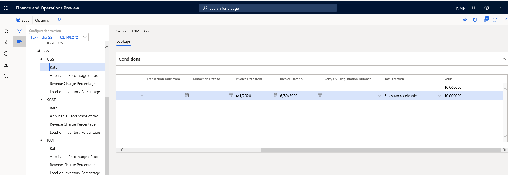

# What's new or changed for India GST in 10.0.0 (April 2019)

[!include [banner](../../includes/banner.md)]

This article includes a summary of the new features and critical bug fixes released in Dynamics 365 Finance version 10.0.0 for India GST localization.

## New configuration 
The following configurations are available from the Shared Asset Library in Lifecycle Services (LCS) for use in version 10.0.0:

- Taxable Document version.81.xml
- Taxable Document (India) version.81.138.xml
- Tax (India GST) version.81.138.246.xml 
 
You can differentiate customer GST registration numbers from vendor GST registration numbers in tax setup.

You can determine the tax rate based on invoice date for the purchase transactions, such as a purchase invoice.

You can create a non-GST transaction, which will be reflected in the Goods and Services Tax return (GSTR).

## Import/export tax setup

You can import and export tax setup for **Rate**, **Reverse charge percentage**, and **Load on inventory percentage**. 

## GTE designer enhancement

You can multi-select lookup columns and search available columns.

## Critical fixes 

- Extended configurations can't be synchronized if you change the data model in your extended tax document.
- Exclude the transactions without GST from GSTR. If there is no GST applicable for the transaction, it will not be in the GSTR,
  unless  it's exempt or non-GST.
- Block the posting with GST if there isn't a GST transaction ID. 

## Upcoming fixes in 10.0.1

- Total item discount amount is not showing in GSTR.
- Item unit of measurement should show the unit and a description.
- Total transaction value in GSTR is not equal to the invoice amount for a transaction with the price including tax.
- No customer billing name for stock transfer in GSTR.
-	No default logic for original GST transaction ID for a credit note.
 

[!INCLUDE[footer-include](../../../includes/footer-banner.md)]
