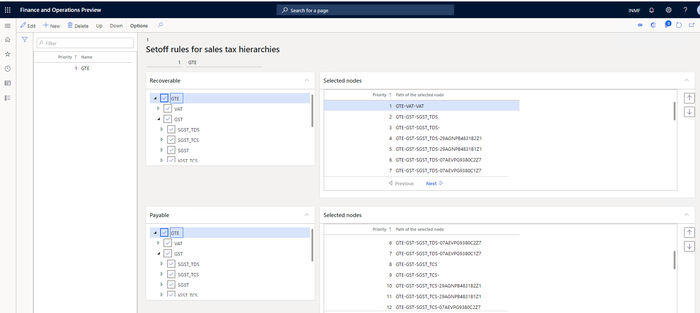

# What's new or changed for India GST in 10.0.11 (July 2020)

[!include [banner](../../includes/banner.md)]

This article includes a summary of the new features and critical bug fixes released in Dynamics 365 Finance version 10.0.11 for India GST localization. 

## New features

### GST Tax settlement as per new settlement rules (vide Circular No. 98/17)

Based on the amended GST law, the following sequence is required to be maintained.

| IGST liability | CGST liability | SGST liability  |
|----------------|----------------|-----------------|
| IGST credit    | IGST credit    | IGST credit     |
| CGST credit    | CGST credit    | SGST credit     |
| SGST credit    |                |                 |

To set up the new settlement rule, go to **Tax** > **Setup** > **Sales tax hierarchies** > **View** > **Setoff rules for sales tax hierarchies**.  

A new tax settlement change has been incorporated in the tax settlement hierarchy. You can define the tax set off hierarchy for a tax component with any  tax settlement priority. Previously, each tax component recoverable amount was settled against the tax payable amount of its own tax component and then with other tax components. Going forward, you can define the set off priority of a tax component with any other tax component. For example, et up a settlement priority of the input tax credit for CGST against IGST first, and then with CGST. Similarly, SGST can be set off against IGST first, and then SGST.

## Data entity for stock transfer order transaction 
The stock transfer transaction upload is provided through the data entity so that large-size stock transfer orders can use data management to upload stock transfer transactions.  

## Critical fixes 

- The **TDS adjustment journal** for adjusting the TDS amount on an already posted transaction is not working correctly
  and instead, results in an error. This occurs when the adjustment amount is transferred from the **Tax journal** to
  the **General journal** for posting.  
-	When you create charge codes with a credit type of Ledger Account, you must also define a SAC code for the charge.
  The charge will be credited to the defined ledger account and will not be included in the vendor balance after 
  the purchase order is posted. With this posting, you are not allowed to define the SAC/HSN code in the charge code.  
-	On the **Account structure** page, if blank values are not allowed for the financial dimension, then when the invoice
  with a tax withholding payment is posted, the defined financial dimension must have a value for the TDS Authority
  vendor and invoice transaction. 
-	If a sales order is created from a sales agreement, the tax information in the sales order should populate from
  the legal entity instead of the warehouse. If the state of origin is different from the state of the legal entity,
  the system calculates IGST instead of CGST, SGST, and vice versa. 
-	When you post the free text invoice with a GST tax amount, the system should round the amount for the Trade debtors account 
  and the Main ledger trade receivable account to the Reconciliation main ledger with sub-ledger. 
-	The **Customer balance and total** button on the **Free text invoice credit note** is updated with wrong value. 
  However, the voucher is posted correctly.  
-	When a withholding tax authority payment is processed, by default all the related withholding tax settlement transactions
  should be marked as ready for settlement. If there is a separate journal transaction posting in progress,
  all of the withholding tax settlement transactions will be closed even though the withholding tax authority payment 
  has not been made. 
-	Vendor invoices that were created by customers using the **Vendor invoice journal** will have GST paid for the invoices 
  on a reverse charge basis.
  If you want to generate a self-invoice, you cannot reverse the charge tax invoice with a GST reference ID.  
-	When posting a vendor invoice journal that includes tax, the section code is not appearing in the **TDS inquiry transaction** page.
  Similarly Project Sales Order, Section code, and Invoice number are not appearing in TDS inquiry transaction form. 
-	Tax information adjustment is not working on project timesheet transactions.   
-	A sales return order with an SEZ customer is not showing the option **With tax payment** even though it was selected in the 
  original sales order. 
-	An error message occurs when posting an invoice journal with multiple lines, applied TDS, and an exchange rate that was 
  updated after lines were created in the invoice journal. The system is not picking up the latest defined exchange rate 
  for the entire transaction. 

## Upcoming fixes in 10.0.12 

- Tax information fields are not updated automatically when a user copies lines from an original free text invoice. 
-	In the TDS statement and voucher reversal, a tax payment error occurs when a **Vendor invoice journal** with TDS is posted.  
- When an invoice journal is posted with TDS and a user reverses a transaction line on the **Vendor transaction** page and adjusts
  withholding tax through the **General journal**, the withholding tax payment results in an error. 
-	When the transaction date on an invoice journal with multiple lines is modified, only the first line in the tax document
  is updated with the new date when all of the lines must be updated. 
-	A voucher balancing error occurs when the **General journal** is posted with a Project/Vendor combination that 
  specifies an inventory load and reverse charge percentage for the selected HSN/SAC code. 
-	Removed and inactive addresses are appearing under **Location** on the **Tax information** page for invoices that
  are generated  from the **Invoice journal** and **Free text invoice**. 
-	An issue occurs when posting the **Withholding tax adjustment journal** and the TDS main account is marked
  as **Do not allow manual entry**.  
-	The tax group **Withholding tax**, can't be modified during invoice processing in the India Legal Entity when posting transactions using the **Pending invoice** page.
- It is possible to delete the source details in the GST number sequence group even when the details are attached to a transaction.   
-	Charges are not automatically updated in the **Assessable value** field on the sales order line when charges are applied using the **Auto charges** functionality. If the **Assessable value** check box is marked when setting up auto charge,
  charges are not automatically updating on the sales order line to include charge amount in the assessable value of goods.  
-	Importing the **General journal** lines with tax using the data import/export feature seems successful, but when verifying
  the tax document there is no tax information for the imported **General journal** transactions.

[!INCLUDE[footer-include](../../../includes/footer-banner.md)]
