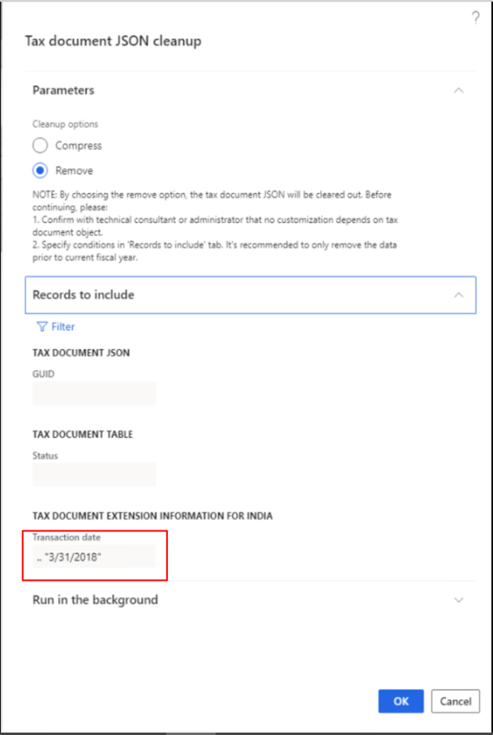

# Clean up the TaxDocumentJSON table

[!include [banner](../../includes/banner.md)]

## Supported versions

- Version 10.0.13 and later support compressing old data from versions that are earlier than 10.0.9.
- Version 10.0.14 and later support removing data.

## Purpose

As the system runs, more and more data is produced, and the database size continues to increase. To free up space in the database, you can clean up old data. During cleanup, if you observe that the TaxDocumentJSON table is using too much space, you can follow the steps in this article to clean it up.

## Before you begin

Before you begin the cleanup, complete the following tasks:

- Contact the customer's technical consultant or administrator, and confirm that no customization depends on the tax document object of the posted transaction.
- Ask the customer to work with its business department to determine a date that all transactions have been closed before.
- Export and back up the data of the TaxDocumentJSON table.

## Clean up the database

1. By default, the **Cleanup** options wouldn't be available because it's a one-time task to compress old data from versions that are earlier than 10.0.9. If you want to use the **Remove** option, contact Microsoft to enable, **TaxRemoveDependenciesOnTaxDocumentJSONFlighting**.
2. Go to **Tax** > **Periodic tasks** > **Tax document JSON cleanup**. 
3. Select the **Remove** option.

    > [!NOTE]
    > The **Compress** option is used to compress the tax document JavaScript Object Notation (JSON) from versions that are earlier than 10.0.9. This compression is a one-time optimization.

    The following note appears. Be sure to verify that the customer understands the impact of the change.

    > NOTE: By choosing the remove option, the tax document JSON will be cleared out. Before continuing, please:  
    > 1\. Confirm with technical consultant or administrator that no customization depends on tax document object.  
    > 2\. Specify conditions in 'Records to include' tab. It's recommended to only remove the data prior to current fiscal year.

4. On the **Records to include** FastTab, specify the conditions that you confirmed with the customer's business department. For example, you've agreed to remove the tax document JSON before March 31, 2018. In this case, in the **Tax document extension information for India** section, in the **Transaction date** field, specify **.."31/3/2018"**. For more details about the query filter, see [Advanced filtering and query syntax](../../../fin-ops-core/fin-ops/get-started/advanced-filtering-query-options.md).

    

5. Select **OK** to start the cleanup.

[!INCLUDE[footer-include](../../../includes/footer-banner.md)]
