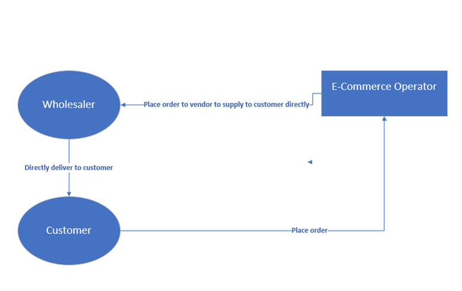

# GST TCS on payment of goods and services

[!include [banner](../../includes/banner.md)]

This article provides information about how to deduct Goods and Services Tax (GST) Tax Collected at Source (TCS) on payments of goods and services in Microsoft Dynamics 365.

Under the GST law, e-commerce aggregators are responsible for deducting and depositing tax at a rate of 1 percent from every transaction. Any dealers or traders that sell goods and services online receive the payment after a deduction of 1-percent tax. The deductor must deposit the deducted tax by the tenth day of the next month.

All dealers and traders that sell goods and services online must be registered under the GST law, even if their turnover is less than the prescribed limit for claiming the tax that is deducted by e-commerce operators.

## Value that GST TCS must be deducted on
For the deduction of TCS, the net value of taxable supplies from another supplier is considered when the tax that must be collected is calculated. If the invoice value includes GST, the tax amount can be excluded.

### Example
Contoso is located in India and sells ready-made clothes online in an e-commerce store. It receives an order for 10,000 rupees (Rs. 10,000), which includes tax in the amount of Rs. 1,525 and a commission in the amount of Rs. 200. Because the e-commerce store charges a commission of Rs. 200, it must deduct 1-percent tax (TCS) on the amount, excluding the money that was paid as tax (Rs. 1,525) and commission (Rs. 200). In other words, the e-commerce store must deduct 1-percent GST TCS on Rs. 8,475 (= 10,000 – 1,525), or Rs. 84.75. Therefore, the e-commerce operator makes a payment of Rs. 8,190.25 to the vendor (= 10,000 – 1525 – 200 – 84.75).
For the e-commerce business-to-business (B2B) scenario, there are two business models:

  -	E-commerce operators buy items from the supplier.
  -	E-commerce operators just provide service as a marketplace.
  
## E-commerce operators buy items from the supplier
In this business model, e-commerce operators buy items from the supplier and vendors. They use their warehouse to store and sell their inventory of items.

### Example

- E-commerce operators is involved in supplying goods.

   - Goods are supplied at a price of Rs. 600 (intrastate).
   - The rate of Central GST (CGST) is 5 percent.
   - The rate of State GST (SGST) is 5 percent.
   - 
- The rate of TCS is as follows:

    - 1% CGST
    - 1% SGST

- The commission on sales is Rs. 100.
- Goods are purchased from suppliers at a price of Rs. 550.

**In the books of the e-commerce operator**

The e-commerce operator posts a receipt of payment from the customer.

| Description | Dr.  | Cr.  |
|-------------|------|------|
|  Bank       | 660  |      |
|  Customer   |      | 660  |

The e-commerce operator places a purchase order with the vendor and receives the goods in the warehouse.

| Description | Dr.  | Cr.  |
|-------------|------|------|
|  Purchase   | 550  |      |
|  GST recoverable   |  55  |      |
|  Vendor     |      | 605  |

Here is the entry for the dispatch of goods and issuance of the sales invoice.

| Description | Dr.  | Cr.  |
|-------------|------|------|
|  Customer   | 660  |      |
|  Sales      |      |  600 |
|  GST payable  |    |  60  |

Here is the entry for the vendor payment.

| Description | Dr.  | Cr.  |
|-------------|------|------|
|  Vendor     | 605  |      |
|  Bank       |      | 665  |

Here is the entry for the GST TCS deduction.

| Description | Dr.  | Cr.  |
|-------------|------|------|
|  Bank       | 5.50  |      |
|  GST TCS (CGST)      |      |  2.75 |
|  GST TCS (SGST)  |    |  2.75  |

**In the books of the supplier**

Sales are made.

| Description | Dr.  | Cr.  |
|-------------|------|------|
|  Customer   | 660  |      |
|  CGST payable      |      |  30 |
|  SGST payable  |    |  30  |
|  Sales      |      | 600  |

The e-commerce operator is debited for the liability to pay the amount that is collected.

| Description | Dr.  | Cr.  |
|-------------|------|------|
|  E-commerce operator     | 660  |      |
|  Customer      |      | 660  |

The amount is received from the e-commerce operator.

| Description | Dr.  | Cr.  |
|-------------|------|------|
|  Bank       | 554  |      |
|  Commission        | 100 |   |
|  GST TCS (CGST)    |  3  |    |
|  GST TCS (SGST)    |  3  |    |
|  E-commerce operator  |   |  660  |

## E-commerce operators just provide service as a marketplace
In this business model, e-commerce operators provide the e-commerce store as a marketplace, but they don't participate in any purchases from vendors or sales to customers.

**In the books of the supplier when goods are sent to the actual customer who buys them**

| Description | Dr.  | Cr.  |
|-------------|------|------|
|  Customer (registered or unregistered)   | 660  |      |
|  CGST payable      |      |  30 |
|  SGST payable  |    |  30  |
|  Sales      |      | 600  |

The general journal is posted to accrue the amount that is due from the e-commerce operator.

| Description | Dr.  | Cr.  |
|-------------|------|------|
|  E-commerce operator | 660  |      |
|  Customer   |      | 660  |

> [!NOTE]
> Another way to handle this scenario is to select an invoice account for the e-commerce operator on the sales order and a customer account for the actual customer.

When payment is received from the e-commerce operator, the e-commerce operator pays the balance amount after deducting TCS.

| Description | Dr.  | Cr.  |
|-------------|------|------|
| Bank        | 560  |      |
| Commission  | 100  |      |
| E-commerce operator |    | 660  |

The GST TCS is posted.

| Description | Dr.  | Cr.  |
|-------------|------|------|
|  GST TCS receivable | 6  |    |
|  Bank   |      | 6  |

**In the books of the e-commerce operator when advance payment is from customer**

The order from the customer is booked. and the order reference number is generated.

| Description | Dr.  | Cr.  |
|-------------|------|------|
|  Bank       | 660  |      |
|  Customer   |      | 660  |

The product is delivered to the customer, and confirmation that the e-commerce operator must post the journal is received.

| Description | Dr.  | Cr.  |
|-------------|------|------|
|  Customer   | 660  |      |
|  Supplier   |      | 660  |

In the transaction, the merchant ID and GST Identification Number (GSTIN) of the supplier, and the order booking reference number, are selected.

Here is the entry for the payment to the vendor, including the bank commission.

| Description | Dr.  | Cr.  |
|-------------|------|------|
| Vendor      |  660 |      |
| Bank        |      | 560  |
| Commission  |      | 100  |

Here is the entry for the GST TCS deduction at the time of payment.

| Description | Dr.  | Cr.  |
|-------------|------|------|
| Bank        |  6   |      |
| GST TCS (CGST) |      |  3   |
| GST TCS (SGST) |      |  3   |

**In the books of the e-commerce operator when the TCS is deposited to the vendor's GST number**

| Description | Dr.  | Cr.  |
|-------------|------|------|
| GST TCS (CGST) |  3   |      |
| GST TCS (SGST) |  3   |      |
| Cash ledger    |      |  6   |

The e-commerce operator will show the preceding details in the GSTR-8.

## Set up GST TCS

GST-TCS on vendor payment by an e-commerce operator must be accounted for under the GST-TCS payable account.  GST-TCS on receipt of payment from an e-commerce customer must be accounted for under the GST-TCS recoverable account. Select the respective ledger account under Tax setup as explained in the following steps.   

1.	Go to **Tax** > **Tax configuration** > **Setup** > **GST** > **GST TCS Tax component** and set up posting accounts.

    

2. The e-commerce operator must identify vendors for GST TCS. Go to **Accounts payable** > **Vendor**, select a vendor, and then, on the **Tax information** FastTab, set the **Apply GST TCS** option to **Yes**. Repeat this step for every vendor that GST TCS must be deducted for.

    

3. Record the GST TCS on customer payment transactions. If the supplier must record GST TCS that the e-commerce operator deducted, when payment is received from the e-commerce operator, go to **Accounts receivable** > **Payment** > **Customer payment journal**, and then, in the **GST** group, set **Apply GST TCS** to **Yes**.

    

## GST TCS on a payment that is received from an e-commerce operator 

### Create and post a customer payment journal

1. Go to **Accounts receivable** > **Customer payment journal**.
2. Select **New**, and set the following values:

    - Account type: Customer
    - Account: NMF-CU000001
    - Credit: 67416.00
    - Offset account type: Bank
    - Offset account: Bank-IND OPER

    

3. Select **Tax information**.
4. Notice that the GST TCS is calculated based on the defined percentage (10.0).
 
    

5. In the customer payment, on the **General** tab, notice that GST that was calculated on the invoice amount is excluded from the GST TCS calculation.

    

  The following illustration shows the posted journal voucher.
  
   
    

The GST TCS on payment that the e-commerce operator makes to the vendor is posted to the GST-TCS payable account. Similarly, the GST TCS is deducted from the customer's payment.
Ensure that the active configuration has the correct formula and posting conditions by following these steps.
 
1. Change the formula part.

    

2. The current configuration contains posting conditions for GST-TCS that the **Price include sales tax** check box must be marked in the customer/vendor payment journal. While. in the payment journal, there is no segregation of payment amounts such as base amount, GST amount, and GST-TCS amount. Because of this, you should remove the price-inclusive condition from the vendor payment and the customer payment under the configuration.

    [Tax document page, Posting tab, vendor and customer payment configurations and the price-inclusive condition.](../media/gst-tcs-payment-11.png)

[!INCLUDE[footer-include](../../../includes/footer-banner.md)]
