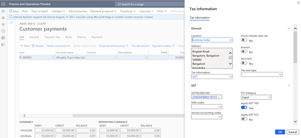

# GST TDS on payment of goods and services

[!include [banner](../../includes/banner.md)]

Goods and Services Tax (GST) Tax Deducted at Source (TDS) is deducted on specific percentages of the amount that is paid or payable by the buyer of goods and services. The buyer, a government company, enters into a contract with a supplier to buy goods and/or services where the total value of the taxable supply that is under contract, excluding GST, exceeds 2,50,000 Indian rupees (INR 2,50,000). The buyer can deduct GST TDS from the payment that is made or credited to the supplier of taxable goods and/or services.

However, in the GSTR-7 return, where all the information is related to the payment that is made to the deductee, the GST TDS feature is provided on a payment basis. If any user wants to deduct GST TDS on an invoice too, the configuration must be extended accordingly.

## When TDS deduction isn't required
Per the provision of section 51 (1) of the Central GST (CGST) act, tax deduction isn't required when the location of the supplier and the place of supply differ from the state of registration of the recipient.
The following table shows the location of the supplier and the supplies, the registration stage of the recipient and, based on the combination of locations. whether GST-TDS is applicable.

| Serial   number | Location of supplier | Place of supply | State of registration of the   recipient | Type of supply | TDS under GST | Type of GST |
|-----------------|----------------------|-----------------|------------------------------------------|----------------|---------------|-------------|
| 1               | Delhi                | Delhi           | Delhi                                    | Intrastate     | Yes           | CGST+SGST   |
| 2               | Delhi                | Haryana         | Delhi                                    | Interstate     | Yes           | CGST+SGST   |
| 3               | Delhi                | Delhi           | Haryana                                  | Interstate     | No            | IGST        |
| 4               | Delhi                | Karnataka       | Haryana                                  | Interstate     | No            | IGST        |

## Base amount for GST TDS deduction
For the purpose of TDS deduction, the value of the supply must be taken as the amount, excluding tax (GST), that is indicated on the invoice. Therefore, TDS must not be deducted on the CGST, State GST (SGST), or Integrated GST (IGST) component of the invoice.

For example, a supplier (vendor) that is named Fabrikam makes a supply that is worth INR 1,000 available to a buyer that is named Contoso. The rate of GST is 20 percent. When Contoso pays Fabrikam, it will pay INR 1,000 (the value of the supply) + INR 100 (CGST) + 100 (SGST). At that time, Contoso will deduct INR 100 (INR 1,000 × 10 percent) as CGST TDS and INR 100 as SGST TDS.

Here is the accounting entry for GST TDS when the buyer (Contoso) pays the vendor (Fabrikam).

| Description                            | Dr.   | Cr.   |
|----------------------------------------|-------|-------|
| Vendor                                 | 1,000 | -     |
| CGST   Input                           | 100   | -     |
| SGST   Input                           | 100   | -     |
| GST TDS   (CGST) Payable (1,000 ×10%)  | -     | 100   |
| GST TDS   (SGST) Payable (1,000 × 10%) | -     | 100   |
| Bank                                   | -     | 1,000 |

## Key features
The following key features are available for GST TDS on payments:

  - The total value of taxable supply under a contract, excluding GST, exceeds INR 2,50,000.
  - The liability to deduct TDS arises when the payment is made to the supplier or credited to the account of the supplier. The provision doesn't specify that the TDS must previously be deducted from the payment that is made or credited to the account of the supplier.
  - The GSTR-7 return indicates the preferred deduction at the time of payment.
  - The deduction of tax isn't required when the location of the supplier and the place of supply differ from the state of registration of the recipient.
  - Advance payments are also eligible for deduction.
  - GST TDS is applicable to intrastate and interstate supply.
  - In their electronic cash ledger, deductee can claim a credit for the tax that is deducted and use it to pay other taxes.

## Set up GST TDS
Follow these steps to set up GST TDS.

1. Go to **Tax** > **Tax configuration** > **Setup** > **GST** > **GST TDS Tax component**, and set up the posting accounts.

    
  
2. Go to **Accounts payable** > **Vendors** and open the vendor record that you're updating.
3. Verify each contract individually. For each contract where the value exceeds INR 2,50,000, you must identify a vendor for deduction of GST TDS. On the **Tax information** FastTab, set the **Apply GST TDS** option to **Yes**. You can update this setting at any time.

    

4.	To record the GST TDS deduction that was made by the customer, go to **Accounts receivable** > **Customers**, and mark the customer as **Govt Company**.
 
    
 
5.	When you're ready to post the journal, go to **Accounts receivable** > **Payment** > **Customer payment journal**, and select the appropriate journal.
6.	In the **Tax information** dialog box, set the **Apply GST TDS** option to **Yesv.

    
 
## Scenario: GST TDS on payment to a vendor transaction

1.	Go to **Accounts payable** > **Vendor payment journal**, and select **New**.
2.	In the **Account type** field, select **Vendor**, and then, in the **Account** field, select **INMF-000001**.
3.	In the **Credit** field, enter **1200.00**.
4.	In the **Offset account type** field, select **Bank**, and then, in the **Offset account** field, select **Bank-IND OPER**.
5.	Select **Tax Information**.
 
    

    Notice that GST TDS is calculated based on the defined percentage (10.0).
    
    
 
    Additionally, notice that the GST that is calculated on the invoice amount is excluded from the GST TDS calculation.
    
    
 
    When the journal voucher is posted, it's shown on the Voucher transactions page.
    
    
 
    The GST TDS on payments from customers is posted in a similar manner when it’s posted to the GST TDS recoverable account.
    

[!INCLUDE[footer-include](../../../includes/footer-banner.md)]
