# Post TDS/TCS on non-filers at a higher rate of tax

[!include [banner](../../includes/banner.md)]

This article explains how to post Tax Deducted at Source (TDS)/Tax Collected at Source (TCS) on non-filers at a higher rate of tax in Microsoft Dynamics 365.
Section 206AB of the Income Tax Act was recently introduced vide the Finance Act, 2021. It applies to any sum or income, or the amount paid, payable, or credited by one person (referred to as the deductee) to a "specified person." A "specified person" is someone who hasn't filed income tax returns for the two assessment years that are relevant to the two previous years that immediately precede the previous year in which tax must be either deducted or collected.
The following conditions which must also be verified:

   - The time limit for filing tax returns under subsection (1) of section 139 of the Act has expired for both assessment years.
   - The aggregate of TDS and TCS in this case is 50,000 Indian rupees (Rs. 50,000) or more in each of the two previous years.
   - The specified person isn't a non-resident who doesn't have a permanent establishment in India.

Additionally, section 206AB doesn't apply in cases where the tax must be deducted under section 192, 192A, 194B, 194BB, 194LBC, or 194N of the Act.

## Check income tax return filings to determine the applicability of section 206AB

The government is expected to provide a new utility for its income tax software, so that a deductor or collector can get the details of their income tax return filings when they enter the permanent account number (PAN) of the buyer or seller.
However, the assessee should keep a copy of the supplier's income tax returns for the previous two financial years as confirmation, to ensure that TDS or TCS is correctly deducted or collected at the applicable rate.
This provision might be an additional burden on the taxpayer. However, it's an additional step that the government has taken to catch people who don't file their income tax returns even when their tax has been deducted or collected and is shown in 26AS.
Given the preceding provisions, if you fall under the purview of section 194Q (if you're a buyer of goods) or section 206(1H) (if you're a seller of goods), as of July 1, 2021, you must determine whether the counterparty has filed its income tax returns for the previous two financial years. (Because the applicability is from July 1, 2021, the previous two financial years are 2019–202020 and 2020–2021.) You must also determine whether the aggregate of TDS/TCS is Rs. 50,000 or more in each of the previous two financial years. If it is, the TDS/TCS will be charged at a higher rate under section 206AB (unless section 192, 192A, 194B, 194BB, 194LBC or 194N of the Act applies).

## Applicability of sections 206AA and 206CCA

Section 206AB was inserted after the previously existing section 206AA of the Act. Another new section, 206CCA, was inserted after the previously existing section 206CC. The existing sections provide for a higher rate of TDS/TCS when no PAN is provided.

**Section 206AA**: This section is applicable when the specified person fails to provide PAN information.
**Section 206AB**: This section is applicable when the specified person fails to file income tax returns for the last two years.

Under each section, the person who is responsible for either deducting or collecting the tax is required to apply the tax rate as described in the following table.

| Section   206AA: Failure to submit PAN information                                                                                                                                                                 | Section 206AB: Failure to file   returns for the last two years                                                                                                                                                                          |
|--------------------------------------------------------------------------------------------------------------------------------------------------------------------------------------------------------------------|------------------------------------------------------------------------------------------------------------------------------------------------------------------------------------------------------------------------------------------|
| Tax   must be deducted at the highest of the following rates:  - The rate   that is specified in the relevant provision of the Act.   - The rate or rates that are in   effect.  - A rate of 20 percent.  | Tax must be deducted at the   highest of the following rates:  - Two times the rate that is   specified in the relevant provision fo the Act.   - Two times the   rate or rates that are in effect. >br>- A rate of five percent.  |

**Section 206CC**: This section is applicable when the specified person fails to provide PAN information.
**Section 206 CCA**: This section is applicable when the specified person fails to file income tax returns for the last two years.

Under each section, the person responsible for collecting the tax is required to apply the tax rate as described in the following table.

| Section   206CC: Failure to submit PAN information                                                                                                                                | Section 206CCA: Failure to file   returns for the last two years                                                                                                                  |
|-----------------------------------------------------------------------------------------------------------------------------------------------------------------------------------|-----------------------------------------------------------------------------------------------------------------------------------------------------------------------------------|
| Tax   must be collected at the higher of the following rates:  - Two times   the rate that is specified in the relevant provision of the Act.  -   A rate of five percent.  | Tax must be collected at the   higher of the following rates:   Two times the rate that is   specified in the relevant provision of the Act.   - A rate of five   percent.  |

Furthermore, subsection (2) of section 206AB provides for cases where both sections 206AA and 206AB are applicable (that is, the specified person hasn't provided PAN information and also hasn't filed income tax returns for the last two years). In these cases, the tax must be deducted at the higher rate between both sections. In other words, TDS must be deducted at the higher of the rate under section 206AA and the rate under section 206AB.

The following illustration summarizes the tax rates under sections 206AA and/or 206AB.

 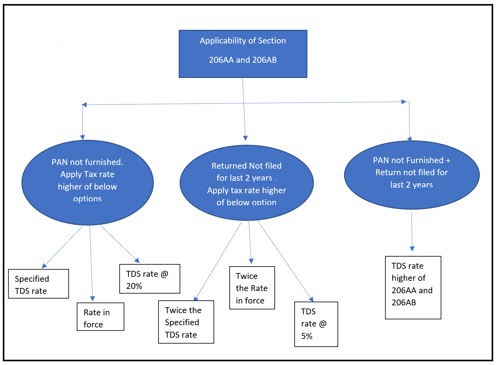

The following illustration summarizes the tax rates under sections 206CC and/or 206CCA.

 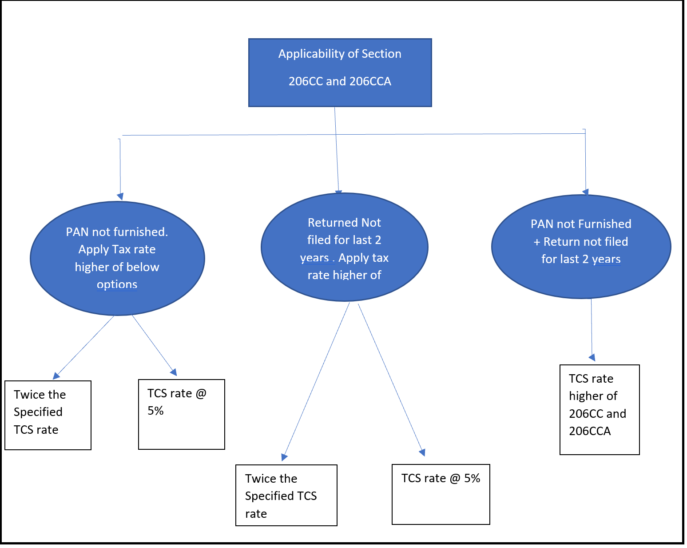

## Set up TDS /TCS at a higher rate for non-filers of returns

There are two ways to set up TDS/TCS at a higher rate for non-filers of income tax returns.

  -	Recommended approach: Define an additional threshold definition for a specific TDS/TCS type.
  -	Create an additional withholding tax code and withholding tax group for a specific TDS/TCS type.

Define a threshold definition for the Rent TDS type

1. Go to **Tax** > **Set up** > **Withholding tax** > **Threshold definitions**.
2. Select **New**.
3. In the **Name** field, enter **Rent**.
4. In the **Description** field, enter **Rent-194 I**.

   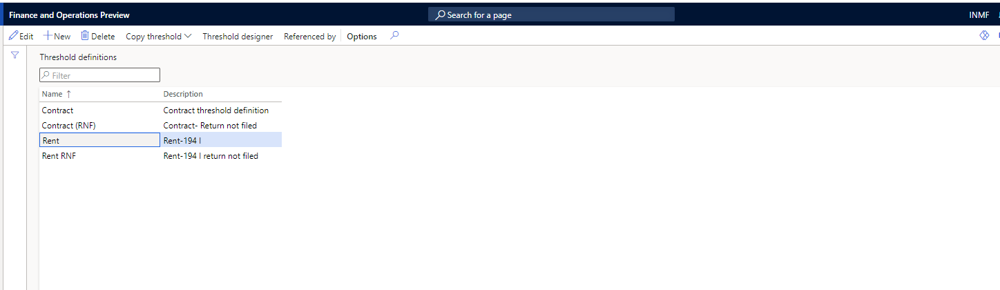
  
### Create an additional threshold definition for non-filing of returns

1.	Go to **Tax** > **Set up** > **Withholding tax** > **Threshold definitions**.
2.	Select **New**.
3.	In the **Name** field, enter **Rent RNF**.
4.	In the **Description** field, enter **Rent-194I return not filed**.
 
   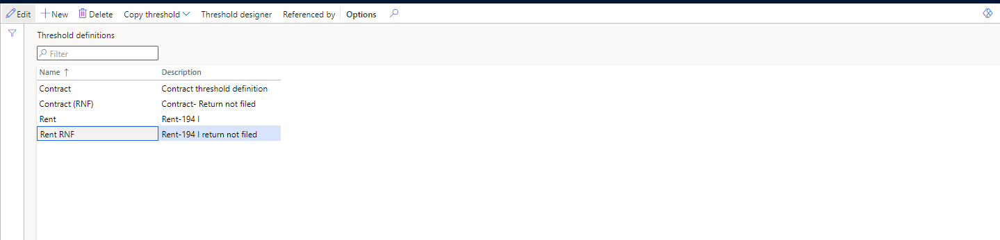
 
5.	Select **Threshold designer**.
6.	On the **Threshold designer** page, select **Rent**, and then select **New** to define the first slab.
7.	On the **General** FastTab, in the **Effective from** field, enter **4/1/2021** (April 1, 2021). In the **Effective to** field, enter **3/31/2022** (March 31, 2022).
8.	In the **Lower limit** field, enter **0.00**. In the **Upper limit** field, enter **240,000.00**.
9.	On the **Calculation** FastTab, in the **Type** field, select **Cumulative**.
10. Set the **Final level** option to **Yes**.

   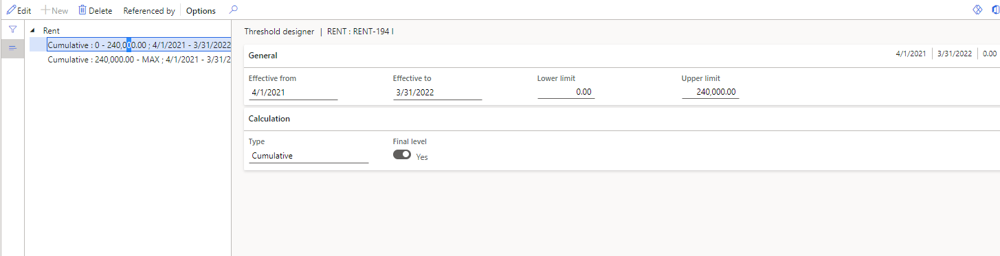
 
11. Select **New** again to define the second slab.
12. On the **General** FastTab, in the **Effective from** field, enter **4/1/2021**. In the **Effective to** field, enter **3/31/2022**.
13. In the **Lower limit** field, enter **240,000.00**. In the **Upper limit** field, enter **0.00**.
14. On the **Calculation** FastTab, in the **Type** field, select **Cumulative**.
15. Set the **Final level** option to **Yes**.
 
    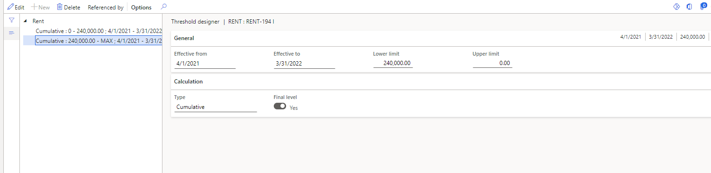
  
16.	Close the **Threshold designer** page.

### Define a threshold definition for non-filing of returns

1.	Go to **Tax** > **Set up** > **Withholding tax** > **Threshold definitions**.
2.	Select **Threshold designer**.
3.	On the **Threshold designer** page, select **Rent RNF**, and then select **New** to define the first slab.
4.	On the **General** FastTab, in the **Effective from** field, enter **4/1/2021**. In the **Effective to** field, enter **3/31/2022**.
5.	In the **Lower limit** field, enter **0.00**. In the **Upper limit** field, enter **240,000.00**.
6.	On the **Calculation** FastTab, in the **Type** field, select **Cumulative**.
7.	Set the **Final level** option to **Yes**.

      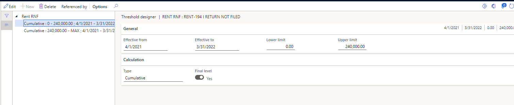
  
8.	Select **New** again to define the second slab.
9.	On the **General** FastTab, in the **Effective from** field, enter **4/1/2021**. In the **Effective to** field, enter **3/31/2022**.
10.	In the **Lower limit** field, enter **240,000.00**. In the **Upper limit** field, enter **0.00**.
11.	On the **Calculation** FastTab, in the **Type** field, select **Cumulative**.
12.	Set the **Final level** option to **Yes**.

       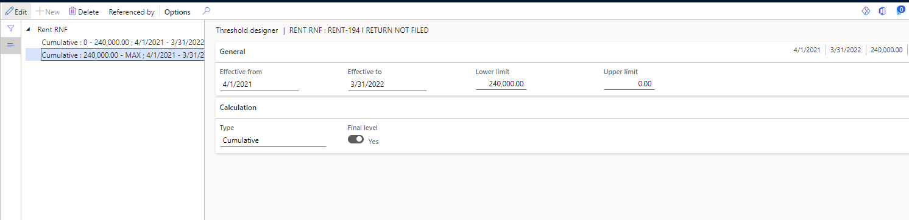
 
13.	Close the **Threshold designer** page.

### Create a withholding tax component group for rent

1.	Go to **Tax** > **Setup** > **Withholding tax component groups**.
2.	Select **New**.
3.	In the **Tax type** field, select **TDS**.
4.	In the **Withholding tax component group** field, select **Rent**.
5.	On the **General** FastTab, in the **Status** field, select **Resident**.
6.	In the **Section code** field, enter **94 I**.
7.	Close the page.

      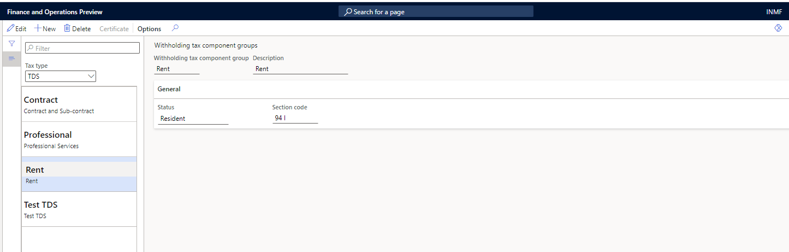

### Create a withholding tax component for rent

1.	Go to **Tax** > **Setup** > **Withholding tax component**.
2.	Select **New**.
3.	In the **Tax type** field, select **TDS**.
4.	In the **Withholding tax component** and **Description** fields, select **Rent**.

      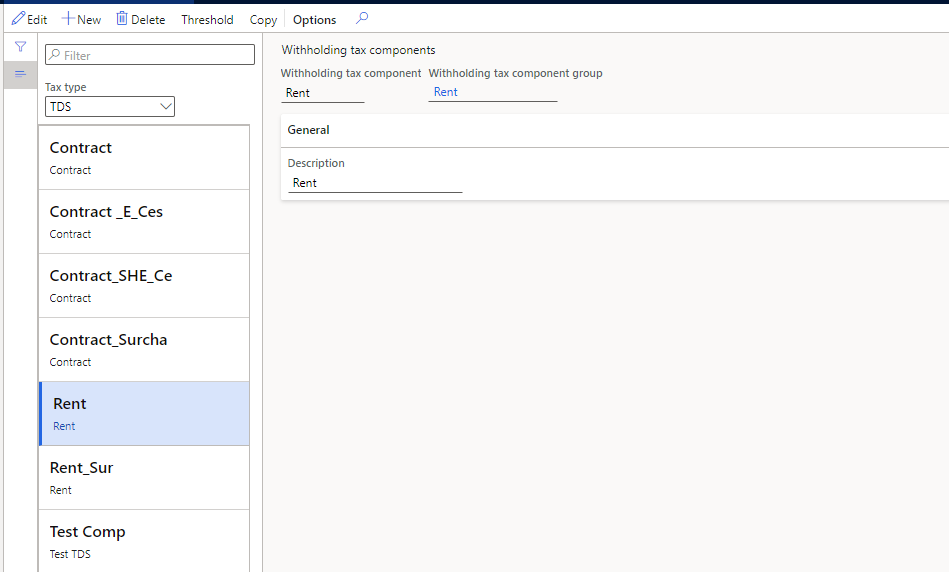
    
### Create a withholding tax code for rent

1.	Go to **Tax** > **Withholding tax codes**.
2.	Select **New**.
3.	In the **Withholding tax code** field, select **Rent 194 I**.
4.	In the **Withholding tax name** field, enter **Rent new law**.
5.	On the **General** FastTab, set the following values:

      - **Currency**: INR
      - **Main account**: 202122
      - **Settlement period**: TDS
      - **Tax type**: TDS
      - **Enable threshold hierarchy**: Yes
      - **Withholding tax component**: Rent

         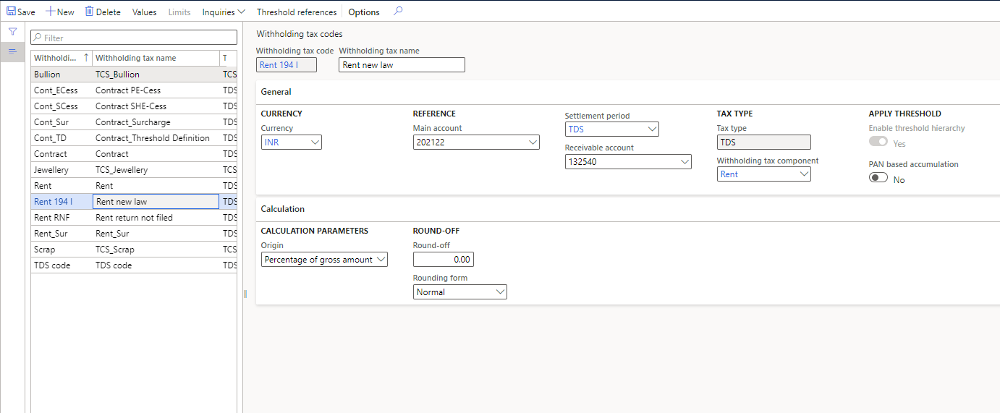
 
6.	Select **Threshold references**.
7.	On the **Threshold references** page, select **New**, and set the following values:

      - **Account type**: Vendor
      - **Account code**: Group
      - **Account or group**: 60
      - **Threshold**: Rent RNF

      > [!NOTE]
      > We recommend that you create a separate group for vendors that haven't filed income tax returns for the last two years. Then attach the group that you create to the appropriate vendor records.

8.	Select **New** again, and set the following values:

      - **Account type**: Vendor
      - **Account code**: All
      - **Threshold**: Rent

  You can leave the **Account or group** field blank for this threshold reference.
 
  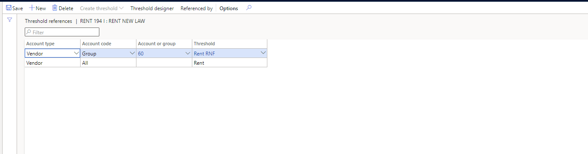
      
9.	Select **Threshold designer**.
10.	On the **Threshold designer** page, select the first cumulative line that has the **Rent RNF** threshold. Then, on the **Tax value** FastTab, select **New**, and set the following values:

      - **PAN status**: Not available
      - **Calculate previously nontaxed**: Yes
      - **Calculate tax**: Yes
      - **Include in turnover base**: Yes
      - **Value**: 0.00

11.	Select **New** again, and set the following values:
      
      - **PAN status**: Received
      - **Calculate previously nontaxed**: Yes
      - **Calculate tax**: Yes
      - **Include in turnover base**: Yes
      - **Value**: 0.00
 
12.	Select the second cumulative line. Then, on the **Tax value** FastTab, select **New**, and set the following values:

      - **PAN status**: Not available
      - **Calculate previously nontaxed**: Yes
      - **Calculate tax**: Yes
      - **Include in turnover base**: Yes
      - **Value**: 20.00
      
13.	Select **New** again, and set the following values:

      - **PAN status**: Received
      - **Calculate previously nontaxed**: Yes
      - **Calculate tax**: Yes
      - **Include in turnover base**: Yes
      - **Value**: 20.00
 
14.	Close the **Threshold designer** page.
15.	On the **Threshold references** page, select **New**, and set the following values:

      - **Account type**: Vendor
      - **Account code**: All
      - **Threshold**: Rent
      
         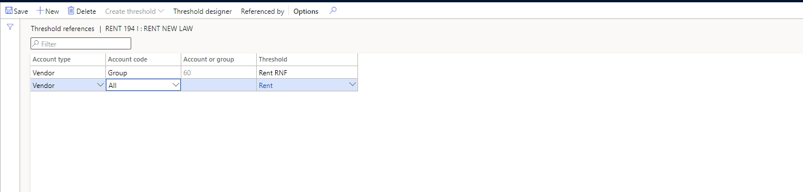
 
16.	Select **Threshold designer**.
17.	Select the first cumulative line. Then, on the **Tax value** FastTab, select **New**, and set the following values:

      - **PAN status**: Not available
      - **Calculate previously nontaxed**: Yes
      - **Calculate tax**: Yes
      - **Include in turnover base**: Yes
      - **Value**: 0.00
      
18.	Select **New** again, and set the following values:

      - **PAN status**: Received
      - **Calculate previously nontaxed**: Yes
      - **Calculate tax**: Yes
      - **Include in turnover base**: Yes
      - **Value**: 0.00
 
19.	Select the second cumulative line. Then, on the **Tax value** FastTab, select **New**, and set the following values:

      - **PAN status**: Not available
      - **Calculate previously nontaxed**: Yes
      - **Calculate tax**: Yes
      - **Include in turnover base**: Yes
      - **Value**: 20.00
      
20.	Select **New** again, and set the following values:

      - **PAN status**: Received
      - **Calculate previously nontaxed**: Yes
      - **Calculate tax**: Yes
      - **Include in turnover base**: Yes
      - **Value**: 10.00
 
21.	Close the **Threshold designer** page.
22.	Go to **Tax** > **Indirect taxes** > **Withholding tax** > **Withholding tax groups**.
23.	Select **New**, and set the following values:

      - **Withholding tax group**: Rent 194 I 
      - **Description**: Rent 194 I New law
      - **Tax type**: TDS

### Create the Rent 194 I withholding tax group

1.	Go to **Tax** > **Withholding tax** > **Withholding tax code**.
2.	Select **New**, and name the new withholding tax group **Rent 194 I**.
3.	On the **Setup** FastTab, select **Add**.
4.	In the **Withholding tax code** field, select **Rent 194 I**.

      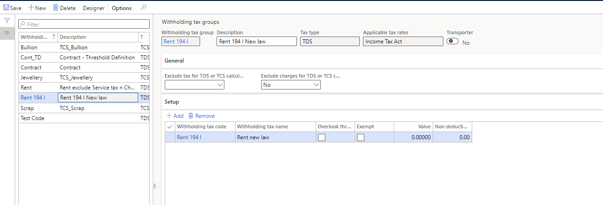
 
5.	Select **Designer**.
6.	On the **Designer** page, select **New**.
7.	In the **Tax code** field, select **Rent 194 I**.

      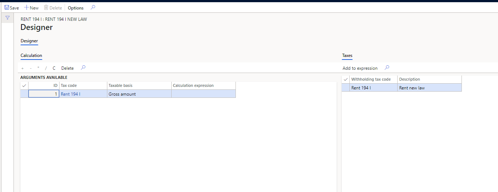
 
8.	Close the **Designer** page.

### Attach the withholding tax group to a vendor account

1.	Go to **Accounts payable** > **Vendors**.
2.	In the list, select vendor account **INMF-000005**.
3.	In the **Group** field, select **60**.
4.	On the **Invoice and delivery** FastTab, set the **Calculate withholding tax** option to **Yes**.
5.	In the **TDS group** field, select **Rent 194 I**.
 
    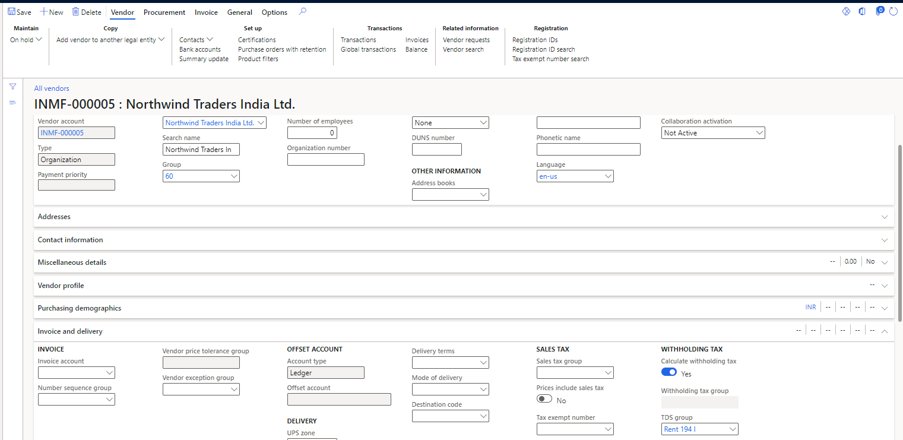

### Update the PAN information for a vendor

1.	Go to **Accounts payable** > **Vendors**.
2.	Open the record for the vendor that you're working with.
3.	On the **Vendor details** page, on the **Tax information** FastTab, in the **PAN information** section, in the **Status** field, select **Received**.
4.	In the **Number** field, enter **AUNPP6767E**.
5.	Close the page.

    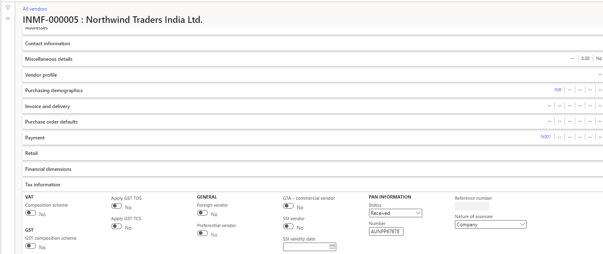
    
## Example scenarios

This section describes two scenarios and shows the steps that are involved, depending on whether a vendor has filed income tax returns for the last two years and provided PAN information.

  - **Scenario 1**: The vendor hasn't filed income tax returns for the last two years.

       - The normal tax rate for Rent (company) is 10 percent.
       - Under the new provision, the higher of the following rates should apply:

            - Two times the specified rate (for example, 20 percent)
            - A rate of 5 percent

   - **Scenario 2**: The vendor has filed income tax returns for the last two years.

### Scenario 1: The vendor hasn't filed returns for the last two years and hasn't provided PAN information

In this scenario, the vendor hasn't filed income tax returns for the last two years and also hasn't provided PAN information. Follow these steps to create and post the invoice journal for the vendor.

1.	Go to **Accounts payable** > **Invoices** > **Vendor invoice journal**.
2.	Select **New**.
3.	In the **Account type** field, select **Vendor**. Then, in the **Account** field, select **INMF-000005**.
4.	In the **Invoice** field, select **IN-8**.
5.	In the **Credit** field, enter **250,000.00**.
6.	In the **Offset account type** field, select **Ledger**. Then, in the **Offset account** field, select **600120**.
 
   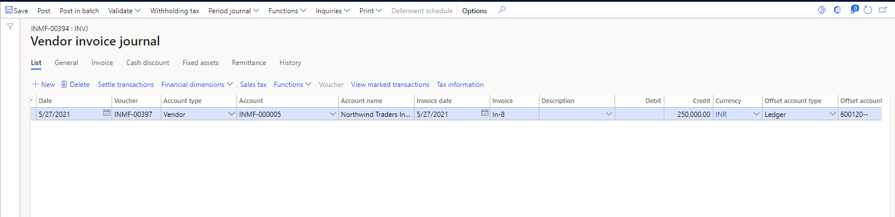
 
7.	Select **Withholding tax**.
8.	On the **Temporary withholding tax transactions** page, notice that the withholding tax is calculated at the defined rate of 20.0 percent for this vendor, because the vendor hasn't filed income tax returns for the last two years.

    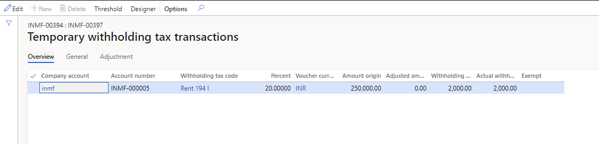
 
### Scenario 2: The vendor has filed returns for the last two years and provides PAN information

In this scenario, the vendor has filed income tax returns for the last two years and has also provided PAN information. Follow these steps to create and post the invoice journal for the vendor.

1.	Go to **Accounts payable** > **Invoices** > **Vendor invoice journal**.
2.	Select **New**.
3.	In the **Account type** field, select **Vendor**. Then, in the **Account** field, select **INMF-000001**.
4.	In the **Invoice** field, select **IN-06**.
5.	In the **Credit** field, enter **250000.00**.
6.	In the **Offset account type** field, select **Ledger**. Then, in the **Offset account** field, select **600150**.
 
    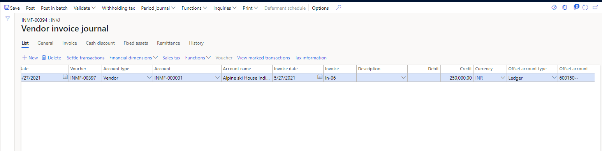
 
7.	Select **Withholding tax**.
8.	On the **Temporary withholding tax transactions** page, notice that the withholding tax is calculated at the defined rate of 10.0 percent.
 
    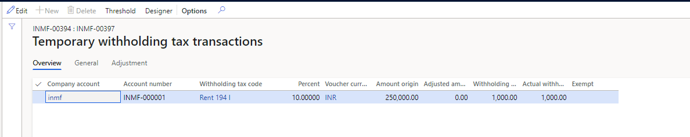
 

