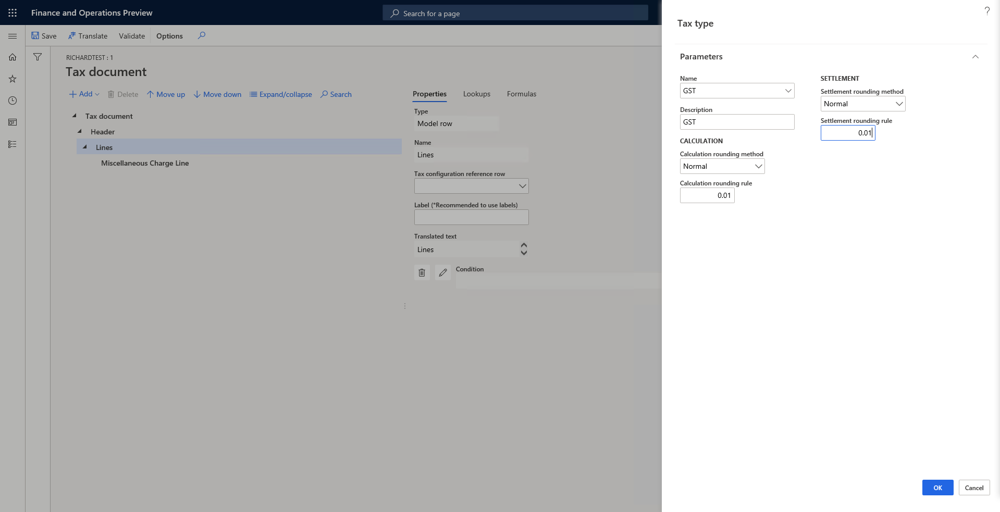

# Create tax components

[!include [banner](../../includes/banner.md)]

Tax components are like sub-tax types that a tax authority can levy in the same jurisdiction or a different jurisdiction. For example, in the US, sales tax is levied at various levels of jurisdiction, such as the state, county, or city level. Different tax components can be treated differently from an accounting, tax reporting, tax settlement, or other perspective. In India, Central Goods and Services Tax (CGST), State GST (SGST), and Integrated GST (IGST) are all types of GST.

> [!NOTE]
> The tax engine functionality is available only for legal entities that have their primary address in India.

For a quick overview of the tax engine, watch [Tax engine overview (YouTube video)](https://www.youtube.com/watch?v=jAFpEBOtNWI&feature=youtu.be).

## Create a tax type

A tax type is analogous to a tax regime. Sales tax, value-added tax (VAT), and GST are three typical tax types. Tax components should be created under a specific tax type.

To create a tax type, on the **Tax document** page, select **Lines**, select **Add** \> **Tax document** \> **Tax type**, specify the name, description, and rounding rule, and then select **OK**.

## Create a tax component

To create a tax component, select the tax type to create the tax component under, and then select **Add \> Tax document \> Tax component**.

> [!TIP]
> Try to use the predefined rules if they meet your requirements. In this case, the system will help create tax measures, formulas, and posting profiles.

The following sections provide information about some of the fields in the **Tax component** dialog box.

### Calculation origin

The **Calculation origin** field specifies the tax base amount. The following options are available:

- **Percent of net amount** – The tax base amount is the net amount of the document line. The net amount is calculated as *Price* × *Quantity*.
- **Percent of gross amount** – The tax base amount is the gross amount of the document line. The gross amount is calculated as *Price* × *Quantity* + *Other tax amount that the tax base amount depends on*. If you select this option, you must specify the other tax amount that the tax base amount depends on in the **Tax on tax component** field. For example, for import orders in India, IGST is calculated as *Net amount* + *Basic Custom Duty (BCD)* + *Social Welfare Surcharge (SWS)*. Therefore, you should select both **BCD** and **SWS**.
- **Percent of sales tax** – The tax base amount is the tax amount of another tax. In other words, the scenario is a tax-on-tax scenario. For example, in India, BCD is the tax base of SWS. If you select this option, you must specify the other tax amount that the tax base amount depends on in the **Tax on tax component** field.
- **Amount per unit** – The tax base amount is the quantity.

### Tax on tax component

The **Tax on tax component** field is available only when the **Calculation origin** field is set to **Percent of gross amount** or **Percent of sales tax**. It specifies the other tax amount that the tax base amount depends on.

### Tax included in price

For transactions where the price includes tax, the **Tax included in price** option controls whether the tax is included in the price.

### Reverse charge

If you set the **Reverse charge** option to **Yes**, the component supports reverse charge behavior. The user can then specify the conditions where reverse charge behavior applies, and tax will be calculated and posted accordingly.

### Non deductible

If you set the **Non deductible** option to **Yes**, the component supports non-deductible behavior. The user can then specify the conditions where non-deductible behavior applies, and tax will be calculated and posted accordingly.

After the tax component is created by using predefined rules, you should define the applicability rule for the tax component itself, the rate, reverse charge, and so on. For more information, see [Tax engine applicability](../../dev-itpro/tax-engine-applicability.md). You can always manually edit the tax measures, formulas, posting profiles, and so on.

[!INCLUDE[footer-include](../../../includes/footer-banner.md)]
