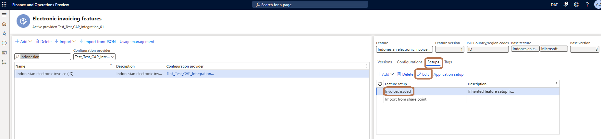

# Get started with Electronic invoicing for Indonesia

[!include [banner](../../includes/banner.md)]

This article provides information that will help you get started with Electronic invoicing for Indonesia. It describes the configuration steps that are country/region-dependent in Microsoft Dynamics 365 Finance. It guides through the steps that you must follow in Finance to export sales invoices through the service, and to review the processing results and the status of invoices.

## Prerequisites

- Become familiar with electronic invoicing as it's described in [Electronic invoicing overview](../global/gs-e-invoicing-service-overview.md).
- Do the common part of electronic invoicing service configuration as described in [Set up electronic invoicing](../global/gs-e-invoicing-set-up-overview.md).

## Configure Electronic invoicing features

1. In the **Globalization Studio** workspace, select the **Electronic invoicing** tile.
1. Import the latest version of the **Indonesian electronic invoice (ID)** Globalization feature as described in [Import features from the repository](../global/gs-e-invoicing-import-feature-global-repository.md).

   > [!NOTE]
   > If you don't see the feature in the list, select **Synchronize**, and then repeat step 2.
   
### Create a new version of the Indonesian electronic invoice (ID) feature

When you import the **Indonesian electronic invoice (ID)** feature from the repository, all the feature settings are imported. These settings include the configurations, actions of the processing pipeline, and applicability rules.
You can create a new feature version by using your configuration provider, if necessary.

1. Create a copy of the imported Globalization feature, and select your configuration provider for it. For more information, see [Create a Globalization feature](../global/gs-e-invoicing-create-new-globalization-feature.md).
1. On the **Versions** tab, verify that the **Draft** version is selected.

### Update the configurations versions

Review the format configurations that are required to generate and export sales invoices.

1. In the **Globalization features** workspace, select the **Electronic Invoicing** tile.
1. On the **Electronic invoicing features** page, on the **Configurations** tab, select **Add** or **Delete** to manage the configuration versions.

When you create a new version, all configurations are inherited from the imported version of the Electronic invoicing feature. The following configurations are required to process invoices:

- Invoices issued (ID)
- eInvoice import (ID)

In the list, select a configuration version, and then select **Edit** or **View** to open the **Format designer** page, where you can edit or view the configuration.

You can review the configuration and customize it as you require. Use the **Format designer** page to edit and view the Electronic reporting (ER) format file configurations. For more information, see [Create electronic document configurations](../../../fin-ops-core/dev-itpro/analytics/electronic-reporting-configuration.md).

### Configure the application-specific parameters

Before you begin, make sure that the **Invoices issued (ID)** ER format configuration is imported.

Follow these steps to begin the configuration.

1. In the **Globalization Studio** workspace, select the **Electronic reporting** tile, and then select the **Reporting configurations** tile.
1. On the **Configurations** page, select the **Invoices issued (ID)** format configuration.
1. On the **Configurations** menu, in the **Application specific parameters** section, selected **Setup**.

To enable the system to determine which sales tax code in Finance corresponds to the tax code for luxury goods (PPnBM) when invoices are exported, follow these steps to set the application-specific parameters for luxury sales tax.

1. In the **Lookups** grid, select the row for **TaxTypeLookup**.
2. In the **Conditions** grid, on the first line, set the **Lookup result** field to **PPnBM** and the **Sales tax code (TaxCode)** field to the sales tax code that's used for luxury tax in Finance.

    > [!NOTE]
    > You can set up several sales tax codes for PPnBM and have several lines for them in the **Conditions** grid.

3. On the last line, set the **Lookup result** field to **Other** and the **Sales tax code (TaxCode)** field to **\*Not blank\***. These settings specify that all other sales tax codes should not be considered as luxury tax by the system..

To enable the system to determine which sales tax group in Finance corresponds to VAT-free reasons (transaction code 07, reasons 1 through 8) or VAT-exempt reasons (transaction code 08, reasons 1 through 5) when invoices are exported, follow these steps to set the application-specific parameters for those reasons.

1. In the **Lookups** grid, select the row for **VATFreeInfoLookup**.
2. In the **Conditions** grid, on the first line, set the **Lookup result** field from **1** through **8** for transaction code **07** and from **1** through **5** for transaction code **08**.
3. Set the **Tax group (TaxGroup)** field to the sales group that's used for exemption operations in Finance.
4. On the last line, set the **Lookup result** field to **Other** and the **Tax group (TaxGroup)** field to **\*Not blank\***. These settings specify that all other sales tax groups should not be considered exemption groups by the system.

After you define specific conditions for each application-specific parameter, save your changes.

### Manage the Electronic invoicing feature setup

Review or configure the actions in the processing pipeline that support the sales invoice export and import scenarios.

1. In the **Globalization Studio** workspace, select the **Electronic Invoicing** tile.
1. On the **Electronic invoicing features** page, on the **Setups** tab, select **Add**, **Delete**, or **Edit** to manage the Electronic invoicing feature setup.

#### Configure the Sales invoice feature setup

To generate the comma-separated values (CSV) file for a sales invoice, you must set up the Sales invoice feature.

1. On the **Electronic invoicing features** page, on the **Setups** tab, in the **Feature setup** column, select the **Invoice issued** record.
1. Select **Edit** to review or configure the actions, applicability rules, and variables.

#### Configure the Vendor invoice feature setup

Before you configure the Vendor invoice feature setup, you should create a draft version of the feature that you'll work with for this procedure.

1. On the **Electronic invoicing features** page, on the **Setups** tab, in the **Feature setup** column, select the **Import from share point** record.
1. Select **Edit** to review or configure the actions, applicability rules, and variables.
1. On the **Feature version setup** page, on the **Data channel** tab, in the **Parameters** list, in the **Data channel** record, in the **Value** field, enter **$Context Channel** from the derived configuration.
1. Set the other parameters for SharePoint.
1. In the **Custom file name** record, set up a filter for the file names of vendor invoices.
1. On the **Applicability rules** tab, in the record that has a **Channel** field, in the **Value** field, enter **$Context Channel** from the derived configuration.
1. On the **Variables** tab, create or validate the record. From client variable **OutputFile** is included by default, which represents the **import source** to be configured in Finance.

    

### Change the version status and deploy the feature

Complete and deploy the Electronic invoicing feature for export sales invoices and import vendor invoices.

1. On the **Electronic invoicing features** page, on the **Versions** tab, select the version of the Electronic invoicing feature that has a status of **Draft**.
1. Select **Change status** \> **Complete**.
1. Select **Deploy**, and then, in the **Effective from** field, select the date when the feature should become effective.
1. Select **OK**.

For more information, see [Complete and deploy a Globalization feature](../global/gs-e-invoicing-complete-publish-deploy-globalization-feature.md).

## Set up Electronic invoicing integration in Finance

### Import the ER data model, ER data model mapping, and context configurations for invoices

1. Sign in to your Finance environment.
1. In the **Electronic reporting** workspace, in the **Configuration providers** section, select the **Microsoft** tile. Make sure that this configuration provider is marked as **Active**. For information about how to mark a provider as active, see [Create configuration providers and mark them as active](../../../fin-ops-core/dev-itpro/analytics/tasks/er-configuration-provider-mark-it-active-2016-11.md).
1. Select **Repositories**.
1. Select **Global resource** \> **Open**.
1. Import the following configurations:

    - Customer invoice context model
    - Invoices Communication Model
    - Vendor invoice Mapping to destination
    - Vendor invoice import (ID), Vendor invoice import XML (ID)

### Enable Finance features for processing Indonesian electronic invoices

1. In the **Feature management** workspace, disable the **Electronic Invoicing integration using Microsoft Dataverse** feature if it's enabled. Then enable the **Electronic document batch submission** feature.

    > [!IMPORTANT]
    > The **Electronic document batch submission** feature can't be enabled if the **Electronic Invoicing integration using Microsoft Dataverse** feature is already enabled.

1. If you want to be able to configure Electronic document parameters on a legal entity basis, enable the **Electronic documents configuration per legal entities in Electronic Invoicing** feature.
1. To enable electronic invoice integration for Indonesia, go to **Organization administration** \> **Setup** \> **Electronic document parameters**. On the **Features** tab, in the row for the **Indonesian electronic invoice** feature, select the **Enable** checkbox.

### Set up the processing for Indonesian electronic sales invoices

1. Go to **Organization administration** \> **Setup** \> **Electronic document parameters**.
1. On the **Electronic document** tab, select **Add**, and enter the customer invoice journal.
1. Optional: Select **Add** again, and enter the project invoice journal.
1. Select the **Batch submission** checkbox.
1. In the **Batch submission ID** section, add a number sequence. The selected number sequence should be continuous. This number sequence is used to number the invoice batches when the system exports them.
1. Select **Save**.

### Set up the processing for Indonesian electronic vendor invoices

1. In the **Electronic reporting** workspace, select **Reporting configurations**.
1. Select **Customer invoice context model**, and then select **Create configuration**.
1. Select **Derive from Name: Customer invoice context model, Microsoft** to create a derived configuration.
1. In the **Draft** version, select **Designer**.
1. In the **Data model** tree, select **Map model to datasource**.
1. In the **Definitions** tree, select **DataChannel**, and then select **Designer**.
1. In the **Data sources** tree, expand the **$Context\_Channel** container.
1. In the **Value** field, select **Edit**, and enter the name of the data channel. The name should have a maximum of 10 characters. It's the name that's given in the configuration of the data channel for the Electronic invoicing feature.
1. Select **Save**, and close the page.
1. Close the page.
1. Select the derived configuration that you just created from **Customer invoice context model**, and then, on the **Versions** FastTab, select **Change Status** \> **Completed**.

    > [!NOTE]
    > You can create several derived configurations that have different **$Context Channel** values. In this way, you can import vendor invoices from different sources. For example, you might want to import vendor invoices for different legal entities.

1. Go to **Organization administration** \> **Setup** \> **Electronic document parameters**.
1. On the **External channels** tab, set up the import of vendor invoices.
1. On the **Channels** FastTab, select **Add**.
1. In the **Channel** field, enter **$Context Channel**.
1. In the **Description** and **Company** fields, enter a value.
1. In the **Document context** field, select the new configuration that you derived from **Customer invoice context model**. The mapping description should be **Data channel context**.
1. On the **Import sources** FastTab, select **Add**.
1. In the **Name** field, enter the value from the **Variables** tab on the **Feature version setup** page.
1. In the **Description** field, enter a value.
1. In **Data entity name** field, select **Vendor Invoice register header** if you want to import vendor invoices into the Invoice register. If you want to import them into pending vendor invoices, select **Vendor invoice journal**. You can have only one import source, **Vendor Invoice register header** or **Vendor invoice journal**.
1. In the **Model mapping** field, select **Vendor invoice import (ID)** to import the invoice header into the Invoice register or pending vendor invoices. Select **Vendor invoice import XML (ID)** to import the invoice header and lines into pending vendor invoices.

    > [!NOTE]
    > Before you import vendor invoices from XML files, you must set up an external item description for vendors. The system can then match an item name in the XML file with line items in sales orders.

If you must import vendor invoices into a different legal entity, for example, create a new channel record that has the new document context.

## Process electronic invoices in Finance

When issued invoices or imported vendor invoices are processed through Electronic invoicing, you can complete the following tasks:

- Submit or export issued invoices, and import vendor invoices.
- View the electronic document submission and receipt logs.

### Submit or export issued invoices

1. Go to **Organization administration** \> **Periodic** \> **Electronic documents** \> **Submit electronic documents**.
1. To export invoices in a batch, set the **Submit document batch** option to **Yes**. The first time that you submit a document, always set the **Resubmit documents** option to **No**. If you must resubmit a document through the service, set this option to **Yes**.
1. On the **Records to include** FastTab, select **Filter** to open the **Inquiry** dialog box, where you can build a query to select documents for export.

### View submission logs

You can view the submission logs for all exported documents.

1. Go to **Organization administration** \> **Periodic** \> **Electronic documents** \> **Electronic document submission log**.
1. Select **Update status**. An invoice batch can have the following statuses:

    - Scheduled
    - Completed
    - Failed

1. On the Action Pane, select **Inquiries** \> **Submission details** to view the details of the submission execution logs. The information in the logs is divided among three FastTabs:

    - **Processing actions** – This FastTab shows the execution log for the actions that are configured in the feature version. The **Status** column shows whether the action was successfully run.
    - **Action files** – This FastTab shows the intermediate files that were generated during execution of the actions. Select **View** to download and view the file.
    - **Processing action log** – This FastTab shows the results of the submission of electronic invoices.

1. On the Action Pane, select **Inquiries** \> **Batch submission invoices** to view the invoices that were submitted in one batch.

### Import vendor invoices and view the electronic document receipt log

1. Go to **Organization administration** \> **Periodic** \> **Electronic documents** \> **Receive electronic documents**.

    > [!NOTE]
    > For the first receipt of any document, always set the **Re-import documents** option to **No**. If you must re-import a document through the service, set this option to **Yes**. This job can be run in batch mode.

1. Go to **Organization administration** \> **Periodic** \> **Electronic documents** \> **Electronic document receipt log**.
1. On the Action Pane, select **Inquiries** \> **Submission details** to view the details of the submission execution logs.

## Privacy notice

Enabling the **Indonesian electronic invoice** feature might require that limited data be sent. This data includes the organization's tax registration ID. An administrator can enable or turn off the **Indonesian electronic invoice** feature by going to **Organization administration** \> **Setup** \> **Electronic document parameters**, and then, on the **Features** tab, selecting the rows that contain the **Indonesian electronic invoice** feature and making the appropriate selection. Data that's imported from these external systems into this Dynamics 365 online service are subject to our [privacy statement](https://go.microsoft.com/fwlink/?LinkId=512132). For more information, see the "Privacy notice" section in country/region-specific feature documentation.

## Additional resources

- [Electronic invoicing overview](../global/gs-e-invoicing-service-overview.md)
- [Get started with Electronic invoicing](../e-invoicing-get-started.md)
- [Set up Electronic invoicing](../e-invoicing-setup.md)

[!INCLUDE[footer-include](../../../includes/footer-banner.md)]
