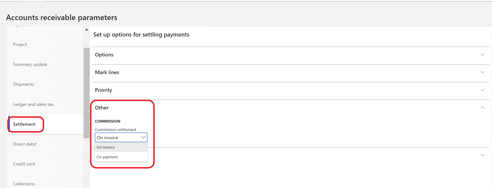
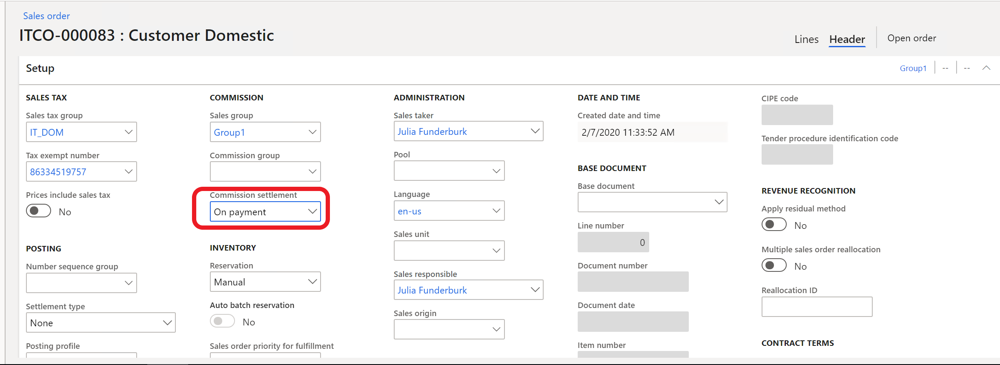
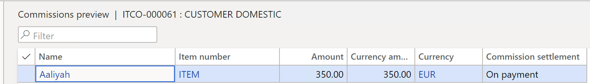

# Commission settlement on payments

[!include [banner](../../includes/banner.md)]

In Italy, companies don't typically settle the commissions for their sales agents when invoices are issued. Instead, they settle the commissions when customers pay the full balance of their invoices.

## Prerequisites

Before you can use the functionality for commission settlement on payments, the following prerequisites must be met:

- The primary address of the legal entity must be in Italy.
- The **Commission settlement on payments** feature must be turned on in the **Feature management** workspace. For more information, see [Feature management overview](../../../fin-ops-core/fin-ops/get-started/feature-management/feature-management-overview.md).

## <a name="default-commission-settlement-period">Set up the default commission settlement method

1. Go to **Accounts receivable** \> **Setup** \> **Accounts receivable parameters**.
2. On the **Accounts receivable parameters** page, on the **Settlement** tab, on the **Other** FastTab, in the **Commission settlement** field, select the default commission settlement method that is used when a sales order is created:

    - **On invoice** – Commissions are charged during the invoice process.
    - **On payment** – Commissions are charged during the payment process.

## Set up commission calculations

You can set up the calculation of commissions for an **On payment** commission by going to **Sales and marketing** \> **Commissions** \> **Commission calculation**.

If the **Payment thresholds** option in the **On payment commissions** section is set to **Yes**, you can specify two limits (thresholds) for commission calculations:

- If the commission amount that is reached (as a percentage of the reachable amount) is below the lower limit, no commissions are accrued.
- When the upper limit is reached, the whole reachable amount is accrued.

Between the two limits, commissions are accrued in the regular way.

### Example

Consider the following example:

- **Total amount of the invoice:** €1,000
- **Lower limit:** 10 percent
- **Upper limit:** 80 percent

The following payments are made:

- €50 (5 percent of the total amount of the invoice): Because commissions are below the lower limit of 10 percent, no accrual occurs.
- €100 (10 percent of the total amount of the invoice): The invoice is settled at 15 percent. Therefore, commissions are accrued at that percentage.
- €500 (50 percent of the total amount of the invoice): The invoice is settled at 65 percent. Commissions are also accrued at 65 percent.
- €200 (20 percent of the total amount of the invoice): The invoice is settled at 85 percent. Because this figure exceeds the upper limit, commissions become fully settled at 100 percent.
- Further payments don't change the amount that is accrued, because that amount has already reached the upper limit. However, accrual transactions are still created.

Another setup can be added to the individual agent who belongs to a specific group. In commission calculations, the setup on agents (employees) has higher priority than the setup on sales.

## Set the commission settlement and preview commission transactions on the Sales order page

After a sales order is created, a user can update the commission settlement in the sales order header.

1. Go to **Accounts receivable** \> **Orders** \> **All sales orders**.
2. Select and open a sales order.
3. On the **Sales order details** page, in the **Header** view, on the **Setup** FastTab update the value of the **Commission settlement** field as you require.

By default, the value of the **Commission settlement** field is inherited from the **Accounts receivable parameters** page. For more information, see [Set up the default commission settlement method](#default-commission-settlement-period).

You can also preview the sales commission calculation from a sales order for either open or invoiced orders. On the **Sales order details** page, on the **General** tab, select **Related information** \> **Commission preview**.

> [!NOTE]
> A user can combine sales orders in a single invoice if all the sales orders for invoicing have the same **Commission settlement** value in the sales order header.

### Get an overview of commission transactions on a sales order invoice

You can also view commission transactions on the **Invoice journal** page.

1. Go to **Accounts receivable** \> **Inquiries and reports** \> **Invoices** \> **Invoice journal**.
2. On the **Invoice** tab, select **Details** \> **Commission transactions**.

> [!NOTE]
> When you post the invoice, the system creates commission and voucher transactions. If the value in the **Commission settlement** field is **On invoice** in the sales order header, the system creates a **Settlement** record. If the value in the **Commission settlement** field is **On payment** in the sales order header, the **Settlement** record is created only after the invoice and a payment are settled.

[!INCLUDE[footer-include](../../../includes/footer-banner.md)]
