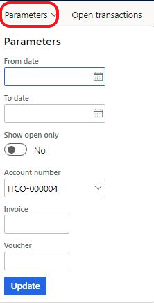

# Improved inquiry on debit/credit settlement

[!include [banner](../../includes/banner.md)]

This article explains how you can view invoice and payment settlement information in a convenient and simple format.

## Prerequisites

Before you can use this functionality, the following prerequisites must be met:

- The primary address of the legal entity must be in Italy.
- In the **Feature management** workspace, turn on the **Improved inquiry on debit/credit settlement** feature. For more information, see [Feature management overview](../../../fin-ops-core/fin-ops/get-started/feature-management/feature-management-overview.md).

## Use the Invoice/payments list page

Follow one of these steps to open the **Invoice/payments** list page: 

- Go to **Accounts receivable \> Customers \> All customers**. Then, on the Action Pane, on the **Invoice** tab, in the **Related information** group, select **Invoice/Payments**.
- Go to **Accounts payable \> Vendors \> All vendors**. Then, on the Action Pane, on the **Invoice** tab, in the **Related information** group, select **Invoice/Payments**.

The grid in the upper part of the page shows the customer invoices or vendor invoices. These invoices are sorted by invoice number and date. 

The grid in the lower part of the page shows the debit and credit transactions of the selected customer or vendor. These transaction types include invoices, payments, and foreign currency revaluation transactions. Any non-zero balance for invoices is highlighted in red.

On the Action Pane, select **Parameters** to set a filter so that the **Invoice/payments** list page shows only specific data.

[!INCLUDE[footer-include](../../../includes/footer-banner.md)]
