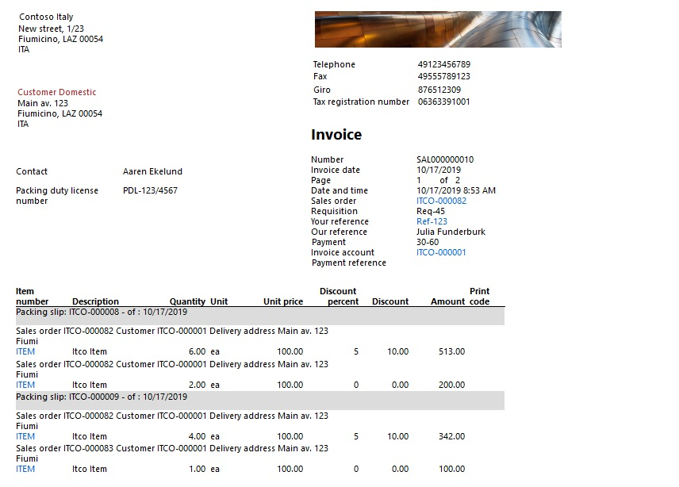

# Sort sales invoice lines by packing slip

[!include [banner](../../includes/banner.md)]

In Italy, companies must often issue *accompanying invoices*. Accompanying invoices are combinations of an ordinary invoice and a transport document or packing slip (documento di trasporto, or DDT).

## Prerequisites

- The primary address of the legal entity must be in Italy.
- In the **Feature management** workspace, verify that the **Sales invoice lines sorting by packing slips** feature is turned on. For more information, see [Feature management overview](../../../fin-ops-core/fin-ops/get-started/feature-management/feature-management-overview.md).
- Customer invoices must use the new **SalesInvoice.Report\_IT** layout. Go to **Accounts receivable** /> **Setup** /> **Forms** /> **Form setup**, and then, on the **General** tab, select **Print management**. On the **Print management setup** page, under **Module - accounts receivable \> Customer invoice**, select **Original \<Default\>**. Then, in the **Report format** field, select **SalesInvoice.Report\_IT**.

    

> [!NOTE]
> When the **Sales invoice lines sorting by packing slips** feature is turned on, the system ignores the setting of the **Print packing slip specifications** check box on the **Invoice** tab of the **Form setup** page (**Accounts receivable \> Setup \> Forms \> Form setup**). Even if this check box is selected, it's treated as if it's cleared.
>
> 

## Printing accompanying invoices

After you've turned on and set up the feature, the printed invoice report will contain invoice lines that are grouped and sorted by packing slip.

> [!NOTE]
> The new layout is applicable only to invoices that are based on sales orders. It isn't applicable to free-text invoices, because they don't use packing slips.

[!INCLUDE[footer-include](../../../includes/footer-banner.md)]
