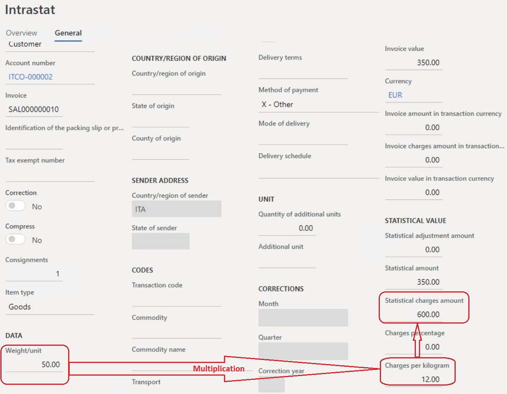

# Miscellaneous charges per kilogram in an Intrastat declaration

[!include [banner](../../includes/banner.md)]

Intrastat is the system that is used to collect information and generate statistics about the trade of goods among countries and regions in the European Union (EU). For more information, see [Intrastat overview](../europe/emea-intrastat.md).

Among other reporting elements, an Intrastat declaration contains information about miscellaneous charges. Miscellaneous charges are usually calculated as a percentage of the invoice amount. However, in Italy, they are often calculated by multiplying the cost of each kilogram and the weight of goods in kilograms.

## Prerequisites

- The primary address of the legal entity must be in Italy.
- In the **Feature management** workspace, turn on the **Miscellaneous charges per kilogram in Intrastat declaration** feature. For more information, see [Feature management overview](../../../fin-ops-core/fin-ops/get-started/feature-management/feature-management-overview.md).

## Set up miscellaneous charges per kilogram

On the **Released products master data** page, on the **Foreign trade** FastTab, in the **Intrastat** section, in the **Charges per kilogram** field, enter the amount of the charges per kilogram.

> [!NOTE]
> Verify that the product weight is defined in kilograms.

## Calculation of miscellaneous charges

When transactions are transferred to an Intrastat declaration, the **Statistical charges amount** value is calculated by using the following formula:

*Statistical charges amount* = *Cost of each kilogram* × *Net weight (in kilograms)*

If a **Charges percentage** value is also entered, both types of miscellaneous charges are used in the calculation:

*Statistical charges amount* = (*Invoice amount* × *Charges percentage*) + (*Cost of each kilogram* × *Net weight \[in kilograms\]*)

For more information, see [Transfer transactions to the Intrastat](../europe/transfer-transactions-intrastat.md)

[!INCLUDE[footer-include](../../../includes/footer-banner.md)]
