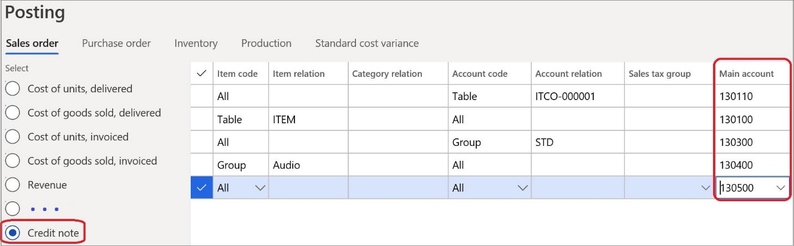
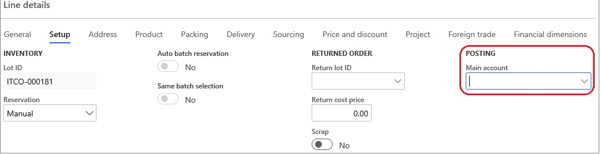

# Separate accounts for credit notes

[!include [banner](../../includes/banner.md)]

In Italy, a company can define the accounting policy so that credit note amounts are posted to ledger accounts that differ from the revenue accounts. This approach is used to track the amount that is issued on credit notes.

## Prerequisites

- The primary address of the legal entity must be in Italy.
- In the **Feature management** workspace, turn on the **Separate accounts for credit notes** feature. For more information, see [Feature management overview](../../../fin-ops-core/fin-ops/get-started/feature-management/feature-management-overview.md).

## Set up posting accounts

You can define specific ledger accounts that should be used for sales orders. To complete the setup, on the **Posting** page, select the **Credit note** option, and then specify the ledger accounts.

You can also use the **Posting** page to set up different accounts for various combinations of customers, items, and related groups.

## Post credit notes

### Post a new credit note

When you post a new credit note, the ledger account is used instead of the standard revenue account that is defined on the sales order.

If no separate ledger account is defined for the credit note, or if a required combination of a customer and an item isn't found, a standard sales order revenue account is used for posting.

### Post a credit note that was created from a sales order

If you create a credit note that is based on an existing sales order, clear the **Main account** field for each credit note line. A revenue account from the sales order might have been automatically entered in the field.

> [!NOTE]
> Separate accounts are applicable only to credit notes that are based on sales orders. They aren't applicable to free-text credit notes, because free-text credit notes require that a ledger account be explicitly entered.

[!INCLUDE[footer-include](../../../includes/footer-banner.md)]
