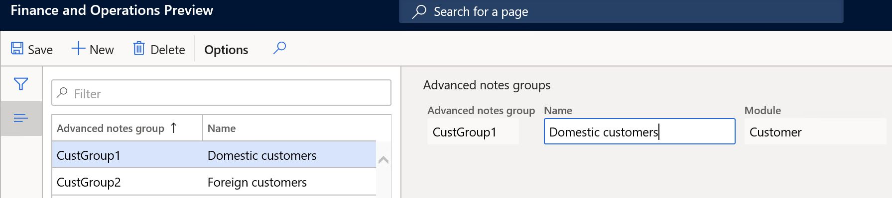
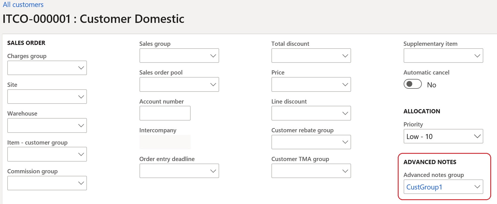
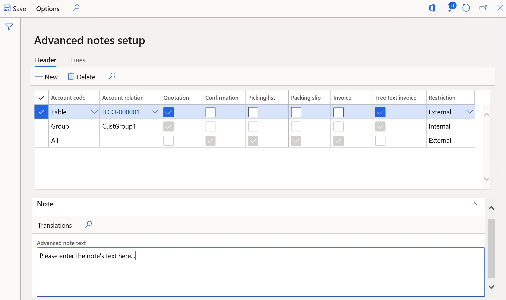
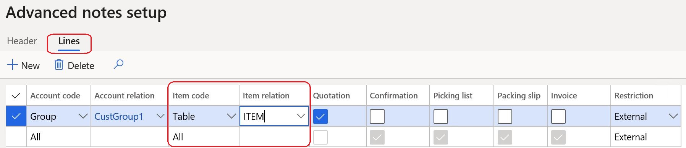
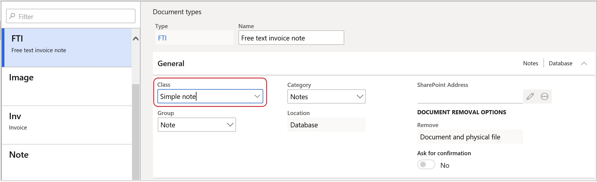
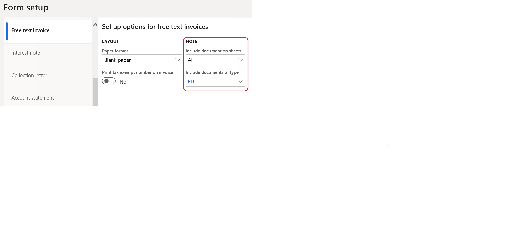
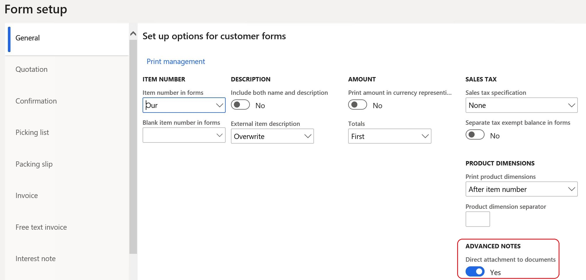
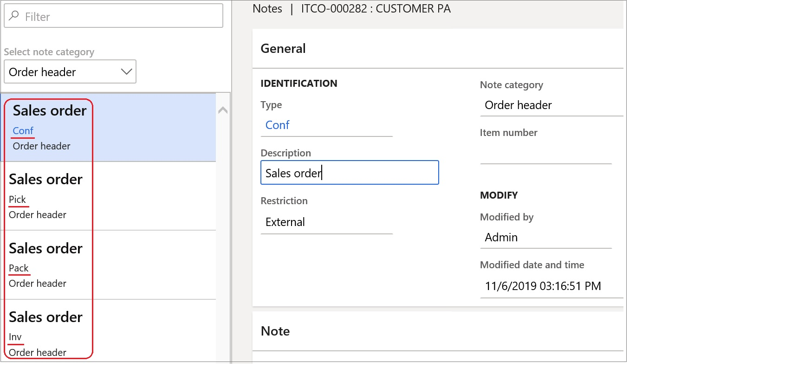
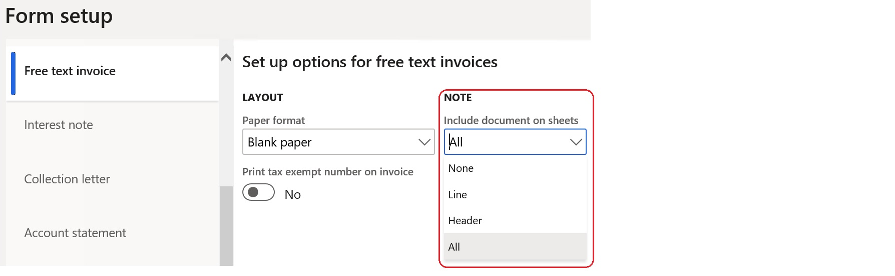

# Advanced notes management

[!include [banner](../../includes/banner.md)]

The Advanced notes management feature lets you set up predefined notes that apply to all or specific customers, vendors, and products. You can then add these notes to specific business documents.

## Advanced notes setup

If similar notes must be printed on documents for groups of customers, you can define new groups specifically for advanced notes. 

### Define group codes and descriptions

1. Go to **Accounts receivable** \> **Setup** \> **Advanced notes** \> **Customers advanced notes groups**.

2. After you create the groups, go to **Accounts receivable** \> **Customers** \> **All customers**. 
3. On the **Sales orders defaults** FastTab, in the **Advanced notes** section, assign the references for the required customers to the new groups.

### Set up advanced notes groups for vendors

1. Go to **Accounts payable** \> **Setup** \> **Advanced notes** \> **Vendors advanced notes groups**.
2. After you create the groups for vendors, go to **Accounts payable** \> **Vendors** \> **All vendors**. 
3. On the **Purchase orders defaults** FastTab, in the **Advanced notes** section, assign the references for the required vendors to the new groups.

### Set up advanced notes groups for products 

1. Go to **Product information management** \> **Setup** \> **Advanced notes** \> **Products advanced notes groups**.
2. After you create the groups for products, go to **Product information management** \> **Products** \> **Released products**. 
3. On the **General** FastTab, in the **Administration** section, assign the references for the required products to the new groups.

### Set up advanced notes for customers and vendors

1. To enter the text of advanced notes for customers and set up the applicability of the notes, go to **Accounts receivable** \> **Setup** \> **Advanced notes** \> **Customers advanced notes setup**.

2. In the lower part of the page, you can enter the note text in the user's default language. To enter the note text in other languages, select **Translations**.

3. In the upper part of the **Advanced notes setup** page, you can set up the applicability of the advanced notes. Select the appropriate check boxes to turn on notes for the various available documents. On the **Header** tab, you can define notes for all customers, individual customers, or customer groups. On the **Lines** tab, you can define notes for all items or individual items.

4. To set up advanced notes for vendors, go to **Accounts payable** \> **Setup** \> **Advanced notes** \> **Vendors advanced notes setup**.

> [!NOTE]
> For vendor advanced notes, **Purchase order** is the only document that is available.

### Set up document types

Go to **Organization administration** \> **Document management** \> **Document types** to define the document types that are used when the related document attachments are created. In the **Class** field, select **Simple note**.

### Set up forms

Go to **Accounts receivable** \> **Setup** \> **Forms** \> **Forms setup** to set up the references to document types for the related documents. Additionally, you can define whether the notes are applicable to a document's header, lines, or both.

### Direct attachment to documents
Advanced notes can be directly attached automatically to sales order confirmations, picking lists, packing slips, and invoices without preliminary attachment to sales orders. To enable direct attachment, complete the following steps. 
1. Go to **Accounts receivable** \> **Setup** \> **Forms** \> **Forms setup**.
2. On the **General** FastTab, in the **Advanced notes** section, enable the **Direct attachment to documents** parameter.

  

> [!NOTE]
> If **Summary update** is enabled, enable the **Direct attachment to documents** parameter when you post affected documents.

## Advanced notes processing

### Generating advanced notes

In Accounts receivable, the notes for confirmations, picking lists, packing slips, and invoices are automatically generated as attachments to the sales orders that are generated for selected customers and products.

The notes for quotations and free text invoices are automatically generated in the appropriate documents.

In Accounts payable, notes are automatically generated as attachments to new purchase orders for applicable vendors and products.

### Printing advanced notes

Advanced notes which are defined as **External** are printed in the related business documents depending on the settings on the **Form setup**

[!INCLUDE[footer-include](../../../includes/footer-banner.md)]
